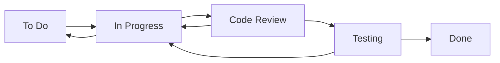

# Jira Key Concepts

## 1. Platform Overview
**What it is**: Project management and issue tracking tool by Atlassian for agile software development.

**Core Components**:
- **Issues**: Work items (stories, tasks, bugs, epics)
- **Projects**: Collections of related issues
- **Workflows**: Issue lifecycle management
- **Boards**: Visual work management (Scrum/Kanban)
- **Dashboards**: Reporting and metrics

```bash
# Jira CLI setup
npm install -g jira-cli
jira config set --url https://company.atlassian.net --username user@company.com --token api-token
```

## 2. Issue Types and Hierarchy
**Standard Issue Types**:

```json
{
  "issue_hierarchy": {
    "epic": {
      "description": "Large body of work that can be broken down",
      "typical_duration": "1-3 months",
      "contains": ["story", "task", "bug"]
    },
    "story": {
      "description": "Feature or requirement from user perspective",
      "typical_duration": "1-2 weeks",
      "format": "As a [user], I want [goal] so that [benefit]"
    },
    "task": {
      "description": "Work item that needs to be completed",
      "typical_duration": "1-5 days",
      "examples": ["Setup environment", "Code review", "Documentation"]
    },
    "bug": {
      "description": "Defect or issue in existing functionality",
      "priority_levels": ["Blocker", "Critical", "Major", "Minor", "Trivial"]
    },
    "subtask": {
      "description": "Breakdown of larger work items",
      "parent_types": ["story", "task", "bug"]
    }
  }
}
```

**Custom Issue Types**:
```json
{
  "custom_issue_types": {
    "data_pipeline": {
      "name": "Data Pipeline",
      "description": "ETL/ELT pipeline development",
      "fields": [
        "source_system",
        "target_system", 
        "data_volume",
        "sla_requirements",
        "data_classification"
      ]
    },
    "infrastructure": {
      "name": "Infrastructure",
      "description": "Infrastructure setup and maintenance",
      "fields": [
        "environment",
        "resource_requirements",
        "security_requirements"
      ]
    }
  }
}
```

## 3. Workflows and Status Management
**Basic Workflow States**:



**Custom Workflow Configuration**:
```json
{
  "workflow_name": "Data Engineering Workflow",
  "statuses": [
    {
      "name": "Backlog",
      "category": "TO_DO",
      "description": "Issue is in the backlog"
    },
    {
      "name": "Analysis",
      "category": "IN_PROGRESS", 
      "description": "Requirements analysis in progress"
    },
    {
      "name": "Development",
      "category": "IN_PROGRESS",
      "description": "Code development in progress"
    },
    {
      "name": "Code Review",
      "category": "IN_PROGRESS",
      "description": "Code review in progress"
    },
    {
      "name": "Testing",
      "category": "IN_PROGRESS",
      "description": "Testing in progress"
    },
    {
      "name": "Deployment",
      "category": "IN_PROGRESS",
      "description": "Deployment to production"
    },
    {
      "name": "Done",
      "category": "DONE",
      "description": "Work completed"
    }
  ],
  "transitions": [
    {
      "name": "Start Analysis",
      "from": "Backlog",
      "to": "Analysis",
      "conditions": ["assignee_exists"]
    },
    {
      "name": "Start Development", 
      "from": "Analysis",
      "to": "Development",
      "conditions": ["analysis_complete"]
    }
  ]
}
```

## 4. Agile Boards (Scrum/Kanban)
**Scrum Board Configuration**:

```json
{
  "board_type": "scrum",
  "board_name": "Data Engineering Sprint Board",
  "project_key": "DE",
  "filter_query": "project = DE AND fixVersion in unreleasedVersions()",
  "columns": [
    {
      "name": "To Do",
      "statuses": ["Backlog", "To Do"]
    },
    {
      "name": "In Progress", 
      "statuses": ["Analysis", "Development"],
      "max_issues": 3
    },
    {
      "name": "Review",
      "statuses": ["Code Review", "Testing"],
      "max_issues": 5
    },
    {
      "name": "Done",
      "statuses": ["Done"]
    }
  ],
  "swimlanes": {
    "type": "assignee",
    "show_unassigned": true
  }
}
```

**Kanban Board with WIP Limits**:
```json
{
  "board_type": "kanban",
  "board_name": "Data Pipeline Maintenance",
  "filter_query": "project = DE AND resolution = Unresolved",
  "columns": [
    {
      "name": "Backlog",
      "statuses": ["Backlog"],
      "max_issues": null
    },
    {
      "name": "Selected for Development",
      "statuses": ["To Do"],
      "max_issues": 10
    },
    {
      "name": "In Progress",
      "statuses": ["In Progress", "Analysis", "Development"],
      "max_issues": 6
    },
    {
      "name": "Review & Testing",
      "statuses": ["Code Review", "Testing"],
      "max_issues": 4
    },
    {
      "name": "Done",
      "statuses": ["Done"]
    }
  ]
}
```

## 5. Custom Fields and Configurations
**Data Engineering Specific Fields**:

```json
{
  "custom_fields": {
    "data_source": {
      "type": "select",
      "name": "Data Source",
      "options": ["PostgreSQL", "MySQL", "S3", "Kafka", "API", "File System"],
      "required": true
    },
    "data_volume": {
      "type": "select",
      "name": "Expected Data Volume",
      "options": ["< 1GB", "1-10GB", "10-100GB", "100GB-1TB", "> 1TB"]
    },
    "sla_requirement": {
      "type": "select",
      "name": "SLA Requirement",
      "options": ["Real-time", "Near real-time (< 5 min)", "Hourly", "Daily", "Weekly"]
    },
    "environment": {
      "type": "multi-select",
      "name": "Target Environment",
      "options": ["Development", "Staging", "Production"]
    },
    "story_points": {
      "type": "number",
      "name": "Story Points",
      "description": "Effort estimation in story points"
    },
    "business_value": {
      "type": "select",
      "name": "Business Value",
      "options": ["Low", "Medium", "High", "Critical"]
    }
  }
}
```

## 6. JQL (Jira Query Language)
**Basic JQL Queries**:

```sql
-- Find all open issues assigned to current user
assignee = currentUser() AND resolution = Unresolved

-- Issues created in last 7 days
created >= -7d

-- High priority bugs in specific project
project = "DE" AND issuetype = Bug AND priority in (Blocker, Critical)

-- Issues in current sprint
Sprint in openSprints() AND project = "DE"

-- Overdue issues
duedate < now() AND resolution = Unresolved

-- Issues with specific labels
labels in (data-pipeline, etl) AND status != Done

-- Complex query with multiple conditions
project = "DE" AND 
issuetype in (Story, Task) AND 
status in ("In Progress", "Code Review") AND 
assignee in (membersOf("data-engineering-team")) AND
created >= startOfWeek() AND
"Story Points" > 0
```

**Advanced JQL Functions**:
```sql
-- Issues updated by specific user in last week
updatedBy = "john.doe" AND updated >= -1w

-- Issues without assignee in active sprints
assignee is EMPTY AND Sprint in openSprints()

-- Issues linked to specific epic
"Epic Link" = DE-123

-- Issues with comments from external users
issueFunction in commented("by user not in group jira-users")

-- Issues that were resolved and then reopened
status CHANGED FROM "Done" TO "In Progress"

-- Issues with specific custom field values
"Data Source" in (PostgreSQL, MySQL) AND "Data Volume" = "> 1TB"
```

## 7. Automation and Rules
**Automation Rules**:

```json
{
  "rule_name": "Auto-assign based on component",
  "trigger": {
    "type": "issue_created"
  },
  "conditions": [
    {
      "type": "issue_fields_condition",
      "configuration": {
        "field": "components",
        "operator": "is",
        "value": "Data Pipeline"
      }
    }
  ],
  "actions": [
    {
      "type": "assign_issue",
      "configuration": {
        "assignee": "pipeline-team-lead"
      }
    },
    {
      "type": "add_label",
      "configuration": {
        "labels": ["auto-assigned", "pipeline"]
      }
    }
  ]
}
```

**Workflow Post Functions**:
```json
{
  "post_functions": [
    {
      "name": "Update parent issue progress",
      "trigger": "transition_to_done",
      "action": {
        "type": "groovy_script",
        "script": """
          import com.atlassian.jira.component.ComponentAccessor
          
          def issueManager = ComponentAccessor.getIssueManager()
          def parentIssue = issue.getParentObject()
          
          if (parentIssue) {
            def subtasks = parentIssue.getSubTaskObjects()
            def completedSubtasks = subtasks.findAll { it.getResolution() != null }
            def progress = (completedSubtasks.size() / subtasks.size()) * 100
            
            // Update custom field with progress
            parentIssue.setCustomFieldValue(progressField, progress)
          }
        """
      }
    }
  ]
}
```

## 8. Reporting and Dashboards
**Dashboard Configuration**:

```json
{
  "dashboard_name": "Data Engineering Metrics",
  "gadgets": [
    {
      "type": "filter_results",
      "title": "Open Issues by Priority",
      "configuration": {
        "filter": "project = DE AND resolution = Unresolved",
        "display": "pie_chart",
        "stat_type": "priority"
      }
    },
    {
      "type": "sprint_burndown",
      "title": "Current Sprint Burndown",
      "configuration": {
        "board_id": 123,
        "display_mode": "story_points"
      }
    },
    {
      "type": "velocity_chart",
      "title": "Team Velocity",
      "configuration": {
        "board_id": 123,
        "number_of_sprints": 6
      }
    },
    {
      "type": "created_vs_resolved",
      "title": "Created vs Resolved Issues",
      "configuration": {
        "filter": "project = DE",
        "period": "monthly",
        "number_of_periods": 6
      }
    }
  ]
}
```

**Custom Reports with JQL**:
```sql
-- Team productivity report
project = "DE" AND 
resolved >= startOfMonth() AND 
resolved <= endOfMonth() AND
assignee in (membersOf("data-engineering-team"))
ORDER BY resolved DESC

-- Bug trend analysis
project = "DE" AND 
issuetype = Bug AND 
created >= -3M
ORDER BY created ASC

-- Epic progress report
project = "DE" AND 
issuetype = Epic AND 
status != Done AND
"Epic Link" is not EMPTY
```

## 9. Integration and API Usage
**REST API Examples**:

```python
import requests
from requests.auth import HTTPBasicAuth
import json

class JiraAPI:
    def __init__(self, base_url, username, api_token):
        self.base_url = base_url.rstrip('/')
        self.auth = HTTPBasicAuth(username, api_token)
        self.headers = {
            'Accept': 'application/json',
            'Content-Type': 'application/json'
        }
    
    def create_issue(self, project_key, issue_type, summary, description, **kwargs):
        data = {
            'fields': {
                'project': {'key': project_key},
                'issuetype': {'name': issue_type},
                'summary': summary,
                'description': description,
                **kwargs
            }
        }
        
        response = requests.post(
            f"{self.base_url}/rest/api/3/issue",
            auth=self.auth,
            headers=self.headers,
            json=data
        )
        return response.json()
    
    def search_issues(self, jql, fields=None, max_results=50):
        params = {
            'jql': jql,
            'maxResults': max_results
        }
        if fields:
            params['fields'] = ','.join(fields)
        
        response = requests.get(
            f"{self.base_url}/rest/api/3/search",
            auth=self.auth,
            headers=self.headers,
            params=params
        )
        return response.json()
    
    def transition_issue(self, issue_key, transition_id, comment=None):
        data = {
            'transition': {'id': transition_id}
        }
        if comment:
            data['update'] = {
                'comment': [{'add': {'body': comment}}]
            }
        
        response = requests.post(
            f"{self.base_url}/rest/api/3/issue/{issue_key}/transitions",
            auth=self.auth,
            headers=self.headers,
            json=data
        )
        return response.status_code == 204

# Usage example
jira = JiraAPI('https://company.atlassian.net', 'user@company.com', 'api-token')

# Create data pipeline issue
issue = jira.create_issue(
    project_key='DE',
    issue_type='Story',
    summary='Implement customer data pipeline',
    description='Create ETL pipeline to process customer data from CRM to data warehouse',
    assignee={'name': 'john.doe'},
    priority={'name': 'High'},
    customfield_10001='PostgreSQL',  # Data Source
    customfield_10002='Daily'        # SLA Requirement
)

print(f"Created issue: {issue['key']}")
```

## 10. Best Practices and Workflows
**Issue Creation Templates**:

```markdown
## Data Pipeline Story Template

**Summary**: [Brief description of the pipeline]

**Description**:
### Business Requirements
- [ ] What business problem does this solve?
- [ ] Who are the stakeholders?
- [ ] What is the expected business value?

### Technical Requirements
- **Source System**: [e.g., PostgreSQL, S3, API]
- **Target System**: [e.g., Snowflake, BigQuery, S3]
- **Data Volume**: [e.g., 10GB daily]
- **SLA**: [e.g., Daily by 6 AM EST]
- **Data Classification**: [e.g., PII, Public, Internal]

### Acceptance Criteria
- [ ] Data pipeline processes all required fields
- [ ] Data quality checks implemented
- [ ] Error handling and alerting configured
- [ ] Documentation updated
- [ ] Monitoring and logging in place

### Technical Notes
[Any technical considerations, dependencies, or constraints]

### Definition of Done
- [ ] Code reviewed and approved
- [ ] Unit tests written and passing
- [ ] Integration tests passing
- [ ] Deployed to production
- [ ] Monitoring alerts configured
- [ ] Documentation updated
```

**Sprint Planning Process**:
```json
{
  "sprint_planning_checklist": [
    {
      "step": "Backlog Refinement",
      "activities": [
        "Review and estimate new stories",
        "Break down large stories into smaller tasks",
        "Ensure acceptance criteria are clear",
        "Identify dependencies and blockers"
      ]
    },
    {
      "step": "Capacity Planning",
      "activities": [
        "Review team availability",
        "Account for holidays and PTO",
        "Consider ongoing support work",
        "Set realistic sprint goals"
      ]
    },
    {
      "step": "Sprint Goal Setting",
      "activities": [
        "Define clear sprint objective",
        "Align with product roadmap",
        "Communicate with stakeholders",
        "Document sprint commitment"
      ]
    }
  ]
}
```