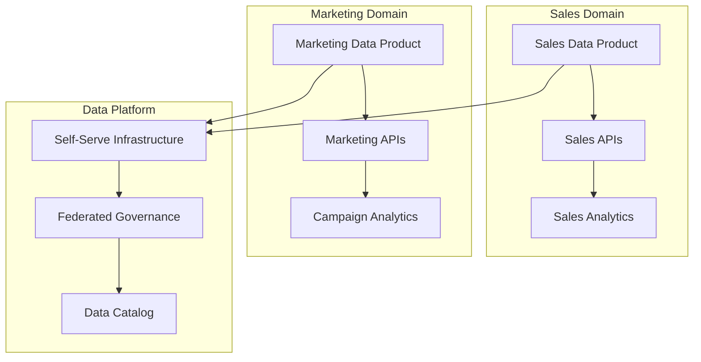

# 📈 Advanced Analytics

> **Next-generation analytics patterns, event-driven architectures, and advanced stream processing for modern data platforms**

## 📋 **Quick Navigation**

| 🎯 **Technology** | 📊 **Complexity** | ⏱️ **Learning Time** | 🏢 **Enterprise Adoption** |
|-------------------|-------------------|----------------------|---------------------------|
| **[Data Mesh Implementation](#-data-mesh-implementation)** | Advanced | 6-8 weeks | 25% (2024) |
| **[Event-Driven Architecture](#-event-driven-architectures)** | Advanced | 4-6 weeks | 60% (2024) |
| **[Advanced Stream Processing](#-stream-processing-patterns)** | Expert | 8-10 weeks | 40% (2024) |
| **[Data Lineage & Impact](#-data-lineage--impact-analysis)** | Intermediate | 3-4 weeks | 70% (2024) |

---

## 🕸️ **Data Mesh Implementation**

### **Core Principles**
- **Domain Ownership**: Business domains own their data
- **Data as a Product**: Treat data with product thinking
- **Self-serve Infrastructure**: Democratize data infrastructure
- **Federated Governance**: Distributed but coordinated governance

### **Implementation Architecture**


### **Governance Patterns**

#### **Federated Data Governance**
```yaml
# Data Product Specification
apiVersion: v1
kind: DataProduct
metadata:
  name: customer-360
  domain: customer-experience
  owner: customer-team@company.com
spec:
  description: "Unified customer view across all touchpoints"
  sla:
    availability: 99.9%
    freshness: "< 15 minutes"
    quality: "> 99.5%"
  interfaces:
    - type: "streaming"
      protocol: "kafka"
      topic: "customer-events"
    - type: "batch"
      protocol: "rest"
      endpoint: "/api/v1/customers"
  governance:
    data_classification: "PII"
    retention_policy: "7 years"
    access_control: "RBAC"
```

### **Technology Stack for Data Mesh**

| Component | Technology Options | Best For |
|-----------|-------------------|----------|
| **Data Catalog** | DataHub, Amundsen, Apache Atlas | Discovery & Lineage |
| **API Gateway** | Kong, AWS API Gateway, Istio | Data Product APIs |
| **Stream Processing** | Kafka, Pulsar, EventBridge | Real-time data |
| **Governance** | Apache Ranger, OPA, Custom | Policy enforcement |
| **Monitoring** | Prometheus, DataDog, Custom | SLA monitoring |

### **Implementation Roadmap**

#### **Phase 1: Foundation (Months 1-3)**
```python
# Example: Domain Data Product Setup
class CustomerDataProduct:
    def __init__(self, domain="customer"):
        self.domain = domain
        self.catalog = DataCatalog()
        self.governance = GovernanceEngine()
    
    def register_dataset(self, dataset_spec):
        # Register with federated catalog
        self.catalog.register(
            dataset=dataset_spec,
            domain=self.domain,
            governance_rules=self.governance.get_rules()
        )
    
    def expose_api(self, endpoint_config):
        # Create self-serve API
        return APIGateway.create_endpoint(
            config=endpoint_config,
            auth=self.governance.get_auth_policy()
        )
```

#### **Phase 2: Domain Migration (Months 4-8)**
- Identify domain boundaries
- Migrate existing data products
- Establish governance policies
- Train domain teams

#### **Phase 3: Scale & Optimize (Months 9-12)**
- Cross-domain data products
- Advanced analytics use cases
- Performance optimization
- Cost management

---

## ⚡ **Event-Driven Architectures**

### **Architecture Patterns**

#### **Event Sourcing Pattern**
```python
# Event Store Implementation
class EventStore:
    def __init__(self):
        self.events = []
    
    def append_event(self, stream_id, event):
        event_record = {
            'stream_id': stream_id,
            'event_type': event.__class__.__name__,
            'event_data': event.to_dict(),
            'timestamp': datetime.utcnow(),
            'version': self.get_next_version(stream_id)
        }
        self.events.append(event_record)
    
    def get_events(self, stream_id, from_version=0):
        return [e for e in self.events 
                if e['stream_id'] == stream_id 
                and e['version'] >= from_version]

# Domain Events
class OrderCreated:
    def __init__(self, order_id, customer_id, amount):
        self.order_id = order_id
        self.customer_id = customer_id
        self.amount = amount
    
    def to_dict(self):
        return {
            'order_id': self.order_id,
            'customer_id': self.customer_id,
            'amount': self.amount
        }

# Event Handler
class OrderProjection:
    def __init__(self, event_store):
        self.event_store = event_store
        self.orders = {}
    
    def handle_order_created(self, event):
        self.orders[event.order_id] = {
            'customer_id': event.customer_id,
            'amount': event.amount,
            'status': 'created'
        }
```

#### **CQRS (Command Query Responsibility Segregation)**
```python
# Command Side (Write Model)
class OrderCommandHandler:
    def __init__(self, event_store):
        self.event_store = event_store
    
    def create_order(self, command):
        # Business logic validation
        if command.amount <= 0:
            raise ValueError("Order amount must be positive")
        
        # Create and store event
        event = OrderCreated(
            order_id=command.order_id,
            customer_id=command.customer_id,
            amount=command.amount
        )
        self.event_store.append_event(command.order_id, event)

# Query Side (Read Model)
class OrderQueryHandler:
    def __init__(self, read_db):
        self.read_db = read_db
    
    def get_customer_orders(self, customer_id):
        return self.read_db.query(
            "SELECT * FROM orders WHERE customer_id = ?",
            [customer_id]
        )
```

### **Event Streaming Platforms**

| Platform | Strengths | Use Cases | Cost |
|----------|-----------|-----------|------|
| **Apache Kafka** | High throughput, durability | Event sourcing, log aggregation | $ |
| **Apache Pulsar** | Multi-tenancy, geo-replication | Global deployments | $$ |
| **AWS EventBridge** | Serverless, schema registry | Microservices integration | $$$ |
| **Azure Event Hubs** | Azure integration, capture | IoT, telemetry | $$$ |

### **Event Schema Evolution**
```json
{
  "type": "record",
  "name": "OrderEvent",
  "namespace": "com.company.orders",
  "fields": [
    {"name": "order_id", "type": "string"},
    {"name": "customer_id", "type": "string"},
    {"name": "amount", "type": "double"},
    {"name": "currency", "type": "string", "default": "USD"},
    {"name": "metadata", "type": ["null", "map"], "default": null}
  ]
}
```

---

## 🌊 **Stream Processing Patterns**

### **Advanced Kafka Patterns**

#### **Exactly-Once Semantics**
```python
from kafka import KafkaProducer, KafkaConsumer
from kafka.errors import KafkaError

class ExactlyOnceProcessor:
    def __init__(self):
        self.producer = KafkaProducer(
            bootstrap_servers=['localhost:9092'],
            enable_idempotence=True,
            transactional_id='my-transactional-id'
        )
        self.consumer = KafkaConsumer(
            'input-topic',
            bootstrap_servers=['localhost:9092'],
            isolation_level='read_committed'
        )
    
    def process_messages(self):
        self.producer.init_transactions()
        
        for message in self.consumer:
            try:
                self.producer.begin_transaction()
                
                # Process message
                result = self.transform_message(message.value)
                
                # Send result
                self.producer.send('output-topic', result)
                
                # Commit transaction
                self.producer.commit_transaction()
                
            except Exception as e:
                self.producer.abort_transaction()
                raise e
```

#### **Stream-Table Joins**
```python
# Kafka Streams equivalent in Python (conceptual)
class StreamTableJoin:
    def __init__(self):
        self.user_table = {}  # KTable equivalent
        self.orders_stream = []  # KStream equivalent
    
    def process_user_update(self, user_event):
        # Update user table
        self.user_table[user_event.user_id] = user_event.user_data
    
    def process_order(self, order_event):
        # Join with user table
        user_data = self.user_table.get(order_event.user_id)
        if user_data:
            enriched_order = {
                **order_event.to_dict(),
                'user_segment': user_data.segment,
                'user_tier': user_data.tier
            }
            return enriched_order
        return None
```

### **Complex Event Processing (CEP)**

#### **Pattern Detection with Apache Flink**
```python
# Flink CEP Pattern (Python API)
from pyflink.datastream import StreamExecutionEnvironment
from pyflink.cep import CEP, Pattern

env = StreamExecutionEnvironment.get_execution_environment()

# Define pattern: Login followed by purchase within 1 hour
pattern = Pattern.begin("login") \
    .where(lambda event: event.event_type == "login") \
    .next("purchase") \
    .where(lambda event: event.event_type == "purchase") \
    .within(timedelta(hours=1))

# Apply pattern to stream
pattern_stream = CEP.pattern(
    input_stream.key_by(lambda event: event.user_id),
    pattern
)

# Process matches
def process_pattern_match(match):
    login_event = match["login"][0]
    purchase_event = match["purchase"][0]
    
    return {
        "user_id": login_event.user_id,
        "conversion_time": purchase_event.timestamp - login_event.timestamp,
        "purchase_amount": purchase_event.amount
    }

result_stream = pattern_stream.select(process_pattern_match)
```

### **Windowing Strategies**

#### **Custom Window Functions**
```python
# Sliding window with custom trigger
class CustomSlidingWindow:
    def __init__(self, window_size, slide_interval):
        self.window_size = window_size
        self.slide_interval = slide_interval
        self.windows = {}
    
    def add_event(self, event):
        window_start = self.get_window_start(event.timestamp)
        window_key = (event.key, window_start)
        
        if window_key not in self.windows:
            self.windows[window_key] = []
        
        self.windows[window_key].append(event)
        
        # Check if window should be triggered
        if self.should_trigger(window_key):
            return self.compute_window_result(window_key)
        
        return None
    
    def compute_window_result(self, window_key):
        events = self.windows[window_key]
        return {
            'key': window_key[0],
            'window_start': window_key[1],
            'count': len(events),
            'sum': sum(e.value for e in events),
            'avg': sum(e.value for e in events) / len(events)
        }
```

---

## 🔍 **Data Lineage & Impact Analysis**

### **Lineage Tracking Systems**

#### **Apache Atlas Integration**
```python
from apache_atlas.client.atlas import Atlas
from apache_atlas.model.instance import AtlasEntity

class LineageTracker:
    def __init__(self, atlas_url, username, password):
        self.atlas = Atlas(atlas_url, (username, password))
    
    def create_dataset_entity(self, dataset_info):
        entity = AtlasEntity(
            typeName="DataSet",
            attributes={
                "name": dataset_info.name,
                "qualifiedName": dataset_info.qualified_name,
                "description": dataset_info.description,
                "owner": dataset_info.owner
            }
        )
        return self.atlas.entity.create_entity(entity)
    
    def create_process_entity(self, process_info, inputs, outputs):
        process_entity = AtlasEntity(
            typeName="Process",
            attributes={
                "name": process_info.name,
                "qualifiedName": process_info.qualified_name,
                "inputs": [{"guid": inp.guid} for inp in inputs],
                "outputs": [{"guid": out.guid} for out in outputs]
            }
        )
        return self.atlas.entity.create_entity(process_entity)
```

#### **Custom Lineage Collection**
```python
class DataLineageCollector:
    def __init__(self):
        self.lineage_graph = {}
    
    def track_transformation(self, source_tables, target_table, transformation_sql):
        lineage_record = {
            'source_tables': source_tables,
            'target_table': target_table,
            'transformation': transformation_sql,
            'timestamp': datetime.utcnow(),
            'columns_mapping': self.extract_column_lineage(transformation_sql)
        }
        
        self.lineage_graph[target_table] = lineage_record
    
    def extract_column_lineage(self, sql):
        # Parse SQL to extract column-level lineage
        # This is a simplified example
        import sqlparse
        
        parsed = sqlparse.parse(sql)[0]
        # Extract column mappings from parsed SQL
        return self.parse_column_mappings(parsed)
    
    def get_upstream_dependencies(self, table_name):
        dependencies = []
        
        def traverse_upstream(table):
            if table in self.lineage_graph:
                record = self.lineage_graph[table]
                for source in record['source_tables']:
                    dependencies.append(source)
                    traverse_upstream(source)
        
        traverse_upstream(table_name)
        return list(set(dependencies))
    
    def impact_analysis(self, table_name):
        # Find all downstream tables affected by changes to table_name
        affected_tables = []
        
        for target, record in self.lineage_graph.items():
            if table_name in record['source_tables']:
                affected_tables.append(target)
                # Recursively find downstream dependencies
                affected_tables.extend(self.impact_analysis(target))
        
        return list(set(affected_tables))
```

### **Automated Impact Analysis**
```python
class ImpactAnalyzer:
    def __init__(self, lineage_tracker):
        self.lineage_tracker = lineage_tracker
    
    def analyze_schema_change(self, table_name, schema_changes):
        impact_report = {
            'table': table_name,
            'changes': schema_changes,
            'affected_downstream': [],
            'risk_level': 'LOW'
        }
        
        downstream_tables = self.lineage_tracker.impact_analysis(table_name)
        
        for downstream_table in downstream_tables:
            # Analyze specific impact on each downstream table
            table_impact = self.analyze_table_impact(
                downstream_table, 
                schema_changes
            )
            impact_report['affected_downstream'].append(table_impact)
        
        # Determine overall risk level
        impact_report['risk_level'] = self.calculate_risk_level(
            impact_report['affected_downstream']
        )
        
        return impact_report
    
    def analyze_table_impact(self, table_name, schema_changes):
        lineage_record = self.lineage_tracker.lineage_graph.get(table_name)
        
        if not lineage_record:
            return {'table': table_name, 'impact': 'UNKNOWN'}
        
        column_mappings = lineage_record['columns_mapping']
        affected_columns = []
        
        for change in schema_changes:
            if change['type'] == 'DROP_COLUMN':
                # Check if dropped column is used in transformation
                if change['column'] in column_mappings:
                    affected_columns.append(change['column'])
        
        return {
            'table': table_name,
            'affected_columns': affected_columns,
            'impact': 'HIGH' if affected_columns else 'LOW'
        }
```

---

## 🎯 **Implementation Strategy**

### **Phase 1: Assessment & Planning (Month 1)**
1. **Current State Analysis**: Audit existing architecture
2. **Technology Selection**: Choose appropriate tools
3. **Team Training**: Upskill engineering teams
4. **Pilot Project**: Select low-risk use case

### **Phase 2: Foundation (Months 2-4)**
1. **Event Infrastructure**: Deploy Kafka/Pulsar
2. **Stream Processing**: Implement Flink/Spark Streaming
3. **Lineage Tracking**: Deploy Atlas/DataHub
4. **Monitoring**: Set up observability

### **Phase 3: Advanced Patterns (Months 5-8)**
1. **Data Mesh**: Implement domain-driven data products
2. **Complex CEP**: Deploy pattern detection
3. **Real-time Analytics**: Build streaming dashboards
4. **Governance**: Establish data governance

### **Phase 4: Scale & Optimize (Months 9-12)**
1. **Performance Tuning**: Optimize stream processing
2. **Cost Management**: Implement cost controls
3. **Advanced Use Cases**: ML feature stores, real-time personalization
4. **Cross-team Adoption**: Scale across organization

---

## 📚 **Learning Resources**

### **Hands-on Labs**
- **[Build Event-Driven Architecture](./Labs/Event-Driven-Lab/)**
- **[Implement Data Mesh](./Labs/Data-Mesh-Lab/)**
- **[Advanced Stream Processing](./Labs/Stream-Processing-Lab/)**
- **[Data Lineage Setup](./Labs/Lineage-Lab/)**

### **Case Studies**
- **[Netflix Event-Driven Architecture](./Case-Studies/Netflix-Events/)**
- **[Uber Real-time Analytics](./Case-Studies/Uber-Realtime/)**
- **[Airbnb Data Mesh Journey](./Case-Studies/Airbnb-DataMesh/)**

### **Certifications**
- **[Advanced Analytics Certification](./Certifications/Advanced-Analytics/)**
- **[Stream Processing Expert](./Certifications/Stream-Processing/)**

---

## 📊 **Statistical Analytics & Business Intelligence**

### **Statistical Analysis Methods**
- **[Key Concepts](./ADVANCED_ANALYTICS_KEY_CONCEPTS.md)** - Comprehensive statistical methods
- Descriptive and inferential statistics
- Hypothesis testing and confidence intervals
- Regression analysis and time series forecasting

### **Machine Learning Analytics**
- Supervised and unsupervised learning algorithms
- Model evaluation and cross-validation techniques
- Feature engineering and selection strategies
- Ensemble methods and deep learning approaches

### **Business Intelligence Patterns**
- OLAP operations and multidimensional analysis
- KPI frameworks and balanced scorecards
- Executive dashboards and self-service analytics
- Predictive analytics and risk modeling

### **Tools & Technologies**

| Category | Tools | Best For |
|----------|-------|----------|
| **Statistical Software** | R, Python (SciPy), SAS, SPSS | Statistical analysis |
| **Visualization** | Tableau, Power BI, D3.js, Plotly | Interactive dashboards |
| **Big Data ML** | Spark MLlib, H2O.ai, Databricks | Scalable machine learning |
| **Real-time Analytics** | Apache Flink, Kafka Streams | Streaming analytics |

---

**🚀 Ready to build next-generation analytics platforms?** Start with event-driven patterns and gradually introduce advanced stream processing capabilities.