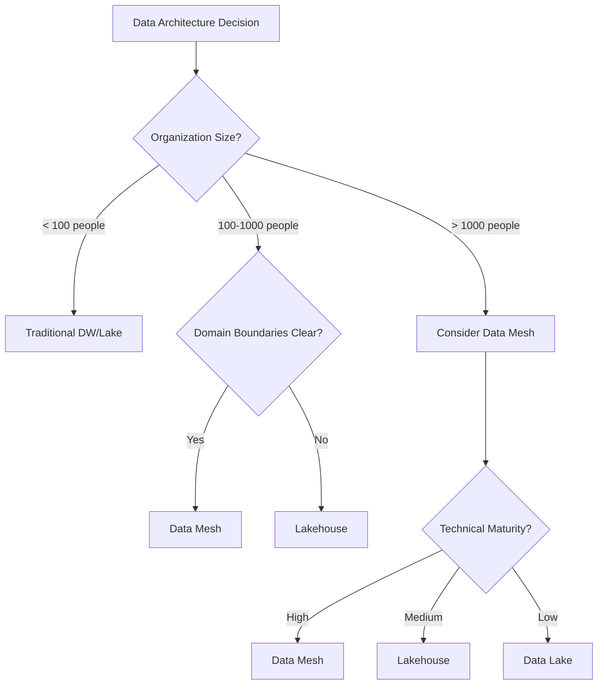

# Data Mesh Interview Questions for Data Engineering

## 📋 Table of Contents

1. [Core Concepts Questions (1-15)](#core-concepts-questions-1-15)
2. [Architecture Questions (16-30)](#architecture-questions-16-30)
3. [Implementation Questions (31-45)](#implementation-questions-31-45)
4. [Governance & Security (46-60)](#governance--security-46-60)
5. [Advanced Topics (61-75)](#advanced-topics-61-75)

---

## Core Concepts Questions (1-15)

### 1. What is Data Mesh and how does it differ from traditional data architecture?

**Answer**: Data Mesh is a decentralized data architecture paradigm that treats data as a product, with domain-oriented ownership and federated governance.

**Key Differences:**
- **Decentralized**: Domain teams own their data products
- **Product Thinking**: Data treated as products with clear ownership
- **Self-Serve**: Infrastructure as a platform for domain teams
- **Federated Governance**: Distributed governance with global standards

**Traditional vs Data Mesh:**
```python
# Traditional centralized approach
class CentralizedDataPlatform:
    def __init__(self):
        self.data_lake = "single_data_lake"
        self.etl_team = "central_data_team"
        self.governance = "centralized_governance"
    
    def ingest_data(self, source):
        # Central team handles all data ingestion
        return self.etl_team.process(source)

# Data Mesh approach
class DataMeshArchitecture:
    def __init__(self):
        self.domains = {
            'sales': SalesDomain(),
            'marketing': MarketingDomain(),
            'finance': FinanceDomain()
        }
        self.platform = SelfServeDataPlatform()
        self.governance = FederatedGovernance()
    
    def create_data_product(self, domain, product_spec):
        domain_team = self.domains[domain]
        return domain_team.create_product(product_spec, self.platform)
```

### 2. What are the four foundational principles of Data Mesh?

### 🎯 **Theoretical Foundation**

#### **Core Concepts**
Data Mesh represents a paradigm shift from centralized data platforms to decentralized, domain-oriented data architecture. It applies product thinking to data management while maintaining federated governance standards.

#### **Historical Context**
- **2019**: Zhamak Dehghani introduces Data Mesh concept at ThoughtWorks
- **2020**: First production implementations at Netflix, Uber
- **2021**: Industry adoption accelerates with cloud-native tools
- **2022**: Enterprise frameworks and governance models mature
- **2023**: Integration with modern data stack becomes standard

#### **Architectural Principles**
- **Decentralization**: Domain teams own their data products end-to-end
- **Product Thinking**: Data treated as products with clear ownership and SLAs
- **Platform Abstraction**: Self-serve infrastructure reduces operational complexity
- **Federated Governance**: Balance between autonomy and organizational standards

### 📊 **Comparative Analysis**

#### **Data Architecture Comparison Matrix**
| Feature | Data Mesh | Data Lake | Data Warehouse | Lakehouse |
|---------|-----------|-----------|----------------|----------|
| **Architecture** | Decentralized domains | Centralized storage | Centralized processing | Hybrid approach |
| **Ownership Model** | Domain-owned products | Central data team | Central data team | Mixed ownership |
| **Scalability** | Horizontal by domain | Vertical scaling | Vertical scaling | Horizontal + Vertical |
| **Governance** | Federated policies | Centralized control | Centralized control | Federated governance |
| **Time to Market** | Fast (domain autonomy) | Medium (central bottleneck) | Slow (rigid schema) | Medium-Fast |
| **Data Quality** | Domain responsibility | Centralized validation | High (structured) | Variable quality |
| **Operational Complexity** | High (distributed) | Medium | Low (established) | Medium-High |
| **Technology Flexibility** | High (domain choice) | Medium | Low (vendor lock) | High |
| **Cost Model** | Domain-based allocation | Centralized budget | Predictable costs | Usage-based |
| **Learning Curve** | Steep (new paradigm) | Medium | Low (established) | Medium |

#### **Decision Framework**


#### **Use Case Scenarios**

**Choose Data Mesh when:**
- **Large Organization (1000+ employees)**: Multiple business domains with clear boundaries
- **High Data Autonomy Needs**: Domains require different technologies and update cycles
- **Mature DevOps Culture**: Teams comfortable with "you build it, you run it" philosophy
- **Regulatory Compliance**: Need for domain-specific data governance and privacy controls
- **Innovation Speed**: Domains need to move fast without central coordination bottlenecks

**Consider Traditional Architecture when:**
- **Small Organization (< 100 people)**: Limited resources for distributed architecture complexity
- **Simple Data Needs**: Single domain or straightforward reporting requirements
- **Cost Sensitivity**: Need predictable, centralized cost structure
- **Limited Technical Expertise**: Team lacks distributed systems experience

**Avoid Data Mesh when:**
- **Unclear Domain Boundaries**: Business domains are not well-defined or frequently changing
- **Low Data Maturity**: Organization lacks basic data management practices
- **Tight Coupling Requirements**: Need for real-time consistency across all data
- **Resource Constraints**: Cannot invest in platform team and domain enablement

#### **Implementation Complexity Analysis**
```
Implementation Effort (Person-months):
┌─────────────────────┬─────────────┬─────────────┬─────────────┐
│ Component           │ Data Mesh   │ Data Lake   │ Data Warehouse │
├─────────────────────┼─────────────┼─────────────┼─────────────┤
│ Platform Setup      │ 24-36       │ 12-18       │ 6-12        │
│ Governance Framework│ 18-24       │ 6-12        │ 3-6         │
│ Domain Migration    │ 36-48       │ 12-24       │ 18-30       │
│ Training & Adoption │ 12-18       │ 6-9         │ 3-6         │
├─────────────────────┼─────────────┼─────────────┼─────────────┤
│ **TOTAL**           │ **90-126**  │ **36-63**   │ **30-54**   │
└─────────────────────┴─────────────┴─────────────┴─────────────┘
```

#### **ROI Timeline Comparison**
```
Return on Investment Timeline:

Data Mesh:     [----Investment----][--Break-even--][+++Returns+++]
               0    12    24    36    48    60    72 months

Data Lake:     [--Investment--][Break-even][+Returns+]
               0    6    12    18    24    30 months

Data Warehouse:[Investment][Break-even][Returns]
               0    3    6    9    12 months
```

**Answer**: The four core principles that define Data Mesh architecture:

**1. Domain-Oriented Decentralized Data Ownership**
```python
class DomainDataProduct:
    def __init__(self, domain_name, product_name):
        self.domain = domain_name
        self.product_name = product_name
        self.owner_team = f"{domain_name}_team"
        self.data_assets = []
        self.apis = []
    
    def define_ownership(self):
        return {
            'domain': self.domain,
            'product_owner': self.owner_team,
            'sla_commitment': '99.9% availability',
            'support_contact': f"{self.owner_team}@company.com"
        }
```

**2. Data as a Product**
```python
class DataProduct:
    def __init__(self, name, domain):
        self.name = name
        self.domain = domain
        self.version = "1.0.0"
        self.schema = None
        self.quality_metrics = {}
        self.documentation = {}
    
    def define_product_characteristics(self):
        return {
            'discoverable': True,
            'addressable': f"api.{self.domain}.{self.name}",
            'understandable': self.documentation,
            'secure': True,
            'interoperable': self.schema,
            'trustworthy': self.quality_metrics
        }
    
    def expose_api(self):
        return {
            'rest_endpoint': f"/api/v1/{self.domain}/{self.name}",
            'graphql_endpoint': f"/graphql/{self.domain}/{self.name}",
            'streaming_endpoint': f"kafka://{self.domain}-{self.name}"
        }
```

**3. Self-Serve Data Infrastructure as a Platform**
```python
class SelfServeDataPlatform:
    def __init__(self):
        self.compute_services = ['spark', 'kubernetes', 'serverless']
        self.storage_services = ['s3', 'delta_lake', 'postgres']
        self.pipeline_tools = ['airflow', 'kafka', 'dbt']
        self.monitoring_tools = ['prometheus', 'grafana', 'datadog']
    
    def provision_infrastructure(self, domain_requirements):
        """Automatically provision infrastructure for domain teams"""
        infrastructure = {
            'compute': self.allocate_compute(domain_requirements),
            'storage': self.allocate_storage(domain_requirements),
            'networking': self.setup_networking(domain_requirements),
            'monitoring': self.setup_monitoring(domain_requirements)
        }
        return infrastructure
    
    def provide_development_tools(self):
        return {
            'data_pipeline_sdk': 'mesh-pipeline-sdk',
            'testing_framework': 'mesh-test-framework',
            'deployment_tools': 'mesh-deploy-cli',
            'monitoring_sdk': 'mesh-observability-sdk'
        }
```

**4. Federated Computational Governance**
```python
class FederatedGovernance:
    def __init__(self):
        self.global_policies = {}
        self.domain_policies = {}
        self.automated_checks = []
    
    def define_global_standards(self):
        return {
            'data_quality_standards': {
                'completeness_threshold': 0.95,
                'accuracy_threshold': 0.99,
                'timeliness_sla': '< 1 hour'
            },
            'security_standards': {
                'encryption_at_rest': True,
                'encryption_in_transit': True,
                'access_control': 'RBAC'
            },
            'interoperability_standards': {
                'schema_format': 'avro',
                'api_standard': 'REST + GraphQL',
                'metadata_format': 'openapi'
            }
        }
    
    def implement_policy_as_code(self, policy):
        """Implement governance policies as automated code"""
        return f"""
        def validate_{policy['name']}(data_product):
            for rule in policy['rules']:
                if not rule.validate(data_product):
                    raise PolicyViolationError(f"Policy {policy['name']} violated")
            return True
        """
```

### 3. How do you implement domain-oriented data ownership in practice?

**Answer**: Domain ownership requires clear boundaries, responsibilities, and organizational alignment.

```python
class DomainOwnership:
    def __init__(self, domain_name):
        self.domain = domain_name
        self.data_products = []
        self.team_structure = {}
        self.responsibilities = {}
    
    def define_domain_boundaries(self):
        """Define clear domain boundaries using Domain-Driven Design"""
        return {
            'bounded_context': f"{self.domain}_context",
            'ubiquitous_language': self.load_domain_vocabulary(),
            'core_entities': self.identify_core_entities(),
            'domain_events': self.identify_domain_events()
        }
    
    def establish_team_structure(self):
        """Define team structure for domain ownership"""
        self.team_structure = {
            'product_owner': f"{self.domain}_product_owner",
            'data_engineers': [f"{self.domain}_de_1", f"{self.domain}_de_2"],
            'data_scientists': [f"{self.domain}_ds_1"],
            'domain_experts': [f"{self.domain}_expert_1"],
            'platform_liaisons': ['platform_engineer_1']
        }
        return self.team_structure
    
    def define_responsibilities(self):
        """Clear responsibility matrix"""
        return {
            'data_quality': 'domain_team',
            'schema_evolution': 'domain_team',
            'api_design': 'domain_team',
            'documentation': 'domain_team',
            'infrastructure': 'platform_team',
            'security_compliance': 'shared',
            'cost_optimization': 'shared'
        }
    
    def implement_ownership_metrics(self):
        """Metrics to track ownership effectiveness"""
        return {
            'data_product_health': self.calculate_product_health(),
            'consumer_satisfaction': self.measure_consumer_satisfaction(),
            'time_to_market': self.measure_delivery_speed(),
            'operational_excellence': self.measure_reliability()
        }
```

### 4. What makes a good data product in Data Mesh?

**Answer**: A good data product exhibits specific characteristics that make it valuable and usable.

```python
class DataProductCharacteristics:
    def __init__(self, product_name):
        self.name = product_name
        self.characteristics = {}
    
    def make_discoverable(self):
        """Ensure data product can be found"""
        return {
            'catalog_registration': True,
            'metadata_tags': ['customer', 'sales', 'real-time'],
            'search_keywords': ['customer_behavior', 'purchase_history'],
            'documentation_url': f"docs.company.com/data-products/{self.name}",
            'api_documentation': f"api.company.com/docs/{self.name}"
        }
    
    def make_addressable(self):
        """Provide clear access mechanisms"""
        return {
            'unique_identifier': f"urn:data-product:{self.name}",
            'api_endpoints': {
                'rest': f"https://api.company.com/v1/{self.name}",
                'graphql': f"https://graphql.company.com/{self.name}",
                'streaming': f"kafka://events.company.com/{self.name}"
            },
            'access_protocols': ['HTTPS', 'Kafka', 'S3']
        }
    
    def make_understandable(self):
        """Provide comprehensive documentation"""
        return {
            'business_purpose': "Customer purchase behavior analysis",
            'data_lineage': self.generate_lineage_diagram(),
            'schema_documentation': self.generate_schema_docs(),
            'usage_examples': self.provide_code_examples(),
            'quality_metrics': self.expose_quality_metrics(),
            'sla_commitments': {
                'availability': '99.9%',
                'latency': '< 100ms',
                'freshness': '< 5 minutes'
            }
        }
    
    def make_secure_and_trustworthy(self):
        """Implement security and trust measures"""
        return {
            'authentication': 'OAuth2',
            'authorization': 'RBAC',
            'encryption': {
                'at_rest': 'AES-256',
                'in_transit': 'TLS 1.3'
            },
            'audit_logging': True,
            'data_quality_score': 0.98,
            'test_coverage': 0.95,
            'monitoring_alerts': True
        }
    
    def make_interoperable(self):
        """Ensure compatibility with other systems"""
        return {
            'standard_formats': ['JSON', 'Avro', 'Parquet'],
            'api_standards': ['REST', 'GraphQL', 'gRPC'],
            'schema_registry': 'confluent_schema_registry',
            'versioning_strategy': 'semantic_versioning',
            'backward_compatibility': True
        }
```

### 5. How do you implement self-serve data infrastructure?

**Answer**: Self-serve infrastructure provides domain teams with automated, standardized tools and platforms.

```python
class SelfServeInfrastructure:
    def __init__(self):
        self.platform_services = {}
        self.automation_tools = {}
        self.developer_experience = {}
    
    def provide_compute_services(self):
        """Managed compute services for domain teams"""
        return {
            'serverless_functions': {
                'aws_lambda': 'auto-scaling functions',
                'azure_functions': 'event-driven compute',
                'gcp_cloud_functions': 'lightweight compute'
            },
            'container_orchestration': {
                'kubernetes': 'managed k8s clusters',
                'docker_swarm': 'simple container orchestration',
                'ecs_fargate': 'serverless containers'
            },
            'big_data_processing': {
                'spark_clusters': 'auto-scaling Spark',
                'dataflow': 'managed stream processing',
                'emr': 'managed Hadoop ecosystem'
            }
        }
    
    def provide_storage_services(self):
        """Managed storage solutions"""
        return {
            'object_storage': {
                's3': 'scalable object storage',
                'azure_blob': 'cloud blob storage',
                'gcs': 'google cloud storage'
            },
            'databases': {
                'postgres': 'managed relational DB',
                'mongodb': 'managed document DB',
                'redis': 'managed in-memory DB'
            },
            'data_lakes': {
                'delta_lake': 'ACID transactions on data lake',
                'iceberg': 'table format for analytics',
                'hudi': 'incremental data processing'
            }
        }
    
    def provide_pipeline_tools(self):
        """Data pipeline development tools"""
        return {
            'orchestration': {
                'airflow': 'workflow orchestration',
                'prefect': 'modern workflow engine',
                'dagster': 'data orchestrator'
            },
            'streaming': {
                'kafka': 'distributed streaming',
                'pulsar': 'cloud-native messaging',
                'kinesis': 'managed streaming'
            },
            'transformation': {
                'dbt': 'analytics engineering',
                'spark_sql': 'big data SQL',
                'dataform': 'data transformation'
            }
        }
    
    def provide_developer_experience(self):
        """Tools and SDKs for domain teams"""
        return {
            'sdks': {
                'python_sdk': 'mesh-python-sdk',
                'java_sdk': 'mesh-java-sdk',
                'javascript_sdk': 'mesh-js-sdk'
            },
            'cli_tools': {
                'mesh_cli': 'command-line interface',
                'deployment_cli': 'deployment automation',
                'testing_cli': 'automated testing'
            },
            'ide_plugins': {
                'vscode_extension': 'VS Code integration',
                'intellij_plugin': 'IntelliJ integration',
                'jupyter_extension': 'Jupyter notebook support'
            }
        }
    
    def implement_infrastructure_as_code(self):
        """Terraform templates for common patterns"""
        return """
        # Data product infrastructure template
        module "data_product" {
          source = "./modules/data-product"
          
          product_name = var.product_name
          domain = var.domain
          
          # Compute resources
          enable_spark = var.enable_spark
          enable_serverless = var.enable_serverless
          
          # Storage resources
          enable_s3 = var.enable_s3
          enable_database = var.enable_database
          
          # Networking
          vpc_id = var.vpc_id
          subnet_ids = var.subnet_ids
          
          # Monitoring
          enable_monitoring = true
          alert_email = var.team_email
        }
        """
```

---

## Architecture Questions (16-30)

### 16. How do you design the overall Data Mesh architecture?

**Answer**: Data Mesh architecture requires careful design of domains, platforms, and governance layers.

```python
class DataMeshArchitecture:
    def __init__(self):
        self.domains = {}
        self.platform_layer = {}
        self.governance_layer = {}
        self.connectivity_layer = {}
    
    def design_domain_layer(self):
        """Design domain-specific data products"""
        domain_design = {
            'domain_identification': {
                'method': 'domain_driven_design',
                'criteria': ['business_capability', 'data_ownership', 'team_structure'],
                'domains': ['sales', 'marketing', 'finance', 'operations']
            },
            'data_product_design': {
                'product_types': ['analytical', 'operational', 'ml_features'],
                'interface_standards': ['rest_api', 'graphql', 'event_streaming'],
                'quality_contracts': ['sla', 'schema', 'freshness']
            }
        }
        return domain_design
    
    def design_platform_layer(self):
        """Design self-serve data platform"""
        platform_design = {
            'infrastructure_services': {
                'compute': ['kubernetes', 'serverless', 'spark'],
                'storage': ['object_store', 'databases', 'streaming'],
                'networking': ['service_mesh', 'api_gateway', 'load_balancer']
            },
            'developer_services': {
                'pipeline_tools': ['airflow', 'dbt', 'kafka'],
                'testing_tools': ['great_expectations', 'pytest', 'data_diff'],
                'monitoring_tools': ['prometheus', 'grafana', 'datadog']
            },
            'automation_services': {
                'ci_cd': ['github_actions', 'jenkins', 'gitlab_ci'],
                'infrastructure_as_code': ['terraform', 'pulumi', 'cloudformation'],
                'policy_as_code': ['opa', 'sentinel', 'cedar']
            }
        }
        return platform_design
    
    def design_governance_layer(self):
        """Design federated governance"""
        governance_design = {
            'policy_framework': {
                'global_policies': ['security', 'privacy', 'quality'],
                'domain_policies': ['business_rules', 'data_contracts'],
                'enforcement_mechanisms': ['automated_checks', 'approval_workflows']
            },
            'standards_and_guidelines': {
                'technical_standards': ['api_design', 'schema_evolution', 'versioning'],
                'operational_standards': ['sla_requirements', 'monitoring', 'alerting'],
                'documentation_standards': ['metadata', 'lineage', 'usage_examples']
            }
        }
        return governance_design
    
    def design_connectivity_layer(self):
        """Design inter-domain connectivity"""
        connectivity_design = {
            'api_management': {
                'api_gateway': 'centralized_api_management',
                'service_discovery': 'automatic_service_registration',
                'load_balancing': 'intelligent_traffic_routing'
            },
            'event_streaming': {
                'event_backbone': 'kafka_cluster',
                'schema_registry': 'confluent_schema_registry',
                'event_catalog': 'event_discovery_service'
            },
            'data_catalog': {
                'metadata_management': 'apache_atlas',
                'lineage_tracking': 'automated_lineage_discovery',
                'search_and_discovery': 'elasticsearch_based_search'
            }
        }
        return connectivity_design
```

### 17. How do you handle data contracts in Data Mesh?

**Answer**: Data contracts define explicit agreements between data producers and consumers.

```python
class DataContract:
    def __init__(self, product_name, version):
        self.product_name = product_name
        self.version = version
        self.contract = {}
    
    def define_schema_contract(self):
        """Define schema and evolution rules"""
        return {
            'schema': {
                'format': 'avro',
                'definition': {
                    'type': 'record',
                    'name': 'CustomerEvent',
                    'fields': [
                        {'name': 'customer_id', 'type': 'string'},
                        {'name': 'event_type', 'type': 'string'},
                        {'name': 'timestamp', 'type': 'long'},
                        {'name': 'properties', 'type': 'map', 'values': 'string'}
                    ]
                }
            },
            'evolution_rules': {
                'backward_compatibility': True,
                'forward_compatibility': False,
                'breaking_change_policy': 'major_version_increment'
            }
        }
    
    def define_sla_contract(self):
        """Define service level agreements"""
        return {
            'availability': {
                'target': '99.9%',
                'measurement_window': '30_days',
                'downtime_allowance': '43_minutes_per_month'
            },
            'latency': {
                'p50': '50ms',
                'p95': '200ms',
                'p99': '500ms'
            },
            'throughput': {
                'max_requests_per_second': 1000,
                'burst_capacity': 2000
            },
            'freshness': {
                'batch_data': '1_hour',
                'streaming_data': '30_seconds',
                'reference_data': '24_hours'
            }
        }
    
    def define_quality_contract(self):
        """Define data quality expectations"""
        return {
            'completeness': {
                'customer_id': {'null_rate': '< 0.1%'},
                'event_type': {'null_rate': '< 0.01%'},
                'timestamp': {'null_rate': '0%'}
            },
            'accuracy': {
                'customer_id': {'format': 'uuid_v4'},
                'event_type': {'enum': ['purchase', 'view', 'cart_add', 'login']},
                'timestamp': {'range': 'last_30_days'}
            },
            'consistency': {
                'referential_integrity': 'customer_id must exist in customer_hub',
                'business_rules': 'purchase events must have positive amount'
            }
        }
    
    def implement_contract_testing(self):
        """Implement automated contract testing"""
        return """
        import pytest
        from data_contract_validator import ContractValidator
        
        class TestDataContract:
            def setup_method(self):
                self.validator = ContractValidator(self.contract)
            
            def test_schema_compliance(self, sample_data):
                assert self.validator.validate_schema(sample_data)
            
            def test_sla_compliance(self, metrics):
                assert self.validator.validate_sla(metrics)
            
            def test_quality_compliance(self, data_batch):
                quality_report = self.validator.validate_quality(data_batch)
                assert quality_report.passed
        """
    
    def implement_contract_monitoring(self):
        """Monitor contract compliance in production"""
        return {
            'schema_monitoring': {
                'tool': 'schema_registry_monitoring',
                'alerts': ['schema_evolution_detected', 'incompatible_change']
            },
            'sla_monitoring': {
                'tool': 'prometheus_grafana',
                'metrics': ['availability', 'latency', 'throughput'],
                'alerts': ['sla_breach', 'degraded_performance']
            },
            'quality_monitoring': {
                'tool': 'great_expectations',
                'checks': ['completeness', 'accuracy', 'consistency'],
                'alerts': ['quality_degradation', 'anomaly_detected']
            }
        }
```

---

## Implementation Questions (31-45)

### 31. How do you migrate from a centralized data platform to Data Mesh?

**Answer**: Migration requires a phased approach with careful planning and execution.

```python
class DataMeshMigration:
    def __init__(self, current_architecture):
        self.current_state = current_architecture
        self.target_state = {}
        self.migration_phases = []
    
    def assess_current_state(self):
        """Assess existing data architecture"""
        assessment = {
            'data_sources': self.inventory_data_sources(),
            'data_pipelines': self.inventory_pipelines(),
            'data_consumers': self.inventory_consumers(),
            'team_structure': self.analyze_team_structure(),
            'technical_debt': self.assess_technical_debt()
        }
        return assessment
    
    def design_migration_strategy(self):
        """Design phased migration approach"""
        return {
            'phase_1_foundation': {
                'duration': '3_months',
                'objectives': [
                    'establish_platform_team',
                    'design_self_serve_platform',
                    'define_governance_framework',
                    'pilot_domain_selection'
                ],
                'deliverables': [
                    'platform_mvp',
                    'governance_policies',
                    'migration_playbook'
                ]
            },
            'phase_2_pilot': {
                'duration': '6_months',
                'objectives': [
                    'migrate_pilot_domain',
                    'implement_data_products',
                    'establish_contracts',
                    'validate_approach'
                ],
                'deliverables': [
                    'pilot_data_products',
                    'lessons_learned',
                    'refined_platform'
                ]
            },
            'phase_3_scale': {
                'duration': '12_months',
                'objectives': [
                    'migrate_remaining_domains',
                    'optimize_platform',
                    'mature_governance',
                    'achieve_full_adoption'
                ],
                'deliverables': [
                    'complete_mesh_architecture',
                    'operational_excellence',
                    'organizational_transformation'
                ]
            }
        }
    
    def implement_strangler_fig_pattern(self):
        """Gradually replace monolithic data platform"""
        return {
            'pattern_description': 'Incrementally replace legacy system',
            'implementation_steps': [
                'identify_migration_boundaries',
                'create_facade_layer',
                'route_traffic_gradually',
                'retire_legacy_components'
            ],
            'code_example': """
            class DataPlatformFacade:
                def __init__(self):
                    self.legacy_system = LegacyDataPlatform()
                    self.mesh_domains = {}
                
                def get_customer_data(self, customer_id):
                    # Route to mesh if domain is migrated
                    if 'customer' in self.mesh_domains:
                        return self.mesh_domains['customer'].get_data(customer_id)
                    else:
                        return self.legacy_system.get_customer_data(customer_id)
            """
        }
    
    def manage_organizational_change(self):
        """Handle organizational transformation"""
        return {
            'change_management': {
                'communication_plan': 'regular_updates_and_training',
                'training_program': 'domain_team_upskilling',
                'incentive_alignment': 'product_ownership_metrics'
            },
            'team_restructuring': {
                'domain_team_formation': 'cross_functional_teams',
                'platform_team_creation': 'infrastructure_specialists',
                'governance_team_establishment': 'federated_governance_council'
            },
            'cultural_transformation': {
                'product_mindset': 'data_as_product_thinking',
                'ownership_culture': 'you_build_it_you_run_it',
                'collaboration_model': 'domain_platform_partnership'
            }
        }
```

### 32. How do you implement data product discovery and cataloging?

**Answer**: Discovery requires comprehensive metadata management and search capabilities.

```python
class DataProductCatalog:
    def __init__(self):
        self.metadata_store = {}
        self.search_engine = {}
        self.lineage_graph = {}
    
    def implement_metadata_management(self):
        """Comprehensive metadata collection and management"""
        return {
            'metadata_schema': {
                'business_metadata': {
                    'product_name': 'string',
                    'domain': 'string',
                    'description': 'text',
                    'business_purpose': 'text',
                    'owner_team': 'string',
                    'contact_email': 'string'
                },
                'technical_metadata': {
                    'api_endpoints': 'array',
                    'schema_definition': 'json',
                    'data_format': 'string',
                    'update_frequency': 'string',
                    'retention_policy': 'string'
                },
                'operational_metadata': {
                    'sla_commitments': 'json',
                    'quality_metrics': 'json',
                    'usage_statistics': 'json',
                    'cost_information': 'json'
                }
            },
            'metadata_collection': {
                'automated_discovery': 'schema_inference_and_profiling',
                'api_registration': 'openapi_spec_parsing',
                'manual_annotation': 'business_context_addition',
                'lineage_tracking': 'automated_dependency_analysis'
            }
        }
    
    def implement_search_and_discovery(self):
        """Advanced search capabilities"""
        return {
            'search_features': {
                'full_text_search': 'elasticsearch_based',
                'faceted_search': 'filter_by_domain_type_format',
                'semantic_search': 'ml_powered_similarity',
                'graph_traversal': 'lineage_based_discovery'
            },
            'search_interface': {
                'web_ui': 'react_based_catalog_ui',
                'api': 'graphql_search_api',
                'cli': 'command_line_search_tool',
                'ide_integration': 'vscode_extension'
            },
            'recommendation_engine': {
                'usage_based': 'recommend_popular_products',
                'similarity_based': 'recommend_similar_products',
                'context_aware': 'recommend_based_on_current_work'
            }
        }
    
    def implement_lineage_tracking(self):
        """Data lineage and impact analysis"""
        return {
            'lineage_collection': {
                'code_parsing': 'static_analysis_of_pipelines',
                'runtime_tracking': 'dynamic_lineage_capture',
                'metadata_inference': 'schema_based_relationships'
            },
            'lineage_visualization': {
                'graph_visualization': 'd3js_based_lineage_graph',
                'impact_analysis': 'downstream_dependency_analysis',
                'root_cause_analysis': 'upstream_dependency_tracing'
            },
            'lineage_api': """
            class LineageAPI:
                def get_upstream_dependencies(self, data_product_id):
                    return self.lineage_graph.get_predecessors(data_product_id)
                
                def get_downstream_consumers(self, data_product_id):
                    return self.lineage_graph.get_successors(data_product_id)
                
                def analyze_impact(self, data_product_id, change_type):
                    affected_products = self.get_downstream_consumers(data_product_id)
                    return self.assess_impact_severity(affected_products, change_type)
            """
        }
    
    def implement_catalog_api(self):
        """Programmatic access to catalog"""
        return """
        from fastapi import FastAPI
        from typing import List, Optional
        
        app = FastAPI(title="Data Product Catalog API")
        
        @app.get("/api/v1/products")
        async def search_products(
            query: Optional[str] = None,
            domain: Optional[str] = None,
            format: Optional[str] = None,
            limit: int = 20
        ):
            filters = {
                'domain': domain,
                'format': format
            }
            return catalog.search(query, filters, limit)
        
        @app.get("/api/v1/products/{product_id}")
        async def get_product_details(product_id: str):
            return catalog.get_product(product_id)
        
        @app.get("/api/v1/products/{product_id}/lineage")
        async def get_product_lineage(product_id: str):
            return lineage_tracker.get_lineage(product_id)
        """
```

---

## Governance & Security (46-60)

### 46. How do you implement federated governance in Data Mesh?

**Answer**: Federated governance balances autonomy with consistency through automated policies and standards.

```python
class FederatedGovernance:
    def __init__(self):
        self.global_policies = {}
        self.domain_policies = {}
        self.policy_engine = {}
        self.compliance_monitoring = {}
    
    def define_governance_framework(self):
        """Establish governance structure and processes"""
        return {
            'governance_structure': {
                'data_governance_council': {
                    'members': ['cdo', 'domain_leads', 'platform_lead', 'security_lead'],
                    'responsibilities': ['policy_definition', 'standards_approval', 'conflict_resolution']
                },
                'domain_governance_teams': {
                    'composition': ['domain_product_owner', 'data_engineers', 'domain_experts'],
                    'responsibilities': ['domain_policy_implementation', 'quality_assurance', 'compliance_monitoring']
                },
                'platform_governance_team': {
                    'composition': ['platform_engineers', 'security_engineers', 'compliance_officers'],
                    'responsibilities': ['platform_standards', 'security_policies', 'automation_tools']
                }
            },
            'governance_processes': {
                'policy_lifecycle': ['definition', 'review', 'approval', 'implementation', 'monitoring'],
                'exception_handling': ['request', 'review', 'approval', 'temporary_exemption'],
                'compliance_reporting': ['automated_checks', 'periodic_audits', 'violation_reporting']
            }
        }
    
    def implement_policy_as_code(self):
        """Implement governance policies as executable code"""
        return {
            'policy_definition_language': 'open_policy_agent_rego',
            'policy_examples': {
                'data_classification_policy': """
                package data_classification
                
                # Classify data based on sensitivity
                classify_data(data_product) = classification {
                    contains_pii(data_product.schema)
                    classification := "sensitive"
                } else = classification {
                    contains_financial_data(data_product.schema)
                    classification := "confidential"
                } else = classification {
                    classification := "public"
                }
                
                # Enforce access controls based on classification
                allow_access(user, data_product) {
                    classification := classify_data(data_product)
                    user.clearance_level >= required_clearance[classification]
                }
                """,
                'schema_evolution_policy': """
                package schema_evolution
                
                # Allow backward compatible changes
                allow_schema_change(old_schema, new_schema) {
                    is_backward_compatible(old_schema, new_schema)
                }
                
                # Require approval for breaking changes
                allow_breaking_change(change_request) {
                    change_request.approval_status == "approved"
                    change_request.migration_plan != null
                }
                """
            },
            'policy_enforcement': {
                'ci_cd_integration': 'policy_checks_in_pipeline',
                'runtime_enforcement': 'api_gateway_policy_enforcement',
                'monitoring_integration': 'continuous_compliance_monitoring'
            }
        }
    
    def implement_automated_compliance(self):
        """Automated compliance monitoring and reporting"""
        return {
            'compliance_checks': {
                'data_quality_monitoring': {
                    'tool': 'great_expectations',
                    'checks': ['completeness', 'accuracy', 'consistency'],
                    'frequency': 'continuous'
                },
                'security_scanning': {
                    'tool': 'data_security_scanner',
                    'checks': ['pii_detection', 'access_control_validation', 'encryption_verification'],
                    'frequency': 'daily'
                },
                'policy_compliance': {
                    'tool': 'open_policy_agent',
                    'checks': ['schema_compliance', 'naming_conventions', 'documentation_completeness'],
                    'frequency': 'on_change'
                }
            },
            'compliance_reporting': {
                'dashboard': 'governance_compliance_dashboard',
                'alerts': 'policy_violation_notifications',
                'audit_trail': 'immutable_compliance_log'
            }
        }
```

### 47. How do you handle data privacy and security in Data Mesh?

**Answer**: Privacy and security require distributed implementation with centralized standards.

```python
class DataMeshSecurity:
    def __init__(self):
        self.security_policies = {}
        self.privacy_controls = {}
        self.access_management = {}
    
    def implement_zero_trust_architecture(self):
        """Zero trust security model for data mesh"""
        return {
            'identity_and_access_management': {
                'authentication': {
                    'method': 'oauth2_openid_connect',
                    'providers': ['azure_ad', 'okta', 'auth0'],
                    'mfa_required': True
                },
                'authorization': {
                    'model': 'attribute_based_access_control',
                    'policies': 'centralized_policy_store',
                    'enforcement': 'distributed_policy_enforcement_points'
                },
                'service_to_service': {
                    'authentication': 'mutual_tls',
                    'authorization': 'service_mesh_policies',
                    'encryption': 'end_to_end_encryption'
                }
            },
            'network_security': {
                'segmentation': 'micro_segmentation_by_domain',
                'traffic_inspection': 'deep_packet_inspection',
                'threat_detection': 'ml_based_anomaly_detection'
            },
            'data_protection': {
                'encryption_at_rest': 'aes_256_encryption',
                'encryption_in_transit': 'tls_1_3',
                'key_management': 'hardware_security_modules'
            }
        }
    
    def implement_privacy_by_design(self):
        """Privacy controls built into data products"""
        return {
            'data_minimization': {
                'principle': 'collect_only_necessary_data',
                'implementation': 'schema_based_field_filtering',
                'automation': 'automated_data_retention_policies'
            },
            'purpose_limitation': {
                'principle': 'use_data_only_for_stated_purpose',
                'implementation': 'purpose_based_access_control',
                'monitoring': 'usage_pattern_analysis'
            },
            'consent_management': {
                'collection': 'explicit_consent_capture',
                'storage': 'consent_preference_center',
                'enforcement': 'consent_based_data_filtering'
            },
            'right_to_be_forgotten': {
                'implementation': 'data_deletion_apis',
                'verification': 'deletion_confirmation_system',
                'compliance': 'audit_trail_maintenance'
            }
        }
    
    def implement_data_classification(self):
        """Automated data classification and protection"""
        return {
            'classification_engine': {
                'pii_detection': 'ml_based_sensitive_data_detection',
                'business_classification': 'rule_based_business_context',
                'regulatory_classification': 'compliance_framework_mapping'
            },
            'protection_controls': {
                'sensitive_data': {
                    'encryption': 'field_level_encryption',
                    'masking': 'dynamic_data_masking',
                    'access_control': 'need_to_know_basis'
                },
                'confidential_data': {
                    'encryption': 'column_level_encryption',
                    'access_logging': 'detailed_audit_logs',
                    'approval_workflow': 'manager_approval_required'
                },
                'public_data': {
                    'protection': 'standard_encryption',
                    'access': 'role_based_access_control'
                }
            }
        }
    
    def implement_security_monitoring(self):
        """Continuous security monitoring and incident response"""
        return {
            'security_monitoring': {
                'data_access_monitoring': 'real_time_access_logging',
                'anomaly_detection': 'ml_based_behavior_analysis',
                'threat_intelligence': 'external_threat_feed_integration'
            },
            'incident_response': {
                'detection': 'automated_security_alert_system',
                'response': 'automated_incident_response_playbooks',
                'recovery': 'disaster_recovery_procedures'
            },
            'compliance_reporting': {
                'gdpr_compliance': 'automated_gdpr_reporting',
                'sox_compliance': 'financial_data_audit_trails',
                'hipaa_compliance': 'healthcare_data_protection_reports'
            }
        }
```

---

## Advanced Topics (61-75)

### 61. How do you implement Data Mesh with real-time streaming data?

**Answer**: Streaming data mesh requires event-driven architecture with domain-owned event streams.

```python
class StreamingDataMesh:
    def __init__(self):
        self.event_backbone = {}
        self.domain_streams = {}
        self.stream_processing = {}
    
    def design_event_driven_architecture(self):
        """Event-driven data mesh architecture"""
        return {
            'event_backbone': {
                'technology': 'apache_kafka',
                'topology': 'multi_cluster_federation',
                'partitioning_strategy': 'domain_based_partitioning',
                'replication': 'cross_region_replication'
            },
            'domain_event_streams': {
                'ownership_model': 'domain_owns_event_streams',
                'naming_convention': '{domain}.{entity}.{event_type}',
                'schema_management': 'confluent_schema_registry',
                'access_control': 'kafka_acls_by_domain'
            },
            'stream_processing': {
                'framework': 'kafka_streams_and_ksql',
                'deployment': 'kubernetes_based_stream_apps',
                'monitoring': 'kafka_streams_monitoring'
            }
        }
    
    def implement_domain_event_streams(self):
        """Domain-owned event streams implementation"""
        return {
            'event_stream_definition': """
            # Sales domain events
            sales.customer.created
            sales.order.placed
            sales.order.fulfilled
            sales.payment.processed
            
            # Marketing domain events
            marketing.campaign.launched
            marketing.email.sent
            marketing.click.tracked
            marketing.conversion.recorded
            """,
            'event_schema_example': {
                'event_type': 'sales.order.placed',
                'schema': {
                    'type': 'record',
                    'name': 'OrderPlaced',
                    'namespace': 'com.company.sales.events',
                    'fields': [
                        {'name': 'order_id', 'type': 'string'},
                        {'name': 'customer_id', 'type': 'string'},
                        {'name': 'timestamp', 'type': 'long'},
                        {'name': 'amount', 'type': 'double'},
                        {'name': 'items', 'type': {'type': 'array', 'items': 'OrderItem'}}
                    ]
                }
            },
            'stream_processing_example': """
            from kafka import KafkaProducer, KafkaConsumer
            import json
            
            class DomainEventProducer:
                def __init__(self, domain_name):
                    self.domain = domain_name
                    self.producer = KafkaProducer(
                        bootstrap_servers=['kafka1:9092', 'kafka2:9092'],
                        value_serializer=lambda v: json.dumps(v).encode('utf-8')
                    )
                
                def publish_event(self, entity, event_type, event_data):
                    topic = f"{self.domain}.{entity}.{event_type}"
                    self.producer.send(topic, event_data)
            
            class DomainEventConsumer:
                def __init__(self, consumer_domain, source_domain):
                    self.consumer_domain = consumer_domain
                    self.source_domain = source_domain
                    self.consumer = KafkaConsumer(
                        f"{source_domain}.*",
                        bootstrap_servers=['kafka1:9092', 'kafka2:9092'],
                        value_deserializer=lambda m: json.loads(m.decode('utf-8'))
                    )
                
                def process_events(self):
                    for message in self.consumer:
                        self.handle_event(message.topic, message.value)
            """
        }
    
    def implement_stream_data_products(self):
        """Stream-based data products"""
        return {
            'real_time_data_products': {
                'customer_behavior_stream': {
                    'description': 'Real-time customer behavior events',
                    'source_streams': ['web.click.tracked', 'mobile.screen.viewed'],
                    'processing': 'sessionization_and_enrichment',
                    'output_format': 'enriched_behavior_events'
                },
                'fraud_detection_stream': {
                    'description': 'Real-time fraud detection alerts',
                    'source_streams': ['payments.transaction.initiated'],
                    'processing': 'ml_based_fraud_scoring',
                    'output_format': 'fraud_risk_scores'
                }
            },
            'stream_processing_patterns': {
                'event_sourcing': 'maintain_event_log_as_source_of_truth',
                'cqrs': 'separate_command_and_query_models',
                'saga_pattern': 'distributed_transaction_coordination',
                'event_streaming_etl': 'continuous_data_transformation'
            }
        }
```

### 62. How do you handle data mesh at scale across multiple cloud providers?

**Answer**: Multi-cloud data mesh requires careful orchestration and standardization.

```python
class MultiCloudDataMesh:
    def __init__(self):
        self.cloud_providers = ['aws', 'azure', 'gcp']
        self.cross_cloud_connectivity = {}
        self.unified_governance = {}
    
    def design_multi_cloud_architecture(self):
        """Multi-cloud data mesh architecture"""
        return {
            'cloud_distribution_strategy': {
                'domain_placement': {
                    'sales_domain': 'aws',
                    'marketing_domain': 'azure',
                    'finance_domain': 'gcp',
                    'operations_domain': 'hybrid_aws_azure'
                },
                'data_residency_compliance': {
                    'eu_data': 'azure_europe',
                    'us_data': 'aws_us_east',
                    'asia_data': 'gcp_asia_pacific'
                }
            },
            'cross_cloud_connectivity': {
                'network_connectivity': {
                    'aws_azure': 'expressroute_direct_connect',
                    'aws_gcp': 'partner_interconnect',
                    'azure_gcp': 'expressroute_partner_peering'
                },
                'data_transfer': {
                    'bulk_transfer': 'cloud_provider_transfer_services',
                    'streaming_transfer': 'kafka_multi_region_replication',
                    'api_integration': 'cross_cloud_api_gateway'
                }
            },
            'unified_control_plane': {
                'identity_federation': 'cross_cloud_identity_provider',
                'policy_management': 'centralized_policy_engine',
                'monitoring_aggregation': 'unified_observability_platform'
            }
        }
    
    def implement_cross_cloud_data_products(self):
        """Data products spanning multiple clouds"""
        return {
            'federated_data_products': {
                'global_customer_360': {
                    'data_sources': {
                        'crm_data': 'aws_rds',
                        'web_analytics': 'gcp_bigquery',
                        'email_campaigns': 'azure_cosmos_db'
                    },
                    'processing': 'cross_cloud_spark_federation',
                    'api_endpoint': 'global_api_gateway'
                }
            },
            'cross_cloud_processing': {
                'federated_query_engine': 'presto_trino_federation',
                'distributed_ml_pipelines': 'kubeflow_multi_cloud',
                'cross_cloud_orchestration': 'airflow_kubernetes_executor'
            },
            'implementation_example': """
            class CrossCloudDataProduct:
                def __init__(self, product_name):
                    self.product_name = product_name
                    self.cloud_connectors = {
                        'aws': AWSConnector(),
                        'azure': AzureConnector(),
                        'gcp': GCPConnector()
                    }
                
                def federated_query(self, query):
                    # Parse query to identify data sources
                    sources = self.parse_data_sources(query)
                    
                    # Execute sub-queries on respective clouds
                    results = {}
                    for cloud, sub_query in sources.items():
                        results[cloud] = self.cloud_connectors[cloud].execute(sub_query)
                    
                    # Combine results
                    return self.combine_results(results)
                
                def cross_cloud_pipeline(self, pipeline_config):
                    # Orchestrate pipeline across clouds
                    for step in pipeline_config['steps']:
                        cloud = step['target_cloud']
                        self.cloud_connectors[cloud].execute_step(step)
            """
        }
    
    def implement_unified_governance(self):
        """Governance across multiple cloud providers"""
        return {
            'policy_federation': {
                'global_policies': 'opa_based_policy_engine',
                'cloud_specific_policies': 'native_cloud_policy_translation',
                'policy_synchronization': 'automated_policy_deployment'
            },
            'compliance_management': {
                'multi_cloud_auditing': 'centralized_audit_log_aggregation',
                'compliance_reporting': 'unified_compliance_dashboard',
                'regulatory_mapping': 'jurisdiction_specific_compliance_rules'
            },
            'cost_optimization': {
                'cross_cloud_cost_monitoring': 'unified_cost_dashboard',
                'workload_optimization': 'intelligent_workload_placement',
                'resource_rightsizing': 'ml_based_resource_optimization'
            }
        }
```

---

## 📚 **Data Mesh Study Guide & Best Practices**

### 🎯 **Essential Data Mesh Concepts**

#### **Core Principles Mastery**
1. **Domain-Oriented Decentralization**: Understand domain boundaries and ownership models
2. **Data as a Product**: Product thinking applied to data assets
3. **Self-Serve Infrastructure**: Platform capabilities for domain autonomy
4. **Federated Governance**: Balance between autonomy and consistency

#### **Implementation Patterns**
1. **Domain Identification**: Use Domain-Driven Design principles
2. **Data Product Design**: Focus on discoverability, addressability, and trustworthiness
3. **Platform Engineering**: Build capabilities, not just infrastructure
4. **Organizational Design**: Align teams with architecture

### 🚀 **Best Practices**

#### **Organizational**
- Start with pilot domains to prove value
- Invest heavily in platform team capabilities
- Establish clear ownership and accountability
- Create incentives aligned with mesh principles

#### **Technical**
- Standardize on common protocols and formats
- Implement comprehensive observability
- Automate governance through policy-as-code
- Design for interoperability from day one

#### **Governance**
- Define global standards while allowing domain flexibility
- Implement automated compliance checking
- Create clear escalation paths for conflicts
- Measure and optimize governance effectiveness

---

**Remember**: Data Mesh is as much an organizational transformation as it is a technical architecture. Success requires alignment of people, processes, and technology around the core principles of domain ownership and product thinking.