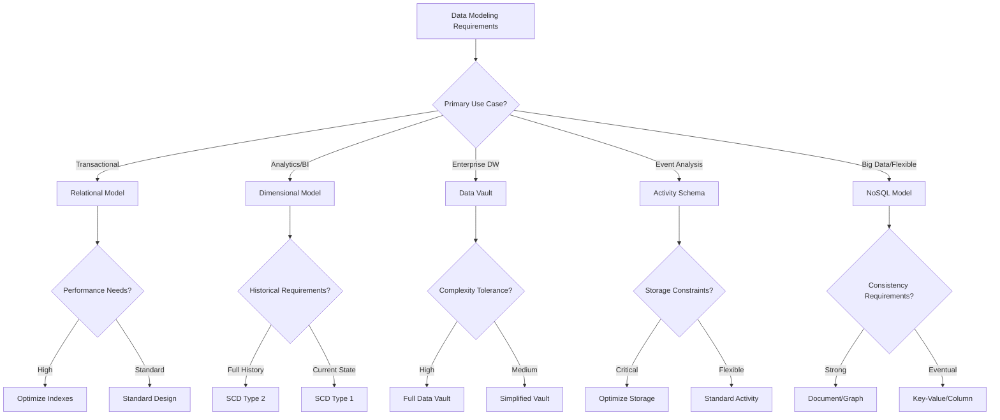

# Data Modeling Key Concepts

## 📋 Table of Contents
1. [Introduction](#introduction)
2. [Fundamental Concepts](#fundamental-concepts)
3. [Traditional Approaches](#traditional-approaches)
4. [Modern Approaches](#modern-approaches)
5. [Comparative Analysis](#comparative-analysis)
6. [Best Practices](#best-practices)
7. [Tools & Technologies](#tools--technologies)

---

## Introduction

Data modeling is the process of creating a conceptual representation of data structures and their relationships within a system. It serves as the foundation for database design, data architecture, and information systems development.

### Why Data Modeling Matters
- **Communication**: Provides a common language between business and technical teams
- **Data Quality**: Ensures consistency, integrity, and accuracy
- **Performance**: Optimizes query performance and system efficiency
- **Maintenance**: Simplifies system evolution and maintenance
- **Compliance**: Supports regulatory requirements and governance

---

## Fundamental Concepts

### Data Modeling Levels

#### 1. Conceptual Data Model
- **Purpose**: High-level business view
- **Audience**: Business stakeholders, analysts
- **Focus**: Entities, relationships, business rules
- **Detail Level**: Abstract, technology-independent

```
Example: Customer Entity
- Attributes: Name, Contact Information, Preferences
- Relationships: Places Orders, Has Addresses
- Business Rules: Customer must have unique identifier
```

#### 2. Logical Data Model
- **Purpose**: Detailed structure without implementation specifics
- **Audience**: Data architects, database designers
- **Focus**: Detailed attributes, data types, constraints
- **Detail Level**: Normalized, platform-independent

```sql
-- Logical model example
Entity: Customer
- customer_id (Primary Key, Integer)
- first_name (String, 50 chars, Not Null)
- last_name (String, 50 chars, Not Null)
- email (String, 255 chars, Unique)
- created_date (Date, Not Null)
```

#### 3. Physical Data Model
- **Purpose**: Implementation-specific design
- **Audience**: Database administrators, developers
- **Focus**: Tables, indexes, partitions, storage
- **Detail Level**: Platform-specific optimizations

```sql
-- Physical model example
CREATE TABLE customers (
    customer_id SERIAL PRIMARY KEY,
    first_name VARCHAR(50) NOT NULL,
    last_name VARCHAR(50) NOT NULL,
    email VARCHAR(255) UNIQUE NOT NULL,
    created_date TIMESTAMP DEFAULT CURRENT_TIMESTAMP,
    INDEX idx_customer_email (email),
    INDEX idx_customer_name (last_name, first_name)
) ENGINE=InnoDB PARTITION BY HASH(customer_id) PARTITIONS 4;
```

### Core Modeling Concepts

#### Entities and Attributes
- **Entity**: A thing or object of interest (Customer, Product, Order)
- **Attribute**: Properties or characteristics of entities (Name, Price, Date)
- **Key Attributes**: Unique identifiers (Primary Key, Foreign Key)

#### Relationships
- **One-to-One (1:1)**: Each entity instance relates to exactly one instance of another
- **One-to-Many (1:M)**: One entity instance relates to multiple instances of another
- **Many-to-Many (M:M)**: Multiple instances of each entity relate to multiple instances of another

#### Constraints and Rules
- **Domain Constraints**: Valid values for attributes
- **Entity Integrity**: Primary key constraints
- **Referential Integrity**: Foreign key constraints
- **Business Rules**: Custom validation logic

---

## Traditional Approaches

### Relational Data Modeling

#### Normalization
Process of organizing data to reduce redundancy and improve data integrity.

**First Normal Form (1NF):**
- Atomic values only
- No repeating groups
- Unique rows

**Second Normal Form (2NF):**
- Must be in 1NF
- No partial dependencies on composite keys

**Third Normal Form (3NF):**
- Must be in 2NF
- No transitive dependencies

**Boyce-Codd Normal Form (BCNF):**
- Stricter version of 3NF
- Every determinant is a candidate key

#### Entity-Relationship (ER) Modeling
- **Entities**: Rectangles
- **Attributes**: Ovals
- **Relationships**: Diamonds
- **Cardinality**: Relationship constraints

### Dimensional Modeling

#### Star Schema
Central fact table surrounded by dimension tables.

```
Fact Table (Sales):
- date_key (FK)
- product_key (FK)
- customer_key (FK)
- quantity
- revenue

Dimension Tables:
- dim_date (date_key, date, month, year)
- dim_product (product_key, name, category)
- dim_customer (customer_key, name, segment)
```

#### Snowflake Schema
Normalized version of star schema with hierarchical dimensions.

#### Galaxy Schema
Multiple fact tables sharing dimension tables.

#### Slowly Changing Dimensions (SCD)
- **Type 0**: Retain original value
- **Type 1**: Overwrite with new value
- **Type 2**: Add new record with version
- **Type 3**: Add new attribute for previous value

---

## Modern Approaches

### Data Vault 2.0

#### Core Components
**Hubs**: Business keys and metadata
```sql
CREATE TABLE hub_customer (
    customer_hash_key CHAR(32) PRIMARY KEY,
    customer_business_key VARCHAR(50),
    load_date TIMESTAMP,
    record_source VARCHAR(50)
);
```

**Links**: Relationships between hubs
```sql
CREATE TABLE link_customer_order (
    customer_order_hash_key CHAR(32) PRIMARY KEY,
    customer_hash_key CHAR(32),
    order_hash_key CHAR(32),
    load_date TIMESTAMP,
    record_source VARCHAR(50)
);
```

**Satellites**: Descriptive attributes and history
```sql
CREATE TABLE sat_customer_details (
    customer_hash_key CHAR(32),
    load_date TIMESTAMP,
    first_name VARCHAR(100),
    last_name VARCHAR(100),
    email VARCHAR(255),
    hash_diff CHAR(32),
    record_source VARCHAR(50),
    PRIMARY KEY (customer_hash_key, load_date)
);
```

#### Advantages
- Auditability and traceability
- Flexibility for new data sources
- Parallel loading capabilities
- Historical preservation

### Activity Schema

#### Core Concept
Event-centric modeling focusing on business activities over time.

```sql
CREATE TABLE activities (
    activity_id UUID PRIMARY KEY,
    activity_ts TIMESTAMP NOT NULL,
    activity VARCHAR(100) NOT NULL,
    feature_json JSONB,
    entity VARCHAR(100),
    entity_id VARCHAR(100),
    link VARCHAR(100),
    link_id VARCHAR(100)
);
```

#### Key Principles
- **Immutability**: Events never change
- **Temporal Focus**: Time as first-class citizen
- **Activity-Centric**: Business processes as activities
- **Flexibility**: JSON for evolving attributes

### NoSQL Data Modeling

#### Document Databases (MongoDB)
```javascript
// Embedded document approach
{
  "_id": ObjectId("..."),
  "customer_id": "CUST001",
  "profile": {
    "name": "John Doe",
    "email": "john@example.com"
  },
  "orders": [
    {
      "order_id": "ORD001",
      "date": ISODate("2024-01-15"),
      "items": [...]
    }
  ]
}
```

#### Key-Value Stores (Redis)
```python
# User session data
user_session = {
    "user_id": "user123",
    "session_data": {
        "cart_items": ["item1", "item2"],
        "preferences": {"theme": "dark"},
        "last_activity": "2024-01-15T10:30:00Z"
    }
}
```

#### Column-Family (Cassandra)
```sql
CREATE TABLE user_activities (
    user_id UUID,
    activity_date DATE,
    activity_time TIMESTAMP,
    activity_type TEXT,
    details MAP<TEXT, TEXT>,
    PRIMARY KEY (user_id, activity_date, activity_time)
) WITH CLUSTERING ORDER BY (activity_date DESC, activity_time DESC);
```

#### Graph Databases (Neo4j)
```cypher
// Nodes and relationships
CREATE (c:Customer {id: 'CUST001', name: 'John Doe'})
CREATE (p:Product {id: 'PROD001', name: 'Laptop'})
CREATE (c)-[:PURCHASED {date: '2024-01-15', amount: 999.99}]->(p)
```

---

## Comparative Analysis

### Approach Comparison Matrix

| Aspect | Relational | Dimensional | Data Vault | Activity Schema | NoSQL |
|--------|------------|-------------|------------|-----------------|-------|
| **Use Case** | OLTP | OLAP/BI | Enterprise DW | Event Analysis | Big Data/Flexible |
| **Normalization** | High | Low | Medium | Low | Variable |
| **Query Performance** | Good for OLTP | Excellent for OLAP | Complex joins | Temporal queries | Varies by type |
| **Schema Flexibility** | Low | Medium | High | High | Very High |
| **Historical Data** | Limited | SCD patterns | Full history | Immutable events | Depends on design |
| **Learning Curve** | Medium | Medium | High | Medium | Varies |
| **Tooling Support** | Excellent | Good | Limited | Emerging | Good |

### Decision Framework



---

## Best Practices

### Universal Principles

#### 1. Understand Requirements First
- **Business Requirements**: What questions need to be answered?
- **Technical Requirements**: Performance, scalability, availability
- **Operational Requirements**: Maintenance, monitoring, backup

#### 2. Design for Your Use Case
- **OLTP**: Normalize for data integrity and update performance
- **OLAP**: Denormalize for query performance and simplicity
- **Hybrid**: Consider separate models or HTAP solutions

#### 3. Plan for Evolution
- **Schema Versioning**: Track and manage schema changes
- **Backward Compatibility**: Ensure existing systems continue to work
- **Migration Strategies**: Plan for data and schema migrations

#### 4. Optimize for Performance
- **Indexing Strategy**: Create indexes based on query patterns
- **Partitioning**: Distribute data for better performance
- **Caching**: Use appropriate caching strategies

#### 5. Ensure Data Quality
- **Constraints**: Implement proper validation rules
- **Data Types**: Choose appropriate data types
- **Referential Integrity**: Maintain relationship consistency

### Naming Conventions

#### Tables and Entities
```sql
-- Use clear, descriptive names
customers          -- Good
customer_orders    -- Good
cust_ord          -- Avoid abbreviations
tbl_customers     -- Avoid prefixes
```

#### Columns and Attributes
```sql
-- Use consistent naming patterns
customer_id       -- Primary key
order_customer_id -- Foreign key
created_date      -- Temporal fields
is_active         -- Boolean fields
total_amount      -- Calculated fields
```

#### Relationships
```sql
-- Clear relationship naming
customer_places_order
product_belongs_to_category
order_contains_items
```

### Documentation Standards

#### Model Documentation
- **Entity Definitions**: Purpose and business meaning
- **Attribute Descriptions**: Data types, constraints, business rules
- **Relationship Explanations**: Cardinality and business logic
- **Change History**: Version control and change tracking

#### Data Dictionary
```yaml
# Example data dictionary entry
customer_id:
  description: "Unique identifier for customer records"
  data_type: "INTEGER"
  constraints: "PRIMARY KEY, AUTO_INCREMENT"
  business_rules: "System-generated, immutable after creation"
  source_system: "CRM Application"
  
email:
  description: "Customer email address for communication"
  data_type: "VARCHAR(255)"
  constraints: "UNIQUE, NOT NULL"
  business_rules: "Must be valid email format, used for login"
  validation: "Email format validation required"
```

---

## Tools & Technologies

### Modeling Tools

#### Commercial Tools
- **ERwin Data Modeler**: Enterprise data modeling
- **PowerDesigner**: Comprehensive modeling suite
- **ER/Studio**: Data architecture and modeling
- **IBM InfoSphere Data Architect**: Enterprise modeling

#### Open Source Tools
- **MySQL Workbench**: Free database design tool
- **pgModeler**: PostgreSQL-specific modeling
- **DBDesigner**: Web-based ER modeling
- **Draw.io**: General-purpose diagramming

#### Cloud-Native Tools
- **AWS QuickSight**: Data modeling and visualization
- **Google Cloud Dataform**: Data transformation modeling
- **Azure Data Factory**: Data pipeline modeling
- **Snowflake dbt**: Modern data transformation

### Implementation Technologies

#### Relational Databases
- **PostgreSQL**: Advanced open-source RDBMS
- **MySQL**: Popular open-source database
- **Oracle**: Enterprise commercial database
- **SQL Server**: Microsoft's relational database

#### Data Warehouses
- **Snowflake**: Cloud-native data warehouse
- **Amazon Redshift**: AWS data warehouse
- **Google BigQuery**: Serverless data warehouse
- **Azure Synapse**: Microsoft's analytics platform

#### NoSQL Databases
- **MongoDB**: Document database
- **Cassandra**: Column-family database
- **Redis**: Key-value store
- **Neo4j**: Graph database

#### Big Data Platforms
- **Apache Spark**: Distributed processing
- **Databricks**: Unified analytics platform
- **Hadoop**: Distributed storage and processing
- **Apache Kafka**: Event streaming platform

### Automation and Code Generation

#### Schema Generation
```python
# Example: Automated schema generation
class SchemaGenerator:
    def generate_table_ddl(self, entity_definition):
        ddl = f"CREATE TABLE {entity_definition.name} (\n"
        
        for attribute in entity_definition.attributes:
            ddl += f"    {attribute.name} {attribute.data_type}"
            if attribute.is_primary_key:
                ddl += " PRIMARY KEY"
            if attribute.is_not_null:
                ddl += " NOT NULL"
            ddl += ",\n"
            
        ddl = ddl.rstrip(",\n") + "\n);"
        return ddl
```

#### Documentation Generation
```python
# Automated documentation from schema
def generate_data_dictionary(database_schema):
    documentation = {}
    
    for table in database_schema.tables:
        table_doc = {
            'description': table.description,
            'columns': {}
        }
        
        for column in table.columns:
            table_doc['columns'][column.name] = {
                'data_type': column.data_type,
                'nullable': column.nullable,
                'description': column.description,
                'constraints': column.constraints
            }
            
        documentation[table.name] = table_doc
    
    return documentation
```

---

## 🎯 Key Takeaways

### Critical Success Factors
1. **Requirements Understanding**: Deep comprehension of business and technical needs
2. **Approach Selection**: Choose the right modeling technique for your use case
3. **Performance Optimization**: Design with query patterns and performance in mind
4. **Evolution Planning**: Build flexibility for future changes and growth
5. **Quality Assurance**: Implement proper validation and integrity constraints
6. **Documentation**: Maintain comprehensive and up-to-date documentation
7. **Team Alignment**: Ensure all stakeholders understand the model

### Modern Considerations
- **Cloud-First Design**: Leverage cloud-native capabilities and services
- **Real-Time Requirements**: Support streaming and low-latency use cases
- **Multi-Model Approaches**: Combine different techniques as needed
- **Data Governance**: Implement proper lineage, quality, and compliance
- **Cost Optimization**: Consider storage, compute, and operational costs
- **Developer Experience**: Make models intuitive and easy to work with

### Future Trends
- **Automated Modeling**: AI-assisted model generation and optimization
- **Semantic Modeling**: Knowledge graphs and ontology-driven approaches
- **Event-Driven Architecture**: Increased adoption of event sourcing patterns
- **Polyglot Persistence**: Multiple database types in single applications
- **Data Mesh**: Decentralized, domain-oriented data architectures