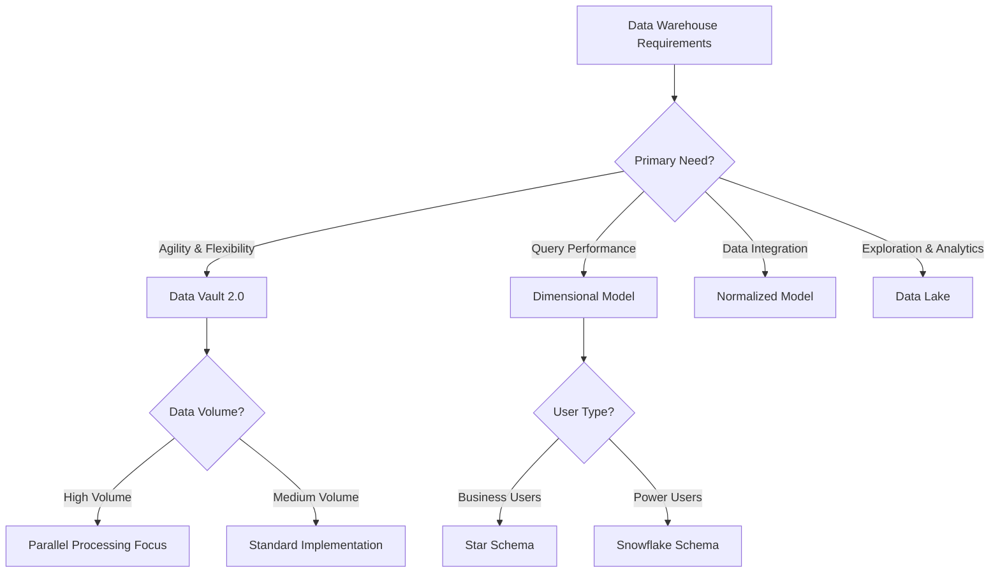
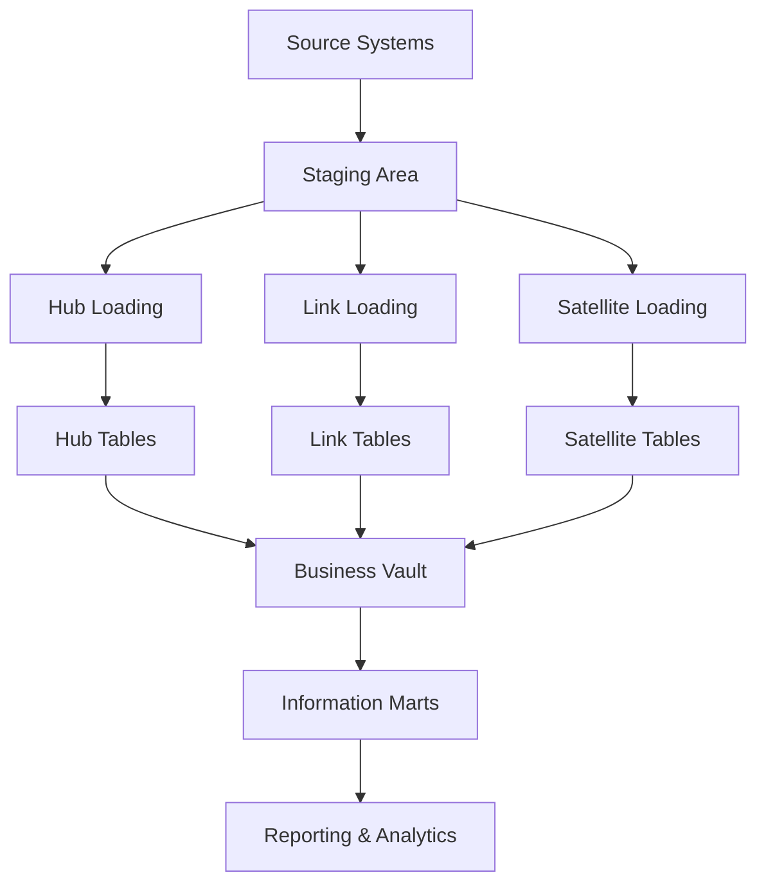

# Data Vault 2.0 Interview Questions for Data Engineering

## 📋 Table of Contents

1. [Core Concepts Questions (1-15)](#core-concepts-questions-1-15)
2. [Modeling Questions (16-30)](#modeling-questions-16-30)
3. [Implementation Questions (31-45)](#implementation-questions-31-45)
4. [Performance & Optimization (46-60)](#performance--optimization-46-60)
5. [Advanced Topics (61-75)](#advanced-topics-61-75)

---

## Core Concepts Questions (1-15)

### 1. What is Data Vault 2.0 and how does it differ from traditional data modeling approaches?

### 🎯 **Theoretical Foundation**
#### **Core Concepts**
- **Ensemble Modeling**: Hybrid approach combining best practices from multiple methodologies
- **Insert-Only Architecture**: Immutable data storage with complete audit trails
- **Business Key Driven**: Focus on natural business identifiers rather than surrogate keys
- **Temporal Consistency**: Built-in time-variant data handling
- **Parallel Processing**: Architecture designed for concurrent loading and querying

#### **Historical Context**
- **Origins**: Developed by Dan Linstedt in the early 2000s
- **Evolution Timeline**:
  - 2000: Data Vault 1.0 introduction
  - 2013: Data Vault 2.0 with NoSQL and Big Data integration
  - 2016: Automation and code generation focus
  - 2020: Cloud-native implementations
  - Current: AI/ML integration and real-time processing

#### **Architectural Principles**
- **Separation of Concerns**: Business keys, relationships, and attributes stored separately
- **Normalization**: Highly normalized structure for flexibility
- **Immutability**: Historical data preservation through insert-only operations
- **Traceability**: Complete lineage from source systems to data warehouse
- **Scalability**: Horizontal scaling through parallel processing

### 📊 **Comparative Analysis**
#### **Data Modeling Approaches Comparison**
| Feature | Data Vault 2.0 | Dimensional (Kimball) | Normalized (Inmon) | Data Lake |
|---------|----------------|----------------------|-------------------|------------|
| **Flexibility** | Very High | Medium | Low | Very High |
| **Auditability** | Excellent | Good | Good | Variable |
| **Time to Market** | Fast | Medium | Slow | Fast |
| **Query Performance** | Medium | Excellent | Medium | Variable |
| **Maintenance** | Low | Medium | High | High |
| **Scalability** | Excellent | Good | Medium | Excellent |
| **Complexity** | Medium | Low | High | High |
| **Business User Friendly** | Medium | Excellent | Medium | Low |

#### **Decision Framework**


#### **Use Case Scenarios**
- **Choose Data Vault 2.0 when:**
  - Frequent changes in business requirements
  - Multiple source systems with different data models
  - Regulatory compliance requiring complete audit trails
  - Need for parallel development and loading
  - Long-term data warehouse evolution expected

- **Consider Alternatives when:**
  - **Dimensional**: Primary focus on business intelligence and reporting
  - **Normalized**: Strong data governance and consistency requirements
  - **Data Lake**: Exploratory analytics and unstructured data processing

#### **Performance Characteristics**
```
Data Vault 2.0 Performance Profile:
┌─────────────────┬──────────────┬──────────────┬──────────────┐
│ Operation       │ Loading      │ Querying     │ Maintenance  │
├─────────────────┼──────────────┼──────────────┼──────────────┤
│ Hub Loading     │ Excellent    │ Fast         │ Minimal      │
│ Link Loading    │ Excellent    │ Fast         │ Minimal      │
│ Satellite Load  │ Good         │ Medium       │ Low          │
│ Historical Query│ Medium       │ Good         │ Low          │
│ Point-in-Time   │ Good         │ Excellent    │ Medium       │
│ Schema Changes  │ Excellent    │ No Impact    │ Minimal      │
└─────────────────┴──────────────┴──────────────┴──────────────┘
```

#### **Cost-Benefit Analysis**
```
Data Vault 2.0 Implementation Costs (3-year TCO):
┌─────────────────┬──────────────┬──────────────┬──────────────┐
│ Cost Component  │ Data Vault   │ Dimensional  │ Normalized   │
├─────────────────┼──────────────┼──────────────┼──────────────┤
│ Initial Dev     │ $200K        │ $150K        │ $300K        │
│ Maintenance     │ $100K        │ $200K        │ $400K        │
│ Schema Changes  │ $50K         │ $150K        │ $250K        │
│ Training        │ $75K         │ $50K         │ $100K        │
├─────────────────┼──────────────┼──────────────┼──────────────┤
│ **TOTAL**       │ **$425K**    │ **$550K**    │ **$1,050K**  │
└─────────────────┴──────────────┴──────────────┴──────────────┘
```

**Answer**: Data Vault 2.0 is a data modeling methodology designed for building scalable, flexible, and auditable data warehouses. It uses three core components: Hubs, Links, and Satellites.

**Key Differences from Traditional Approaches:**
- **Flexibility**: Easily accommodates changing business requirements
- **Auditability**: Complete historical tracking of all changes
- **Scalability**: Parallel loading and processing capabilities
- **Agility**: Faster time-to-market for new data sources

```sql
-- Hub: Business keys
CREATE TABLE hub_customer (
    customer_hk CHAR(32) PRIMARY KEY,
    customer_bk VARCHAR(50) NOT NULL,
    load_date TIMESTAMP NOT NULL,
    record_source VARCHAR(50) NOT NULL
);

-- Link: Relationships
CREATE TABLE link_customer_order (
    customer_order_hk CHAR(32) PRIMARY KEY,
    customer_hk CHAR(32) NOT NULL,
    order_hk CHAR(32) NOT NULL,
    load_date TIMESTAMP NOT NULL,
    record_source VARCHAR(50) NOT NULL
);

-- Satellite: Descriptive data
CREATE TABLE sat_customer_details (
    customer_hk CHAR(32) NOT NULL,
    load_date TIMESTAMP NOT NULL,
    hash_diff CHAR(32) NOT NULL,
    first_name VARCHAR(50),
    last_name VARCHAR(50),
    email VARCHAR(100),
    record_source VARCHAR(50) NOT NULL,
    PRIMARY KEY (customer_hk, load_date)
);
```

### 2. Explain the three core components of Data Vault: Hubs, Links, and Satellites.

### 🎯 **Theoretical Foundation**
#### **Core Concepts**
- **Separation of Concerns**: Each component serves a distinct purpose in the data model
- **Referential Integrity**: Maintained through hash key relationships
- **Temporal Modeling**: Time-variant data handled through satellite versioning
- **Business Rule Independence**: Structure independent of business logic
- **Source System Agnostic**: Components can accommodate any source system structure

#### **Historical Context**
- **Design Philosophy**: Based on Entity-Relationship modeling principles
- **Normalization Theory**: Extends 3NF principles with temporal considerations
- **Data Warehouse Evolution**: Response to limitations of traditional star/snowflake schemas
- **Agile Development**: Supports iterative and parallel development approaches

#### **Architectural Principles**
- **Hub Stability**: Business keys provide stable foundation
- **Link Flexibility**: Relationships can evolve without structural changes
- **Satellite Adaptability**: Attributes can be added without impacting existing structure
- **Hash Key Consistency**: Deterministic key generation for integration
- **Audit Trail Completeness**: Full historical tracking at granular level

### 📊 **Comparative Analysis**
#### **Data Vault Components vs Traditional Structures**
| Aspect | Hubs | Links | Satellites | Fact Tables | Dimension Tables |
|--------|------|-------|------------|-------------|------------------|
| **Purpose** | Business Keys | Relationships | Attributes | Metrics | Descriptive Data |
| **Mutability** | Insert-Only | Insert-Only | Versioned | Updateable | SCD Handling |
| **Granularity** | Entity Level | Transaction Level | Attribute Level | Aggregated | Entity Level |
| **Performance** | Excellent | Excellent | Good | Excellent | Good |
| **Flexibility** | High | High | Very High | Low | Medium |
| **Complexity** | Low | Medium | Medium | Low | Medium |

#### **Component Interaction Framework**


#### **Design Patterns**
```
Data Vault Component Design Patterns:
┌─────────────────┬──────────────┬──────────────┬──────────────┐
│ Pattern         │ Hubs         │ Links        │ Satellites   │
├─────────────────┼──────────────┼──────────────┼──────────────┤
│ Standard        │ Single BK    │ 2+ Hub FKs   │ Descriptive  │
│ Multi-Active    │ N/A          │ N/A          │ Multiple Active│
│ Hierarchical    │ Self-Ref     │ Parent-Child │ Hierarchy Data│
│ Same-As         │ Master       │ Duplicate    │ Relationship │
│ Non-Historized  │ N/A          │ N/A          │ Reference    │
│ Computed        │ N/A          │ Derived      │ Calculated   │
└─────────────────┴──────────────┴──────────────┴──────────────┘
```

**Answer**: 

**Hubs**: Store unique business keys and metadata
- Contain only business keys, hash keys, load dates, and record sources
- Represent core business entities (Customer, Product, Order)
- Never change once loaded (insert-only)

**Links**: Capture relationships between business entities
- Connect two or more hubs
- Store foreign keys to related hubs
- Represent transactions, associations, or hierarchies

**Satellites**: Store descriptive attributes and context
- Contain all descriptive data about hubs or links
- Track historical changes over time
- Use hash diff for change detection

```python
# Python implementation for hash key generation
import hashlib

def generate_hash_key(business_key):
    """Generate consistent hash key from business key"""
    return hashlib.md5(str(business_key).upper().strip().encode()).hexdigest()

def generate_hash_diff(attributes):
    """Generate hash diff for change detection"""
    concat_attrs = '|'.join([str(attr) for attr in attributes])
    return hashlib.md5(concat_attrs.encode()).hexdigest()

# Example usage
customer_hk = generate_hash_key("CUST001")
hash_diff = generate_hash_diff(["John", "Doe", "john@email.com"])
```

### 3. What is a hash key and why is it used in Data Vault?

### 🎯 **Theoretical Foundation**
#### **Core Concepts**
- **Cryptographic Hashing**: One-way mathematical function producing fixed-length output
- **Deterministic Generation**: Same input always produces same hash value
- **Collision Resistance**: Extremely low probability of different inputs producing same hash
- **Distribution Properties**: Even distribution across hash space for performance
- **Immutability**: Hash values never change once generated

#### **Historical Context**
- **Hash Function Evolution**:
  - 1990s: MD5 widely adopted for data warehousing
  - 2000s: SHA-1 introduced for enhanced security
  - 2010s: SHA-256 for high-security environments
  - Current: Blake2 and SHA-3 for performance optimization

#### **Mathematical Principles**
- **Hash Function Properties**: Deterministic, uniform distribution, avalanche effect
- **Key Space**: 2^128 possible values for MD5, 2^160 for SHA-1
- **Collision Probability**: Negligible for practical data warehouse sizes
- **Performance Characteristics**: O(1) lookup time, fixed storage requirements

### 📊 **Comparative Analysis**
#### **Hash Key vs Traditional Key Approaches**
| Feature | Hash Keys | Natural Keys | Surrogate Keys | Composite Keys |
|---------|-----------|--------------|----------------|----------------|
| **Performance** | Excellent | Variable | Excellent | Poor |
| **Consistency** | Perfect | Variable | Good | Variable |
| **Storage** | Fixed 32/40 bytes | Variable | 4-8 bytes | Variable |
| **Integration** | Excellent | Poor | Medium | Poor |
| **Maintenance** | None | High | Medium | High |
| **Collision Risk** | Negligible | None | None | None |
| **Readability** | Poor | Excellent | Poor | Good |

#### **Hash Algorithm Comparison**
```
Hash Algorithm Performance Comparison:
┌─────────────────┬──────────────┬──────────────┬──────────────┐
│ Algorithm       │ MD5          │ SHA-1        │ SHA-256      │
├─────────────────┼──────────────┼──────────────┼──────────────┤
│ Output Length   │ 32 chars     │ 40 chars     │ 64 chars     │
│ Speed           │ Fastest      │ Fast         │ Medium       │
│ Security        │ Low          │ Medium       │ High         │
│ Collision Risk  │ Theoretical  │ Very Low     │ Negligible   │
│ Storage Req     │ 32 bytes     │ 40 bytes     │ 64 bytes     │
│ DW Suitability  │ Excellent    │ Very Good    │ Good         │
└─────────────────┴──────────────┴──────────────┴──────────────┘
```

#### **Implementation Patterns**
```
Hash Key Generation Patterns:
┌─────────────────┬──────────────┬──────────────┬──────────────┐
│ Pattern         │ Single Key   │ Composite    │ Hierarchical │
├─────────────────┼──────────────┼──────────────┼──────────────┤
│ Input           │ CUST001      │ CUST001|ORD1 │ L1|L2|L3     │
│ Processing      │ UPPER+TRIM   │ CONCAT+DELIM │ LEVEL+CONCAT │
│ Hash Function   │ MD5          │ MD5          │ MD5          │
│ Output          │ 32 chars     │ 32 chars     │ 32 chars     │
│ Use Case        │ Hub Keys     │ Link Keys    │ Hierarchy    │
└─────────────────┴──────────────┴──────────────┴──────────────┘
```

**Answer**: A hash key is a fixed-length string generated from business keys using a hash function (typically MD5 or SHA-1).

**Benefits of Hash Keys:**
- **Performance**: Fixed-length keys improve join performance
- **Consistency**: Same business key always generates same hash
- **Scalability**: Enables parallel processing
- **Integration**: Simplifies multi-source data integration

```sql
-- Hash key generation examples
SELECT 
    MD5(UPPER(TRIM(customer_id))) as customer_hk,
    customer_id as customer_bk
FROM source_customers;

-- Composite hash key for links
SELECT 
    MD5(CONCAT(
        MD5(UPPER(TRIM(customer_id))), '|',
        MD5(UPPER(TRIM(order_id)))
    )) as customer_order_hk
FROM source_orders;
```

### 4. How do you handle slowly changing dimensions in Data Vault?

**Answer**: Data Vault handles SCDs naturally through satellites with temporal tracking.

**SCD Implementation:**
```sql
-- Satellite with temporal tracking
CREATE TABLE sat_customer_details (
    customer_hk CHAR(32) NOT NULL,
    load_date TIMESTAMP NOT NULL,
    load_end_date TIMESTAMP,
    hash_diff CHAR(32) NOT NULL,
    first_name VARCHAR(50),
    last_name VARCHAR(50),
    email VARCHAR(100),
    is_current BOOLEAN DEFAULT TRUE,
    record_source VARCHAR(50) NOT NULL,
    PRIMARY KEY (customer_hk, load_date)
);

-- Loading process with change detection
INSERT INTO sat_customer_details
SELECT 
    customer_hk,
    CURRENT_TIMESTAMP as load_date,
    NULL as load_end_date,
    hash_diff,
    first_name,
    last_name,
    email,
    TRUE as is_current,
    'CRM_SYSTEM' as record_source
FROM staging_customers s
WHERE NOT EXISTS (
    SELECT 1 FROM sat_customer_details sat
    WHERE sat.customer_hk = s.customer_hk
    AND sat.hash_diff = s.hash_diff
    AND sat.is_current = TRUE
);

-- End-date previous records
UPDATE sat_customer_details 
SET load_end_date = CURRENT_TIMESTAMP,
    is_current = FALSE
WHERE customer_hk IN (SELECT customer_hk FROM staging_customers)
AND is_current = TRUE
AND hash_diff NOT IN (SELECT hash_diff FROM staging_customers);
```

### 5. What is a Point-in-Time (PIT) table and when would you use it?

**Answer**: PIT tables provide optimized access to historical data by storing snapshot dates and corresponding satellite load dates.

**Use Cases:**
- Reporting at specific points in time
- Performance optimization for historical queries
- Regulatory compliance requirements

```sql
-- PIT table structure
CREATE TABLE pit_customer (
    customer_hk CHAR(32) NOT NULL,
    snapshot_date DATE NOT NULL,
    sat_customer_details_date TIMESTAMP,
    sat_customer_address_date TIMESTAMP,
    sat_customer_preferences_date TIMESTAMP,
    PRIMARY KEY (customer_hk, snapshot_date)
);

-- PIT table population
INSERT INTO pit_customer
SELECT 
    c.customer_hk,
    d.snapshot_date,
    (SELECT MAX(load_date) 
     FROM sat_customer_details scd 
     WHERE scd.customer_hk = c.customer_hk 
     AND scd.load_date <= d.snapshot_date) as sat_customer_details_date,
    (SELECT MAX(load_date) 
     FROM sat_customer_address sca 
     WHERE sca.customer_hk = c.customer_hk 
     AND sca.load_date <= d.snapshot_date) as sat_customer_address_date
FROM hub_customer c
CROSS JOIN date_dimension d
WHERE d.snapshot_date BETWEEN '2023-01-01' AND CURRENT_DATE;
```

---

## Modeling Questions (16-30)

### 16. How do you model hierarchical relationships in Data Vault?

**Answer**: Hierarchical relationships are modeled using same-as links (SAL) or hierarchical links.

```sql
-- Hierarchical link for organizational structure
CREATE TABLE link_employee_manager (
    employee_manager_hk CHAR(32) PRIMARY KEY,
    employee_hk CHAR(32) NOT NULL,
    manager_hk CHAR(32) NOT NULL,
    load_date TIMESTAMP NOT NULL,
    record_source VARCHAR(50) NOT NULL,
    FOREIGN KEY (employee_hk) REFERENCES hub_employee(employee_hk),
    FOREIGN KEY (manager_hk) REFERENCES hub_employee(employee_hk)
);

-- Same-as link for duplicate detection
CREATE TABLE sal_customer (
    customer_sal_hk CHAR(32) PRIMARY KEY,
    customer_hk_parent CHAR(32) NOT NULL,
    customer_hk_child CHAR(32) NOT NULL,
    load_date TIMESTAMP NOT NULL,
    record_source VARCHAR(50) NOT NULL
);
```

### 17. What are Multi-Active Satellites and when do you use them?

**Answer**: Multi-Active Satellites handle multiple active records per business key, such as multiple addresses or phone numbers.

```sql
-- Multi-active satellite for customer addresses
CREATE TABLE sat_customer_address (
    customer_hk CHAR(32) NOT NULL,
    address_type VARCHAR(20) NOT NULL,  -- Driving key
    load_date TIMESTAMP NOT NULL,
    load_end_date TIMESTAMP,
    hash_diff CHAR(32) NOT NULL,
    street_address VARCHAR(200),
    city VARCHAR(50),
    state VARCHAR(20),
    zip_code VARCHAR(10),
    record_source VARCHAR(50) NOT NULL,
    PRIMARY KEY (customer_hk, address_type, load_date)
);

-- Loading multi-active satellite
INSERT INTO sat_customer_address
SELECT 
    customer_hk,
    address_type,
    CURRENT_TIMESTAMP as load_date,
    NULL as load_end_date,
    hash_diff,
    street_address,
    city,
    state,
    zip_code,
    'ADDRESS_SYSTEM' as record_source
FROM staging_addresses s
WHERE NOT EXISTS (
    SELECT 1 FROM sat_customer_address sat
    WHERE sat.customer_hk = s.customer_hk
    AND sat.address_type = s.address_type
    AND sat.hash_diff = s.hash_diff
    AND sat.load_end_date IS NULL
);
```

### 18. How do you handle many-to-many relationships in Data Vault?

**Answer**: Many-to-many relationships are modeled using links that connect multiple hubs.

```sql
-- Many-to-many: Students to Courses
CREATE TABLE link_student_course (
    student_course_hk CHAR(32) PRIMARY KEY,
    student_hk CHAR(32) NOT NULL,
    course_hk CHAR(32) NOT NULL,
    load_date TIMESTAMP NOT NULL,
    record_source VARCHAR(50) NOT NULL,
    FOREIGN KEY (student_hk) REFERENCES hub_student(student_hk),
    FOREIGN KEY (course_hk) REFERENCES hub_course(course_hk)
);

-- Satellite for enrollment details
CREATE TABLE sat_student_course_enrollment (
    student_course_hk CHAR(32) NOT NULL,
    load_date TIMESTAMP NOT NULL,
    hash_diff CHAR(32) NOT NULL,
    enrollment_date DATE,
    grade VARCHAR(2),
    credits INTEGER,
    status VARCHAR(20),
    record_source VARCHAR(50) NOT NULL,
    PRIMARY KEY (student_course_hk, load_date)
);
```

---

## Implementation Questions (31-45)

### 31. How do you implement an ETL process for Data Vault loading?

**Answer**: Data Vault ETL follows a specific pattern: Extract → Stage → Load Hubs → Load Links → Load Satellites.

```python
class DataVaultETL:
    def __init__(self, connection):
        self.conn = connection
        self.load_date = datetime.now()
        self.record_source = 'ETL_PROCESS'
    
    def extract_and_stage(self, source_query, staging_table):
        """Extract data from source and load to staging"""
        df = pd.read_sql(source_query, self.conn)
        df.to_sql(staging_table, self.conn, if_exists='replace', index=False)
        return df
    
    def load_hub(self, staging_table, hub_table, business_key_col):
        """Load hub with new business keys only"""
        sql = f"""
        INSERT INTO {hub_table} (hash_key, business_key, load_date, record_source)
        SELECT DISTINCT
            MD5(UPPER(TRIM({business_key_col}))) as hash_key,
            {business_key_col} as business_key,
            '{self.load_date}' as load_date,
            '{self.record_source}' as record_source
        FROM {staging_table}
        WHERE MD5(UPPER(TRIM({business_key_col}))) NOT IN (
            SELECT hash_key FROM {hub_table}
        )
        """
        self.conn.execute(sql)
    
    def load_link(self, staging_table, link_table, hub_keys):
        """Load link with new relationships only"""
        hash_key_expr = "MD5(CONCAT(" + ", '|', ".join([f"MD5(UPPER(TRIM({key})))" for key in hub_keys]) + "))"
        
        sql = f"""
        INSERT INTO {link_table}
        SELECT DISTINCT
            {hash_key_expr} as hash_key,
            {', '.join([f"MD5(UPPER(TRIM({key}))) as {key.replace('_bk', '_hk')}" for key in hub_keys])},
            '{self.load_date}' as load_date,
            '{self.record_source}' as record_source
        FROM {staging_table}
        WHERE {hash_key_expr} NOT IN (
            SELECT hash_key FROM {link_table}
        )
        """
        self.conn.execute(sql)
    
    def load_satellite(self, staging_table, sat_table, hub_key, attribute_cols):
        """Load satellite with change detection"""
        hash_diff_expr = "MD5(CONCAT(" + ", '|', ".join([f"COALESCE({col}, '')" for col in attribute_cols]) + "))"
        
        # End-date existing records
        end_date_sql = f"""
        UPDATE {sat_table} 
        SET load_end_date = '{self.load_date}'
        WHERE {hub_key} IN (SELECT DISTINCT {hub_key} FROM {staging_table})
        AND load_end_date IS NULL
        AND hash_diff NOT IN (
            SELECT DISTINCT {hash_diff_expr} FROM {staging_table}
        )
        """
        
        # Insert new records
        insert_sql = f"""
        INSERT INTO {sat_table}
        SELECT 
            {hub_key},
            '{self.load_date}' as load_date,
            NULL as load_end_date,
            {hash_diff_expr} as hash_diff,
            {', '.join(attribute_cols)},
            '{self.record_source}' as record_source
        FROM {staging_table}
        WHERE {hash_diff_expr} NOT IN (
            SELECT hash_diff FROM {sat_table}
            WHERE {hub_key} = {staging_table}.{hub_key}
            AND load_end_date IS NULL
        )
        """
        
        self.conn.execute(end_date_sql)
        self.conn.execute(insert_sql)
```

### 32. How do you handle data quality issues in Data Vault?

**Answer**: Data Vault implements multiple layers of data quality controls.

```python
class DataVaultQuality:
    def __init__(self, connection):
        self.conn = connection
        self.quality_issues = []
    
    def validate_business_keys(self, df, key_column):
        """Validate business key quality"""
        issues = []
        
        # Check for nulls
        null_count = df[key_column].isnull().sum()
        if null_count > 0:
            issues.append(f"Found {null_count} null business keys")
        
        # Check for duplicates
        duplicate_count = df[key_column].duplicated().sum()
        if duplicate_count > 0:
            issues.append(f"Found {duplicate_count} duplicate business keys")
        
        # Check for empty strings
        empty_count = (df[key_column] == '').sum()
        if empty_count > 0:
            issues.append(f"Found {empty_count} empty business keys")
        
        return issues
    
    def validate_hash_keys(self, df, hash_key_column):
        """Validate hash key generation"""
        issues = []
        
        # Check hash key length (MD5 should be 32 characters)
        invalid_length = df[df[hash_key_column].str.len() != 32]
        if not invalid_length.empty:
            issues.append(f"Found {len(invalid_length)} invalid hash key lengths")
        
        # Check for null hash keys
        null_hashes = df[hash_key_column].isnull().sum()
        if null_hashes > 0:
            issues.append(f"Found {null_hashes} null hash keys")
        
        return issues
    
    def create_error_mart(self):
        """Create error mart for tracking quality issues"""
        sql = """
        CREATE TABLE IF NOT EXISTS error_mart (
            error_id SERIAL PRIMARY KEY,
            table_name VARCHAR(100),
            error_type VARCHAR(50),
            error_description TEXT,
            record_count INTEGER,
            load_date TIMESTAMP,
            record_source VARCHAR(50)
        )
        """
        self.conn.execute(sql)
    
    def log_quality_issue(self, table_name, error_type, description, count):
        """Log quality issues to error mart"""
        sql = """
        INSERT INTO error_mart 
        (table_name, error_type, error_description, record_count, load_date, record_source)
        VALUES (%s, %s, %s, %s, %s, %s)
        """
        self.conn.execute(sql, (table_name, error_type, description, count, 
                               datetime.now(), 'QUALITY_CHECK'))
```

---

## Performance & Optimization (46-60)

### 46. How do you optimize Data Vault performance for large datasets?

**Answer**: Multiple optimization strategies for Data Vault performance:

```sql
-- 1. Proper indexing strategy
CREATE INDEX idx_hub_customer_bk ON hub_customer(customer_bk);
CREATE INDEX idx_hub_customer_hk ON hub_customer(customer_hk);
CREATE INDEX idx_sat_customer_hk_date ON sat_customer_details(customer_hk, load_date);
CREATE INDEX idx_sat_customer_current ON sat_customer_details(customer_hk) 
WHERE load_end_date IS NULL;

-- 2. Partitioning by load date
CREATE TABLE sat_customer_details_partitioned (
    customer_hk CHAR(32) NOT NULL,
    load_date TIMESTAMP NOT NULL,
    hash_diff CHAR(32) NOT NULL,
    -- other columns
) PARTITION BY RANGE (load_date);

-- 3. Materialized views for common queries
CREATE MATERIALIZED VIEW mv_customer_current AS
SELECT 
    h.customer_hk,
    h.customer_bk,
    s.first_name,
    s.last_name,
    s.email
FROM hub_customer h
JOIN sat_customer_details s ON h.customer_hk = s.customer_hk
WHERE s.load_end_date IS NULL;

-- 4. Bridge tables for performance
CREATE TABLE bridge_customer_current AS
SELECT 
    h.customer_hk,
    h.customer_bk,
    s.first_name,
    s.last_name,
    s.email,
    a.street_address,
    a.city,
    a.state
FROM hub_customer h
LEFT JOIN sat_customer_details s ON h.customer_hk = s.customer_hk 
    AND s.load_end_date IS NULL
LEFT JOIN sat_customer_address a ON h.customer_hk = a.customer_hk 
    AND a.load_end_date IS NULL;
```

### 47. How do you implement parallel loading in Data Vault?

**Answer**: Data Vault's architecture enables natural parallelization:

```python
from concurrent.futures import ThreadPoolExecutor
import threading

class ParallelDataVaultLoader:
    def __init__(self, connection_pool):
        self.connection_pool = connection_pool
        self.lock = threading.Lock()
    
    def parallel_hub_loading(self, hub_configs):
        """Load multiple hubs in parallel"""
        with ThreadPoolExecutor(max_workers=4) as executor:
            futures = []
            for config in hub_configs:
                future = executor.submit(self.load_single_hub, config)
                futures.append(future)
            
            # Wait for all hubs to complete
            for future in futures:
                future.result()
    
    def load_single_hub(self, config):
        """Load individual hub"""
        conn = self.connection_pool.get_connection()
        try:
            loader = DataVaultETL(conn)
            loader.load_hub(
                config['staging_table'],
                config['hub_table'],
                config['business_key']
            )
        finally:
            self.connection_pool.return_connection(conn)
    
    def parallel_satellite_loading(self, sat_configs):
        """Load satellites in parallel after hubs and links"""
        with ThreadPoolExecutor(max_workers=6) as executor:
            futures = []
            for config in sat_configs:
                future = executor.submit(self.load_single_satellite, config)
                futures.append(future)
            
            for future in futures:
                future.result()
    
    def orchestrate_parallel_load(self, load_config):
        """Orchestrate complete parallel loading process"""
        # Stage 1: Load hubs in parallel
        self.parallel_hub_loading(load_config['hubs'])
        
        # Stage 2: Load links in parallel (after hubs)
        self.parallel_link_loading(load_config['links'])
        
        # Stage 3: Load satellites in parallel (after hubs and links)
        self.parallel_satellite_loading(load_config['satellites'])
```

---

## Advanced Topics (61-75)

### 61. How do you implement Data Vault automation and code generation?

**Answer**: Automation reduces manual effort and ensures consistency:

```python
class DataVaultGenerator:
    def __init__(self, metadata_config):
        self.config = metadata_config
        self.templates = self.load_templates()
    
    def generate_hub_ddl(self, hub_name, business_key):
        """Generate hub table DDL"""
        template = """
        CREATE TABLE hub_{hub_name} (
            {hub_name}_hk CHAR(32) PRIMARY KEY,
            {business_key} VARCHAR(100) NOT NULL,
            load_date TIMESTAMP NOT NULL,
            record_source VARCHAR(50) NOT NULL,
            UNIQUE({business_key})
        );
        
        CREATE INDEX idx_hub_{hub_name}_bk ON hub_{hub_name}({business_key});
        """
        return template.format(hub_name=hub_name, business_key=business_key)
    
    def generate_satellite_ddl(self, sat_name, hub_name, attributes):
        """Generate satellite table DDL"""
        attr_definitions = []
        for attr in attributes:
            attr_definitions.append(f"    {attr['name']} {attr['type']}")
        
        template = """
        CREATE TABLE sat_{sat_name} (
            {hub_name}_hk CHAR(32) NOT NULL,
            load_date TIMESTAMP NOT NULL,
            load_end_date TIMESTAMP,
            hash_diff CHAR(32) NOT NULL,
        {attributes},
            record_source VARCHAR(50) NOT NULL,
            PRIMARY KEY ({hub_name}_hk, load_date),
            FOREIGN KEY ({hub_name}_hk) REFERENCES hub_{hub_name}({hub_name}_hk)
        );
        """
        return template.format(
            sat_name=sat_name,
            hub_name=hub_name,
            attributes=',\n'.join(attr_definitions)
        )
    
    def generate_loading_procedure(self, table_config):
        """Generate stored procedure for loading"""
        if table_config['type'] == 'hub':
            return self.generate_hub_load_proc(table_config)
        elif table_config['type'] == 'satellite':
            return self.generate_satellite_load_proc(table_config)
    
    def generate_complete_model(self, model_config):
        """Generate complete Data Vault model"""
        ddl_scripts = []
        load_procedures = []
        
        # Generate hubs
        for hub in model_config['hubs']:
            ddl_scripts.append(self.generate_hub_ddl(hub['name'], hub['business_key']))
            load_procedures.append(self.generate_loading_procedure(hub))
        
        # Generate links
        for link in model_config['links']:
            ddl_scripts.append(self.generate_link_ddl(link))
            load_procedures.append(self.generate_loading_procedure(link))
        
        # Generate satellites
        for sat in model_config['satellites']:
            ddl_scripts.append(self.generate_satellite_ddl(
                sat['name'], sat['hub'], sat['attributes']
            ))
            load_procedures.append(self.generate_loading_procedure(sat))
        
        return {
            'ddl_scripts': ddl_scripts,
            'load_procedures': load_procedures
        }
```

### 62. How do you handle real-time streaming data in Data Vault?

**Answer**: Data Vault can accommodate streaming data with micro-batch processing:

```python
from kafka import KafkaConsumer
import json

class StreamingDataVaultLoader:
    def __init__(self, kafka_config, db_connection):
        self.consumer = KafkaConsumer(
            'customer_events',
            bootstrap_servers=kafka_config['servers'],
            value_deserializer=lambda x: json.loads(x.decode('utf-8'))
        )
        self.db = db_connection
        self.batch_size = 1000
        self.batch_buffer = []
    
    def process_streaming_events(self):
        """Process streaming events in micro-batches"""
        for message in self.consumer:
            event_data = message.value
            self.batch_buffer.append(event_data)
            
            if len(self.batch_buffer) >= self.batch_size:
                self.process_batch()
                self.batch_buffer = []
    
    def process_batch(self):
        """Process accumulated batch"""
        # Convert to DataFrame for processing
        df = pd.DataFrame(self.batch_buffer)
        
        # Apply Data Vault loading pattern
        loader = DataVaultETL(self.db)
        
        # Load hubs first
        unique_customers = df[['customer_id']].drop_duplicates()
        loader.load_hub('temp_customers', 'hub_customer', 'customer_id')
        
        # Load events as links
        loader.load_link('temp_events', 'link_customer_event', 
                        ['customer_id', 'event_id'])
        
        # Load event details as satellites
        loader.load_satellite('temp_events', 'sat_customer_event', 
                            'customer_event_hk', 
                            ['event_type', 'event_timestamp', 'event_data'])
    
    def handle_late_arriving_data(self, event_data):
        """Handle late-arriving events"""
        event_timestamp = pd.to_datetime(event_data['timestamp'])
        current_time = pd.Timestamp.now()
        
        # Check if event is late (more than 1 hour old)
        if (current_time - event_timestamp).total_seconds() > 3600:
            # Log late arrival
            self.log_late_arrival(event_data)
            
            # Still process but mark as late
            event_data['is_late_arrival'] = True
        
        return event_data
```

### 63. How do you implement Data Vault in a cloud environment?

**Answer**: Cloud implementation leverages managed services and auto-scaling:

```python
# AWS implementation example
import boto3
from airflow import DAG
from airflow.operators.python_operator import PythonOperator

class CloudDataVaultLoader:
    def __init__(self, aws_config):
        self.s3 = boto3.client('s3')
        self.redshift = boto3.client('redshift-data')
        self.glue = boto3.client('glue')
    
    def extract_from_s3(self, bucket, prefix):
        """Extract data from S3 data lake"""
        response = self.s3.list_objects_v2(Bucket=bucket, Prefix=prefix)
        files = [obj['Key'] for obj in response.get('Contents', [])]
        
        # Use Glue for schema inference and cataloging
        self.glue.start_crawler(Name='data-vault-crawler')
        
        return files
    
    def load_to_redshift(self, staging_table, s3_path):
        """Load data to Redshift staging"""
        copy_sql = f"""
        COPY {staging_table}
        FROM '{s3_path}'
        IAM_ROLE 'arn:aws:iam::account:role/RedshiftRole'
        FORMAT AS PARQUET
        """
        
        self.redshift.execute_statement(
            ClusterIdentifier='data-vault-cluster',
            Database='datavault',
            Sql=copy_sql
        )
    
    def create_airflow_dag(self):
        """Create Airflow DAG for Data Vault loading"""
        dag = DAG(
            'data_vault_loading',
            schedule_interval='@hourly',
            catchup=False
        )
        
        extract_task = PythonOperator(
            task_id='extract_from_s3',
            python_callable=self.extract_from_s3,
            dag=dag
        )
        
        load_hubs_task = PythonOperator(
            task_id='load_hubs',
            python_callable=self.load_all_hubs,
            dag=dag
        )
        
        load_links_task = PythonOperator(
            task_id='load_links',
            python_callable=self.load_all_links,
            dag=dag
        )
        
        load_satellites_task = PythonOperator(
            task_id='load_satellites',
            python_callable=self.load_all_satellites,
            dag=dag
        )
        
        # Set dependencies
        extract_task >> load_hubs_task >> load_links_task >> load_satellites_task
        
        return dag
```

---

## 📚 **Data Vault Study Guide & Best Practices**

### 🎯 **Essential Data Vault Concepts**

#### **Core Principles**
1. **Insert-Only Architecture**: Never update or delete, only insert
2. **Auditability**: Complete tracking of all changes
3. **Flexibility**: Easy to accommodate new requirements
4. **Scalability**: Parallel loading and processing
5. **Traceability**: Full lineage from source to target

#### **Naming Conventions**
```sql
-- Hubs: hub_<business_entity>
hub_customer, hub_product, hub_order

-- Links: link_<entity1>_<entity2>
link_customer_order, link_product_supplier

-- Satellites: sat_<entity>_<context>
sat_customer_details, sat_customer_address, sat_order_header
```

#### **Best Practices**
1. **Use consistent hash algorithms** (MD5 or SHA-1)
2. **Implement proper error handling** and logging
3. **Create comprehensive documentation** of business rules
4. **Automate code generation** where possible
5. **Monitor performance** and optimize regularly
6. **Implement data quality** checks at every stage

### 🚀 **Implementation Checklist**

#### **Design Phase**
- [ ] Identify business entities (hubs)
- [ ] Map relationships (links)
- [ ] Define descriptive attributes (satellites)
- [ ] Plan for multi-active scenarios
- [ ] Design error handling strategy

#### **Development Phase**
- [ ] Generate DDL scripts
- [ ] Implement loading procedures
- [ ] Create data quality checks
- [ ] Build monitoring and alerting
- [ ] Develop testing framework

#### **Deployment Phase**
- [ ] Set up environments
- [ ] Configure security and access
- [ ] Implement backup and recovery
- [ ] Create operational procedures
- [ ] Train support team

---

**Remember**: Data Vault 2.0 success depends on understanding both the methodology and practical implementation patterns. Focus on building robust, scalable solutions that can evolve with changing business requirements.