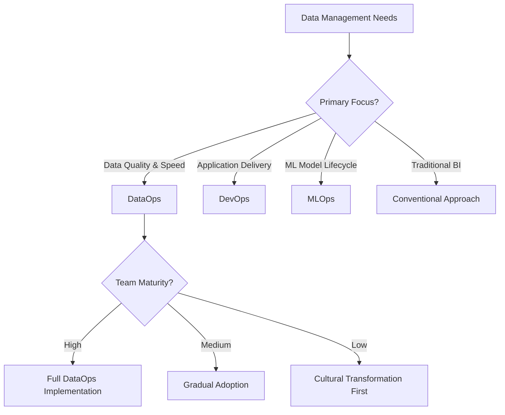

# DataOps Interview Questions & Answers

## Table of Contents
1. [Basic DataOps Concepts](#basic-dataops-concepts)
2. [DataOps vs DevOps](#dataops-vs-devops)
3. [Implementation & Tools](#implementation--tools)
4. [Data Pipeline Management](#data-pipeline-management)
5. [Monitoring & Quality](#monitoring--quality)
6. [Advanced Topics](#advanced-topics)

---

## Basic DataOps Concepts

### 1. What is DataOps and how does it differ from traditional data management?

### 🎯 **Theoretical Foundation**
#### **Core Concepts**
- **Agile Data Management**: Application of agile methodologies to data operations
- **Continuous Integration/Continuous Deployment (CI/CD)**: Automated pipeline deployment and testing
- **Data as Code**: Treating data pipelines, schemas, and configurations as version-controlled code
- **Observability**: Comprehensive monitoring of data quality, lineage, and pipeline health
- **Collaborative Culture**: Breaking down silos between data producers and consumers

#### **Historical Context**
- **Origins**: Emerged from DevOps practices around 2014-2016
- **Evolution Timeline**:
  - 2014: Early adoption of DevOps principles in data teams
  - 2017: "DataOps" term coined and formalized
  - 2019: Enterprise adoption and tool ecosystem development
  - 2021: Integration with MLOps and data mesh architectures
  - Current: AI-driven automation and self-healing pipelines

#### **Philosophical Principles**
- **Lean Manufacturing**: Elimination of waste in data processes
- **Systems Thinking**: Holistic view of data ecosystem interactions
- **Continuous Improvement**: Kaizen approach to data operations
- **Customer-Centricity**: Focus on data consumer needs and experience
- **Quality by Design**: Built-in quality controls rather than post-hoc validation

### 📊 **Comparative Analysis**
#### **Data Management Approaches Comparison**
| Aspect | Traditional Data Management | DataOps | DevOps | MLOps |
|--------|----------------------------|---------|--------|---------|
| **Methodology** | Waterfall | Agile | Agile | Agile |
| **Deployment** | Manual, scheduled | Automated, continuous | Automated, continuous | Automated, versioned |
| **Testing** | End-to-end validation | Continuous testing | Unit/integration tests | Model validation |
| **Collaboration** | Siloed teams | Cross-functional | Cross-functional | ML-focused teams |
| **Monitoring** | Batch reports | Real-time observability | Application monitoring | Model performance |
| **Rollback** | Manual restoration | Automated rollback | Code rollback | Model rollback |
| **Quality** | Post-production checks | Continuous validation | Code quality | Model accuracy |
| **Speed** | Weeks/months | Hours/days | Minutes/hours | Days/weeks |

#### **Decision Framework**


#### **Use Case Scenarios**
- **Choose DataOps when:**
  - Multiple data sources requiring integration
  - Frequent changes in data requirements
  - Need for rapid data product delivery
  - Quality issues impacting business decisions
  - Cross-functional teams working with data

- **Consider Alternatives when:**
  - **Traditional**: Simple, stable data environments with infrequent changes
  - **DevOps**: Primary focus on application development and deployment
  - **MLOps**: Machine learning model lifecycle management is the priority

#### **Maturity Model**
```
DataOps Maturity Progression:
┌─────────────────┬──────────────┬──────────────┬──────────────┐
│ Level           │ Characteristics│ Automation   │ Collaboration│
├─────────────────┼──────────────┼──────────────┼──────────────┤
│ 1. Initial      │ Manual       │ None         │ Siloed       │
│ 2. Managed      │ Some process │ Basic        │ Limited      │
│ 3. Defined      │ Standardized │ Partial      │ Structured   │
│ 4. Quantitative │ Measured     │ Extensive    │ Integrated   │
│ 5. Optimizing   │ Continuous   │ Full         │ Seamless     │
└─────────────────┴──────────────┴──────────────┴──────────────┘
```

#### **ROI Analysis**
```
DataOps Implementation ROI (2-year projection):
┌─────────────────┬──────────────┬──────────────┬──────────────┐
│ Benefit Category│ Traditional  │ DataOps      │ Improvement  │
├─────────────────┼──────────────┼──────────────┼──────────────┤
│ Time to Market  │ 8 weeks      │ 2 weeks      │ 75% faster   │
│ Data Quality    │ 85%          │ 98%          │ 15% better   │
│ Operational Cost│ $500K        │ $300K        │ 40% reduction│
│ Team Efficiency │ 60%          │ 85%          │ 42% increase │
│ Error Rate      │ 5%           │ 1%           │ 80% reduction│
└─────────────────┴──────────────┴──────────────┴──────────────┘
```

**Answer:**
DataOps is a collaborative data management practice focused on improving communication, integration, and automation of data flows between data managers and data consumers across an organization.

**Key Differences:**
- **Traditional**: Siloed teams, manual processes, waterfall approach
- **DataOps**: Cross-functional collaboration, automated pipelines, agile methodology
- **Focus**: End-to-end data lifecycle management
- **Goal**: Faster, more reliable data delivery with higher quality

**Core Principles:**
- Continuous integration/continuous deployment (CI/CD) for data
- Automated testing and validation
- Version control for data and code
- Monitoring and observability
- Collaboration between teams

### 2. What are the core principles of DataOps?

**Answer:**
**1. Customer Satisfaction**
- Deliver valuable data insights quickly and continuously
- Focus on business value and user needs

**2. Value Working Analytics**
- Prioritize working data products over comprehensive documentation
- Emphasize functional analytics over perfect models

**3. Customer Collaboration**
- Work closely with data consumers and stakeholders
- Regular feedback and iteration

**4. Respond to Change**
- Adapt to changing requirements and data sources
- Embrace flexibility over rigid processes

**5. Quality and Testing**
- Implement automated testing for data quality
- Continuous validation and monitoring

### 3. How does DataOps support data governance?

**Answer:**
**Integration Points:**
- **Automated Compliance**: Built-in governance checks in pipelines
- **Data Lineage**: Automatic tracking of data flow and transformations
- **Access Control**: Integrated security and permission management
- **Audit Trails**: Complete history of data changes and access

**Benefits:**
- Consistent policy enforcement
- Reduced manual governance overhead
- Real-time compliance monitoring
- Improved data quality and trust

---

## DataOps vs DevOps

### 4. What are the key similarities and differences between DataOps and DevOps?

**Answer:**
**Similarities:**
- Automation and CI/CD practices
- Cross-functional collaboration
- Monitoring and observability
- Version control and testing
- Agile methodologies

**Key Differences:**

| Aspect | DevOps | DataOps |
|--------|--------|---------|
| **Focus** | Application deployment | Data pipeline deployment |
| **Artifacts** | Code, applications | Data, models, analytics |
| **Testing** | Unit, integration tests | Data quality, schema validation |
| **Deployment** | Application releases | Data pipeline releases |
| **Monitoring** | Application performance | Data quality, pipeline health |
| **Rollback** | Code rollback | Data versioning, pipeline rollback |

### 5. How do you implement version control in DataOps?

**Answer:**
**Code Versioning:**
```bash
# Git for pipeline code
git add data_pipeline.py
git commit -m "Add customer segmentation logic"
git tag v1.2.0
```

**Data Versioning:**
- **Data Version Control (DVC)**
- **Delta Lake** for data versioning
- **Pachyderm** for data lineage
- **lakeFS** for data lake versioning

**Schema Versioning:**
- Schema registry (Confluent, AWS Glue)
- Migration scripts for schema changes
- Backward compatibility testing

**Model Versioning:**
- MLflow for model tracking
- Model registry with versioning
- A/B testing for model deployment

---

## Implementation & Tools

### 6. What tools and technologies are commonly used in DataOps?

**Answer:**
**Orchestration:**
- Apache Airflow, Prefect, Dagster
- AWS Step Functions, Azure Data Factory

**CI/CD:**
- Jenkins, GitLab CI, GitHub Actions
- Azure DevOps, AWS CodePipeline

**Data Processing:**
- Apache Spark, Databricks
- dbt for transformations
- Apache Kafka for streaming

**Monitoring:**
- Datadog, Grafana, Prometheus
- Great Expectations for data quality
- Monte Carlo, Datafold for data observability

**Infrastructure:**
- Docker, Kubernetes
- Terraform, CloudFormation
- Ansible for configuration management

### 7. How do you implement automated testing in DataOps?

**Answer:**
**Data Quality Tests:**
```python
# Great Expectations example
import great_expectations as ge

# Load data
df = ge.read_csv("customer_data.csv")

# Define expectations
df.expect_column_to_exist("customer_id")
df.expect_column_values_to_not_be_null("customer_id")
df.expect_column_values_to_be_unique("customer_id")
df.expect_column_values_to_be_between("age", 0, 120)
```

**Schema Validation:**
```python
# Pandera schema validation
import pandera as pa

schema = pa.DataFrameSchema({
    "customer_id": pa.Column(int, checks=pa.Check.gt(0)),
    "email": pa.Column(str, checks=pa.Check.str_matches(r'^[\w\.-]+@[\w\.-]+\.\w+$')),
    "created_date": pa.Column(pa.DateTime)
})

validated_df = schema(df)
```

**Pipeline Testing:**
- Unit tests for transformation functions
- Integration tests for end-to-end pipelines
- Data drift detection
- Performance regression tests

### 8. How do you handle data pipeline failures in DataOps?

**Answer:**
**Failure Detection:**
- Automated monitoring and alerting
- Health checks and heartbeat monitoring
- Data quality threshold violations
- SLA monitoring

**Recovery Strategies:**
```python
# Airflow retry configuration
from airflow import DAG
from airflow.operators.python_operator import PythonOperator

task = PythonOperator(
    task_id='process_data',
    python_callable=process_function,
    retries=3,
    retry_delay=timedelta(minutes=5),
    retry_exponential_backoff=True
)
```

**Rollback Mechanisms:**
- Data versioning for rollback
- Pipeline state checkpoints
- Graceful degradation strategies
- Circuit breaker patterns

---

## Data Pipeline Management

### 9. How do you implement continuous integration for data pipelines?

**Answer:**
**CI Pipeline Structure:**
```yaml
# .github/workflows/data-pipeline-ci.yml
name: Data Pipeline CI
on: [push, pull_request]

jobs:
  test:
    runs-on: ubuntu-latest
    steps:
      - uses: actions/checkout@v2
      - name: Setup Python
        uses: actions/setup-python@v2
        with:
          python-version: 3.8
      
      - name: Install dependencies
        run: pip install -r requirements.txt
      
      - name: Run unit tests
        run: pytest tests/unit/
      
      - name: Run data quality tests
        run: great_expectations checkpoint run data_quality_checkpoint
      
      - name: Validate schemas
        run: python validate_schemas.py
      
      - name: Integration tests
        run: pytest tests/integration/
```

**Key Components:**
- Automated testing on code changes
- Data quality validation
- Schema compatibility checks
- Performance benchmarking
- Security scanning

### 10. What is data lineage and why is it important in DataOps?

**Answer:**
**Definition:**
Data lineage tracks the flow of data from source to destination, including all transformations, dependencies, and relationships.

**Importance:**
- **Impact Analysis**: Understand downstream effects of changes
- **Root Cause Analysis**: Trace data quality issues to source
- **Compliance**: Audit trails for regulatory requirements
- **Documentation**: Automatic documentation of data flows

**Implementation:**
```python
# Apache Atlas for data lineage
from pyatlasclient.client import Atlas

atlas = Atlas('http://atlas-server:21000', ('admin', 'admin'))

# Create lineage relationship
lineage = {
    'typeName': 'DataSet',
    'attributes': {
        'name': 'customer_processed',
        'inputs': ['customer_raw'],
        'process': 'customer_etl_pipeline'
    }
}
```

**Tools:**
- Apache Atlas, DataHub
- AWS Glue Data Catalog
- Collibra, Alation
- dbt docs for transformation lineage

---

## Monitoring & Quality

### 11. How do you implement data observability in DataOps?

**Answer:**
**Key Metrics:**
- **Data Quality**: Completeness, accuracy, consistency
- **Data Freshness**: Timeliness of data updates
- **Data Volume**: Expected vs actual data volumes
- **Schema Changes**: Unexpected schema modifications
- **Pipeline Performance**: Execution time, resource usage

**Implementation:**
```python
# Custom data observability
import pandas as pd
from datetime import datetime, timedelta

def monitor_data_quality(df, table_name):
    metrics = {
        'timestamp': datetime.now(),
        'table_name': table_name,
        'row_count': len(df),
        'null_percentage': df.isnull().sum().sum() / (len(df) * len(df.columns)),
        'duplicate_count': df.duplicated().sum(),
        'schema_hash': hash(str(df.dtypes.to_dict()))
    }
    
    # Send to monitoring system
    send_metrics_to_datadog(metrics)
    
    return metrics
```

**Alerting Strategy:**
- Threshold-based alerts
- Anomaly detection
- Trend analysis
- Business impact scoring

### 12. How do you ensure data quality in DataOps pipelines?

**Answer:**
**Multi-Layer Approach:**

**1. Source Data Validation:**
```python
# Input validation
def validate_source_data(df):
    checks = [
        df['id'].notna().all(),
        df['timestamp'].dtype == 'datetime64[ns]',
        df['amount'].between(0, 1000000).all()
    ]
    return all(checks)
```

**2. Transformation Testing:**
```python
# Unit test for transformation
def test_customer_aggregation():
    input_data = pd.DataFrame({
        'customer_id': [1, 1, 2],
        'amount': [100, 200, 150]
    })
    
    result = aggregate_customer_spending(input_data)
    
    assert result.loc[1, 'total_amount'] == 300
    assert result.loc[2, 'total_amount'] == 150
```

**3. Output Validation:**
- Data profiling and statistical checks
- Business rule validation
- Referential integrity checks
- Format and type validation

**4. Continuous Monitoring:**
- Real-time data quality dashboards
- Automated anomaly detection
- Data drift monitoring
- SLA tracking

---

## Advanced Topics

### 13. How do you implement DataOps in a multi-cloud environment?

**Answer:**
**Challenges:**
- Different cloud services and APIs
- Data transfer costs and latency
- Security and compliance variations
- Tool compatibility issues

**Solutions:**
```yaml
# Terraform multi-cloud setup
# AWS resources
resource "aws_s3_bucket" "data_lake" {
  bucket = "company-data-lake-aws"
}

# Azure resources
resource "azurerm_storage_account" "data_lake" {
  name = "companydatalakeazure"
  resource_group_name = azurerm_resource_group.main.name
}

# GCP resources
resource "google_storage_bucket" "data_lake" {
  name = "company-data-lake-gcp"
}
```

**Best Practices:**
- Cloud-agnostic tools (Kubernetes, Docker)
- Standardized APIs and interfaces
- Centralized monitoring and logging
- Consistent security policies
- Data replication strategies

### 14. How do you handle real-time data processing in DataOps?

**Answer:**
**Architecture Components:**
```python
# Kafka Streams processing
from kafka import KafkaProducer, KafkaConsumer
import json

# Real-time data processing
def process_streaming_data():
    consumer = KafkaConsumer(
        'raw_events',
        bootstrap_servers=['localhost:9092'],
        value_deserializer=lambda x: json.loads(x.decode('utf-8'))
    )
    
    producer = KafkaProducer(
        bootstrap_servers=['localhost:9092'],
        value_serializer=lambda x: json.dumps(x).encode('utf-8')
    )
    
    for message in consumer:
        # Process data
        processed_data = transform_event(message.value)
        
        # Validate quality
        if validate_event(processed_data):
            producer.send('processed_events', processed_data)
```

**Key Considerations:**
- Stream processing frameworks (Kafka Streams, Apache Flink)
- Real-time data quality checks
- Backpressure handling
- Exactly-once processing guarantees
- Low-latency monitoring and alerting

### 15. What are the key metrics for measuring DataOps success?

**Answer:**
**Technical Metrics:**
- **Deployment Frequency**: How often data pipelines are deployed
- **Lead Time**: Time from code commit to production deployment
- **Mean Time to Recovery (MTTR)**: Time to fix data pipeline failures
- **Change Failure Rate**: Percentage of deployments causing failures

**Data Quality Metrics:**
- **Data Accuracy**: Percentage of correct data
- **Data Completeness**: Percentage of complete records
- **Data Timeliness**: SLA compliance for data freshness
- **Data Consistency**: Cross-system data alignment

**Business Metrics:**
- **Time to Insight**: Speed of delivering analytics
- **Data Consumer Satisfaction**: User feedback scores
- **Cost Efficiency**: Infrastructure and operational costs
- **Compliance Score**: Regulatory adherence percentage

**Monitoring Dashboard:**
```python
# Grafana dashboard metrics
metrics = {
    'pipeline_success_rate': 99.5,
    'average_processing_time': 45,  # minutes
    'data_quality_score': 98.2,
    'sla_compliance': 99.8,
    'cost_per_gb_processed': 0.05
}
```

---

## Summary

DataOps represents a fundamental shift in how organizations manage their data lifecycle, emphasizing automation, collaboration, and continuous improvement. Success requires:

1. **Cultural Change**: Breaking down silos between teams
2. **Technical Implementation**: Robust tooling and automation
3. **Process Optimization**: Agile methodologies for data
4. **Quality Focus**: Comprehensive testing and monitoring
5. **Continuous Learning**: Regular retrospectives and improvements

The key is to start small, demonstrate value, and gradually expand DataOps practices across the organization while maintaining focus on business outcomes and data quality.