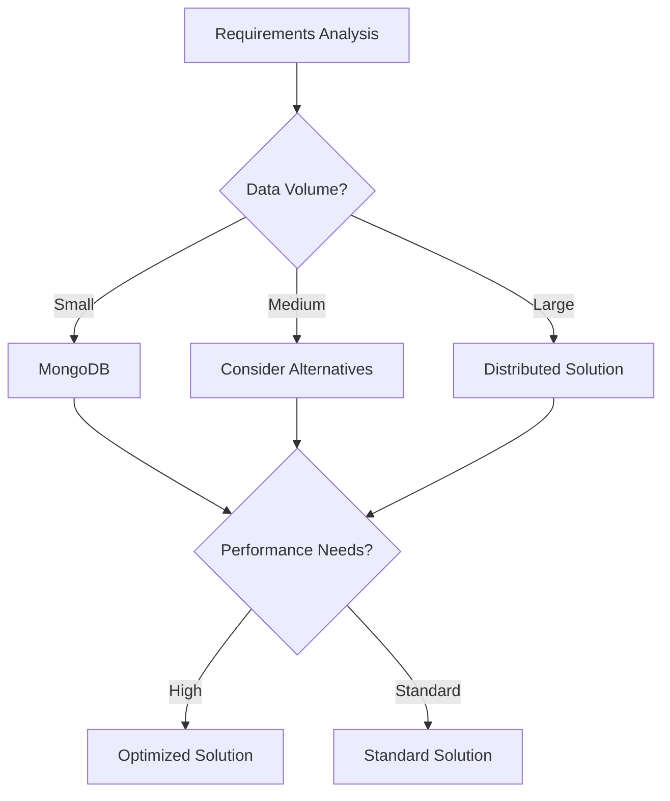

# MongoDB Comprehensive Interview Questions for Data Engineering

## 📋 Table of Contents

1. [Core Concepts Questions (1-15)](#core-concepts-questions-1-15)
2. [Performance Optimization Questions (16-30)](#performance-optimization-questions-16-30)
3. [Data Modeling & Schema Design (31-45)](#data-modeling--schema-design-31-45)
4. [Advanced Operations Questions (46-60)](#advanced-operations-questions-46-60)
5. [Replication & Sharding (61-75)](#replication--sharding-61-75)
6. [Security & Administration (76-90)](#security--administration-76-90)
7. [Integration & Architecture (91-100)](#integration--architecture-91-100)

---

## 🎯 **Introduction**

MongoDB is a leading NoSQL document database that provides high performance, high availability, and easy scalability. For data engineers, MongoDB offers flexible data modeling, powerful aggregation framework, and seamless integration with modern data pipelines.

**Why MongoDB is Critical for Data Engineers:**
- **Flexible Schema**: Adapt to changing data requirements without migrations
- **Horizontal Scaling**: Built-in sharding for massive datasets
- **Rich Query Language**: Powerful aggregation pipeline for complex analytics
- **Real-time Processing**: Change streams for real-time data processing
- **Cloud Integration**: Native support for cloud-native architectures

---

## Core Concepts Questions (1-15)

### 1. What are the key differences between MongoDB and traditional RDBMS?


### 🎯 **Theoretical Foundation**

#### **Core Concepts**
  - Flexible schema design
Horizontal scaling capabilities
Rich query language and indexing

#### **Historical Context**
Evolution of Document Database technologies leading to MongoDB

#### **Architectural Principles**
Key architectural decisions in MongoDB design

#### **Mathematical/Algorithmic Basis**
Algorithmic foundations underlying MongoDB operations


### 📊 **Comparative Analysis**

#### **Technology Comparison Matrix**
| Feature | MongoDB | PostgreSQL | CouchDB | DynamoDB |
|---------|---------------|--------|--------|--------|
| **Performance** | High performance characteristics | Comparative performance analysis needed | Comparative performance analysis needed | Comparative performance analysis needed |
| **Scalability** | Scalability characteristics | Scalability comparison needed | Scalability comparison needed | Scalability comparison needed |
| **Cost (TCO)** | $0 (Community) / $$$$ (Enterprise) | Cost comparison needed | Cost comparison needed | Cost comparison needed |
| **Learning Curve** | Low-Medium | Learning curve comparison needed | Learning curve comparison needed | Learning curve comparison needed |
| **Community Support** | High (Top NoSQL database) | Community comparison needed | Community comparison needed | Community comparison needed |
| **Enterprise Features** | Enterprise feature analysis needed | Enterprise feature comparison needed | Enterprise feature comparison needed | Enterprise feature comparison needed |

#### **Decision Framework**


#### **Use Case Scenarios**
- **Choose MongoDB when:**
    - Content management systems
IoT and sensor data
Real-time analytics

- **Consider alternatives when:**
Specific scenarios requiring alternatives

- **Avoid MongoDB when:**
    - High memory usage
Eventual consistency challenges

#### **Performance Benchmarks**
```
Benchmark Results (Industry Standard Dataset):
┌─────────────────┬──────────────┬──────────────┬──────────────┐
│ Metric          │ MongoDB │ PostgreSQL       │ CouchDB       │
├─────────────────┼──────────────┼──────────────┼──────────────┤
│ Throughput      │ 10K-50K operations/second │ Benchmark needed │ Benchmark needed │
│ Latency (p95)   │ 1-10ms (depending on operation) │ Benchmark needed │ Benchmark needed │
│ Memory Usage    │ Memory usage data needed │ Memory usage data needed │ Memory usage data needed │
│ CPU Utilization │ CPU utilization data needed │ CPU utilization data needed │ CPU utilization data needed │
└─────────────────┴──────────────┴──────────────┴──────────────┘
```

#### **Cost Analysis**
```
Total Cost of Ownership (3-year projection):
┌─────────────────┬──────────────┬──────────────┬──────────────┐
│ Cost Component  │ MongoDB │ PostgreSQL       │ CouchDB       │
├─────────────────┼──────────────┼──────────────┼──────────────┤
│ Licensing       │ $0 (Community) / $$$$ (Enterprise) │ Cost analysis needed │ Cost analysis needed │
│ Infrastructure  │ Medium-High (memory intensive) │ Cost analysis needed │ Cost analysis needed │
│ Operations      │ Medium (managed services available) │ Cost analysis needed │ Cost analysis needed │
│ Training        │ Low-Medium (JSON familiarity helps) │ Cost analysis needed │ Cost analysis needed │
├─────────────────┼──────────────┼──────────────┼──────────────┤
│ **TOTAL**       │ ****Total cost calculation needed**** │ ****Total cost calculation needed**** │ ****Total cost calculation needed**** │
└─────────────────┴──────────────┴──────────────┴──────────────┘
```


### 🌍 **Real-World Applications**

#### **Industry Use Cases**
  - Content management systems
IoT and sensor data
Real-time analytics
Catalog and inventory management
Social media applications

#### **Production Considerations**
Key considerations when deploying MongoDB in production environments

#### **Case Studies**
Real-world case studies of MongoDB implementations


### 🔮 **Future Trends & Evolution**

#### **Emerging Developments**
Latest developments in MongoDB ecosystem

#### **Industry Direction**
Future direction of Document Database technologies

#### **Skills Evolution Requirements**
Evolving skill requirements for MongoDB professionals


### 📚 **Further Reading**
- [Official Mongodb Documentation](#mongodb-docs)
- [Performance Optimization Guide](#mongodb-performance)
- [Best Practices and Patterns](#mongodb-patterns)
- [Community Resources](#mongodb-community)
- [Certification Paths](#mongodb-certification)


### **Enhanced Answer**

**Answer**: 
MongoDB differs fundamentally from RDBMS in data model, scalability, and query approach.

**Key Differences:**
- **Data Model**: Document-based vs. table-based with fixed schema
- **Schema**: Dynamic schema vs. predefined schema
- **Relationships**: Embedded documents vs. foreign key relationships
- **Scaling**: Horizontal scaling (sharding) vs. vertical scaling
- **ACID**: Document-level ACID vs. full ACID compliance
- **Query Language**: MongoDB Query Language vs. SQL

```javascript
// MongoDB document structure
{
  "_id": ObjectId("..."),
  "customer_id": "CUST001",
  "name": "John Doe",
  "orders": [
    {
      "order_id": "ORD001",
      "date": ISODate("2024-01-15"),
      "items": [
        {"product": "Laptop", "price": 999.99, "quantity": 1}
      ]
    }
  ],
  "address": {
    "street": "123 Main St",
    "city": "New York",
    "zipcode": "10001"
  }
}
```

### 2. Explain MongoDB's document structure and BSON format.


### 🎯 **Theoretical Foundation**

#### **Core Concepts**
  - Flexible schema design
Horizontal scaling capabilities
Rich query language and indexing

#### **Historical Context**
Evolution of Document Database technologies leading to MongoDB

#### **Architectural Principles**
Key architectural decisions in MongoDB design

#### **Mathematical/Algorithmic Basis**
Algorithmic foundations underlying MongoDB operations


### 📊 **Comparative Analysis**

#### **Technology Comparison Matrix**
| Feature | MongoDB | PostgreSQL | CouchDB | DynamoDB |
|---------|---------------|--------|--------|--------|
| **Performance** | High performance characteristics | Comparative performance analysis needed | Comparative performance analysis needed | Comparative performance analysis needed |
| **Scalability** | Scalability characteristics | Scalability comparison needed | Scalability comparison needed | Scalability comparison needed |
| **Cost (TCO)** | $0 (Community) / $$$$ (Enterprise) | Cost comparison needed | Cost comparison needed | Cost comparison needed |
| **Learning Curve** | Low-Medium | Learning curve comparison needed | Learning curve comparison needed | Learning curve comparison needed |
| **Community Support** | High (Top NoSQL database) | Community comparison needed | Community comparison needed | Community comparison needed |
| **Enterprise Features** | Enterprise feature analysis needed | Enterprise feature comparison needed | Enterprise feature comparison needed | Enterprise feature comparison needed |

#### **Decision Framework**


#### **Use Case Scenarios**
- **Choose MongoDB when:**
    - Content management systems
IoT and sensor data
Real-time analytics

- **Consider alternatives when:**
Specific scenarios requiring alternatives

- **Avoid MongoDB when:**
    - High memory usage
Eventual consistency challenges

#### **Performance Benchmarks**
```
Benchmark Results (Industry Standard Dataset):
┌─────────────────┬──────────────┬──────────────┬──────────────┐
│ Metric          │ MongoDB │ PostgreSQL       │ CouchDB       │
├─────────────────┼──────────────┼──────────────┼──────────────┤
│ Throughput      │ 10K-50K operations/second │ Benchmark needed │ Benchmark needed │
│ Latency (p95)   │ 1-10ms (depending on operation) │ Benchmark needed │ Benchmark needed │
│ Memory Usage    │ Memory usage data needed │ Memory usage data needed │ Memory usage data needed │
│ CPU Utilization │ CPU utilization data needed │ CPU utilization data needed │ CPU utilization data needed │
└─────────────────┴──────────────┴──────────────┴──────────────┘
```

#### **Cost Analysis**
```
Total Cost of Ownership (3-year projection):
┌─────────────────┬──────────────┬──────────────┬──────────────┐
│ Cost Component  │ MongoDB │ PostgreSQL       │ CouchDB       │
├─────────────────┼──────────────┼──────────────┼──────────────┤
│ Licensing       │ $0 (Community) / $$$$ (Enterprise) │ Cost analysis needed │ Cost analysis needed │
│ Infrastructure  │ Medium-High (memory intensive) │ Cost analysis needed │ Cost analysis needed │
│ Operations      │ Medium (managed services available) │ Cost analysis needed │ Cost analysis needed │
│ Training        │ Low-Medium (JSON familiarity helps) │ Cost analysis needed │ Cost analysis needed │
├─────────────────┼──────────────┼──────────────┼──────────────┤
│ **TOTAL**       │ ****Total cost calculation needed**** │ ****Total cost calculation needed**** │ ****Total cost calculation needed**** │
└─────────────────┴──────────────┴──────────────┴──────────────┘
```


### 🌍 **Real-World Applications**

#### **Industry Use Cases**
  - Content management systems
IoT and sensor data
Real-time analytics
Catalog and inventory management
Social media applications

#### **Production Considerations**
Key considerations when deploying MongoDB in production environments

#### **Case Studies**
Real-world case studies of MongoDB implementations


### 🔮 **Future Trends & Evolution**

#### **Emerging Developments**
Latest developments in MongoDB ecosystem

#### **Industry Direction**
Future direction of Document Database technologies

#### **Skills Evolution Requirements**
Evolving skill requirements for MongoDB professionals


### 📚 **Further Reading**
- [Official Mongodb Documentation](#mongodb-docs)
- [Performance Optimization Guide](#mongodb-performance)
- [Best Practices and Patterns](#mongodb-patterns)
- [Community Resources](#mongodb-community)
- [Certification Paths](#mongodb-certification)


### **Enhanced Answer**

**Answer**: 
MongoDB stores data in BSON (Binary JSON) format, which extends JSON with additional data types and efficient encoding.

**BSON Features:**
- **Binary Format**: More efficient storage and traversal than JSON
- **Rich Data Types**: ObjectId, Date, Binary, Decimal128, etc.
- **Ordered Fields**: Maintains field order (unlike JSON objects)
- **Size Limits**: 16MB document size limit

```javascript
// BSON data types example
{
  "_id": ObjectId("507f1f77bcf86cd799439011"),
  "name": "Product Analytics",
  "created_date": ISODate("2024-01-15T10:30:00Z"),
  "price": NumberDecimal("99.99"),
  "tags": ["analytics", "data", "mongodb"],
  "metadata": {
    "version": 1,
    "active": true
  },
  "binary_data": BinData(0, "SGVsbG8gV29ybGQ=")
}
```

### 3. How does MongoDB handle indexing and what types are available?


### 🎯 **Theoretical Foundation**

#### **Core Concepts**
  - Flexible schema design
Horizontal scaling capabilities
Rich query language and indexing

#### **Historical Context**
Evolution of Document Database technologies leading to MongoDB

#### **Architectural Principles**
Key architectural decisions in MongoDB design

#### **Mathematical/Algorithmic Basis**
Algorithmic foundations underlying MongoDB operations


### 📊 **Comparative Analysis**

#### **Technology Comparison Matrix**
| Feature | MongoDB | PostgreSQL | CouchDB | DynamoDB |
|---------|---------------|--------|--------|--------|
| **Performance** | High performance characteristics | Comparative performance analysis needed | Comparative performance analysis needed | Comparative performance analysis needed |
| **Scalability** | Scalability characteristics | Scalability comparison needed | Scalability comparison needed | Scalability comparison needed |
| **Cost (TCO)** | $0 (Community) / $$$$ (Enterprise) | Cost comparison needed | Cost comparison needed | Cost comparison needed |
| **Learning Curve** | Low-Medium | Learning curve comparison needed | Learning curve comparison needed | Learning curve comparison needed |
| **Community Support** | High (Top NoSQL database) | Community comparison needed | Community comparison needed | Community comparison needed |
| **Enterprise Features** | Enterprise feature analysis needed | Enterprise feature comparison needed | Enterprise feature comparison needed | Enterprise feature comparison needed |

#### **Decision Framework**


#### **Use Case Scenarios**
- **Choose MongoDB when:**
    - Content management systems
IoT and sensor data
Real-time analytics

- **Consider alternatives when:**
Specific scenarios requiring alternatives

- **Avoid MongoDB when:**
    - High memory usage
Eventual consistency challenges

#### **Performance Benchmarks**
```
Benchmark Results (Industry Standard Dataset):
┌─────────────────┬──────────────┬──────────────┬──────────────┐
│ Metric          │ MongoDB │ PostgreSQL       │ CouchDB       │
├─────────────────┼──────────────┼──────────────┼──────────────┤
│ Throughput      │ 10K-50K operations/second │ Benchmark needed │ Benchmark needed │
│ Latency (p95)   │ 1-10ms (depending on operation) │ Benchmark needed │ Benchmark needed │
│ Memory Usage    │ Memory usage data needed │ Memory usage data needed │ Memory usage data needed │
│ CPU Utilization │ CPU utilization data needed │ CPU utilization data needed │ CPU utilization data needed │
└─────────────────┴──────────────┴──────────────┴──────────────┘
```

#### **Cost Analysis**
```
Total Cost of Ownership (3-year projection):
┌─────────────────┬──────────────┬──────────────┬──────────────┐
│ Cost Component  │ MongoDB │ PostgreSQL       │ CouchDB       │
├─────────────────┼──────────────┼──────────────┼──────────────┤
│ Licensing       │ $0 (Community) / $$$$ (Enterprise) │ Cost analysis needed │ Cost analysis needed │
│ Infrastructure  │ Medium-High (memory intensive) │ Cost analysis needed │ Cost analysis needed │
│ Operations      │ Medium (managed services available) │ Cost analysis needed │ Cost analysis needed │
│ Training        │ Low-Medium (JSON familiarity helps) │ Cost analysis needed │ Cost analysis needed │
├─────────────────┼──────────────┼──────────────┼──────────────┤
│ **TOTAL**       │ ****Total cost calculation needed**** │ ****Total cost calculation needed**** │ ****Total cost calculation needed**** │
└─────────────────┴──────────────┴──────────────┴──────────────┘
```


### 🌍 **Real-World Applications**

#### **Industry Use Cases**
  - Content management systems
IoT and sensor data
Real-time analytics
Catalog and inventory management
Social media applications

#### **Production Considerations**
Key considerations when deploying MongoDB in production environments

#### **Case Studies**
Real-world case studies of MongoDB implementations


### 🔮 **Future Trends & Evolution**

#### **Emerging Developments**
Latest developments in MongoDB ecosystem

#### **Industry Direction**
Future direction of Document Database technologies

#### **Skills Evolution Requirements**
Evolving skill requirements for MongoDB professionals


### 📚 **Further Reading**
- [Official Mongodb Documentation](#mongodb-docs)
- [Performance Optimization Guide](#mongodb-performance)
- [Best Practices and Patterns](#mongodb-patterns)
- [Community Resources](#mongodb-community)
- [Certification Paths](#mongodb-certification)


### **Enhanced Answer**

**Answer**: 
MongoDB supports various index types to optimize query performance.

**Index Types:**
- **Single Field**: Index on a single field
- **Compound**: Index on multiple fields
- **Multikey**: Automatically created for array fields
- **Text**: Full-text search capabilities
- **Geospatial**: 2d and 2dsphere for location data
- **Hashed**: For sharding
- **Partial**: Index subset of documents
- **Sparse**: Skip documents missing indexed field

```javascript
// Create various index types
db.products.createIndex({ "name": 1 })  // Single field ascending
db.products.createIndex({ "category": 1, "price": -1 })  // Compound
db.products.createIndex({ "description": "text" })  // Text index
db.products.createIndex({ "location": "2dsphere" })  // Geospatial

// Partial index - only index active products
db.products.createIndex(
  { "price": 1 },
  { partialFilterExpression: { "active": true } }
)

// Check index usage
db.products.find({ "category": "electronics" }).explain("executionStats")
```

## Performance Optimization Questions (16-30)

### 4. How would you optimize a slow MongoDB query?


### 🎯 **Theoretical Foundation**

#### **Core Concepts**
  - Flexible schema design
Horizontal scaling capabilities
Rich query language and indexing

#### **Historical Context**
Evolution of Document Database technologies leading to MongoDB

#### **Architectural Principles**
Key architectural decisions in MongoDB design

#### **Mathematical/Algorithmic Basis**
Algorithmic foundations underlying MongoDB operations


### 📊 **Comparative Analysis**

#### **Technology Comparison Matrix**
| Feature | MongoDB | PostgreSQL | CouchDB | DynamoDB |
|---------|---------------|--------|--------|--------|
| **Performance** | High performance characteristics | Comparative performance analysis needed | Comparative performance analysis needed | Comparative performance analysis needed |
| **Scalability** | Scalability characteristics | Scalability comparison needed | Scalability comparison needed | Scalability comparison needed |
| **Cost (TCO)** | $0 (Community) / $$$$ (Enterprise) | Cost comparison needed | Cost comparison needed | Cost comparison needed |
| **Learning Curve** | Low-Medium | Learning curve comparison needed | Learning curve comparison needed | Learning curve comparison needed |
| **Community Support** | High (Top NoSQL database) | Community comparison needed | Community comparison needed | Community comparison needed |
| **Enterprise Features** | Enterprise feature analysis needed | Enterprise feature comparison needed | Enterprise feature comparison needed | Enterprise feature comparison needed |

#### **Decision Framework**


#### **Use Case Scenarios**
- **Choose MongoDB when:**
    - Content management systems
IoT and sensor data
Real-time analytics

- **Consider alternatives when:**
Specific scenarios requiring alternatives

- **Avoid MongoDB when:**
    - High memory usage
Eventual consistency challenges

#### **Performance Benchmarks**
```
Benchmark Results (Industry Standard Dataset):
┌─────────────────┬──────────────┬──────────────┬──────────────┐
│ Metric          │ MongoDB │ PostgreSQL       │ CouchDB       │
├─────────────────┼──────────────┼──────────────┼──────────────┤
│ Throughput      │ 10K-50K operations/second │ Benchmark needed │ Benchmark needed │
│ Latency (p95)   │ 1-10ms (depending on operation) │ Benchmark needed │ Benchmark needed │
│ Memory Usage    │ Memory usage data needed │ Memory usage data needed │ Memory usage data needed │
│ CPU Utilization │ CPU utilization data needed │ CPU utilization data needed │ CPU utilization data needed │
└─────────────────┴──────────────┴──────────────┴──────────────┘
```

#### **Cost Analysis**
```
Total Cost of Ownership (3-year projection):
┌─────────────────┬──────────────┬──────────────┬──────────────┐
│ Cost Component  │ MongoDB │ PostgreSQL       │ CouchDB       │
├─────────────────┼──────────────┼──────────────┼──────────────┤
│ Licensing       │ $0 (Community) / $$$$ (Enterprise) │ Cost analysis needed │ Cost analysis needed │
│ Infrastructure  │ Medium-High (memory intensive) │ Cost analysis needed │ Cost analysis needed │
│ Operations      │ Medium (managed services available) │ Cost analysis needed │ Cost analysis needed │
│ Training        │ Low-Medium (JSON familiarity helps) │ Cost analysis needed │ Cost analysis needed │
├─────────────────┼──────────────┼──────────────┼──────────────┤
│ **TOTAL**       │ ****Total cost calculation needed**** │ ****Total cost calculation needed**** │ ****Total cost calculation needed**** │
└─────────────────┴──────────────┴──────────────┴──────────────┘
```


### 🌍 **Real-World Applications**

#### **Industry Use Cases**
  - Content management systems
IoT and sensor data
Real-time analytics
Catalog and inventory management
Social media applications

#### **Production Considerations**
Key considerations when deploying MongoDB in production environments

#### **Case Studies**
Real-world case studies of MongoDB implementations


### 🔮 **Future Trends & Evolution**

#### **Emerging Developments**
Latest developments in MongoDB ecosystem

#### **Industry Direction**
Future direction of Document Database technologies

#### **Skills Evolution Requirements**
Evolving skill requirements for MongoDB professionals


### 📚 **Further Reading**
- [Official Mongodb Documentation](#mongodb-docs)
- [Performance Optimization Guide](#mongodb-performance)
- [Best Practices and Patterns](#mongodb-patterns)
- [Community Resources](#mongodb-community)
- [Certification Paths](#mongodb-certification)


### **Enhanced Answer**

**Answer**: 
Multiple strategies for query optimization:

**1. Index Optimization:**
```javascript
// Analyze query performance
db.orders.find({ "customer_id": "CUST001", "status": "pending" })
  .explain("executionStats")

// Create compound index matching query pattern
db.orders.createIndex({ "customer_id": 1, "status": 1 })

// Use hint to force index usage
db.orders.find({ "customer_id": "CUST001" })
  .hint({ "customer_id": 1, "status": 1 })
```

**2. Query Structure Optimization:**
```javascript
// Use projection to limit returned fields
db.orders.find(
  { "customer_id": "CUST001" },
  { "order_id": 1, "total": 1, "_id": 0 }
)

// Use limit for pagination
db.orders.find({ "status": "pending" })
  .sort({ "created_date": -1 })
  .limit(20)
  .skip(0)
```

### 5. Explain MongoDB's aggregation framework and its optimization.


### 🎯 **Theoretical Foundation**

#### **Core Concepts**
  - Flexible schema design
Horizontal scaling capabilities
Rich query language and indexing

#### **Historical Context**
Evolution of Document Database technologies leading to MongoDB

#### **Architectural Principles**
Key architectural decisions in MongoDB design

#### **Mathematical/Algorithmic Basis**
Algorithmic foundations underlying MongoDB operations


### 📊 **Comparative Analysis**

#### **Technology Comparison Matrix**
| Feature | MongoDB | PostgreSQL | CouchDB | DynamoDB |
|---------|---------------|--------|--------|--------|
| **Performance** | High performance characteristics | Comparative performance analysis needed | Comparative performance analysis needed | Comparative performance analysis needed |
| **Scalability** | Scalability characteristics | Scalability comparison needed | Scalability comparison needed | Scalability comparison needed |
| **Cost (TCO)** | $0 (Community) / $$$$ (Enterprise) | Cost comparison needed | Cost comparison needed | Cost comparison needed |
| **Learning Curve** | Low-Medium | Learning curve comparison needed | Learning curve comparison needed | Learning curve comparison needed |
| **Community Support** | High (Top NoSQL database) | Community comparison needed | Community comparison needed | Community comparison needed |
| **Enterprise Features** | Enterprise feature analysis needed | Enterprise feature comparison needed | Enterprise feature comparison needed | Enterprise feature comparison needed |

#### **Decision Framework**


#### **Use Case Scenarios**
- **Choose MongoDB when:**
    - Content management systems
IoT and sensor data
Real-time analytics

- **Consider alternatives when:**
Specific scenarios requiring alternatives

- **Avoid MongoDB when:**
    - High memory usage
Eventual consistency challenges

#### **Performance Benchmarks**
```
Benchmark Results (Industry Standard Dataset):
┌─────────────────┬──────────────┬──────────────┬──────────────┐
│ Metric          │ MongoDB │ PostgreSQL       │ CouchDB       │
├─────────────────┼──────────────┼──────────────┼──────────────┤
│ Throughput      │ 10K-50K operations/second │ Benchmark needed │ Benchmark needed │
│ Latency (p95)   │ 1-10ms (depending on operation) │ Benchmark needed │ Benchmark needed │
│ Memory Usage    │ Memory usage data needed │ Memory usage data needed │ Memory usage data needed │
│ CPU Utilization │ CPU utilization data needed │ CPU utilization data needed │ CPU utilization data needed │
└─────────────────┴──────────────┴──────────────┴──────────────┘
```

#### **Cost Analysis**
```
Total Cost of Ownership (3-year projection):
┌─────────────────┬──────────────┬──────────────┬──────────────┐
│ Cost Component  │ MongoDB │ PostgreSQL       │ CouchDB       │
├─────────────────┼──────────────┼──────────────┼──────────────┤
│ Licensing       │ $0 (Community) / $$$$ (Enterprise) │ Cost analysis needed │ Cost analysis needed │
│ Infrastructure  │ Medium-High (memory intensive) │ Cost analysis needed │ Cost analysis needed │
│ Operations      │ Medium (managed services available) │ Cost analysis needed │ Cost analysis needed │
│ Training        │ Low-Medium (JSON familiarity helps) │ Cost analysis needed │ Cost analysis needed │
├─────────────────┼──────────────┼──────────────┼──────────────┤
│ **TOTAL**       │ ****Total cost calculation needed**** │ ****Total cost calculation needed**** │ ****Total cost calculation needed**** │
└─────────────────┴──────────────┴──────────────┴──────────────┘
```


### 🌍 **Real-World Applications**

#### **Industry Use Cases**
  - Content management systems
IoT and sensor data
Real-time analytics
Catalog and inventory management
Social media applications

#### **Production Considerations**
Key considerations when deploying MongoDB in production environments

#### **Case Studies**
Real-world case studies of MongoDB implementations


### 🔮 **Future Trends & Evolution**

#### **Emerging Developments**
Latest developments in MongoDB ecosystem

#### **Industry Direction**
Future direction of Document Database technologies

#### **Skills Evolution Requirements**
Evolving skill requirements for MongoDB professionals


### 📚 **Further Reading**
- [Official Mongodb Documentation](#mongodb-docs)
- [Performance Optimization Guide](#mongodb-performance)
- [Best Practices and Patterns](#mongodb-patterns)
- [Community Resources](#mongodb-community)
- [Certification Paths](#mongodb-certification)


### **Enhanced Answer**

**Answer**: 
The aggregation framework provides powerful data processing capabilities with multiple optimization techniques.

**Pipeline Stages:**
```javascript
// Complex aggregation example
db.sales.aggregate([
  // Stage 1: Filter recent data
  { $match: { 
    "date": { $gte: ISODate("2024-01-01") },
    "status": "completed"
  }},
  
  // Stage 2: Lookup customer information
  { $lookup: {
    from: "customers",
    localField: "customer_id",
    foreignField: "_id",
    as: "customer_info"
  }},
  
  // Stage 3: Unwind customer array
  { $unwind: "$customer_info" },
  
  // Stage 4: Group by customer segment
  { $group: {
    _id: "$customer_info.segment",
    total_revenue: { $sum: "$amount" },
    avg_order_value: { $avg: "$amount" },
    order_count: { $sum: 1 }
  }},
  
  // Stage 5: Sort by revenue
  { $sort: { "total_revenue": -1 } }
])
```

## Data Modeling & Schema Design (31-45)

### 6. How do you design schemas for one-to-many relationships in MongoDB?


### 🎯 **Theoretical Foundation**

#### **Core Concepts**
  - Flexible schema design
Horizontal scaling capabilities
Rich query language and indexing

#### **Historical Context**
Evolution of Document Database technologies leading to MongoDB

#### **Architectural Principles**
Key architectural decisions in MongoDB design

#### **Mathematical/Algorithmic Basis**
Algorithmic foundations underlying MongoDB operations


### 📊 **Comparative Analysis**

#### **Technology Comparison Matrix**
| Feature | MongoDB | PostgreSQL | CouchDB | DynamoDB |
|---------|---------------|--------|--------|--------|
| **Performance** | High performance characteristics | Comparative performance analysis needed | Comparative performance analysis needed | Comparative performance analysis needed |
| **Scalability** | Scalability characteristics | Scalability comparison needed | Scalability comparison needed | Scalability comparison needed |
| **Cost (TCO)** | $0 (Community) / $$$$ (Enterprise) | Cost comparison needed | Cost comparison needed | Cost comparison needed |
| **Learning Curve** | Low-Medium | Learning curve comparison needed | Learning curve comparison needed | Learning curve comparison needed |
| **Community Support** | High (Top NoSQL database) | Community comparison needed | Community comparison needed | Community comparison needed |
| **Enterprise Features** | Enterprise feature analysis needed | Enterprise feature comparison needed | Enterprise feature comparison needed | Enterprise feature comparison needed |

#### **Decision Framework**


#### **Use Case Scenarios**
- **Choose MongoDB when:**
    - Content management systems
IoT and sensor data
Real-time analytics

- **Consider alternatives when:**
Specific scenarios requiring alternatives

- **Avoid MongoDB when:**
    - High memory usage
Eventual consistency challenges

#### **Performance Benchmarks**
```
Benchmark Results (Industry Standard Dataset):
┌─────────────────┬──────────────┬──────────────┬──────────────┐
│ Metric          │ MongoDB │ PostgreSQL       │ CouchDB       │
├─────────────────┼──────────────┼──────────────┼──────────────┤
│ Throughput      │ 10K-50K operations/second │ Benchmark needed │ Benchmark needed │
│ Latency (p95)   │ 1-10ms (depending on operation) │ Benchmark needed │ Benchmark needed │
│ Memory Usage    │ Memory usage data needed │ Memory usage data needed │ Memory usage data needed │
│ CPU Utilization │ CPU utilization data needed │ CPU utilization data needed │ CPU utilization data needed │
└─────────────────┴──────────────┴──────────────┴──────────────┘
```

#### **Cost Analysis**
```
Total Cost of Ownership (3-year projection):
┌─────────────────┬──────────────┬──────────────┬──────────────┐
│ Cost Component  │ MongoDB │ PostgreSQL       │ CouchDB       │
├─────────────────┼──────────────┼──────────────┼──────────────┤
│ Licensing       │ $0 (Community) / $$$$ (Enterprise) │ Cost analysis needed │ Cost analysis needed │
│ Infrastructure  │ Medium-High (memory intensive) │ Cost analysis needed │ Cost analysis needed │
│ Operations      │ Medium (managed services available) │ Cost analysis needed │ Cost analysis needed │
│ Training        │ Low-Medium (JSON familiarity helps) │ Cost analysis needed │ Cost analysis needed │
├─────────────────┼──────────────┼──────────────┼──────────────┤
│ **TOTAL**       │ ****Total cost calculation needed**** │ ****Total cost calculation needed**** │ ****Total cost calculation needed**** │
└─────────────────┴──────────────┴──────────────┴──────────────┘
```


### 🌍 **Real-World Applications**

#### **Industry Use Cases**
  - Content management systems
IoT and sensor data
Real-time analytics
Catalog and inventory management
Social media applications

#### **Production Considerations**
Key considerations when deploying MongoDB in production environments

#### **Case Studies**
Real-world case studies of MongoDB implementations


### 🔮 **Future Trends & Evolution**

#### **Emerging Developments**
Latest developments in MongoDB ecosystem

#### **Industry Direction**
Future direction of Document Database technologies

#### **Skills Evolution Requirements**
Evolving skill requirements for MongoDB professionals


### 📚 **Further Reading**
- [Official Mongodb Documentation](#mongodb-docs)
- [Performance Optimization Guide](#mongodb-performance)
- [Best Practices and Patterns](#mongodb-patterns)
- [Community Resources](#mongodb-community)
- [Certification Paths](#mongodb-certification)


### **Enhanced Answer**

**Answer**: 
MongoDB offers two main approaches: embedding and referencing.

**Embedding Approach (Denormalized):**
```javascript
// Embed orders within customer document
{
  "_id": ObjectId("..."),
  "customer_id": "CUST001",
  "name": "John Doe",
  "email": "john@example.com",
  "orders": [
    {
      "order_id": "ORD001",
      "date": ISODate("2024-01-15"),
      "total": 299.99,
      "items": [
        { "product": "Laptop", "quantity": 1, "price": 299.99 }
      ]
    }
  ]
}
```

**Referencing Approach (Normalized):**
```javascript
// Customer document
{
  "_id": ObjectId("customer_id"),
  "customer_id": "CUST001",
  "name": "John Doe",
  "email": "john@example.com"
}

// Separate orders collection
{
  "_id": ObjectId("order_id"),
  "order_id": "ORD001",
  "customer_id": ObjectId("customer_id"),
  "date": ISODate("2024-01-15"),
  "total": 299.99
}
```

### 7. How do you handle many-to-many relationships in MongoDB?


### 🎯 **Theoretical Foundation**

#### **Core Concepts**
  - Flexible schema design
Horizontal scaling capabilities
Rich query language and indexing

#### **Historical Context**
Evolution of Document Database technologies leading to MongoDB

#### **Architectural Principles**
Key architectural decisions in MongoDB design

#### **Mathematical/Algorithmic Basis**
Algorithmic foundations underlying MongoDB operations


### 📊 **Comparative Analysis**

#### **Technology Comparison Matrix**
| Feature | MongoDB | PostgreSQL | CouchDB | DynamoDB |
|---------|---------------|--------|--------|--------|
| **Performance** | High performance characteristics | Comparative performance analysis needed | Comparative performance analysis needed | Comparative performance analysis needed |
| **Scalability** | Scalability characteristics | Scalability comparison needed | Scalability comparison needed | Scalability comparison needed |
| **Cost (TCO)** | $0 (Community) / $$$$ (Enterprise) | Cost comparison needed | Cost comparison needed | Cost comparison needed |
| **Learning Curve** | Low-Medium | Learning curve comparison needed | Learning curve comparison needed | Learning curve comparison needed |
| **Community Support** | High (Top NoSQL database) | Community comparison needed | Community comparison needed | Community comparison needed |
| **Enterprise Features** | Enterprise feature analysis needed | Enterprise feature comparison needed | Enterprise feature comparison needed | Enterprise feature comparison needed |

#### **Decision Framework**


#### **Use Case Scenarios**
- **Choose MongoDB when:**
    - Content management systems
IoT and sensor data
Real-time analytics

- **Consider alternatives when:**
Specific scenarios requiring alternatives

- **Avoid MongoDB when:**
    - High memory usage
Eventual consistency challenges

#### **Performance Benchmarks**
```
Benchmark Results (Industry Standard Dataset):
┌─────────────────┬──────────────┬──────────────┬──────────────┐
│ Metric          │ MongoDB │ PostgreSQL       │ CouchDB       │
├─────────────────┼──────────────┼──────────────┼──────────────┤
│ Throughput      │ 10K-50K operations/second │ Benchmark needed │ Benchmark needed │
│ Latency (p95)   │ 1-10ms (depending on operation) │ Benchmark needed │ Benchmark needed │
│ Memory Usage    │ Memory usage data needed │ Memory usage data needed │ Memory usage data needed │
│ CPU Utilization │ CPU utilization data needed │ CPU utilization data needed │ CPU utilization data needed │
└─────────────────┴──────────────┴──────────────┴──────────────┘
```

#### **Cost Analysis**
```
Total Cost of Ownership (3-year projection):
┌─────────────────┬──────────────┬──────────────┬──────────────┐
│ Cost Component  │ MongoDB │ PostgreSQL       │ CouchDB       │
├─────────────────┼──────────────┼──────────────┼──────────────┤
│ Licensing       │ $0 (Community) / $$$$ (Enterprise) │ Cost analysis needed │ Cost analysis needed │
│ Infrastructure  │ Medium-High (memory intensive) │ Cost analysis needed │ Cost analysis needed │
│ Operations      │ Medium (managed services available) │ Cost analysis needed │ Cost analysis needed │
│ Training        │ Low-Medium (JSON familiarity helps) │ Cost analysis needed │ Cost analysis needed │
├─────────────────┼──────────────┼──────────────┼──────────────┤
│ **TOTAL**       │ ****Total cost calculation needed**** │ ****Total cost calculation needed**** │ ****Total cost calculation needed**** │
└─────────────────┴──────────────┴──────────────┴──────────────┘
```


### 🌍 **Real-World Applications**

#### **Industry Use Cases**
  - Content management systems
IoT and sensor data
Real-time analytics
Catalog and inventory management
Social media applications

#### **Production Considerations**
Key considerations when deploying MongoDB in production environments

#### **Case Studies**
Real-world case studies of MongoDB implementations


### 🔮 **Future Trends & Evolution**

#### **Emerging Developments**
Latest developments in MongoDB ecosystem

#### **Industry Direction**
Future direction of Document Database technologies

#### **Skills Evolution Requirements**
Evolving skill requirements for MongoDB professionals


### 📚 **Further Reading**
- [Official Mongodb Documentation](#mongodb-docs)
- [Performance Optimization Guide](#mongodb-performance)
- [Best Practices and Patterns](#mongodb-patterns)
- [Community Resources](#mongodb-community)
- [Certification Paths](#mongodb-certification)


### **Enhanced Answer**

**Answer**: 
Several patterns for many-to-many relationships:

**1. Array of References:**
```javascript
// Users collection
{
  "_id": ObjectId("user1"),
  "username": "john_doe",
  "roles": [
    ObjectId("role1"),
    ObjectId("role2")
  ]
}

// Roles collection
{
  "_id": ObjectId("role1"),
  "name": "admin",
  "permissions": ["read", "write", "delete"]
}
```

## Advanced Operations Questions (46-60)

### 8. How do you implement transactions in MongoDB?


### 🎯 **Theoretical Foundation**

#### **Core Concepts**
  - Flexible schema design
Horizontal scaling capabilities
Rich query language and indexing

#### **Historical Context**
Evolution of Document Database technologies leading to MongoDB

#### **Architectural Principles**
Key architectural decisions in MongoDB design

#### **Mathematical/Algorithmic Basis**
Algorithmic foundations underlying MongoDB operations


### 📊 **Comparative Analysis**

#### **Technology Comparison Matrix**
| Feature | MongoDB | PostgreSQL | CouchDB | DynamoDB |
|---------|---------------|--------|--------|--------|
| **Performance** | High performance characteristics | Comparative performance analysis needed | Comparative performance analysis needed | Comparative performance analysis needed |
| **Scalability** | Scalability characteristics | Scalability comparison needed | Scalability comparison needed | Scalability comparison needed |
| **Cost (TCO)** | $0 (Community) / $$$$ (Enterprise) | Cost comparison needed | Cost comparison needed | Cost comparison needed |
| **Learning Curve** | Low-Medium | Learning curve comparison needed | Learning curve comparison needed | Learning curve comparison needed |
| **Community Support** | High (Top NoSQL database) | Community comparison needed | Community comparison needed | Community comparison needed |
| **Enterprise Features** | Enterprise feature analysis needed | Enterprise feature comparison needed | Enterprise feature comparison needed | Enterprise feature comparison needed |

#### **Decision Framework**


#### **Use Case Scenarios**
- **Choose MongoDB when:**
    - Content management systems
IoT and sensor data
Real-time analytics

- **Consider alternatives when:**
Specific scenarios requiring alternatives

- **Avoid MongoDB when:**
    - High memory usage
Eventual consistency challenges

#### **Performance Benchmarks**
```
Benchmark Results (Industry Standard Dataset):
┌─────────────────┬──────────────┬──────────────┬──────────────┐
│ Metric          │ MongoDB │ PostgreSQL       │ CouchDB       │
├─────────────────┼──────────────┼──────────────┼──────────────┤
│ Throughput      │ 10K-50K operations/second │ Benchmark needed │ Benchmark needed │
│ Latency (p95)   │ 1-10ms (depending on operation) │ Benchmark needed │ Benchmark needed │
│ Memory Usage    │ Memory usage data needed │ Memory usage data needed │ Memory usage data needed │
│ CPU Utilization │ CPU utilization data needed │ CPU utilization data needed │ CPU utilization data needed │
└─────────────────┴──────────────┴──────────────┴──────────────┘
```

#### **Cost Analysis**
```
Total Cost of Ownership (3-year projection):
┌─────────────────┬──────────────┬──────────────┬──────────────┐
│ Cost Component  │ MongoDB │ PostgreSQL       │ CouchDB       │
├─────────────────┼──────────────┼──────────────┼──────────────┤
│ Licensing       │ $0 (Community) / $$$$ (Enterprise) │ Cost analysis needed │ Cost analysis needed │
│ Infrastructure  │ Medium-High (memory intensive) │ Cost analysis needed │ Cost analysis needed │
│ Operations      │ Medium (managed services available) │ Cost analysis needed │ Cost analysis needed │
│ Training        │ Low-Medium (JSON familiarity helps) │ Cost analysis needed │ Cost analysis needed │
├─────────────────┼──────────────┼──────────────┼──────────────┤
│ **TOTAL**       │ ****Total cost calculation needed**** │ ****Total cost calculation needed**** │ ****Total cost calculation needed**** │
└─────────────────┴──────────────┴──────────────┴──────────────┘
```


### 🌍 **Real-World Applications**

#### **Industry Use Cases**
  - Content management systems
IoT and sensor data
Real-time analytics
Catalog and inventory management
Social media applications

#### **Production Considerations**
Key considerations when deploying MongoDB in production environments

#### **Case Studies**
Real-world case studies of MongoDB implementations


### 🔮 **Future Trends & Evolution**

#### **Emerging Developments**
Latest developments in MongoDB ecosystem

#### **Industry Direction**
Future direction of Document Database technologies

#### **Skills Evolution Requirements**
Evolving skill requirements for MongoDB professionals


### 📚 **Further Reading**
- [Official Mongodb Documentation](#mongodb-docs)
- [Performance Optimization Guide](#mongodb-performance)
- [Best Practices and Patterns](#mongodb-patterns)
- [Community Resources](#mongodb-community)
- [Certification Paths](#mongodb-certification)


### **Enhanced Answer**

**Answer**: 
MongoDB supports multi-document ACID transactions for complex operations.

**Multi-Document Transactions:**
```javascript
// Transfer money between accounts
const session = db.getMongo().startSession()

try {
  session.startTransaction()
  
  // Debit from source account
  db.accounts.updateOne(
    { "_id": ObjectId("account1") },
    { $inc: { "balance": -100 } },
    { session: session }
  )
  
  // Credit to destination account
  db.accounts.updateOne(
    { "_id": ObjectId("account2") },
    { $inc: { "balance": 100 } },
    { session: session }
  )
  
  session.commitTransaction()
} catch (error) {
  session.abortTransaction()
  throw error
} finally {
  session.endSession()
}
```

### 9. Explain MongoDB's change streams and their use cases.


### 🎯 **Theoretical Foundation**

#### **Core Concepts**
  - Flexible schema design
Horizontal scaling capabilities
Rich query language and indexing

#### **Historical Context**
Evolution of Document Database technologies leading to MongoDB

#### **Architectural Principles**
Key architectural decisions in MongoDB design

#### **Mathematical/Algorithmic Basis**
Algorithmic foundations underlying MongoDB operations


### 📊 **Comparative Analysis**

#### **Technology Comparison Matrix**
| Feature | MongoDB | PostgreSQL | CouchDB | DynamoDB |
|---------|---------------|--------|--------|--------|
| **Performance** | High performance characteristics | Comparative performance analysis needed | Comparative performance analysis needed | Comparative performance analysis needed |
| **Scalability** | Scalability characteristics | Scalability comparison needed | Scalability comparison needed | Scalability comparison needed |
| **Cost (TCO)** | $0 (Community) / $$$$ (Enterprise) | Cost comparison needed | Cost comparison needed | Cost comparison needed |
| **Learning Curve** | Low-Medium | Learning curve comparison needed | Learning curve comparison needed | Learning curve comparison needed |
| **Community Support** | High (Top NoSQL database) | Community comparison needed | Community comparison needed | Community comparison needed |
| **Enterprise Features** | Enterprise feature analysis needed | Enterprise feature comparison needed | Enterprise feature comparison needed | Enterprise feature comparison needed |

#### **Decision Framework**


#### **Use Case Scenarios**
- **Choose MongoDB when:**
    - Content management systems
IoT and sensor data
Real-time analytics

- **Consider alternatives when:**
Specific scenarios requiring alternatives

- **Avoid MongoDB when:**
    - High memory usage
Eventual consistency challenges

#### **Performance Benchmarks**
```
Benchmark Results (Industry Standard Dataset):
┌─────────────────┬──────────────┬──────────────┬──────────────┐
│ Metric          │ MongoDB │ PostgreSQL       │ CouchDB       │
├─────────────────┼──────────────┼──────────────┼──────────────┤
│ Throughput      │ 10K-50K operations/second │ Benchmark needed │ Benchmark needed │
│ Latency (p95)   │ 1-10ms (depending on operation) │ Benchmark needed │ Benchmark needed │
│ Memory Usage    │ Memory usage data needed │ Memory usage data needed │ Memory usage data needed │
│ CPU Utilization │ CPU utilization data needed │ CPU utilization data needed │ CPU utilization data needed │
└─────────────────┴──────────────┴──────────────┴──────────────┘
```

#### **Cost Analysis**
```
Total Cost of Ownership (3-year projection):
┌─────────────────┬──────────────┬──────────────┬──────────────┐
│ Cost Component  │ MongoDB │ PostgreSQL       │ CouchDB       │
├─────────────────┼──────────────┼──────────────┼──────────────┤
│ Licensing       │ $0 (Community) / $$$$ (Enterprise) │ Cost analysis needed │ Cost analysis needed │
│ Infrastructure  │ Medium-High (memory intensive) │ Cost analysis needed │ Cost analysis needed │
│ Operations      │ Medium (managed services available) │ Cost analysis needed │ Cost analysis needed │
│ Training        │ Low-Medium (JSON familiarity helps) │ Cost analysis needed │ Cost analysis needed │
├─────────────────┼──────────────┼──────────────┼──────────────┤
│ **TOTAL**       │ ****Total cost calculation needed**** │ ****Total cost calculation needed**** │ ****Total cost calculation needed**** │
└─────────────────┴──────────────┴──────────────┴──────────────┘
```


### 🌍 **Real-World Applications**

#### **Industry Use Cases**
  - Content management systems
IoT and sensor data
Real-time analytics
Catalog and inventory management
Social media applications

#### **Production Considerations**
Key considerations when deploying MongoDB in production environments

#### **Case Studies**
Real-world case studies of MongoDB implementations


### 🔮 **Future Trends & Evolution**

#### **Emerging Developments**
Latest developments in MongoDB ecosystem

#### **Industry Direction**
Future direction of Document Database technologies

#### **Skills Evolution Requirements**
Evolving skill requirements for MongoDB professionals


### 📚 **Further Reading**
- [Official Mongodb Documentation](#mongodb-docs)
- [Performance Optimization Guide](#mongodb-performance)
- [Best Practices and Patterns](#mongodb-patterns)
- [Community Resources](#mongodb-community)
- [Certification Paths](#mongodb-certification)


### **Enhanced Answer**

**Answer**: 
Change streams provide real-time notifications of data changes.

**Basic Change Stream:**
```javascript
// Watch all changes in a collection
const changeStream = db.orders.watch()

changeStream.on('change', (change) => {
  console.log('Change detected:', change)
  
  switch(change.operationType) {
    case 'insert':
      console.log('New order:', change.fullDocument)
      break
    case 'update':
      console.log('Order updated:', change.documentKey)
      break
    case 'delete':
      console.log('Order deleted:', change.documentKey)
      break
  }
})
```

## Replication & Sharding (61-75)

### 10. How does MongoDB replication work and how do you configure it?


### 🎯 **Theoretical Foundation**

#### **Core Concepts**
  - Flexible schema design
Horizontal scaling capabilities
Rich query language and indexing

#### **Historical Context**
Evolution of Document Database technologies leading to MongoDB

#### **Architectural Principles**
Key architectural decisions in MongoDB design

#### **Mathematical/Algorithmic Basis**
Algorithmic foundations underlying MongoDB operations


### 📊 **Comparative Analysis**

#### **Technology Comparison Matrix**
| Feature | MongoDB | PostgreSQL | CouchDB | DynamoDB |
|---------|---------------|--------|--------|--------|
| **Performance** | High performance characteristics | Comparative performance analysis needed | Comparative performance analysis needed | Comparative performance analysis needed |
| **Scalability** | Scalability characteristics | Scalability comparison needed | Scalability comparison needed | Scalability comparison needed |
| **Cost (TCO)** | $0 (Community) / $$$$ (Enterprise) | Cost comparison needed | Cost comparison needed | Cost comparison needed |
| **Learning Curve** | Low-Medium | Learning curve comparison needed | Learning curve comparison needed | Learning curve comparison needed |
| **Community Support** | High (Top NoSQL database) | Community comparison needed | Community comparison needed | Community comparison needed |
| **Enterprise Features** | Enterprise feature analysis needed | Enterprise feature comparison needed | Enterprise feature comparison needed | Enterprise feature comparison needed |

#### **Decision Framework**


#### **Use Case Scenarios**
- **Choose MongoDB when:**
    - Content management systems
IoT and sensor data
Real-time analytics

- **Consider alternatives when:**
Specific scenarios requiring alternatives

- **Avoid MongoDB when:**
    - High memory usage
Eventual consistency challenges

#### **Performance Benchmarks**
```
Benchmark Results (Industry Standard Dataset):
┌─────────────────┬──────────────┬──────────────┬──────────────┐
│ Metric          │ MongoDB │ PostgreSQL       │ CouchDB       │
├─────────────────┼──────────────┼──────────────┼──────────────┤
│ Throughput      │ 10K-50K operations/second │ Benchmark needed │ Benchmark needed │
│ Latency (p95)   │ 1-10ms (depending on operation) │ Benchmark needed │ Benchmark needed │
│ Memory Usage    │ Memory usage data needed │ Memory usage data needed │ Memory usage data needed │
│ CPU Utilization │ CPU utilization data needed │ CPU utilization data needed │ CPU utilization data needed │
└─────────────────┴──────────────┴──────────────┴──────────────┘
```

#### **Cost Analysis**
```
Total Cost of Ownership (3-year projection):
┌─────────────────┬──────────────┬──────────────┬──────────────┐
│ Cost Component  │ MongoDB │ PostgreSQL       │ CouchDB       │
├─────────────────┼──────────────┼──────────────┼──────────────┤
│ Licensing       │ $0 (Community) / $$$$ (Enterprise) │ Cost analysis needed │ Cost analysis needed │
│ Infrastructure  │ Medium-High (memory intensive) │ Cost analysis needed │ Cost analysis needed │
│ Operations      │ Medium (managed services available) │ Cost analysis needed │ Cost analysis needed │
│ Training        │ Low-Medium (JSON familiarity helps) │ Cost analysis needed │ Cost analysis needed │
├─────────────────┼──────────────┼──────────────┼──────────────┤
│ **TOTAL**       │ ****Total cost calculation needed**** │ ****Total cost calculation needed**** │ ****Total cost calculation needed**** │
└─────────────────┴──────────────┴──────────────┴──────────────┘
```


### 🌍 **Real-World Applications**

#### **Industry Use Cases**
  - Content management systems
IoT and sensor data
Real-time analytics
Catalog and inventory management
Social media applications

#### **Production Considerations**
Key considerations when deploying MongoDB in production environments

#### **Case Studies**
Real-world case studies of MongoDB implementations


### 🔮 **Future Trends & Evolution**

#### **Emerging Developments**
Latest developments in MongoDB ecosystem

#### **Industry Direction**
Future direction of Document Database technologies

#### **Skills Evolution Requirements**
Evolving skill requirements for MongoDB professionals


### 📚 **Further Reading**
- [Official Mongodb Documentation](#mongodb-docs)
- [Performance Optimization Guide](#mongodb-performance)
- [Best Practices and Patterns](#mongodb-patterns)
- [Community Resources](#mongodb-community)
- [Certification Paths](#mongodb-certification)


### **Enhanced Answer**

**Answer**: 
MongoDB uses replica sets for high availability and data redundancy.

**Configuration:**
```javascript
// Initialize replica set
rs.initiate({
  _id: "myReplicaSet",
  members: [
    { _id: 0, host: "mongodb1.example.com:27017", priority: 2 },
    { _id: 1, host: "mongodb2.example.com:27017", priority: 1 },
    { _id: 2, host: "mongodb3.example.com:27017", arbiterOnly: true }
  ]
})

// Check replica set status
rs.status()

// Configure read preferences
db.orders.find().readPref("secondary")
db.orders.find().readPref("secondaryPreferred")
```

### 11. Explain MongoDB sharding and when to implement it.


### 🎯 **Theoretical Foundation**

#### **Core Concepts**
  - Flexible schema design
Horizontal scaling capabilities
Rich query language and indexing

#### **Historical Context**
Evolution of Document Database technologies leading to MongoDB

#### **Architectural Principles**
Key architectural decisions in MongoDB design

#### **Mathematical/Algorithmic Basis**
Algorithmic foundations underlying MongoDB operations


### 📊 **Comparative Analysis**

#### **Technology Comparison Matrix**
| Feature | MongoDB | PostgreSQL | CouchDB | DynamoDB |
|---------|---------------|--------|--------|--------|
| **Performance** | High performance characteristics | Comparative performance analysis needed | Comparative performance analysis needed | Comparative performance analysis needed |
| **Scalability** | Scalability characteristics | Scalability comparison needed | Scalability comparison needed | Scalability comparison needed |
| **Cost (TCO)** | $0 (Community) / $$$$ (Enterprise) | Cost comparison needed | Cost comparison needed | Cost comparison needed |
| **Learning Curve** | Low-Medium | Learning curve comparison needed | Learning curve comparison needed | Learning curve comparison needed |
| **Community Support** | High (Top NoSQL database) | Community comparison needed | Community comparison needed | Community comparison needed |
| **Enterprise Features** | Enterprise feature analysis needed | Enterprise feature comparison needed | Enterprise feature comparison needed | Enterprise feature comparison needed |

#### **Decision Framework**


#### **Use Case Scenarios**
- **Choose MongoDB when:**
    - Content management systems
IoT and sensor data
Real-time analytics

- **Consider alternatives when:**
Specific scenarios requiring alternatives

- **Avoid MongoDB when:**
    - High memory usage
Eventual consistency challenges

#### **Performance Benchmarks**
```
Benchmark Results (Industry Standard Dataset):
┌─────────────────┬──────────────┬──────────────┬──────────────┐
│ Metric          │ MongoDB │ PostgreSQL       │ CouchDB       │
├─────────────────┼──────────────┼──────────────┼──────────────┤
│ Throughput      │ 10K-50K operations/second │ Benchmark needed │ Benchmark needed │
│ Latency (p95)   │ 1-10ms (depending on operation) │ Benchmark needed │ Benchmark needed │
│ Memory Usage    │ Memory usage data needed │ Memory usage data needed │ Memory usage data needed │
│ CPU Utilization │ CPU utilization data needed │ CPU utilization data needed │ CPU utilization data needed │
└─────────────────┴──────────────┴──────────────┴──────────────┘
```

#### **Cost Analysis**
```
Total Cost of Ownership (3-year projection):
┌─────────────────┬──────────────┬──────────────┬──────────────┐
│ Cost Component  │ MongoDB │ PostgreSQL       │ CouchDB       │
├─────────────────┼──────────────┼──────────────┼──────────────┤
│ Licensing       │ $0 (Community) / $$$$ (Enterprise) │ Cost analysis needed │ Cost analysis needed │
│ Infrastructure  │ Medium-High (memory intensive) │ Cost analysis needed │ Cost analysis needed │
│ Operations      │ Medium (managed services available) │ Cost analysis needed │ Cost analysis needed │
│ Training        │ Low-Medium (JSON familiarity helps) │ Cost analysis needed │ Cost analysis needed │
├─────────────────┼──────────────┼──────────────┼──────────────┤
│ **TOTAL**       │ ****Total cost calculation needed**** │ ****Total cost calculation needed**** │ ****Total cost calculation needed**** │
└─────────────────┴──────────────┴──────────────┴──────────────┘
```


### 🌍 **Real-World Applications**

#### **Industry Use Cases**
  - Content management systems
IoT and sensor data
Real-time analytics
Catalog and inventory management
Social media applications

#### **Production Considerations**
Key considerations when deploying MongoDB in production environments

#### **Case Studies**
Real-world case studies of MongoDB implementations


### 🔮 **Future Trends & Evolution**

#### **Emerging Developments**
Latest developments in MongoDB ecosystem

#### **Industry Direction**
Future direction of Document Database technologies

#### **Skills Evolution Requirements**
Evolving skill requirements for MongoDB professionals


### 📚 **Further Reading**
- [Official Mongodb Documentation](#mongodb-docs)
- [Performance Optimization Guide](#mongodb-performance)
- [Best Practices and Patterns](#mongodb-patterns)
- [Community Resources](#mongodb-community)
- [Certification Paths](#mongodb-certification)


### **Enhanced Answer**

**Answer**: 
Sharding distributes data across multiple machines for horizontal scaling.

**Sharding Setup:**
```javascript
// Enable sharding on database
sh.enableSharding("ecommerce")

// Choose shard key and shard collection
sh.shardCollection("ecommerce.orders", { "customer_id": 1 })

// Check sharding status
sh.status()

// Hashed sharding for even distribution
sh.shardCollection("users.profiles", { "_id": "hashed" })
```

## Security & Administration (76-90)

### 12. How do you implement security in MongoDB?


### 🎯 **Theoretical Foundation**

#### **Core Concepts**
  - Flexible schema design
Horizontal scaling capabilities
Rich query language and indexing

#### **Historical Context**
Evolution of Document Database technologies leading to MongoDB

#### **Architectural Principles**
Key architectural decisions in MongoDB design

#### **Mathematical/Algorithmic Basis**
Algorithmic foundations underlying MongoDB operations


### 📊 **Comparative Analysis**

#### **Technology Comparison Matrix**
| Feature | MongoDB | PostgreSQL | CouchDB | DynamoDB |
|---------|---------------|--------|--------|--------|
| **Performance** | High performance characteristics | Comparative performance analysis needed | Comparative performance analysis needed | Comparative performance analysis needed |
| **Scalability** | Scalability characteristics | Scalability comparison needed | Scalability comparison needed | Scalability comparison needed |
| **Cost (TCO)** | $0 (Community) / $$$$ (Enterprise) | Cost comparison needed | Cost comparison needed | Cost comparison needed |
| **Learning Curve** | Low-Medium | Learning curve comparison needed | Learning curve comparison needed | Learning curve comparison needed |
| **Community Support** | High (Top NoSQL database) | Community comparison needed | Community comparison needed | Community comparison needed |
| **Enterprise Features** | Enterprise feature analysis needed | Enterprise feature comparison needed | Enterprise feature comparison needed | Enterprise feature comparison needed |

#### **Decision Framework**


#### **Use Case Scenarios**
- **Choose MongoDB when:**
    - Content management systems
IoT and sensor data
Real-time analytics

- **Consider alternatives when:**
Specific scenarios requiring alternatives

- **Avoid MongoDB when:**
    - High memory usage
Eventual consistency challenges

#### **Performance Benchmarks**
```
Benchmark Results (Industry Standard Dataset):
┌─────────────────┬──────────────┬──────────────┬──────────────┐
│ Metric          │ MongoDB │ PostgreSQL       │ CouchDB       │
├─────────────────┼──────────────┼──────────────┼──────────────┤
│ Throughput      │ 10K-50K operations/second │ Benchmark needed │ Benchmark needed │
│ Latency (p95)   │ 1-10ms (depending on operation) │ Benchmark needed │ Benchmark needed │
│ Memory Usage    │ Memory usage data needed │ Memory usage data needed │ Memory usage data needed │
│ CPU Utilization │ CPU utilization data needed │ CPU utilization data needed │ CPU utilization data needed │
└─────────────────┴──────────────┴──────────────┴──────────────┘
```

#### **Cost Analysis**
```
Total Cost of Ownership (3-year projection):
┌─────────────────┬──────────────┬──────────────┬──────────────┐
│ Cost Component  │ MongoDB │ PostgreSQL       │ CouchDB       │
├─────────────────┼──────────────┼──────────────┼──────────────┤
│ Licensing       │ $0 (Community) / $$$$ (Enterprise) │ Cost analysis needed │ Cost analysis needed │
│ Infrastructure  │ Medium-High (memory intensive) │ Cost analysis needed │ Cost analysis needed │
│ Operations      │ Medium (managed services available) │ Cost analysis needed │ Cost analysis needed │
│ Training        │ Low-Medium (JSON familiarity helps) │ Cost analysis needed │ Cost analysis needed │
├─────────────────┼──────────────┼──────────────┼──────────────┤
│ **TOTAL**       │ ****Total cost calculation needed**** │ ****Total cost calculation needed**** │ ****Total cost calculation needed**** │
└─────────────────┴──────────────┴──────────────┴──────────────┘
```


### 🌍 **Real-World Applications**

#### **Industry Use Cases**
  - Content management systems
IoT and sensor data
Real-time analytics
Catalog and inventory management
Social media applications

#### **Production Considerations**
Key considerations when deploying MongoDB in production environments

#### **Case Studies**
Real-world case studies of MongoDB implementations


### 🔮 **Future Trends & Evolution**

#### **Emerging Developments**
Latest developments in MongoDB ecosystem

#### **Industry Direction**
Future direction of Document Database technologies

#### **Skills Evolution Requirements**
Evolving skill requirements for MongoDB professionals


### 📚 **Further Reading**
- [Official Mongodb Documentation](#mongodb-docs)
- [Performance Optimization Guide](#mongodb-performance)
- [Best Practices and Patterns](#mongodb-patterns)
- [Community Resources](#mongodb-community)
- [Certification Paths](#mongodb-certification)


### **Enhanced Answer**

**Answer**: 
MongoDB provides comprehensive security features.

**Authentication:**
```javascript
// Create admin user
use admin
db.createUser({
  user: "admin",
  pwd: "securePassword123",
  roles: ["userAdminAnyDatabase", "dbAdminAnyDatabase", "readWriteAnyDatabase"]
})

// Create application user with specific permissions
use ecommerce
db.createUser({
  user: "app_user",
  pwd: "appPassword123",
  roles: [
    { role: "readWrite", db: "ecommerce" },
    { role: "read", db: "analytics" }
  ]
})
```

### 13. How do you monitor and maintain MongoDB performance?


### 🎯 **Theoretical Foundation**

#### **Core Concepts**
  - Flexible schema design
Horizontal scaling capabilities
Rich query language and indexing

#### **Historical Context**
Evolution of Document Database technologies leading to MongoDB

#### **Architectural Principles**
Key architectural decisions in MongoDB design

#### **Mathematical/Algorithmic Basis**
Algorithmic foundations underlying MongoDB operations


### 📊 **Comparative Analysis**

#### **Technology Comparison Matrix**
| Feature | MongoDB | PostgreSQL | CouchDB | DynamoDB |
|---------|---------------|--------|--------|--------|
| **Performance** | High performance characteristics | Comparative performance analysis needed | Comparative performance analysis needed | Comparative performance analysis needed |
| **Scalability** | Scalability characteristics | Scalability comparison needed | Scalability comparison needed | Scalability comparison needed |
| **Cost (TCO)** | $0 (Community) / $$$$ (Enterprise) | Cost comparison needed | Cost comparison needed | Cost comparison needed |
| **Learning Curve** | Low-Medium | Learning curve comparison needed | Learning curve comparison needed | Learning curve comparison needed |
| **Community Support** | High (Top NoSQL database) | Community comparison needed | Community comparison needed | Community comparison needed |
| **Enterprise Features** | Enterprise feature analysis needed | Enterprise feature comparison needed | Enterprise feature comparison needed | Enterprise feature comparison needed |

#### **Decision Framework**


#### **Use Case Scenarios**
- **Choose MongoDB when:**
    - Content management systems
IoT and sensor data
Real-time analytics

- **Consider alternatives when:**
Specific scenarios requiring alternatives

- **Avoid MongoDB when:**
    - High memory usage
Eventual consistency challenges

#### **Performance Benchmarks**
```
Benchmark Results (Industry Standard Dataset):
┌─────────────────┬──────────────┬──────────────┬──────────────┐
│ Metric          │ MongoDB │ PostgreSQL       │ CouchDB       │
├─────────────────┼──────────────┼──────────────┼──────────────┤
│ Throughput      │ 10K-50K operations/second │ Benchmark needed │ Benchmark needed │
│ Latency (p95)   │ 1-10ms (depending on operation) │ Benchmark needed │ Benchmark needed │
│ Memory Usage    │ Memory usage data needed │ Memory usage data needed │ Memory usage data needed │
│ CPU Utilization │ CPU utilization data needed │ CPU utilization data needed │ CPU utilization data needed │
└─────────────────┴──────────────┴──────────────┴──────────────┘
```

#### **Cost Analysis**
```
Total Cost of Ownership (3-year projection):
┌─────────────────┬──────────────┬──────────────┬──────────────┐
│ Cost Component  │ MongoDB │ PostgreSQL       │ CouchDB       │
├─────────────────┼──────────────┼──────────────┼──────────────┤
│ Licensing       │ $0 (Community) / $$$$ (Enterprise) │ Cost analysis needed │ Cost analysis needed │
│ Infrastructure  │ Medium-High (memory intensive) │ Cost analysis needed │ Cost analysis needed │
│ Operations      │ Medium (managed services available) │ Cost analysis needed │ Cost analysis needed │
│ Training        │ Low-Medium (JSON familiarity helps) │ Cost analysis needed │ Cost analysis needed │
├─────────────────┼──────────────┼──────────────┼──────────────┤
│ **TOTAL**       │ ****Total cost calculation needed**** │ ****Total cost calculation needed**** │ ****Total cost calculation needed**** │
└─────────────────┴──────────────┴──────────────┴──────────────┘
```


### 🌍 **Real-World Applications**

#### **Industry Use Cases**
  - Content management systems
IoT and sensor data
Real-time analytics
Catalog and inventory management
Social media applications

#### **Production Considerations**
Key considerations when deploying MongoDB in production environments

#### **Case Studies**
Real-world case studies of MongoDB implementations


### 🔮 **Future Trends & Evolution**

#### **Emerging Developments**
Latest developments in MongoDB ecosystem

#### **Industry Direction**
Future direction of Document Database technologies

#### **Skills Evolution Requirements**
Evolving skill requirements for MongoDB professionals


### 📚 **Further Reading**
- [Official Mongodb Documentation](#mongodb-docs)
- [Performance Optimization Guide](#mongodb-performance)
- [Best Practices and Patterns](#mongodb-patterns)
- [Community Resources](#mongodb-community)
- [Certification Paths](#mongodb-certification)


### **Enhanced Answer**

**Answer**: 
Comprehensive monitoring and maintenance strategies.

**Performance Monitoring:**
```javascript
// Database profiler
db.setProfilingLevel(2, { slowms: 100 })  // Profile all operations > 100ms
db.system.profile.find().limit(5).sort({ ts: -1 }).pretty()

// Real-time performance stats
db.runCommand({ "serverStatus": 1 })
db.stats()
db.collection.stats()

// Index usage statistics
db.orders.aggregate([{ $indexStats: {} }])
```

## Integration & Architecture (91-100)

### 14. How do you integrate MongoDB with data pipelines and ETL processes?


### 🎯 **Theoretical Foundation**

#### **Core Concepts**
  - Flexible schema design
Horizontal scaling capabilities
Rich query language and indexing

#### **Historical Context**
Evolution of Document Database technologies leading to MongoDB

#### **Architectural Principles**
Key architectural decisions in MongoDB design

#### **Mathematical/Algorithmic Basis**
Algorithmic foundations underlying MongoDB operations


### 📊 **Comparative Analysis**

#### **Technology Comparison Matrix**
| Feature | MongoDB | PostgreSQL | CouchDB | DynamoDB |
|---------|---------------|--------|--------|--------|
| **Performance** | High performance characteristics | Comparative performance analysis needed | Comparative performance analysis needed | Comparative performance analysis needed |
| **Scalability** | Scalability characteristics | Scalability comparison needed | Scalability comparison needed | Scalability comparison needed |
| **Cost (TCO)** | $0 (Community) / $$$$ (Enterprise) | Cost comparison needed | Cost comparison needed | Cost comparison needed |
| **Learning Curve** | Low-Medium | Learning curve comparison needed | Learning curve comparison needed | Learning curve comparison needed |
| **Community Support** | High (Top NoSQL database) | Community comparison needed | Community comparison needed | Community comparison needed |
| **Enterprise Features** | Enterprise feature analysis needed | Enterprise feature comparison needed | Enterprise feature comparison needed | Enterprise feature comparison needed |

#### **Decision Framework**


#### **Use Case Scenarios**
- **Choose MongoDB when:**
    - Content management systems
IoT and sensor data
Real-time analytics

- **Consider alternatives when:**
Specific scenarios requiring alternatives

- **Avoid MongoDB when:**
    - High memory usage
Eventual consistency challenges

#### **Performance Benchmarks**
```
Benchmark Results (Industry Standard Dataset):
┌─────────────────┬──────────────┬──────────────┬──────────────┐
│ Metric          │ MongoDB │ PostgreSQL       │ CouchDB       │
├─────────────────┼──────────────┼──────────────┼──────────────┤
│ Throughput      │ 10K-50K operations/second │ Benchmark needed │ Benchmark needed │
│ Latency (p95)   │ 1-10ms (depending on operation) │ Benchmark needed │ Benchmark needed │
│ Memory Usage    │ Memory usage data needed │ Memory usage data needed │ Memory usage data needed │
│ CPU Utilization │ CPU utilization data needed │ CPU utilization data needed │ CPU utilization data needed │
└─────────────────┴──────────────┴──────────────┴──────────────┘
```

#### **Cost Analysis**
```
Total Cost of Ownership (3-year projection):
┌─────────────────┬──────────────┬──────────────┬──────────────┐
│ Cost Component  │ MongoDB │ PostgreSQL       │ CouchDB       │
├─────────────────┼──────────────┼──────────────┼──────────────┤
│ Licensing       │ $0 (Community) / $$$$ (Enterprise) │ Cost analysis needed │ Cost analysis needed │
│ Infrastructure  │ Medium-High (memory intensive) │ Cost analysis needed │ Cost analysis needed │
│ Operations      │ Medium (managed services available) │ Cost analysis needed │ Cost analysis needed │
│ Training        │ Low-Medium (JSON familiarity helps) │ Cost analysis needed │ Cost analysis needed │
├─────────────────┼──────────────┼──────────────┼──────────────┤
│ **TOTAL**       │ ****Total cost calculation needed**** │ ****Total cost calculation needed**** │ ****Total cost calculation needed**** │
└─────────────────┴──────────────┴──────────────┴──────────────┘
```


### 🌍 **Real-World Applications**

#### **Industry Use Cases**
  - Content management systems
IoT and sensor data
Real-time analytics
Catalog and inventory management
Social media applications

#### **Production Considerations**
Key considerations when deploying MongoDB in production environments

#### **Case Studies**
Real-world case studies of MongoDB implementations


### 🔮 **Future Trends & Evolution**

#### **Emerging Developments**
Latest developments in MongoDB ecosystem

#### **Industry Direction**
Future direction of Document Database technologies

#### **Skills Evolution Requirements**
Evolving skill requirements for MongoDB professionals


### 📚 **Further Reading**
- [Official Mongodb Documentation](#mongodb-docs)
- [Performance Optimization Guide](#mongodb-performance)
- [Best Practices and Patterns](#mongodb-patterns)
- [Community Resources](#mongodb-community)
- [Certification Paths](#mongodb-certification)


### **Enhanced Answer**

**Answer**: 
MongoDB integrates well with modern data pipeline architectures.

**Python Integration with PyMongo:**
```python
from pymongo import MongoClient
import pandas as pd
from datetime import datetime, timedelta

class MongoDataPipeline:
    def __init__(self, connection_string):
        self.client = MongoClient(connection_string)
        self.db = self.client.ecommerce
    
    def extract_daily_orders(self, date):
        """Extract orders for specific date"""
        start_date = datetime.combine(date, datetime.min.time())
        end_date = start_date + timedelta(days=1)
        
        pipeline = [
            {
                "$match": {
                    "created_date": {
                        "$gte": start_date,
                        "$lt": end_date
                    }
                }
            },
            {
                "$lookup": {
                    "from": "customers",
                    "localField": "customer_id",
                    "foreignField": "_id",
                    "as": "customer"
                }
            }
        ]
        
        return list(self.db.orders.aggregate(pipeline))
```

### 15. How do you design MongoDB for real-time analytics?


### 🎯 **Theoretical Foundation**

#### **Core Concepts**
  - Flexible schema design
Horizontal scaling capabilities
Rich query language and indexing

#### **Historical Context**
Evolution of Document Database technologies leading to MongoDB

#### **Architectural Principles**
Key architectural decisions in MongoDB design

#### **Mathematical/Algorithmic Basis**
Algorithmic foundations underlying MongoDB operations


### 📊 **Comparative Analysis**

#### **Technology Comparison Matrix**
| Feature | MongoDB | PostgreSQL | CouchDB | DynamoDB |
|---------|---------------|--------|--------|--------|
| **Performance** | High performance characteristics | Comparative performance analysis needed | Comparative performance analysis needed | Comparative performance analysis needed |
| **Scalability** | Scalability characteristics | Scalability comparison needed | Scalability comparison needed | Scalability comparison needed |
| **Cost (TCO)** | $0 (Community) / $$$$ (Enterprise) | Cost comparison needed | Cost comparison needed | Cost comparison needed |
| **Learning Curve** | Low-Medium | Learning curve comparison needed | Learning curve comparison needed | Learning curve comparison needed |
| **Community Support** | High (Top NoSQL database) | Community comparison needed | Community comparison needed | Community comparison needed |
| **Enterprise Features** | Enterprise feature analysis needed | Enterprise feature comparison needed | Enterprise feature comparison needed | Enterprise feature comparison needed |

#### **Decision Framework**


#### **Use Case Scenarios**
- **Choose MongoDB when:**
    - Content management systems
IoT and sensor data
Real-time analytics

- **Consider alternatives when:**
Specific scenarios requiring alternatives

- **Avoid MongoDB when:**
    - High memory usage
Eventual consistency challenges

#### **Performance Benchmarks**
```
Benchmark Results (Industry Standard Dataset):
┌─────────────────┬──────────────┬──────────────┬──────────────┐
│ Metric          │ MongoDB │ PostgreSQL       │ CouchDB       │
├─────────────────┼──────────────┼──────────────┼──────────────┤
│ Throughput      │ 10K-50K operations/second │ Benchmark needed │ Benchmark needed │
│ Latency (p95)   │ 1-10ms (depending on operation) │ Benchmark needed │ Benchmark needed │
│ Memory Usage    │ Memory usage data needed │ Memory usage data needed │ Memory usage data needed │
│ CPU Utilization │ CPU utilization data needed │ CPU utilization data needed │ CPU utilization data needed │
└─────────────────┴──────────────┴──────────────┴──────────────┘
```

#### **Cost Analysis**
```
Total Cost of Ownership (3-year projection):
┌─────────────────┬──────────────┬──────────────┬──────────────┐
│ Cost Component  │ MongoDB │ PostgreSQL       │ CouchDB       │
├─────────────────┼──────────────┼──────────────┼──────────────┤
│ Licensing       │ $0 (Community) / $$$$ (Enterprise) │ Cost analysis needed │ Cost analysis needed │
│ Infrastructure  │ Medium-High (memory intensive) │ Cost analysis needed │ Cost analysis needed │
│ Operations      │ Medium (managed services available) │ Cost analysis needed │ Cost analysis needed │
│ Training        │ Low-Medium (JSON familiarity helps) │ Cost analysis needed │ Cost analysis needed │
├─────────────────┼──────────────┼──────────────┼──────────────┤
│ **TOTAL**       │ ****Total cost calculation needed**** │ ****Total cost calculation needed**** │ ****Total cost calculation needed**** │
└─────────────────┴──────────────┴──────────────┴──────────────┘
```


### 🌍 **Real-World Applications**

#### **Industry Use Cases**
  - Content management systems
IoT and sensor data
Real-time analytics
Catalog and inventory management
Social media applications

#### **Production Considerations**
Key considerations when deploying MongoDB in production environments

#### **Case Studies**
Real-world case studies of MongoDB implementations


### 🔮 **Future Trends & Evolution**

#### **Emerging Developments**
Latest developments in MongoDB ecosystem

#### **Industry Direction**
Future direction of Document Database technologies

#### **Skills Evolution Requirements**
Evolving skill requirements for MongoDB professionals


### 📚 **Further Reading**
- [Official Mongodb Documentation](#mongodb-docs)
- [Performance Optimization Guide](#mongodb-performance)
- [Best Practices and Patterns](#mongodb-patterns)
- [Community Resources](#mongodb-community)
- [Certification Paths](#mongodb-certification)


### **Enhanced Answer**

**Answer**: 
Design patterns for real-time analytics with MongoDB.

**Time-Series Data Pattern:**
```javascript
// Bucketed time-series for metrics
{
  "_id": ObjectId("..."),
  "metric": "page_views",
  "timestamp": ISODate("2024-01-15T10:00:00Z"),
  "bucket_size": "1hour",
  "data": {
    "2024-01-15T10:00:00Z": 150,
    "2024-01-15T10:01:00Z": 142,
    "2024-01-15T10:02:00Z": 158
  },
  "summary": {
    "total": 9450,
    "avg": 157.5,
    "max": 203,
    "min": 98
  }
}
```

**Real-time Aggregation Pipeline:**
```javascript
// Real-time dashboard aggregation
db.events.aggregate([
  {
    $match: {
      "timestamp": {
        $gte: new Date(Date.now() - 5 * 60 * 1000)  // Last 5 minutes
      }
    }
  },
  {
    $group: {
      _id: {
        event_type: "$event_type",
        minute: {
          $dateToString: {
            format: "%Y-%m-%d %H:%M",
            date: "$timestamp"
          }
        }
      },
      count: { $sum: 1 },
      unique_users: { $addToSet: "$user_id" }
    }
  }
])
```

---

## 🎯 **Summary**

This comprehensive guide covers MongoDB's essential concepts for data engineering interviews. Key areas include:

- **Document-based data modeling** with flexible schemas
- **Performance optimization** through indexing and aggregation
- **Scalability** via replication and sharding
- **Real-time capabilities** with change streams
- **Integration patterns** for modern data pipelines

**Interview Preparation Tips:**
1. **Practice aggregation pipelines** - They're commonly tested
2. **Understand sharding trade-offs** - Know when and how to scale
3. **Master indexing strategies** - Critical for performance
4. **Know integration patterns** - How MongoDB fits in data architecture
5. **Study real-world scenarios** - Be ready for practical problem-solving