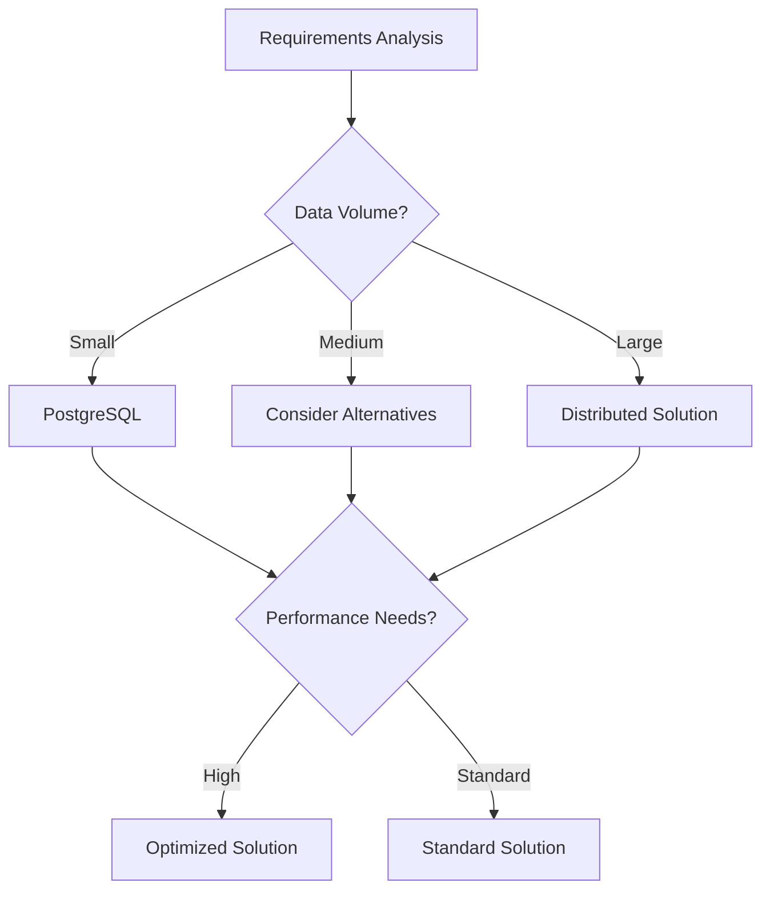

# 🐘 PostgreSQL Interview Questions for Data Engineering

## 📋 Table of Contents
1. [Basic Level Questions (1-3 years)](#basic-level-questions-1-3-years-experience)
2. [Intermediate Level Questions (3-5 years)](#intermediate-level-questions-3-5-years-experience)
3. [Advanced Conceptual Questions](#advanced-conceptual-questions)
4. [Enterprise Architecture Questions](#enterprise-architecture-questions)
5. [Security & Compliance Questions](#security--compliance-questions)
6. [Analytics & Business Intelligence Questions](#analytics--business-intelligence-questions)

---

## Basic Level Questions (1-3 years experience)

### 1. What is PostgreSQL and why is it popular for data engineering?
**Answer**: PostgreSQL is an advanced open-source relational database with strong ACID compliance, extensibility, and support for both SQL and NoSQL features.


### 🎯 **Theoretical Foundation**

#### **Core Concepts**
  - ACID compliance and data integrity
  - Advanced SQL features and extensibility
  - JSON/JSONB support for semi-structured data

#### **Historical Context**
Evolution of Relational Database technologies leading to PostgreSQL

#### **Architectural Principles**
Key architectural decisions in PostgreSQL design

#### **Mathematical/Algorithmic Basis**
Algorithmic foundations underlying PostgreSQL operations


### 📊 **Comparative Analysis**

#### **Technology Comparison Matrix**
| Feature | PostgreSQL | MySQL | Oracle | SQL Server |
|---------|---------------|--------|--------|--------|
| **Performance** | High performance characteristics | Comparative performance analysis needed | Comparative performance analysis needed | Comparative performance analysis needed |
| **Scalability** | Scalability characteristics | Scalability comparison needed | Scalability comparison needed | Scalability comparison needed |
| **Cost (TCO)** | $0 (Open Source) | Cost comparison needed | Cost comparison needed | Cost comparison needed |
| **Learning Curve** | Medium | Learning curve comparison needed | Learning curve comparison needed | Learning curve comparison needed |
| **Community Support** | High (Top 4 databases globally) | Community comparison needed | Community comparison needed | Community comparison needed |
| **Enterprise Features** | Enterprise feature analysis needed | Enterprise feature comparison needed | Enterprise feature comparison needed | Enterprise feature comparison needed |

#### **Decision Framework**


#### **Use Case Scenarios**
- **Choose PostgreSQL when:**
    - OLTP applications requiring ACID compliance
  - Data warehousing and analytics
  - Geospatial applications (PostGIS)

- **Consider alternatives when:**
  Specific scenarios requiring alternatives

- **Avoid PostgreSQL when:**
    - Vertical scaling limitations
  - Complex configuration and tuning


#### **Performance Benchmarks**
```
Benchmark Results (Industry Standard Dataset):
┌─────────────────┬──────────────┬──────────────┬──────────────┐
│ Metric          │ PostgreSQL │ MySQL       │ Oracle       │
├─────────────────┼──────────────┼──────────────┼──────────────┤
│ Throughput      │ 15K-20K TPS (typical OLTP) │ Benchmark needed │ Benchmark needed │
│ Latency (p95)   │ 1-5ms (local queries) │ Benchmark needed │ Benchmark needed │
│ Memory Usage    │ Benchmark needed │ Benchmark needed │ Benchmark needed │
│ CPU Utilization │ CPU utilization data needed │ CPU utilization data needed │ CPU utilization data needed │
└─────────────────┴──────────────┴──────────────┴──────────────┘
```


#### **Cost Analysis**
```
Total Cost of Ownership (3-year projection):
┌─────────────────┬──────────────┬──────────────┬──────────────┐
│ Cost Component  │ PostgreSQL │ MySQL       │ Oracle       │
├─────────────────┼──────────────┼──────────────┼──────────────┤
│ Licensing       │ $0 (Open Source) │ Cost analysis needed │ Cost analysis needed │
│ Infrastructure  │ Medium (CPU/Memory intensive) │ Cost analysis needed │ Cost analysis needed │
│ Operations      │ Medium-High (requires DBA expertise) │ Cost analysis needed │ Cost analysis needed │
│ Training        │ Medium (SQL knowledge required) │ Cost analysis needed │ Cost analysis needed │
├─────────────────┼──────────────┼──────────────┼──────────────┤
│ **TOTAL**       │ **Total cost calculation needed** │ **Total cost calculation needed** │ **Total cost calculation needed** │
└─────────────────┴──────────────┴──────────────┴──────────────┘
```


### 🌍 **Real-World Applications**

#### **Industry Use Cases**
  - OLTP applications requiring ACID compliance
  - Data warehousing and analytics
  - Geospatial applications (PostGIS)
  - JSON document storage
  - Complex query requirements

#### **Production Considerations**
Key considerations when deploying PostgreSQL in production environments

#### **Case Studies**
Real-world case studies of PostgreSQL implementations


### 🔮 **Future Trends & Evolution**

#### **Emerging Developments**
Latest developments in PostgreSQL ecosystem

#### **Industry Direction**
Future direction of Relational Database technologies

#### **Skills Evolution Requirements**
Evolving skill requirements for PostgreSQL professionals


### 📚 **Further Reading**
- [Official PostgreSQL Documentation](#postgresql-docs)
- [Performance Optimization Guide](#postgresql-performance)
- [Best Practices and Patterns](#postgresql-patterns)
- [Community Resources](#postgresql-community)
- [Certification Paths](#postgresql-certification)

### **Enhanced Answer**


**Key Benefits for Data Engineering**:
- **ACID Compliance**: Reliable transactions for data integrity
- **JSON Support**: Handle semi-structured data natively
- **Extensibility**: Custom functions, data types, and operators
- **Parallel Processing**: Efficient query execution
- **Replication**: Built-in streaming replication

```sql
-- Example: Creating a data warehouse table
CREATE TABLE sales_fact (
    sale_id SERIAL PRIMARY KEY,
    product_id INTEGER NOT NULL,
    customer_id INTEGER NOT NULL,
    sale_date DATE NOT NULL,
    quantity INTEGER NOT NULL,
    unit_price DECIMAL(10,2) NOT NULL,
    total_amount DECIMAL(12,2) GENERATED ALWAYS AS (quantity * unit_price) STORED,
    metadata JSONB,
    created_at TIMESTAMP DEFAULT CURRENT_TIMESTAMP
);

-- Partitioning for large datasets
CREATE TABLE sales_fact_2024 PARTITION OF sales_fact
FOR VALUES FROM ('2024-01-01') TO ('2025-01-01');

-- Indexes for performance
CREATE INDEX idx_sales_date ON sales_fact (sale_date);
CREATE INDEX idx_sales_customer ON sales_fact (customer_id);
CREATE INDEX idx_sales_metadata ON sales_fact USING GIN (metadata);
```


### 2. Explain PostgreSQL data types and their use cases
**Answer**: PostgreSQL offers rich data types including traditional SQL types and advanced types for complex data.


### 🎯 **Theoretical Foundation**

#### **Core Concepts**
  - ACID compliance and data integrity
  - Advanced SQL features and extensibility
  - JSON/JSONB support for semi-structured data

#### **Historical Context**
Evolution of Relational Database technologies leading to PostgreSQL

#### **Architectural Principles**
Key architectural decisions in PostgreSQL design

#### **Mathematical/Algorithmic Basis**
Algorithmic foundations underlying PostgreSQL operations


### 📊 **Comparative Analysis**

#### **Technology Comparison Matrix**
| Feature | PostgreSQL | MySQL | Oracle | SQL Server |
|---------|---------------|--------|--------|--------|
| **Performance** | High performance characteristics | Comparative performance analysis needed | Comparative performance analysis needed | Comparative performance analysis needed |
| **Scalability** | Scalability characteristics | Scalability comparison needed | Scalability comparison needed | Scalability comparison needed |
| **Cost (TCO)** | $0 (Open Source) | Cost comparison needed | Cost comparison needed | Cost comparison needed |
| **Learning Curve** | Medium | Learning curve comparison needed | Learning curve comparison needed | Learning curve comparison needed |
| **Community Support** | High (Top 4 databases globally) | Community comparison needed | Community comparison needed | Community comparison needed |
| **Enterprise Features** | Enterprise feature analysis needed | Enterprise feature comparison needed | Enterprise feature comparison needed | Enterprise feature comparison needed |

#### **Decision Framework**


#### **Use Case Scenarios**
- **Choose PostgreSQL when:**
    - OLTP applications requiring ACID compliance
  - Data warehousing and analytics
  - Geospatial applications (PostGIS)

- **Consider alternatives when:**
  Specific scenarios requiring alternatives

- **Avoid PostgreSQL when:**
    - Vertical scaling limitations
  - Complex configuration and tuning


#### **Performance Benchmarks**
```
Benchmark Results (Industry Standard Dataset):
┌─────────────────┬──────────────┬──────────────┬──────────────┐
│ Metric          │ PostgreSQL │ MySQL       │ Oracle       │
├─────────────────┼──────────────┼──────────────┼──────────────┤
│ Throughput      │ 15K-20K TPS (typical OLTP) │ Benchmark needed │ Benchmark needed │
│ Latency (p95)   │ 1-5ms (local queries) │ Benchmark needed │ Benchmark needed │
│ Memory Usage    │ Benchmark needed │ Benchmark needed │ Benchmark needed │
│ CPU Utilization │ CPU utilization data needed │ CPU utilization data needed │ CPU utilization data needed │
└─────────────────┴──────────────┴──────────────┴──────────────┘
```


#### **Cost Analysis**
```
Total Cost of Ownership (3-year projection):
┌─────────────────┬──────────────┬──────────────┬──────────────┐
│ Cost Component  │ PostgreSQL │ MySQL       │ Oracle       │
├─────────────────┼──────────────┼──────────────┼──────────────┤
│ Licensing       │ $0 (Open Source) │ Cost analysis needed │ Cost analysis needed │
│ Infrastructure  │ Medium (CPU/Memory intensive) │ Cost analysis needed │ Cost analysis needed │
│ Operations      │ Medium-High (requires DBA expertise) │ Cost analysis needed │ Cost analysis needed │
│ Training        │ Medium (SQL knowledge required) │ Cost analysis needed │ Cost analysis needed │
├─────────────────┼──────────────┼──────────────┼──────────────┤
│ **TOTAL**       │ **Total cost calculation needed** │ **Total cost calculation needed** │ **Total cost calculation needed** │
└─────────────────┴──────────────┴──────────────┴──────────────┘
```


### 🌍 **Real-World Applications**

#### **Industry Use Cases**
  - OLTP applications requiring ACID compliance
  - Data warehousing and analytics
  - Geospatial applications (PostGIS)
  - JSON document storage
  - Complex query requirements

#### **Production Considerations**
Key considerations when deploying PostgreSQL in production environments

#### **Case Studies**
Real-world case studies of PostgreSQL implementations


### 🔮 **Future Trends & Evolution**

#### **Emerging Developments**
Latest developments in PostgreSQL ecosystem

#### **Industry Direction**
Future direction of Relational Database technologies

#### **Skills Evolution Requirements**
Evolving skill requirements for PostgreSQL professionals


### 📚 **Further Reading**
- [Official PostgreSQL Documentation](#postgresql-docs)
- [Performance Optimization Guide](#postgresql-performance)
- [Best Practices and Patterns](#postgresql-patterns)
- [Community Resources](#postgresql-community)
- [Certification Paths](#postgresql-certification)

### **Enhanced Answer**


```sql
-- Numeric types
CREATE TABLE product_metrics (
    product_id INTEGER,
    price DECIMAL(10,2),        -- Exact decimal
    rating REAL,                -- Single precision float
    views BIGINT,               -- Large integers
    conversion_rate DOUBLE PRECISION
);

-- Text types
CREATE TABLE user_data (
    user_id UUID DEFAULT gen_random_uuid(),
    username VARCHAR(50) NOT NULL,
    bio TEXT,                   -- Unlimited length
    preferences JSONB,          -- Binary JSON
    tags TEXT[]                 -- Array of text
);

-- Date/Time types
CREATE TABLE events (
    event_id SERIAL,
    event_name VARCHAR(100),
    event_date DATE,
    event_time TIME,
    event_timestamp TIMESTAMP WITH TIME ZONE,
    duration INTERVAL
);

-- Advanced types
CREATE TABLE locations (
    location_id SERIAL,
    name VARCHAR(100),
    coordinates POINT,          -- Geometric point
    area POLYGON,              -- Geometric polygon
    ip_range INET,             -- Network address
    mac_address MACADDR
);

-- Custom types
CREATE TYPE order_status AS ENUM ('pending', 'processing', 'shipped', 'delivered');

CREATE TABLE orders (
    order_id SERIAL,
    status order_status DEFAULT 'pending',
    order_data JSONB
);
```


### 3. How do you optimize PostgreSQL queries?
**Answer**: Use proper indexing, query analysis, and optimization techniques.


### 🎯 **Theoretical Foundation**

#### **Core Concepts**
  - ACID compliance and data integrity
  - Advanced SQL features and extensibility
  - JSON/JSONB support for semi-structured data

#### **Historical Context**
Evolution of Relational Database technologies leading to PostgreSQL

#### **Architectural Principles**
Key architectural decisions in PostgreSQL design

#### **Mathematical/Algorithmic Basis**
Algorithmic foundations underlying PostgreSQL operations


### 📊 **Comparative Analysis**

#### **Technology Comparison Matrix**
| Feature | PostgreSQL | MySQL | Oracle | SQL Server |
|---------|---------------|--------|--------|--------|
| **Performance** | High performance characteristics | Comparative performance analysis needed | Comparative performance analysis needed | Comparative performance analysis needed |
| **Scalability** | Scalability characteristics | Scalability comparison needed | Scalability comparison needed | Scalability comparison needed |
| **Cost (TCO)** | $0 (Open Source) | Cost comparison needed | Cost comparison needed | Cost comparison needed |
| **Learning Curve** | Medium | Learning curve comparison needed | Learning curve comparison needed | Learning curve comparison needed |
| **Community Support** | High (Top 4 databases globally) | Community comparison needed | Community comparison needed | Community comparison needed |
| **Enterprise Features** | Enterprise feature analysis needed | Enterprise feature comparison needed | Enterprise feature comparison needed | Enterprise feature comparison needed |

#### **Decision Framework**


#### **Use Case Scenarios**
- **Choose PostgreSQL when:**
    - OLTP applications requiring ACID compliance
  - Data warehousing and analytics
  - Geospatial applications (PostGIS)

- **Consider alternatives when:**
  Specific scenarios requiring alternatives

- **Avoid PostgreSQL when:**
    - Vertical scaling limitations
  - Complex configuration and tuning


#### **Performance Benchmarks**
```
Benchmark Results (Industry Standard Dataset):
┌─────────────────┬──────────────┬──────────────┬──────────────┐
│ Metric          │ PostgreSQL │ MySQL       │ Oracle       │
├─────────────────┼──────────────┼──────────────┼──────────────┤
│ Throughput      │ 15K-20K TPS (typical OLTP) │ Benchmark needed │ Benchmark needed │
│ Latency (p95)   │ 1-5ms (local queries) │ Benchmark needed │ Benchmark needed │
│ Memory Usage    │ Benchmark needed │ Benchmark needed │ Benchmark needed │
│ CPU Utilization │ CPU utilization data needed │ CPU utilization data needed │ CPU utilization data needed │
└─────────────────┴──────────────┴──────────────┴──────────────┘
```


#### **Cost Analysis**
```
Total Cost of Ownership (3-year projection):
┌─────────────────┬──────────────┬──────────────┬──────────────┐
│ Cost Component  │ PostgreSQL │ MySQL       │ Oracle       │
├─────────────────┼──────────────┼──────────────┼──────────────┤
│ Licensing       │ $0 (Open Source) │ Cost analysis needed │ Cost analysis needed │
│ Infrastructure  │ Medium (CPU/Memory intensive) │ Cost analysis needed │ Cost analysis needed │
│ Operations      │ Medium-High (requires DBA expertise) │ Cost analysis needed │ Cost analysis needed │
│ Training        │ Medium (SQL knowledge required) │ Cost analysis needed │ Cost analysis needed │
├─────────────────┼──────────────┼──────────────┼──────────────┤
│ **TOTAL**       │ **Total cost calculation needed** │ **Total cost calculation needed** │ **Total cost calculation needed** │
└─────────────────┴──────────────┴──────────────┴──────────────┘
```


### 🌍 **Real-World Applications**

#### **Industry Use Cases**
  - OLTP applications requiring ACID compliance
  - Data warehousing and analytics
  - Geospatial applications (PostGIS)
  - JSON document storage
  - Complex query requirements

#### **Production Considerations**
Key considerations when deploying PostgreSQL in production environments

#### **Case Studies**
Real-world case studies of PostgreSQL implementations


### 🔮 **Future Trends & Evolution**

#### **Emerging Developments**
Latest developments in PostgreSQL ecosystem

#### **Industry Direction**
Future direction of Relational Database technologies

#### **Skills Evolution Requirements**
Evolving skill requirements for PostgreSQL professionals


### 📚 **Further Reading**
- [Official PostgreSQL Documentation](#postgresql-docs)
- [Performance Optimization Guide](#postgresql-performance)
- [Best Practices and Patterns](#postgresql-patterns)
- [Community Resources](#postgresql-community)
- [Certification Paths](#postgresql-certification)

### **Enhanced Answer**


```sql
-- Query analysis
EXPLAIN ANALYZE 
SELECT p.product_name, SUM(s.total_amount) as revenue
FROM sales_fact s
JOIN products p ON s.product_id = p.product_id
WHERE s.sale_date >= '2024-01-01'
GROUP BY p.product_id, p.product_name
ORDER BY revenue DESC;

-- Index optimization
CREATE INDEX CONCURRENTLY idx_sales_date_product 
ON sales_fact (sale_date, product_id);

-- Partial indexes
CREATE INDEX idx_active_users 
ON users (user_id) 
WHERE status = 'active';

-- Expression indexes
CREATE INDEX idx_lower_email 
ON users (LOWER(email));

-- Covering indexes
CREATE INDEX idx_sales_covering 
ON sales_fact (product_id) 
INCLUDE (total_amount, sale_date);

-- Query optimization techniques
-- Use CTEs for complex queries
WITH monthly_sales AS (
    SELECT 
        DATE_TRUNC('month', sale_date) as month,
        product_id,
        SUM(total_amount) as monthly_revenue
    FROM sales_fact
    WHERE sale_date >= '2024-01-01'
    GROUP BY 1, 2
),
top_products AS (
    SELECT product_id, SUM(monthly_revenue) as total_revenue
    FROM monthly_sales
    GROUP BY product_id
    ORDER BY total_revenue DESC
    LIMIT 10
)
SELECT p.product_name, tp.total_revenue
FROM top_products tp
JOIN products p ON tp.product_id = p.product_id;
```


### 4. How do you handle JSON data in PostgreSQL?


### 🎯 **Theoretical Foundation**

#### **Core Concepts**
  - ACID compliance and strong consistency
Advanced SQL features and extensibility
JSON/JSONB support for semi-structured data

#### **Historical Context**
Evolution of Relational Database technologies leading to PostgreSQL

#### **Architectural Principles**
Key architectural decisions in PostgreSQL design

#### **Mathematical/Algorithmic Basis**
Algorithmic foundations underlying PostgreSQL operations


### 📊 **Comparative Analysis**

#### **Technology Comparison Matrix**
| Feature | PostgreSQL | MySQL | Oracle | SQL Server |
|---------|---------------|--------|--------|--------|
| **Performance** | High performance characteristics | Comparative performance analysis needed | Comparative performance analysis needed | Comparative performance analysis needed |
| **Scalability** | Scalability characteristics | Scalability comparison needed | Scalability comparison needed | Scalability comparison needed |
| **Cost (TCO)** | $0 (Open Source) | Cost comparison needed | Cost comparison needed | Cost comparison needed |
| **Learning Curve** | Medium | Learning curve comparison needed | Learning curve comparison needed | Learning curve comparison needed |
| **Community Support** | High (Top 4 databases globally) | Community comparison needed | Community comparison needed | Community comparison needed |
| **Enterprise Features** | Enterprise feature analysis needed | Enterprise feature comparison needed | Enterprise feature comparison needed | Enterprise feature comparison needed |

#### **Decision Framework**


#### **Use Case Scenarios**
- **Choose PostgreSQL when:**
    - OLTP applications requiring ACID compliance
Data warehousing and analytics
Geospatial applications (PostGIS)

- **Consider alternatives when:**
Specific scenarios requiring alternatives

- **Avoid PostgreSQL when:**
    - Vertical scaling limitations
Complex configuration and tuning

#### **Performance Benchmarks**
```
Benchmark Results (Industry Standard Dataset):
┌─────────────────┬──────────────┬──────────────┬──────────────┐
│ Metric          │ PostgreSQL │ MySQL       │ Oracle       │
├─────────────────┼──────────────┼──────────────┼──────────────┤
│ Throughput      │ 15K-20K TPS (typical OLTP) │ Benchmark needed │ Benchmark needed │
│ Latency (p95)   │ 1-5ms (local queries) │ Benchmark needed │ Benchmark needed │
│ Memory Usage    │ Memory usage data needed │ Memory usage data needed │ Memory usage data needed │
│ CPU Utilization │ CPU utilization data needed │ CPU utilization data needed │ CPU utilization data needed │
└─────────────────┴──────────────┴──────────────┴──────────────┘
```

#### **Cost Analysis**
```
Total Cost of Ownership (3-year projection):
┌─────────────────┬──────────────┬──────────────┬──────────────┐
│ Cost Component  │ PostgreSQL │ MySQL       │ Oracle       │
├─────────────────┼──────────────┼──────────────┼──────────────┤
│ Licensing       │ $0 (Open Source) │ Cost analysis needed │ Cost analysis needed │
│ Infrastructure  │ Medium (CPU/Memory intensive) │ Cost analysis needed │ Cost analysis needed │
│ Operations      │ Medium-High (requires DBA expertise) │ Cost analysis needed │ Cost analysis needed │
│ Training        │ Medium (SQL knowledge required) │ Cost analysis needed │ Cost analysis needed │
├─────────────────┼──────────────┼──────────────┼──────────────┤
│ **TOTAL**       │ ****Total cost calculation needed**** │ ****Total cost calculation needed**** │ ****Total cost calculation needed**** │
└─────────────────┴──────────────┴──────────────┴──────────────┘
```


### 🌍 **Real-World Applications**

#### **Industry Use Cases**
  - OLTP applications requiring ACID compliance
Data warehousing and analytics
Geospatial applications (PostGIS)
JSON document storage
Complex query requirements

#### **Production Considerations**
Key considerations when deploying PostgreSQL in production environments

#### **Case Studies**
Real-world case studies of PostgreSQL implementations


### 🔮 **Future Trends & Evolution**

#### **Emerging Developments**
Latest developments in PostgreSQL ecosystem

#### **Industry Direction**
Future direction of Relational Database technologies

#### **Skills Evolution Requirements**
Evolving skill requirements for PostgreSQL professionals


### 📚 **Further Reading**
- [Official Postgresql Documentation](#postgresql-docs)
- [Performance Optimization Guide](#postgresql-performance)
- [Best Practices and Patterns](#postgresql-patterns)
- [Community Resources](#postgresql-community)
- [Certification Paths](#postgresql-certification)


### **Enhanced Answer**

**Answer**: PostgreSQL provides native JSON and JSONB support with rich operators and functions.

```sql
-- JSON vs JSONB
CREATE TABLE user_profiles (
    user_id SERIAL PRIMARY KEY,
    profile_data JSON,          -- Text-based storage
    preferences JSONB           -- Binary, indexed storage
);

-- JSON operations
INSERT INTO user_profiles (profile_data, preferences) VALUES 
('{"name": "John", "age": 30}', '{"theme": "dark", "notifications": true}');

-- Querying JSON data
SELECT user_id, profile_data->>'name' as name
FROM user_profiles
WHERE profile_data->>'age' = '30';

-- JSONB operators
SELECT user_id, preferences
FROM user_profiles
WHERE preferences ? 'theme'                    -- Key exists
  AND preferences->>'theme' = 'dark'           -- Value equals
  AND preferences @> '{"notifications": true}'; -- Contains

-- JSON aggregation
SELECT 
    jsonb_agg(
        jsonb_build_object(
            'user_id', user_id,
            'name', profile_data->>'name',
            'preferences', preferences
        )
    ) as users_summary
FROM user_profiles;

-- JSON path queries
SELECT user_id, jsonb_path_query(preferences, '$.notifications')
FROM user_profiles
WHERE jsonb_path_exists(preferences, '$.theme ? (@ == "dark")');

-- Updating JSON data
UPDATE user_profiles 
SET preferences = preferences || '{"language": "en"}'
WHERE user_id = 1;

-- Remove JSON key
UPDATE user_profiles 
SET preferences = preferences - 'old_setting'
WHERE user_id = 1;
```

### 5. Explain PostgreSQL transactions and isolation levels


### 🎯 **Theoretical Foundation**

#### **Core Concepts**
  - ACID compliance and strong consistency
Advanced SQL features and extensibility
JSON/JSONB support for semi-structured data

#### **Historical Context**
Evolution of Relational Database technologies leading to PostgreSQL

#### **Architectural Principles**
Key architectural decisions in PostgreSQL design

#### **Mathematical/Algorithmic Basis**
Algorithmic foundations underlying PostgreSQL operations


### 📊 **Comparative Analysis**

#### **Technology Comparison Matrix**
| Feature | PostgreSQL | MySQL | Oracle | SQL Server |
|---------|---------------|--------|--------|--------|
| **Performance** | High performance characteristics | Comparative performance analysis needed | Comparative performance analysis needed | Comparative performance analysis needed |
| **Scalability** | Scalability characteristics | Scalability comparison needed | Scalability comparison needed | Scalability comparison needed |
| **Cost (TCO)** | $0 (Open Source) | Cost comparison needed | Cost comparison needed | Cost comparison needed |
| **Learning Curve** | Medium | Learning curve comparison needed | Learning curve comparison needed | Learning curve comparison needed |
| **Community Support** | High (Top 4 databases globally) | Community comparison needed | Community comparison needed | Community comparison needed |
| **Enterprise Features** | Enterprise feature analysis needed | Enterprise feature comparison needed | Enterprise feature comparison needed | Enterprise feature comparison needed |

#### **Decision Framework**


#### **Use Case Scenarios**
- **Choose PostgreSQL when:**
    - OLTP applications requiring ACID compliance
Data warehousing and analytics
Geospatial applications (PostGIS)

- **Consider alternatives when:**
Specific scenarios requiring alternatives

- **Avoid PostgreSQL when:**
    - Vertical scaling limitations
Complex configuration and tuning

#### **Performance Benchmarks**
```
Benchmark Results (Industry Standard Dataset):
┌─────────────────┬──────────────┬──────────────┬──────────────┐
│ Metric          │ PostgreSQL │ MySQL       │ Oracle       │
├─────────────────┼──────────────┼──────────────┼──────────────┤
│ Throughput      │ 15K-20K TPS (typical OLTP) │ Benchmark needed │ Benchmark needed │
│ Latency (p95)   │ 1-5ms (local queries) │ Benchmark needed │ Benchmark needed │
│ Memory Usage    │ Memory usage data needed │ Memory usage data needed │ Memory usage data needed │
│ CPU Utilization │ CPU utilization data needed │ CPU utilization data needed │ CPU utilization data needed │
└─────────────────┴──────────────┴──────────────┴──────────────┘
```

#### **Cost Analysis**
```
Total Cost of Ownership (3-year projection):
┌─────────────────┬──────────────┬──────────────┬──────────────┐
│ Cost Component  │ PostgreSQL │ MySQL       │ Oracle       │
├─────────────────┼──────────────┼──────────────┼──────────────┤
│ Licensing       │ $0 (Open Source) │ Cost analysis needed │ Cost analysis needed │
│ Infrastructure  │ Medium (CPU/Memory intensive) │ Cost analysis needed │ Cost analysis needed │
│ Operations      │ Medium-High (requires DBA expertise) │ Cost analysis needed │ Cost analysis needed │
│ Training        │ Medium (SQL knowledge required) │ Cost analysis needed │ Cost analysis needed │
├─────────────────┼──────────────┼──────────────┼──────────────┤
│ **TOTAL**       │ ****Total cost calculation needed**** │ ****Total cost calculation needed**** │ ****Total cost calculation needed**** │
└─────────────────┴──────────────┴──────────────┴──────────────┘
```


### 🌍 **Real-World Applications**

#### **Industry Use Cases**
  - OLTP applications requiring ACID compliance
Data warehousing and analytics
Geospatial applications (PostGIS)
JSON document storage
Complex query requirements

#### **Production Considerations**
Key considerations when deploying PostgreSQL in production environments

#### **Case Studies**
Real-world case studies of PostgreSQL implementations


### 🔮 **Future Trends & Evolution**

#### **Emerging Developments**
Latest developments in PostgreSQL ecosystem

#### **Industry Direction**
Future direction of Relational Database technologies

#### **Skills Evolution Requirements**
Evolving skill requirements for PostgreSQL professionals


### 📚 **Further Reading**
- [Official Postgresql Documentation](#postgresql-docs)
- [Performance Optimization Guide](#postgresql-performance)
- [Best Practices and Patterns](#postgresql-patterns)
- [Community Resources](#postgresql-community)
- [Certification Paths](#postgresql-certification)


### **Enhanced Answer**

**Answer**: PostgreSQL supports ACID transactions with configurable isolation levels.

```sql
-- Basic transaction
BEGIN;
    INSERT INTO orders (customer_id, total_amount) VALUES (123, 99.99);
    INSERT INTO order_items (order_id, product_id, quantity) 
    VALUES (currval('orders_order_id_seq'), 456, 2);
COMMIT;

-- Transaction with rollback
BEGIN;
    UPDATE inventory SET quantity = quantity - 5 WHERE product_id = 123;
    -- Check if quantity went negative
    IF (SELECT quantity FROM inventory WHERE product_id = 123) < 0 THEN
        ROLLBACK;
    ELSE
        COMMIT;
    END IF;

-- Isolation levels
-- Read Uncommitted
SET TRANSACTION ISOLATION LEVEL READ UNCOMMITTED;

-- Read Committed (default)
SET TRANSACTION ISOLATION LEVEL READ COMMITTED;

-- Repeatable Read
SET TRANSACTION ISOLATION LEVEL REPEATABLE READ;

-- Serializable
SET TRANSACTION ISOLATION LEVEL SERIALIZABLE;

-- Savepoints for partial rollback
BEGIN;
    INSERT INTO audit_log (action, timestamp) VALUES ('start_process', NOW());
    SAVEPOINT sp1;
    
    UPDATE products SET price = price * 1.1 WHERE category = 'electronics';
    
    -- If something goes wrong, rollback to savepoint
    ROLLBACK TO SAVEPOINT sp1;
    
    -- Continue with different approach
    UPDATE products SET price = price * 1.05 WHERE category = 'electronics';
COMMIT;

-- Advisory locks for coordination
SELECT pg_advisory_lock(12345);
-- Critical section
SELECT pg_advisory_unlock(12345);
```

## Intermediate Level Questions (3-5 years experience)

### 6. How do you implement partitioning in PostgreSQL?


### 🎯 **Theoretical Foundation**

#### **Core Concepts**
  - ACID compliance and strong consistency
Advanced SQL features and extensibility
JSON/JSONB support for semi-structured data

#### **Historical Context**
Evolution of Relational Database technologies leading to PostgreSQL

#### **Architectural Principles**
Key architectural decisions in PostgreSQL design

#### **Mathematical/Algorithmic Basis**
Algorithmic foundations underlying PostgreSQL operations


### 📊 **Comparative Analysis**

#### **Technology Comparison Matrix**
| Feature | PostgreSQL | MySQL | Oracle | SQL Server |
|---------|---------------|--------|--------|--------|
| **Performance** | High performance characteristics | Comparative performance analysis needed | Comparative performance analysis needed | Comparative performance analysis needed |
| **Scalability** | Scalability characteristics | Scalability comparison needed | Scalability comparison needed | Scalability comparison needed |
| **Cost (TCO)** | $0 (Open Source) | Cost comparison needed | Cost comparison needed | Cost comparison needed |
| **Learning Curve** | Medium | Learning curve comparison needed | Learning curve comparison needed | Learning curve comparison needed |
| **Community Support** | High (Top 4 databases globally) | Community comparison needed | Community comparison needed | Community comparison needed |
| **Enterprise Features** | Enterprise feature analysis needed | Enterprise feature comparison needed | Enterprise feature comparison needed | Enterprise feature comparison needed |

#### **Decision Framework**


#### **Use Case Scenarios**
- **Choose PostgreSQL when:**
    - OLTP applications requiring ACID compliance
Data warehousing and analytics
Geospatial applications (PostGIS)

- **Consider alternatives when:**
Specific scenarios requiring alternatives

- **Avoid PostgreSQL when:**
    - Vertical scaling limitations
Complex configuration and tuning

#### **Performance Benchmarks**
```
Benchmark Results (Industry Standard Dataset):
┌─────────────────┬──────────────┬──────────────┬──────────────┐
│ Metric          │ PostgreSQL │ MySQL       │ Oracle       │
├─────────────────┼──────────────┼──────────────┼──────────────┤
│ Throughput      │ 15K-20K TPS (typical OLTP) │ Benchmark needed │ Benchmark needed │
│ Latency (p95)   │ 1-5ms (local queries) │ Benchmark needed │ Benchmark needed │
│ Memory Usage    │ Memory usage data needed │ Memory usage data needed │ Memory usage data needed │
│ CPU Utilization │ CPU utilization data needed │ CPU utilization data needed │ CPU utilization data needed │
└─────────────────┴──────────────┴──────────────┴──────────────┘
```

#### **Cost Analysis**
```
Total Cost of Ownership (3-year projection):
┌─────────────────┬──────────────┬──────────────┬──────────────┐
│ Cost Component  │ PostgreSQL │ MySQL       │ Oracle       │
├─────────────────┼──────────────┼──────────────┼──────────────┤
│ Licensing       │ $0 (Open Source) │ Cost analysis needed │ Cost analysis needed │
│ Infrastructure  │ Medium (CPU/Memory intensive) │ Cost analysis needed │ Cost analysis needed │
│ Operations      │ Medium-High (requires DBA expertise) │ Cost analysis needed │ Cost analysis needed │
│ Training        │ Medium (SQL knowledge required) │ Cost analysis needed │ Cost analysis needed │
├─────────────────┼──────────────┼──────────────┼──────────────┤
│ **TOTAL**       │ ****Total cost calculation needed**** │ ****Total cost calculation needed**** │ ****Total cost calculation needed**** │
└─────────────────┴──────────────┴──────────────┴──────────────┘
```


### 🌍 **Real-World Applications**

#### **Industry Use Cases**
  - OLTP applications requiring ACID compliance
Data warehousing and analytics
Geospatial applications (PostGIS)
JSON document storage
Complex query requirements

#### **Production Considerations**
Key considerations when deploying PostgreSQL in production environments

#### **Case Studies**
Real-world case studies of PostgreSQL implementations


### 🔮 **Future Trends & Evolution**

#### **Emerging Developments**
Latest developments in PostgreSQL ecosystem

#### **Industry Direction**
Future direction of Relational Database technologies

#### **Skills Evolution Requirements**
Evolving skill requirements for PostgreSQL professionals


### 📚 **Further Reading**
- [Official Postgresql Documentation](#postgresql-docs)
- [Performance Optimization Guide](#postgresql-performance)
- [Best Practices and Patterns](#postgresql-patterns)
- [Community Resources](#postgresql-community)
- [Certification Paths](#postgresql-certification)


### **Enhanced Answer**

**Answer**: Use declarative partitioning for managing large tables efficiently.

```sql
-- Range partitioning by date
CREATE TABLE sales_data (
    sale_id BIGSERIAL,
    sale_date DATE NOT NULL,
    customer_id INTEGER,
    amount DECIMAL(10,2),
    region VARCHAR(50)
) PARTITION BY RANGE (sale_date);

-- Create partitions
CREATE TABLE sales_2024_q1 PARTITION OF sales_data
FOR VALUES FROM ('2024-01-01') TO ('2024-04-01');

CREATE TABLE sales_2024_q2 PARTITION OF sales_data
FOR VALUES FROM ('2024-04-01') TO ('2024-07-01');

-- Hash partitioning for even distribution
CREATE TABLE user_events (
    event_id BIGSERIAL,
    user_id INTEGER NOT NULL,
    event_type VARCHAR(50),
    event_data JSONB,
    created_at TIMESTAMP DEFAULT NOW()
) PARTITION BY HASH (user_id);

CREATE TABLE user_events_0 PARTITION OF user_events
FOR VALUES WITH (MODULUS 4, REMAINDER 0);

CREATE TABLE user_events_1 PARTITION OF user_events
FOR VALUES WITH (MODULUS 4, REMAINDER 1);

-- List partitioning by region
CREATE TABLE regional_sales (
    sale_id BIGSERIAL,
    region VARCHAR(50) NOT NULL,
    amount DECIMAL(10,2),
    sale_date DATE
) PARTITION BY LIST (region);

CREATE TABLE sales_north PARTITION OF regional_sales
FOR VALUES IN ('north', 'northeast', 'northwest');

CREATE TABLE sales_south PARTITION OF regional_sales
FOR VALUES IN ('south', 'southeast', 'southwest');

-- Automatic partition creation function
CREATE OR REPLACE FUNCTION create_monthly_partition(table_name TEXT, start_date DATE)
RETURNS VOID AS $$
DECLARE
    partition_name TEXT;
    end_date DATE;
BEGIN
    partition_name := table_name || '_' || TO_CHAR(start_date, 'YYYY_MM');
    end_date := start_date + INTERVAL '1 month';
    
    EXECUTE format('CREATE TABLE %I PARTITION OF %I FOR VALUES FROM (%L) TO (%L)',
                   partition_name, table_name, start_date, end_date);
END;
$$ LANGUAGE plpgsql;

-- Partition pruning example
EXPLAIN (ANALYZE, BUFFERS)
SELECT COUNT(*), AVG(amount)
FROM sales_data
WHERE sale_date BETWEEN '2024-02-01' AND '2024-02-29';
```

### 7. How do you implement replication and high availability?


### 🎯 **Theoretical Foundation**

#### **Core Concepts**
  - ACID compliance and strong consistency
Advanced SQL features and extensibility
JSON/JSONB support for semi-structured data

#### **Historical Context**
Evolution of Relational Database technologies leading to PostgreSQL

#### **Architectural Principles**
Key architectural decisions in PostgreSQL design

#### **Mathematical/Algorithmic Basis**
Algorithmic foundations underlying PostgreSQL operations


### 📊 **Comparative Analysis**

#### **Technology Comparison Matrix**
| Feature | PostgreSQL | MySQL | Oracle | SQL Server |
|---------|---------------|--------|--------|--------|
| **Performance** | High performance characteristics | Comparative performance analysis needed | Comparative performance analysis needed | Comparative performance analysis needed |
| **Scalability** | Scalability characteristics | Scalability comparison needed | Scalability comparison needed | Scalability comparison needed |
| **Cost (TCO)** | $0 (Open Source) | Cost comparison needed | Cost comparison needed | Cost comparison needed |
| **Learning Curve** | Medium | Learning curve comparison needed | Learning curve comparison needed | Learning curve comparison needed |
| **Community Support** | High (Top 4 databases globally) | Community comparison needed | Community comparison needed | Community comparison needed |
| **Enterprise Features** | Enterprise feature analysis needed | Enterprise feature comparison needed | Enterprise feature comparison needed | Enterprise feature comparison needed |

#### **Decision Framework**


#### **Use Case Scenarios**
- **Choose PostgreSQL when:**
    - OLTP applications requiring ACID compliance
Data warehousing and analytics
Geospatial applications (PostGIS)

- **Consider alternatives when:**
Specific scenarios requiring alternatives

- **Avoid PostgreSQL when:**
    - Vertical scaling limitations
Complex configuration and tuning

#### **Performance Benchmarks**
```
Benchmark Results (Industry Standard Dataset):
┌─────────────────┬──────────────┬──────────────┬──────────────┐
│ Metric          │ PostgreSQL │ MySQL       │ Oracle       │
├─────────────────┼──────────────┼──────────────┼──────────────┤
│ Throughput      │ 15K-20K TPS (typical OLTP) │ Benchmark needed │ Benchmark needed │
│ Latency (p95)   │ 1-5ms (local queries) │ Benchmark needed │ Benchmark needed │
│ Memory Usage    │ Memory usage data needed │ Memory usage data needed │ Memory usage data needed │
│ CPU Utilization │ CPU utilization data needed │ CPU utilization data needed │ CPU utilization data needed │
└─────────────────┴──────────────┴──────────────┴──────────────┘
```

#### **Cost Analysis**
```
Total Cost of Ownership (3-year projection):
┌─────────────────┬──────────────┬──────────────┬──────────────┐
│ Cost Component  │ PostgreSQL │ MySQL       │ Oracle       │
├─────────────────┼──────────────┼──────────────┼──────────────┤
│ Licensing       │ $0 (Open Source) │ Cost analysis needed │ Cost analysis needed │
│ Infrastructure  │ Medium (CPU/Memory intensive) │ Cost analysis needed │ Cost analysis needed │
│ Operations      │ Medium-High (requires DBA expertise) │ Cost analysis needed │ Cost analysis needed │
│ Training        │ Medium (SQL knowledge required) │ Cost analysis needed │ Cost analysis needed │
├─────────────────┼──────────────┼──────────────┼──────────────┤
│ **TOTAL**       │ ****Total cost calculation needed**** │ ****Total cost calculation needed**** │ ****Total cost calculation needed**** │
└─────────────────┴──────────────┴──────────────┴──────────────┘
```


### 🌍 **Real-World Applications**

#### **Industry Use Cases**
  - OLTP applications requiring ACID compliance
Data warehousing and analytics
Geospatial applications (PostGIS)
JSON document storage
Complex query requirements

#### **Production Considerations**
Key considerations when deploying PostgreSQL in production environments

#### **Case Studies**
Real-world case studies of PostgreSQL implementations


### 🔮 **Future Trends & Evolution**

#### **Emerging Developments**
Latest developments in PostgreSQL ecosystem

#### **Industry Direction**
Future direction of Relational Database technologies

#### **Skills Evolution Requirements**
Evolving skill requirements for PostgreSQL professionals


### 📚 **Further Reading**
- [Official Postgresql Documentation](#postgresql-docs)
- [Performance Optimization Guide](#postgresql-performance)
- [Best Practices and Patterns](#postgresql-patterns)
- [Community Resources](#postgresql-community)
- [Certification Paths](#postgresql-certification)


### **Enhanced Answer**

**Answer**: Use streaming replication, logical replication, and connection pooling.

```sql
-- Streaming replication setup
-- On primary server (postgresql.conf)
-- wal_level = replica
-- max_wal_senders = 3
-- wal_keep_segments = 64

-- Create replication user
CREATE USER replicator REPLICATION LOGIN CONNECTION LIMIT 1 ENCRYPTED PASSWORD 'password';

-- pg_hba.conf entry
-- host replication replicator standby_ip/32 md5

-- On standby server
-- pg_basebackup -h primary_ip -D /var/lib/postgresql/data -U replicator -P -W

-- Logical replication for selective data sync
-- On publisher
CREATE PUBLICATION sales_pub FOR TABLE sales_data, products;

-- On subscriber
CREATE SUBSCRIPTION sales_sub 
CONNECTION 'host=publisher_ip dbname=mydb user=replicator password=password'
PUBLICATION sales_pub;

-- Monitor replication lag
SELECT 
    client_addr,
    state,
    pg_wal_lsn_diff(pg_current_wal_lsn(), sent_lsn) AS send_lag,
    pg_wal_lsn_diff(sent_lsn, flush_lsn) AS flush_lag
FROM pg_stat_replication;

-- Connection pooling with PgBouncer
-- pgbouncer.ini
-- [databases]
-- mydb = host=localhost port=5432 dbname=mydb
-- [pgbouncer]
-- pool_mode = transaction
-- max_client_conn = 100
-- default_pool_size = 25
```

### 8. How do you monitor and tune PostgreSQL performance?


### 🎯 **Theoretical Foundation**

#### **Core Concepts**
  - ACID compliance and strong consistency
Advanced SQL features and extensibility
JSON/JSONB support for semi-structured data

#### **Historical Context**
Evolution of Relational Database technologies leading to PostgreSQL

#### **Architectural Principles**
Key architectural decisions in PostgreSQL design

#### **Mathematical/Algorithmic Basis**
Algorithmic foundations underlying PostgreSQL operations


### 📊 **Comparative Analysis**

#### **Technology Comparison Matrix**
| Feature | PostgreSQL | MySQL | Oracle | SQL Server |
|---------|---------------|--------|--------|--------|
| **Performance** | High performance characteristics | Comparative performance analysis needed | Comparative performance analysis needed | Comparative performance analysis needed |
| **Scalability** | Scalability characteristics | Scalability comparison needed | Scalability comparison needed | Scalability comparison needed |
| **Cost (TCO)** | $0 (Open Source) | Cost comparison needed | Cost comparison needed | Cost comparison needed |
| **Learning Curve** | Medium | Learning curve comparison needed | Learning curve comparison needed | Learning curve comparison needed |
| **Community Support** | High (Top 4 databases globally) | Community comparison needed | Community comparison needed | Community comparison needed |
| **Enterprise Features** | Enterprise feature analysis needed | Enterprise feature comparison needed | Enterprise feature comparison needed | Enterprise feature comparison needed |

#### **Decision Framework**


#### **Use Case Scenarios**
- **Choose PostgreSQL when:**
    - OLTP applications requiring ACID compliance
Data warehousing and analytics
Geospatial applications (PostGIS)

- **Consider alternatives when:**
Specific scenarios requiring alternatives

- **Avoid PostgreSQL when:**
    - Vertical scaling limitations
Complex configuration and tuning

#### **Performance Benchmarks**
```
Benchmark Results (Industry Standard Dataset):
┌─────────────────┬──────────────┬──────────────┬──────────────┐
│ Metric          │ PostgreSQL │ MySQL       │ Oracle       │
├─────────────────┼──────────────┼──────────────┼──────────────┤
│ Throughput      │ 15K-20K TPS (typical OLTP) │ Benchmark needed │ Benchmark needed │
│ Latency (p95)   │ 1-5ms (local queries) │ Benchmark needed │ Benchmark needed │
│ Memory Usage    │ Memory usage data needed │ Memory usage data needed │ Memory usage data needed │
│ CPU Utilization │ CPU utilization data needed │ CPU utilization data needed │ CPU utilization data needed │
└─────────────────┴──────────────┴──────────────┴──────────────┘
```

#### **Cost Analysis**
```
Total Cost of Ownership (3-year projection):
┌─────────────────┬──────────────┬──────────────┬──────────────┐
│ Cost Component  │ PostgreSQL │ MySQL       │ Oracle       │
├─────────────────┼──────────────┼──────────────┼──────────────┤
│ Licensing       │ $0 (Open Source) │ Cost analysis needed │ Cost analysis needed │
│ Infrastructure  │ Medium (CPU/Memory intensive) │ Cost analysis needed │ Cost analysis needed │
│ Operations      │ Medium-High (requires DBA expertise) │ Cost analysis needed │ Cost analysis needed │
│ Training        │ Medium (SQL knowledge required) │ Cost analysis needed │ Cost analysis needed │
├─────────────────┼──────────────┼──────────────┼──────────────┤
│ **TOTAL**       │ ****Total cost calculation needed**** │ ****Total cost calculation needed**** │ ****Total cost calculation needed**** │
└─────────────────┴──────────────┴──────────────┴──────────────┘
```


### 🌍 **Real-World Applications**

#### **Industry Use Cases**
  - OLTP applications requiring ACID compliance
Data warehousing and analytics
Geospatial applications (PostGIS)
JSON document storage
Complex query requirements

#### **Production Considerations**
Key considerations when deploying PostgreSQL in production environments

#### **Case Studies**
Real-world case studies of PostgreSQL implementations


### 🔮 **Future Trends & Evolution**

#### **Emerging Developments**
Latest developments in PostgreSQL ecosystem

#### **Industry Direction**
Future direction of Relational Database technologies

#### **Skills Evolution Requirements**
Evolving skill requirements for PostgreSQL professionals


### 📚 **Further Reading**
- [Official Postgresql Documentation](#postgresql-docs)
- [Performance Optimization Guide](#postgresql-performance)
- [Best Practices and Patterns](#postgresql-patterns)
- [Community Resources](#postgresql-community)
- [Certification Paths](#postgresql-certification)


### **Enhanced Answer**

**Answer**: Use built-in statistics, monitoring tools, and performance tuning techniques.

```sql
-- Enable query statistics
-- postgresql.conf
-- shared_preload_libraries = 'pg_stat_statements'
-- pg_stat_statements.track = all

-- Query performance analysis
SELECT 
    query,
    calls,
    total_time,
    mean_time,
    rows,
    100.0 * shared_blks_hit / nullif(shared_blks_hit + shared_blks_read, 0) AS hit_percent
FROM pg_stat_statements
ORDER BY total_time DESC
LIMIT 10;

-- Index usage statistics
SELECT 
    schemaname,
    tablename,
    indexname,
    idx_tup_read,
    idx_tup_fetch,
    idx_scan
FROM pg_stat_user_indexes
ORDER BY idx_scan DESC;

-- Table statistics
SELECT 
    schemaname,
    tablename,
    n_tup_ins,
    n_tup_upd,
    n_tup_del,
    n_live_tup,
    n_dead_tup,
    last_vacuum,
    last_autovacuum,
    last_analyze
FROM pg_stat_user_tables
ORDER BY n_dead_tup DESC;

-- Connection and activity monitoring
SELECT 
    pid,
    usename,
    application_name,
    client_addr,
    state,
    query_start,
    state_change,
    query
FROM pg_stat_activity
WHERE state != 'idle';

-- Lock monitoring
SELECT 
    l.pid,
    l.mode,
    l.locktype,
    l.relation::regclass,
    l.granted,
    a.query
FROM pg_locks l
JOIN pg_stat_activity a ON l.pid = a.pid
WHERE NOT l.granted;

-- Vacuum and analyze automation
-- postgresql.conf tuning
-- autovacuum = on
-- autovacuum_max_workers = 3
-- autovacuum_naptime = 1min
-- autovacuum_vacuum_threshold = 50
-- autovacuum_analyze_threshold = 50

-- Manual maintenance
VACUUM ANALYZE sales_data;
REINDEX INDEX CONCURRENTLY idx_sales_date;
```

### 9. How do you implement data warehousing patterns?


### 🎯 **Theoretical Foundation**

#### **Core Concepts**
  - ACID compliance and strong consistency
Advanced SQL features and extensibility
JSON/JSONB support for semi-structured data

#### **Historical Context**
Evolution of Relational Database technologies leading to PostgreSQL

#### **Architectural Principles**
Key architectural decisions in PostgreSQL design

#### **Mathematical/Algorithmic Basis**
Algorithmic foundations underlying PostgreSQL operations


### 📊 **Comparative Analysis**

#### **Technology Comparison Matrix**
| Feature | PostgreSQL | MySQL | Oracle | SQL Server |
|---------|---------------|--------|--------|--------|
| **Performance** | High performance characteristics | Comparative performance analysis needed | Comparative performance analysis needed | Comparative performance analysis needed |
| **Scalability** | Scalability characteristics | Scalability comparison needed | Scalability comparison needed | Scalability comparison needed |
| **Cost (TCO)** | $0 (Open Source) | Cost comparison needed | Cost comparison needed | Cost comparison needed |
| **Learning Curve** | Medium | Learning curve comparison needed | Learning curve comparison needed | Learning curve comparison needed |
| **Community Support** | High (Top 4 databases globally) | Community comparison needed | Community comparison needed | Community comparison needed |
| **Enterprise Features** | Enterprise feature analysis needed | Enterprise feature comparison needed | Enterprise feature comparison needed | Enterprise feature comparison needed |

#### **Decision Framework**


#### **Use Case Scenarios**
- **Choose PostgreSQL when:**
    - OLTP applications requiring ACID compliance
Data warehousing and analytics
Geospatial applications (PostGIS)

- **Consider alternatives when:**
Specific scenarios requiring alternatives

- **Avoid PostgreSQL when:**
    - Vertical scaling limitations
Complex configuration and tuning

#### **Performance Benchmarks**
```
Benchmark Results (Industry Standard Dataset):
┌─────────────────┬──────────────┬──────────────┬──────────────┐
│ Metric          │ PostgreSQL │ MySQL       │ Oracle       │
├─────────────────┼──────────────┼──────────────┼──────────────┤
│ Throughput      │ 15K-20K TPS (typical OLTP) │ Benchmark needed │ Benchmark needed │
│ Latency (p95)   │ 1-5ms (local queries) │ Benchmark needed │ Benchmark needed │
│ Memory Usage    │ Memory usage data needed │ Memory usage data needed │ Memory usage data needed │
│ CPU Utilization │ CPU utilization data needed │ CPU utilization data needed │ CPU utilization data needed │
└─────────────────┴──────────────┴──────────────┴──────────────┘
```

#### **Cost Analysis**
```
Total Cost of Ownership (3-year projection):
┌─────────────────┬──────────────┬──────────────┬──────────────┐
│ Cost Component  │ PostgreSQL │ MySQL       │ Oracle       │
├─────────────────┼──────────────┼──────────────┼──────────────┤
│ Licensing       │ $0 (Open Source) │ Cost analysis needed │ Cost analysis needed │
│ Infrastructure  │ Medium (CPU/Memory intensive) │ Cost analysis needed │ Cost analysis needed │
│ Operations      │ Medium-High (requires DBA expertise) │ Cost analysis needed │ Cost analysis needed │
│ Training        │ Medium (SQL knowledge required) │ Cost analysis needed │ Cost analysis needed │
├─────────────────┼──────────────┼──────────────┼──────────────┤
│ **TOTAL**       │ ****Total cost calculation needed**** │ ****Total cost calculation needed**** │ ****Total cost calculation needed**** │
└─────────────────┴──────────────┴──────────────┴──────────────┘
```


### 🌍 **Real-World Applications**

#### **Industry Use Cases**
  - OLTP applications requiring ACID compliance
Data warehousing and analytics
Geospatial applications (PostGIS)
JSON document storage
Complex query requirements

#### **Production Considerations**
Key considerations when deploying PostgreSQL in production environments

#### **Case Studies**
Real-world case studies of PostgreSQL implementations


### 🔮 **Future Trends & Evolution**

#### **Emerging Developments**
Latest developments in PostgreSQL ecosystem

#### **Industry Direction**
Future direction of Relational Database technologies

#### **Skills Evolution Requirements**
Evolving skill requirements for PostgreSQL professionals


### 📚 **Further Reading**
- [Official Postgresql Documentation](#postgresql-docs)
- [Performance Optimization Guide](#postgresql-performance)
- [Best Practices and Patterns](#postgresql-patterns)
- [Community Resources](#postgresql-community)
- [Certification Paths](#postgresql-certification)


### **Enhanced Answer**

**Answer**: Use dimensional modeling, ETL processes, and analytical functions.

```sql
-- Dimensional model example
-- Fact table
CREATE TABLE sales_fact (
    sale_key BIGSERIAL PRIMARY KEY,
    date_key INTEGER REFERENCES dim_date(date_key),
    product_key INTEGER REFERENCES dim_product(product_key),
    customer_key INTEGER REFERENCES dim_customer(customer_key),
    store_key INTEGER REFERENCES dim_store(store_key),
    quantity INTEGER,
    unit_price DECIMAL(10,2),
    total_amount DECIMAL(12,2),
    discount_amount DECIMAL(10,2)
);

-- Dimension tables
CREATE TABLE dim_date (
    date_key INTEGER PRIMARY KEY,
    full_date DATE,
    year INTEGER,
    quarter INTEGER,
    month INTEGER,
    day INTEGER,
    day_of_week INTEGER,
    is_weekend BOOLEAN,
    is_holiday BOOLEAN
);

CREATE TABLE dim_product (
    product_key SERIAL PRIMARY KEY,
    product_id VARCHAR(50) UNIQUE,
    product_name VARCHAR(200),
    category VARCHAR(100),
    subcategory VARCHAR(100),
    brand VARCHAR(100),
    unit_cost DECIMAL(10,2)
);

-- ETL process example
CREATE OR REPLACE FUNCTION load_sales_fact()
RETURNS VOID AS $$
BEGIN
    -- Extract and transform
    INSERT INTO sales_fact (
        date_key, product_key, customer_key, store_key,
        quantity, unit_price, total_amount, discount_amount
    )
    SELECT 
        dd.date_key,
        dp.product_key,
        dc.customer_key,
        ds.store_key,
        s.quantity,
        s.unit_price,
        s.total_amount,
        s.discount_amount
    FROM staging.sales s
    JOIN dim_date dd ON s.sale_date = dd.full_date
    JOIN dim_product dp ON s.product_id = dp.product_id
    JOIN dim_customer dc ON s.customer_id = dc.customer_id
    JOIN dim_store ds ON s.store_id = ds.store_id
    WHERE s.processed_flag = FALSE;
    
    -- Mark as processed
    UPDATE staging.sales SET processed_flag = TRUE WHERE processed_flag = FALSE;
END;
$$ LANGUAGE plpgsql;

-- Analytical queries
-- Window functions for analytics
SELECT 
    product_name,
    sale_date,
    total_amount,
    SUM(total_amount) OVER (
        PARTITION BY product_key 
        ORDER BY sale_date 
        ROWS BETWEEN UNBOUNDED PRECEDING AND CURRENT ROW
    ) AS running_total,
    LAG(total_amount, 1) OVER (
        PARTITION BY product_key 
        ORDER BY sale_date
    ) AS previous_sale,
    RANK() OVER (
        PARTITION BY DATE_TRUNC('month', sale_date) 
        ORDER BY total_amount DESC
    ) AS monthly_rank
FROM sales_fact sf
JOIN dim_product dp ON sf.product_key = dp.product_key
JOIN dim_date dd ON sf.date_key = dd.date_key;

-- Materialized views for performance
CREATE MATERIALIZED VIEW monthly_sales_summary AS
SELECT 
    dd.year,
    dd.month,
    dp.category,
    COUNT(*) as transaction_count,
    SUM(sf.total_amount) as total_revenue,
    AVG(sf.total_amount) as avg_transaction_value
FROM sales_fact sf
JOIN dim_date dd ON sf.date_key = dd.date_key
JOIN dim_product dp ON sf.product_key = dp.product_key
GROUP BY dd.year, dd.month, dp.category;

-- Refresh materialized view
REFRESH MATERIALIZED VIEW CONCURRENTLY monthly_sales_summary;
```

### 10. How do you handle large-scale data operations?


### 🎯 **Theoretical Foundation**

#### **Core Concepts**
  - ACID compliance and strong consistency
Advanced SQL features and extensibility
JSON/JSONB support for semi-structured data

#### **Historical Context**
Evolution of Relational Database technologies leading to PostgreSQL

#### **Architectural Principles**
Key architectural decisions in PostgreSQL design

#### **Mathematical/Algorithmic Basis**
Algorithmic foundations underlying PostgreSQL operations


### 📊 **Comparative Analysis**

#### **Technology Comparison Matrix**
| Feature | PostgreSQL | MySQL | Oracle | SQL Server |
|---------|---------------|--------|--------|--------|
| **Performance** | High performance characteristics | Comparative performance analysis needed | Comparative performance analysis needed | Comparative performance analysis needed |
| **Scalability** | Scalability characteristics | Scalability comparison needed | Scalability comparison needed | Scalability comparison needed |
| **Cost (TCO)** | $0 (Open Source) | Cost comparison needed | Cost comparison needed | Cost comparison needed |
| **Learning Curve** | Medium | Learning curve comparison needed | Learning curve comparison needed | Learning curve comparison needed |
| **Community Support** | High (Top 4 databases globally) | Community comparison needed | Community comparison needed | Community comparison needed |
| **Enterprise Features** | Enterprise feature analysis needed | Enterprise feature comparison needed | Enterprise feature comparison needed | Enterprise feature comparison needed |

#### **Decision Framework**


#### **Use Case Scenarios**
- **Choose PostgreSQL when:**
    - OLTP applications requiring ACID compliance
Data warehousing and analytics
Geospatial applications (PostGIS)

- **Consider alternatives when:**
Specific scenarios requiring alternatives

- **Avoid PostgreSQL when:**
    - Vertical scaling limitations
Complex configuration and tuning

#### **Performance Benchmarks**
```
Benchmark Results (Industry Standard Dataset):
┌─────────────────┬──────────────┬──────────────┬──────────────┐
│ Metric          │ PostgreSQL │ MySQL       │ Oracle       │
├─────────────────┼──────────────┼──────────────┼──────────────┤
│ Throughput      │ 15K-20K TPS (typical OLTP) │ Benchmark needed │ Benchmark needed │
│ Latency (p95)   │ 1-5ms (local queries) │ Benchmark needed │ Benchmark needed │
│ Memory Usage    │ Memory usage data needed │ Memory usage data needed │ Memory usage data needed │
│ CPU Utilization │ CPU utilization data needed │ CPU utilization data needed │ CPU utilization data needed │
└─────────────────┴──────────────┴──────────────┴──────────────┘
```

#### **Cost Analysis**
```
Total Cost of Ownership (3-year projection):
┌─────────────────┬──────────────┬──────────────┬──────────────┐
│ Cost Component  │ PostgreSQL │ MySQL       │ Oracle       │
├─────────────────┼──────────────┼──────────────┼──────────────┤
│ Licensing       │ $0 (Open Source) │ Cost analysis needed │ Cost analysis needed │
│ Infrastructure  │ Medium (CPU/Memory intensive) │ Cost analysis needed │ Cost analysis needed │
│ Operations      │ Medium-High (requires DBA expertise) │ Cost analysis needed │ Cost analysis needed │
│ Training        │ Medium (SQL knowledge required) │ Cost analysis needed │ Cost analysis needed │
├─────────────────┼──────────────┼──────────────┼──────────────┤
│ **TOTAL**       │ ****Total cost calculation needed**** │ ****Total cost calculation needed**** │ ****Total cost calculation needed**** │
└─────────────────┴──────────────┴──────────────┴──────────────┘
```


### 🌍 **Real-World Applications**

#### **Industry Use Cases**
  - OLTP applications requiring ACID compliance
Data warehousing and analytics
Geospatial applications (PostGIS)
JSON document storage
Complex query requirements

#### **Production Considerations**
Key considerations when deploying PostgreSQL in production environments

#### **Case Studies**
Real-world case studies of PostgreSQL implementations


### 🔮 **Future Trends & Evolution**

#### **Emerging Developments**
Latest developments in PostgreSQL ecosystem

#### **Industry Direction**
Future direction of Relational Database technologies

#### **Skills Evolution Requirements**
Evolving skill requirements for PostgreSQL professionals


### 📚 **Further Reading**
- [Official Postgresql Documentation](#postgresql-docs)
- [Performance Optimization Guide](#postgresql-performance)
- [Best Practices and Patterns](#postgresql-patterns)
- [Community Resources](#postgresql-community)
- [Certification Paths](#postgresql-certification)


### **Enhanced Answer**

**Answer**: Use bulk operations, parallel processing, and efficient data loading techniques.

```sql
-- Bulk data loading with COPY
COPY sales_staging FROM '/path/to/sales_data.csv' 
WITH (FORMAT csv, HEADER true, DELIMITER ',');

-- Parallel bulk insert
INSERT INTO sales_fact 
SELECT * FROM sales_staging
WHERE batch_id = $1;

-- Upsert operations
INSERT INTO products (product_id, product_name, price)
VALUES ('P001', 'Widget A', 19.99)
ON CONFLICT (product_id) 
DO UPDATE SET 
    product_name = EXCLUDED.product_name,
    price = EXCLUDED.price,
    updated_at = NOW();

-- Batch processing with DO blocks
DO $$
DECLARE
    batch_size INTEGER := 10000;
    total_rows INTEGER;
    processed INTEGER := 0;
BEGIN
    SELECT COUNT(*) INTO total_rows FROM staging_table WHERE processed = FALSE;
    
    WHILE processed < total_rows LOOP
        WITH batch AS (
            SELECT id FROM staging_table 
            WHERE processed = FALSE 
            ORDER BY id 
            LIMIT batch_size
        )
        UPDATE staging_table 
        SET processed = TRUE 
        WHERE id IN (SELECT id FROM batch);
        
        processed := processed + batch_size;
        RAISE NOTICE 'Processed % of % rows', processed, total_rows;
        COMMIT;
    END LOOP;
END $$;

-- Parallel query execution
SET max_parallel_workers_per_gather = 4;
SET parallel_tuple_cost = 0.1;
SET parallel_setup_cost = 1000.0;

-- Large table maintenance
-- Partitioned table maintenance
SELECT schemaname, tablename, n_dead_tup
FROM pg_stat_user_tables 
WHERE n_dead_tup > 1000000;

-- Concurrent index creation
CREATE INDEX CONCURRENTLY idx_large_table_date 
ON large_table (created_date);
```

---

## 🎯 **Advanced Conceptual Questions**

### 11. Explain PostgreSQL's MVCC (Multi-Version Concurrency Control) architecture
**Answer:**
MVCC allows multiple transactions to access the same data simultaneously without blocking each other.

**Key Concepts:**
- **Transaction IDs (XIDs)**: Each transaction gets a unique ID
- **Tuple Visibility**: Each row version has creation and deletion XIDs
- **Snapshot Isolation**: Transactions see consistent data snapshots
- **Vacuum Process**: Cleans up old row versions

**Practical Implications:**
```sql
-- Understanding tuple visibility
SELECT 
    ctid,           -- Physical location
    xmin,           -- Creating transaction ID
    xmax,           -- Deleting transaction ID
    *
FROM products
WHERE product_id = 'P001';

-- Transaction isolation demonstration
-- Session 1
BEGIN;
SELECT * FROM accounts WHERE account_id = 123;
-- Shows balance = 1000

-- Session 2 (concurrent)
BEGIN;
UPDATE accounts SET balance = 1500 WHERE account_id = 123;
COMMIT;

-- Back to Session 1
SELECT * FROM accounts WHERE account_id = 123;
-- Still shows balance = 1000 (snapshot isolation)
COMMIT;
```

### 12. How does PostgreSQL handle write-ahead logging (WAL)?
**Answer:**
WAL ensures data durability and enables point-in-time recovery.

**WAL Components:**
- **WAL Files**: Sequential log files storing changes
- **Checkpoints**: Periodic sync of dirty buffers to disk
- **LSN (Log Sequence Number)**: Unique identifier for log positions
- **WAL Archiving**: Backup of WAL files for recovery

```sql
-- WAL configuration
-- postgresql.conf settings
-- wal_level = replica
-- max_wal_size = 1GB
-- min_wal_size = 80MB
-- checkpoint_completion_target = 0.9
-- wal_buffers = 16MB

-- Monitor WAL activity
SELECT 
    pg_current_wal_lsn() as current_lsn,
    pg_wal_lsn_diff(pg_current_wal_lsn(), '0/0') as total_wal_bytes;

-- WAL archiving setup
-- archive_mode = on
-- archive_command = 'cp %p /archive/%f'

-- Point-in-time recovery
-- recovery.conf
-- restore_command = 'cp /archive/%f %p'
-- recovery_target_time = '2024-01-15 14:30:00'
```

### 13. What are PostgreSQL extensions and how do you use them?
**Answer:**
Extensions add functionality to PostgreSQL without modifying core code.

**Popular Extensions:**
- **pg_stat_statements**: Query performance statistics
- **PostGIS**: Geographic data support
- **pg_trgm**: Trigram matching for fuzzy search
- **uuid-ossp**: UUID generation functions
- **hstore**: Key-value storage
- **pg_partman**: Partition management

```sql
-- Install extensions
CREATE EXTENSION IF NOT EXISTS pg_stat_statements;
CREATE EXTENSION IF NOT EXISTS "uuid-ossp";
CREATE EXTENSION IF NOT EXISTS pg_trgm;
CREATE EXTENSION IF NOT EXISTS hstore;

-- Using uuid-ossp
CREATE TABLE users (
    user_id UUID DEFAULT uuid_generate_v4() PRIMARY KEY,
    username VARCHAR(50) NOT NULL,
    created_at TIMESTAMP DEFAULT NOW()
);

-- Using pg_trgm for fuzzy search
CREATE INDEX idx_product_name_trgm ON products USING GIN (product_name gin_trgm_ops);

SELECT product_name, similarity(product_name, 'iPhone') as sim
FROM products
WHERE product_name % 'iPhone'  -- Fuzzy match
ORDER BY sim DESC;

-- Using hstore for flexible attributes
CREATE TABLE products_flexible (
    product_id SERIAL PRIMARY KEY,
    name VARCHAR(200),
    attributes HSTORE
);

INSERT INTO products_flexible (name, attributes) VALUES 
('Laptop', 'brand=>"Dell", ram=>"16GB", storage=>"512GB SSD"');

SELECT name, attributes->'brand' as brand
FROM products_flexible
WHERE attributes ? 'ram' AND attributes->'ram' = '16GB';
```

---

## 🏢 **Enterprise Architecture Questions**

### 14. How do you design PostgreSQL for microservices architecture?
**Answer:**
Design database-per-service pattern with proper data consistency strategies.

**Architecture Patterns:**
- **Database per Service**: Each microservice owns its data
- **Shared Database Anti-pattern**: Avoid shared databases
- **Event Sourcing**: Store events instead of current state
- **CQRS**: Separate read and write models

```sql
-- Service-specific databases
-- User Service Database
CREATE DATABASE user_service;
\c user_service;

CREATE TABLE users (
    user_id UUID PRIMARY KEY DEFAULT uuid_generate_v4(),
    email VARCHAR(255) UNIQUE NOT NULL,
    username VARCHAR(100) UNIQUE NOT NULL,
    created_at TIMESTAMP DEFAULT NOW()
);

-- Order Service Database
CREATE DATABASE order_service;
\c order_service;

CREATE TABLE orders (
    order_id UUID PRIMARY KEY DEFAULT uuid_generate_v4(),
    user_id UUID NOT NULL,  -- Reference to user service
    status VARCHAR(50) DEFAULT 'pending',
    total_amount DECIMAL(10,2),
    created_at TIMESTAMP DEFAULT NOW()
);

-- Event sourcing table
CREATE TABLE events (
    event_id UUID PRIMARY KEY DEFAULT uuid_generate_v4(),
    aggregate_id UUID NOT NULL,
    event_type VARCHAR(100) NOT NULL,
    event_data JSONB NOT NULL,
    event_version INTEGER NOT NULL,
    created_at TIMESTAMP DEFAULT NOW()
);

-- Outbox pattern for reliable messaging
CREATE TABLE outbox_events (
    event_id UUID PRIMARY KEY DEFAULT uuid_generate_v4(),
    aggregate_id UUID NOT NULL,
    event_type VARCHAR(100) NOT NULL,
    payload JSONB NOT NULL,
    published BOOLEAN DEFAULT FALSE,
    created_at TIMESTAMP DEFAULT NOW()
);
```

### 15. How do you implement data synchronization across PostgreSQL instances?
**Answer:**
Use logical replication, foreign data wrappers, and event-driven synchronization.

```sql
-- Logical replication for selective sync
-- Publisher setup
CREATE PUBLICATION user_data_pub FOR TABLE users, user_profiles;

-- Subscriber setup
CREATE SUBSCRIPTION user_data_sub
CONNECTION 'host=source-db port=5432 dbname=source user=replicator'
PUBLICATION user_data_pub;

-- Foreign Data Wrapper for cross-database queries
CREATE EXTENSION postgres_fdw;

CREATE SERVER remote_db
FOREIGN DATA WRAPPER postgres_fdw
OPTIONS (host 'remote-host', port '5432', dbname 'remote_db');

CREATE USER MAPPING FOR current_user
SERVER remote_db
OPTIONS (user 'remote_user', password 'password');

CREATE FOREIGN TABLE remote_orders (
    order_id UUID,
    user_id UUID,
    total_amount DECIMAL(10,2),
    created_at TIMESTAMP
)
SERVER remote_db
OPTIONS (schema_name 'public', table_name 'orders');

-- Cross-database analytics
SELECT 
    u.username,
    COUNT(ro.order_id) as order_count,
    SUM(ro.total_amount) as total_spent
FROM users u
LEFT JOIN remote_orders ro ON u.user_id = ro.user_id
GROUP BY u.user_id, u.username;
```

---

## 🔒 **Security & Compliance Questions**

### 16. How do you implement comprehensive security in PostgreSQL?
**Answer:**
Implement multiple security layers including authentication, authorization, encryption, and auditing.

```sql
-- Role-based access control
CREATE ROLE data_analysts;
CREATE ROLE data_engineers;
CREATE ROLE application_users;

-- Grant specific permissions
GRANT SELECT ON sales_fact TO data_analysts;
GRANT SELECT, INSERT, UPDATE ON staging_tables TO data_engineers;
GRANT SELECT, INSERT, UPDATE ON application_tables TO application_users;

-- Row-level security
ALTER TABLE customer_data ENABLE ROW LEVEL SECURITY;

CREATE POLICY customer_isolation ON customer_data
    FOR ALL TO application_users
    USING (customer_id = current_setting('app.current_customer_id')::UUID);

-- Column-level security
GRANT SELECT (customer_id, name, email) ON customers TO data_analysts;
-- Exclude sensitive columns like SSN, credit_card

-- Data masking for non-production
CREATE OR REPLACE FUNCTION mask_email(email TEXT)
RETURNS TEXT AS $$
BEGIN
    IF current_setting('app.environment') = 'production' THEN
        RETURN email;
    ELSE
        RETURN regexp_replace(email, '(.{2}).*(@.*)', '\1***\2');
    END IF;
END;
$$ LANGUAGE plpgsql;

-- Audit logging
CREATE TABLE audit_log (
    log_id SERIAL PRIMARY KEY,
    table_name VARCHAR(100),
    operation VARCHAR(10),
    user_name VARCHAR(100),
    timestamp TIMESTAMP DEFAULT NOW(),
    old_values JSONB,
    new_values JSONB
);

-- Audit trigger function
CREATE OR REPLACE FUNCTION audit_trigger_function()
RETURNS TRIGGER AS $$
BEGIN
    INSERT INTO audit_log (table_name, operation, user_name, old_values, new_values)
    VALUES (
        TG_TABLE_NAME,
        TG_OP,
        current_user,
        CASE WHEN TG_OP = 'DELETE' THEN row_to_json(OLD) ELSE NULL END,
        CASE WHEN TG_OP IN ('INSERT', 'UPDATE') THEN row_to_json(NEW) ELSE NULL END
    );
    RETURN COALESCE(NEW, OLD);
END;
$$ LANGUAGE plpgsql;

-- Apply audit trigger
CREATE TRIGGER audit_trigger
    AFTER INSERT OR UPDATE OR DELETE ON sensitive_table
    FOR EACH ROW EXECUTE FUNCTION audit_trigger_function();
```

### 17. How do you handle data encryption in PostgreSQL?
**Answer:**
Implement encryption at multiple levels: connection, storage, and application.

```sql
-- Connection encryption (postgresql.conf)
-- ssl = on
-- ssl_cert_file = 'server.crt'
-- ssl_key_file = 'server.key'
-- ssl_ca_file = 'ca.crt'

-- Column-level encryption using pgcrypto
CREATE EXTENSION pgcrypto;

CREATE TABLE secure_customers (
    customer_id SERIAL PRIMARY KEY,
    name VARCHAR(100),
    email VARCHAR(255),
    ssn_encrypted BYTEA,  -- Encrypted SSN
    credit_card_encrypted BYTEA  -- Encrypted credit card
);

-- Insert encrypted data
INSERT INTO secure_customers (name, email, ssn_encrypted, credit_card_encrypted)
VALUES (
    'John Doe',
    'john@example.com',
    pgp_sym_encrypt('123-45-6789', 'encryption_key'),
    pgp_sym_encrypt('4111-1111-1111-1111', 'encryption_key')
);

-- Query encrypted data
SELECT 
    customer_id,
    name,
    email,
    pgp_sym_decrypt(ssn_encrypted, 'encryption_key') as ssn,
    pgp_sym_decrypt(credit_card_encrypted, 'encryption_key') as credit_card
FROM secure_customers
WHERE customer_id = 1;

-- Hash passwords
CREATE TABLE users_secure (
    user_id SERIAL PRIMARY KEY,
    username VARCHAR(100) UNIQUE,
    password_hash TEXT
);

-- Store hashed password
INSERT INTO users_secure (username, password_hash)
VALUES ('john_doe', crypt('user_password', gen_salt('bf', 8)));

-- Verify password
SELECT user_id, username
FROM users_secure
WHERE username = 'john_doe'
  AND password_hash = crypt('user_password', password_hash);
```

---

## 📊 **Analytics & Business Intelligence Questions**

### 18. How do you implement real-time analytics with PostgreSQL?
**Answer:**
Combine materialized views, triggers, and streaming technologies for real-time insights.

```sql
-- Real-time aggregation tables
CREATE TABLE real_time_metrics (
    metric_id SERIAL PRIMARY KEY,
    metric_name VARCHAR(100),
    metric_value DECIMAL(15,2),
    time_bucket TIMESTAMP,
    updated_at TIMESTAMP DEFAULT NOW()
);

-- Trigger for real-time updates
CREATE OR REPLACE FUNCTION update_real_time_metrics()
RETURNS TRIGGER AS $$
BEGIN
    -- Update hourly sales metrics
    INSERT INTO real_time_metrics (metric_name, metric_value, time_bucket)
    VALUES (
        'hourly_sales',
        NEW.total_amount,
        DATE_TRUNC('hour', NEW.created_at)
    )
    ON CONFLICT (metric_name, time_bucket)
    DO UPDATE SET 
        metric_value = real_time_metrics.metric_value + EXCLUDED.metric_value,
        updated_at = NOW();
    
    RETURN NEW;
END;
$$ LANGUAGE plpgsql;

CREATE TRIGGER sales_metrics_trigger
    AFTER INSERT ON sales
    FOR EACH ROW EXECUTE FUNCTION update_real_time_metrics();

-- Sliding window analytics
CREATE OR REPLACE VIEW sliding_window_metrics AS
SELECT 
    'last_hour_sales' as metric,
    COUNT(*) as transaction_count,
    SUM(total_amount) as total_revenue
FROM sales
WHERE created_at >= NOW() - INTERVAL '1 hour'
UNION ALL
SELECT 
    'last_24h_sales' as metric,
    COUNT(*) as transaction_count,
    SUM(total_amount) as total_revenue
FROM sales
WHERE created_at >= NOW() - INTERVAL '24 hours';

-- Time-series analysis with window functions
SELECT 
    DATE_TRUNC('hour', created_at) as hour,
    COUNT(*) as transactions,
    SUM(total_amount) as revenue,
    AVG(SUM(total_amount)) OVER (
        ORDER BY DATE_TRUNC('hour', created_at)
        ROWS BETWEEN 23 PRECEDING AND CURRENT ROW
    ) as moving_avg_24h
FROM sales
WHERE created_at >= NOW() - INTERVAL '7 days'
GROUP BY DATE_TRUNC('hour', created_at)
ORDER BY hour;
```

### 19. How do you implement data quality monitoring?
**Answer:**
Create automated data quality checks and monitoring systems.

```sql
-- Data quality rules table
CREATE TABLE data_quality_rules (
    rule_id SERIAL PRIMARY KEY,
    table_name VARCHAR(100),
    rule_name VARCHAR(100),
    rule_query TEXT,
    threshold_value DECIMAL(10,2),
    is_active BOOLEAN DEFAULT TRUE,
    created_at TIMESTAMP DEFAULT NOW()
);

-- Insert quality rules
INSERT INTO data_quality_rules (table_name, rule_name, rule_query, threshold_value) VALUES
('customers', 'null_email_check', 'SELECT COUNT(*) FROM customers WHERE email IS NULL', 0),
('orders', 'negative_amount_check', 'SELECT COUNT(*) FROM orders WHERE total_amount < 0', 0),
('products', 'duplicate_sku_check', 'SELECT COUNT(*) - COUNT(DISTINCT sku) FROM products', 0);

-- Data quality results table
CREATE TABLE data_quality_results (
    result_id SERIAL PRIMARY KEY,
    rule_id INTEGER REFERENCES data_quality_rules(rule_id),
    check_timestamp TIMESTAMP DEFAULT NOW(),
    actual_value DECIMAL(10,2),
    threshold_value DECIMAL(10,2),
    status VARCHAR(20),
    details JSONB
);

-- Data quality check function
CREATE OR REPLACE FUNCTION run_data_quality_checks()
RETURNS TABLE(rule_name TEXT, status TEXT, actual_value DECIMAL, threshold_value DECIMAL) AS $$
DECLARE
    rule_record RECORD;
    actual_val DECIMAL;
    check_status TEXT;
BEGIN
    FOR rule_record IN 
        SELECT * FROM data_quality_rules WHERE is_active = TRUE
    LOOP
        -- Execute the rule query
        EXECUTE rule_record.rule_query INTO actual_val;
        
        -- Determine status
        IF actual_val <= rule_record.threshold_value THEN
            check_status := 'PASS';
        ELSE
            check_status := 'FAIL';
        END IF;
        
        -- Insert result
        INSERT INTO data_quality_results (rule_id, actual_value, threshold_value, status)
        VALUES (rule_record.rule_id, actual_val, rule_record.threshold_value, check_status);
        
        -- Return result
        RETURN QUERY SELECT rule_record.rule_name, check_status, actual_val, rule_record.threshold_value;
    END LOOP;
END;
$$ LANGUAGE plpgsql;

-- Run quality checks
SELECT * FROM run_data_quality_checks();

-- Data profiling queries
CREATE OR REPLACE FUNCTION profile_table(table_name TEXT)
RETURNS TABLE(
    column_name TEXT,
    data_type TEXT,
    null_count BIGINT,
    null_percentage DECIMAL,
    distinct_count BIGINT,
    min_value TEXT,
    max_value TEXT
) AS $$
DECLARE
    col_record RECORD;
    total_rows BIGINT;
BEGIN
    -- Get total row count
    EXECUTE format('SELECT COUNT(*) FROM %I', table_name) INTO total_rows;
    
    -- Profile each column
    FOR col_record IN 
        SELECT c.column_name, c.data_type
        FROM information_schema.columns c
        WHERE c.table_name = profile_table.table_name
    LOOP
        RETURN QUERY
        EXECUTE format('
            SELECT 
                %L::TEXT as column_name,
                %L::TEXT as data_type,
                COUNT(*) FILTER (WHERE %I IS NULL) as null_count,
                (COUNT(*) FILTER (WHERE %I IS NULL) * 100.0 / %s)::DECIMAL(5,2) as null_percentage,
                COUNT(DISTINCT %I) as distinct_count,
                MIN(%I::TEXT) as min_value,
                MAX(%I::TEXT) as max_value
            FROM %I',
            col_record.column_name,
            col_record.data_type,
            col_record.column_name,
            col_record.column_name,
            total_rows,
            col_record.column_name,
            col_record.column_name,
            col_record.column_name,
            table_name
        );
    END LOOP;
END;
$$ LANGUAGE plpgsql;

-- Profile a table
SELECT * FROM profile_table('customers');
```

This comprehensive set covers PostgreSQL from basic concepts through advanced enterprise architecture, security, and data quality monitoring with practical data engineering applications.