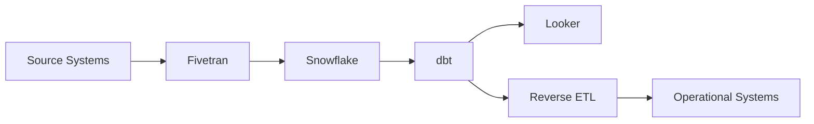

# 🤖 Emerging Technologies

> **Next-generation data engineering tools and patterns shaping the future of data infrastructure**

## 📋 **Quick Navigation**

| 🎯 **Technology** | 📊 **Adoption** | ⏱️ **Learning Time** | 🎓 **Complexity** |
|-------------------|-----------------|----------------------|-------------------|
| **[Data Contracts](#-data-contracts--schema-evolution)** | 65% (2024) | 2-3 weeks | Intermediate |
| **[Data Observability](#-data-observability-tools)** | 45% (2024) | 3-4 weeks | Advanced |
| **[Modern Data Stack](#-modern-data-stack-integration)** | 80% (2024) | 4-6 weeks | Intermediate |
| **[Real-time Feature Stores](#-real-time-feature-stores)** | 35% (2024) | 4-5 weeks | Advanced |

---

## 📋 **Data Contracts & Schema Evolution**

### **What are Data Contracts?**
Data contracts define the structure, semantics, and quality expectations of data shared between teams and systems.

### **Key Tools & Frameworks**
- **[Great Expectations](./Data-Contracts/Great-Expectations/)** - Data validation and profiling
- **[Soda](./Data-Contracts/Soda/)** - Data quality monitoring
- **[dbt](./Data-Contracts/DBT-Contracts/)** - Schema testing and documentation
- **[Apache Avro](./Data-Contracts/Avro-Schema/)** - Schema evolution and compatibility

### **Implementation Patterns**
```yaml
# Example Data Contract (YAML)
version: "1.0"
dataset: "user_events"
owner: "data-platform-team"
schema:
  user_id: 
    type: "string"
    required: true
    description: "Unique user identifier"
  event_timestamp:
    type: "timestamp"
    required: true
    format: "ISO-8601"
quality_rules:
  - completeness: user_id > 99%
  - freshness: < 1 hour
  - uniqueness: user_id per day > 95%
```

### **Schema Evolution Strategies**
- **[Forward Compatibility](./Data-Contracts/Schema-Evolution/FORWARD_COMPATIBILITY.md)**
- **[Backward Compatibility](./Data-Contracts/Schema-Evolution/BACKWARD_COMPATIBILITY.md)**
- **[Full Compatibility](./Data-Contracts/Schema-Evolution/FULL_COMPATIBILITY.md)**

---

## 👁️ **Data Observability Tools**

### **Market Leaders**
- **[Monte Carlo](./Data-Observability/Monte-Carlo/)** - ML-powered data monitoring
- **[Datafold](./Data-Observability/Datafold/)** - Data diff and validation
- **[Bigeye](./Data-Observability/Bigeye/)** - Automated data quality monitoring
- **[Anomalo](./Data-Observability/Anomalo/)** - Anomaly detection for data

### **Open Source Solutions**
- **[Elementary](./Data-Observability/Elementary/)** - dbt-native data observability
- **[Apache Griffin](./Data-Observability/Apache-Griffin/)** - Data quality platform
- **[Amundsen](./Data-Observability/Amundsen/)** - Data discovery and lineage

### **Key Capabilities Comparison**

| Tool | Data Lineage | Anomaly Detection | Data Quality | Cost |
|------|--------------|-------------------|--------------|------|
| Monte Carlo | ✅ Advanced | ✅ ML-powered | ✅ Comprehensive | $$$$ |
| Datafold | ✅ Basic | ✅ Rule-based | ✅ Advanced | $$$ |
| Elementary | ✅ dbt-native | ✅ Statistical | ✅ Good | $ |
| Bigeye | ✅ Good | ✅ ML-powered | ✅ Advanced | $$$ |

### **Implementation Example**
```python
# Monte Carlo Data Circuit Breaker
from monte_carlo import MonteCarloClient

client = MonteCarloClient(api_key="your_key")

# Set up data quality monitor
monitor = client.create_monitor(
    table="production.user_events",
    metric="row_count",
    threshold_type="relative",
    threshold_value=0.1,  # 10% change triggers alert
    lookback_days=7
)
```

---

## 🏗️ **Modern Data Stack Integration**

### **Core Components**
- **Ingestion**: Fivetran, Stitch, Airbyte
- **Storage**: Snowflake, Databricks, BigQuery
- **Transformation**: dbt, Dataform
- **Orchestration**: Airflow, Prefect, Dagster
- **Visualization**: Looker, Tableau, Mode

### **Integration Patterns**
- **[ELT over ETL](./Modern-Data-Stack/ELT-Patterns/ELT_BEST_PRACTICES.md)**
- **[Reverse ETL](./Modern-Data-Stack/Reverse-ETL/REVERSE_ETL_PATTERNS.md)**
- **[Metrics Layer](./Modern-Data-Stack/Metrics-Layer/METRICS_LAYER_ARCHITECTURE.md)**

### **Sample Architecture**


### **Technology Stack Examples**

#### **Startup Stack** ($5K-15K/month)
- **Ingestion**: Airbyte (Open Source)
- **Warehouse**: BigQuery
- **Transformation**: dbt Core
- **Orchestration**: Airflow
- **BI**: Metabase

#### **Scale-up Stack** ($15K-50K/month)
- **Ingestion**: Fivetran
- **Warehouse**: Snowflake
- **Transformation**: dbt Cloud
- **Orchestration**: Prefect Cloud
- **BI**: Looker

#### **Enterprise Stack** ($50K+/month)
- **Ingestion**: Fivetran + Custom
- **Warehouse**: Snowflake + Databricks
- **Transformation**: dbt + Spark
- **Orchestration**: Airflow + Kubernetes
- **BI**: Tableau + Looker

---

## 🚀 **Real-time Feature Stores**

### **Leading Platforms**
- **[Feast](./Feature-Stores/Feast/)** - Open-source feature store
- **[Tecton](./Feature-Stores/Tecton/)** - Enterprise feature platform
- **[Hopsworks](./Feature-Stores/Hopsworks/)** - ML data platform
- **[AWS SageMaker Feature Store](./Feature-Stores/SageMaker-FS/)** - Managed service

### **Architecture Patterns**

#### **Lambda Architecture for Features**
```python
# Feast Feature Store Example
from feast import FeatureStore

fs = FeatureStore(repo_path=".")

# Define feature view
@feature_view(
    entities=["user_id"],
    ttl=timedelta(days=1),
    tags={"team": "ml-platform"},
    online=True,
    offline=True,
    source=user_activity_source,
    schema=[
        Field(name="avg_session_duration", dtype=Float32),
        Field(name="total_purchases", dtype=Int64),
        Field(name="last_activity", dtype=UnixTimestamp),
    ],
)
def user_activity_features(df):
    return df.select(
        col("user_id"),
        col("avg_session_duration"),
        col("total_purchases"), 
        col("last_activity")
    )
```

#### **Real-time Feature Pipeline**
```python
# Streaming feature computation with Kafka + Flink
from pyflink.datastream import StreamExecutionEnvironment
from pyflink.table import StreamTableEnvironment

env = StreamExecutionEnvironment.get_execution_environment()
t_env = StreamTableEnvironment.create(env)

# Real-time feature aggregation
t_env.execute_sql("""
    CREATE TABLE user_features (
        user_id STRING,
        session_count BIGINT,
        avg_duration DOUBLE,
        event_time TIMESTAMP(3),
        WATERMARK FOR event_time AS event_time - INTERVAL '5' SECOND
    ) WITH (
        'connector' = 'kafka',
        'topic' = 'user-events',
        'properties.bootstrap.servers' = 'localhost:9092'
    )
""")

# Windowed aggregations for real-time features
t_env.execute_sql("""
    INSERT INTO feature_store
    SELECT 
        user_id,
        COUNT(*) as session_count_1h,
        AVG(duration) as avg_duration_1h,
        TUMBLE_END(event_time, INTERVAL '1' HOUR) as window_end
    FROM user_features
    GROUP BY user_id, TUMBLE(event_time, INTERVAL '1' HOUR)
""")
```

### **Feature Store Comparison**

| Feature | Feast | Tecton | Hopsworks | SageMaker FS |
|---------|-------|--------|-----------|--------------|
| **Open Source** | ✅ | ❌ | ✅ | ❌ |
| **Real-time Serving** | ✅ | ✅ | ✅ | ✅ |
| **Feature Versioning** | ✅ | ✅ | ✅ | ✅ |
| **Data Quality** | Basic | Advanced | Good | Basic |
| **Cost** | Free | $$$$ | $$ | $$$ |
| **Scalability** | High | Very High | High | High |

---

## 🎯 **Implementation Roadmap**

### **Phase 1: Foundation (Months 1-2)**
1. **Data Contracts**: Implement schema validation
2. **Basic Observability**: Set up data quality monitoring
3. **Modern Stack**: Migrate to ELT pattern

### **Phase 2: Advanced (Months 3-4)**
1. **Full Observability**: Deploy comprehensive monitoring
2. **Feature Store**: Implement real-time feature serving
3. **Integration**: Connect all components

### **Phase 3: Optimization (Months 5-6)**
1. **Performance Tuning**: Optimize pipelines
2. **Cost Management**: Implement cost controls
3. **Governance**: Establish data governance

---

## 📚 **Learning Resources**

### **Certifications**
- **[Data Contracts Certification](./Certifications/Data-Contracts/)**
- **[Modern Data Stack Certification](./Certifications/Modern-Data-Stack/)**

### **Hands-on Labs**
- **[Build a Feature Store](./Labs/Feature-Store-Lab/)**
- **[Implement Data Observability](./Labs/Observability-Lab/)**
- **[Modern Stack Setup](./Labs/Modern-Stack-Lab/)**

### **Case Studies**
- **[Netflix Feature Store](./Case-Studies/Netflix-Feature-Store/)**
- **[Uber Data Observability](./Case-Studies/Uber-Observability/)**
- **[Airbnb Modern Stack](./Case-Studies/Airbnb-Modern-Stack/)**

---

## 🆕 **2024 Emerging Trends**

### **AI-Native Data Platforms**
- **Vector Databases**: Pinecone, Weaviate, Chroma for AI applications
- **Natural Language Interfaces**: DataGPT, Seek AI for conversational analytics
- **Automated Data Discovery**: AI-powered catalog and lineage tools

### **Privacy-Preserving Technologies**
- **Differential Privacy**: Statistical privacy protection
- **Homomorphic Encryption**: Compute on encrypted data
- **Federated Learning**: Distributed ML without data sharing

### **Next-Gen Streaming**
- **Apache Paimon**: Streaming data lake storage
- **RisingWave**: Cloud-native streaming database
- **Materialize**: Streaming SQL database

### **Composable Data Stack**
- **API-First Architecture**: Modular, interoperable components
- **Headless BI**: Cube, MetricFlow semantic layers
- **Universal Connectors**: Airbyte, Meltano for data integration

**📋 [Complete 2024 Guide](./EMERGING_TECHNOLOGIES_2024.md)**

---

**🚀 Ready to explore the future of data engineering?** Start with data contracts and observability - they're the foundation for everything else.