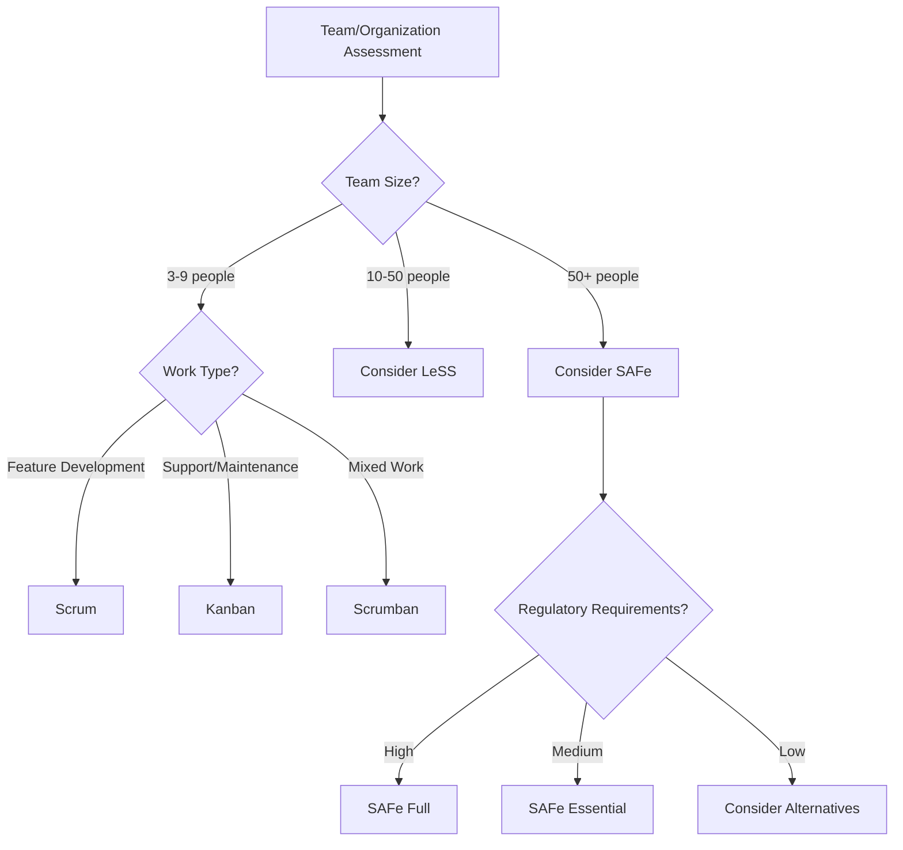

# Agile & Scrum Comprehensive Interview Questions

## 1. What is Agile methodology and how does it differ from traditional project management approaches?

#### **Methodology Comparison Matrix**
| Aspect | Agile | Waterfall | Lean | DevOps |
|--------|-------|-----------|------|--------|
| **Planning** | Adaptive, iterative | Comprehensive upfront | Value stream focused | Continuous integration |
| **Documentation** | Just enough | Extensive | Minimal waste | Automated documentation |
| **Change Management** | Welcome change | Change is costly | Eliminate waste | Continuous deployment |
| **Team Structure** | Cross-functional | Specialized roles | Value stream teams | DevOps culture |
| **Delivery** | Incremental | Big bang | Continuous flow | Continuous delivery |
| **Risk Management** | Early detection | Late discovery | Waste reduction | Automated testing |

### **Answer**
Agile methodology is an iterative approach to project management and software development that emphasizes flexibility, collaboration, and customer satisfaction. Unlike traditional waterfall approaches that follow sequential phases, Agile breaks work into short iterations called sprints, typically 1-4 weeks long.

Key differences include: adaptive vs. comprehensive planning, incremental vs. big-bang delivery, welcoming vs. controlling change, and continuous vs. limited customer collaboration. Agile prioritizes working software and customer feedback over extensive documentation and rigid processes.

---

## 2. Explain the Scrum framework and its key components.

#### **Scrum Framework Structure**
```
SCRUM FRAMEWORK COMPONENTS:
┌─────────────────────────────────────────────────────────────┐
│                        SCRUM ROLES                         │
├─────────────────┬─────────────────┬─────────────────────────┤
│ Product Owner   │ Scrum Master    │ Development Team        │
│ • Product vision│ • Process coach │ • Cross-functional      │
│ • Backlog mgmt  │ • Impediment    │ • Self-organizing       │
│ • Stakeholder   │   removal       │ • 3-9 members           │
│   communication │ • Team coaching │ • Collective ownership  │
└─────────────────┴─────────────────┴─────────────────────────┘

┌─────────────────────────────────────────────────────────────┐
│                       SCRUM EVENTS                         │
├─────────────────┬─────────────────┬─────────────────────────┤
│ Sprint          │ Sprint Planning │ Daily Scrum             │
│ • 1-4 weeks     │ • 8 hours max   │ • 15 minutes            │
│ • Fixed length  │ • What & How    │ • Daily sync            │
│                 │                 │                         │
│ Sprint Review   │ Sprint Retro    │                         │
│ • 4 hours max   │ • 3 hours max   │                         │
│ • Demo & feedback│ • Process improvement│                   │
└─────────────────┴─────────────────┴─────────────────────────┘

┌─────────────────────────────────────────────────────────────┐
│                      SCRUM ARTIFACTS                       │
├─────────────────┬─────────────────┬─────────────────────────┤
│ Product Backlog │ Sprint Backlog  │ Product Increment       │
│ • Prioritized   │ • Sprint Goal   │ • Potentially shippable │
│ • User stories  │ • Selected items│ • Definition of Done    │
│ • Epics         │ • Task breakdown│ • Working software      │
└─────────────────┴─────────────────┴─────────────────────────┘
```

#### **Agile Framework Comparison**
| Framework | Team Size | Structure | Ceremonies | Best For |
|-----------|-----------|-----------|------------|----------|
| **Scrum** | 3-9 people | Prescribed roles/events | 5 ceremonies | Feature development |
| **Kanban** | Any size | Flexible | Minimal | Maintenance/support |
| **SAFe** | 50-125 people | Hierarchical | Multiple levels | Enterprise scaling |
| **LeSS** | 8-50 people | Simplified scaling | Extended Scrum | Large product development |

### **Answer**
Scrum is an Agile framework for managing product development with three roles, five events, and three artifacts. The Product Owner defines what to build, the Scrum Master facilitates the process, and the Development Team builds the product.

Key events include Sprints (1-4 week iterations), Sprint Planning (defining sprint goals), Daily Scrums (15-minute syncs), Sprint Reviews (demonstrating work), and Retrospectives (process improvement). Artifacts include the Product Backlog (prioritized features), Sprint Backlog (sprint work), and Product Increment (working software).

---

## 3. What is the Waterfall methodology and when should it be used?

#### **Waterfall Phases**
```
WATERFALL METHODOLOGY PHASES:
┌─────────────────────────────────────────────────────────────┐
│  Phase 1: Requirements Analysis                             │
│  • Gather and document all requirements                     │
│  • Stakeholder interviews and analysis                      │
│  • Requirements specification document                      │
│  • Sign-off and approval                                    │
└─────────────────────────────────────────────────────────────┘
                              ↓
┌─────────────────────────────────────────────────────────────┐
│  Phase 2: System Design                                     │
│  • High-level system architecture                          │
│  • Detailed technical specifications                       │
│  • Database design and data models                         │
│  • Interface and integration design                        │
└─────────────────────────────────────────────────────────────┘
                              ↓
┌─────────────────────────────────────────────────────────────┐
│  Phase 3: Implementation                                    │
│  • Code development based on design                        │
│  • Unit testing and code reviews                           │
│  • Integration of system components                        │
│  • Documentation and code comments                         │
└─────────────────────────────────────────────────────────────┘
                              ↓
┌─────────────────────────────────────────────────────────────┐
│  Phase 4: Testing                                           │
│  • System testing and integration testing                  │
│  • User acceptance testing (UAT)                           │
│  • Performance and security testing                        │
│  • Bug fixes and retesting                                 │
└─────────────────────────────────────────────────────────────┘
                              ↓
┌─────────────────────────────────────────────────────────────┐
│  Phase 5: Deployment                                        │
│  • Production deployment                                    │
│  • User training and documentation                         │
│  • Go-live support and monitoring                          │
│  • Project closure and handover                            │
└─────────────────────────────────────────────────────────────┘
                              ↓
┌─────────────────────────────────────────────────────────────┐
│  Phase 6: Maintenance                                       │
│  • Ongoing support and bug fixes                           │
│  • Performance monitoring                                  │
│  • Enhancement requests                                    │
│  • System updates and patches                              │
└─────────────────────────────────────────────────────────────┘
```

#### **When to Use Each Methodology**
| Scenario | Waterfall | Agile | Hybrid |
|----------|-----------|-------|--------|
| **Requirements Clarity** | Well-defined, stable | Unclear, evolving | Mixed clarity |
| **Project Size** | Large, complex | Small to medium | Large with phases |
| **Timeline** | Fixed deadlines | Flexible delivery | Fixed milestones |
| **Budget** | Fixed budget | Flexible budget | Fixed with contingency |
| **Risk Tolerance** | Low risk tolerance | High risk tolerance | Moderate risk |
| **Customer Involvement** | Limited availability | High availability | Periodic involvement |
| **Regulatory Requirements** | High compliance needs | Minimal compliance | Selective compliance |

#### **Industry Usage Patterns**
```
Waterfall Usage by Industry:
┌─────────────────┬──────────────┬──────────────┬──────────────┐
│ Industry        │ Waterfall %  │ Agile %      │ Hybrid %     │
├─────────────────┼──────────────┼──────────────┼──────────────┤
│ Government      │ 60%          │ 25%          │ 15%          │
│ Healthcare      │ 45%          │ 35%          │ 20%          │
│ Financial       │ 40%          │ 40%          │ 20%          │
│ Manufacturing   │ 55%          │ 30%          │ 15%          │
│ Technology      │ 15%          │ 70%          │ 15%          │
│ Startups        │ 5%           │ 85%          │ 10%          │
└─────────────────┴──────────────┴──────────────┴──────────────┘
```

### **Answer**
Waterfall is a linear, sequential project management methodology where each phase must be completed before the next begins. It follows six phases: Requirements Analysis, System Design, Implementation, Testing, Deployment, and Maintenance.

Waterfall should be used when requirements are well-defined and stable, regulatory compliance is critical, the project has fixed budgets and timelines, or when working with legacy systems. It's ideal for infrastructure projects, government contracts, and situations where comprehensive documentation is required. However, it's less suitable for projects with evolving requirements or need for rapid delivery.

---

## 4. Compare Scrum, Kanban, and SAFe frameworks.

### 📊 **Comprehensive Framework Comparison**

#### **Framework Overview Matrix**
| Aspect | Scrum | Kanban | SAFe |
|--------|-------|--------|------|
| **Team Size** | 3-9 people | Any size | 50-125+ people |
| **Structure** | Prescribed roles/events | Flexible workflow | Multi-level hierarchy |
| **Planning** | Sprint-based | Continuous flow | PI Planning (quarterly) |
| **Roles** | 3 defined roles | Flexible roles | Multiple role types |
| **Ceremonies** | 5 events | Minimal meetings | Extensive ceremony set |
| **Artifacts** | 3 artifacts | Kanban board | Multiple artifacts |
| **Change Management** | Sprint boundaries | Immediate changes | Planned increments |
| **Metrics** | Velocity, burndown | Lead time, throughput | Multiple KPIs |

#### **Detailed Comparison Analysis**

**SCRUM Framework:**
```
SCRUM CHARACTERISTICS:
┌─────────────────────────────────────────────────────────────┐
│ STRENGTHS                    │ WEAKNESSES                   │
├─────────────────────────────┼──────────────────────────────┤
│ • Clear structure & roles   │ • Can be rigid for some teams│
│ • Regular delivery cycles   │ • Overhead of ceremonies     │
│ • Built-in improvement      │ • Limited to small teams     │
│ • Proven track record       │ • Sprint commitment pressure │
│ • Good for feature dev      │ • Difficult mid-sprint changes│
└─────────────────────────────┴──────────────────────────────┘

BEST FOR:
• Feature development teams
• New product development
• Teams new to Agile
• Projects with clear sprint goals
```

**KANBAN Framework:**
```
KANBAN CHARACTERISTICS:
┌─────────────────────────────────────────────────────────────┐
│ STRENGTHS                    │ WEAKNESSES                   │
├─────────────────────────────┼──────────────────────────────┤
│ • Flexible and adaptive     │ • Less structure for new teams│
│ • Continuous flow           │ • No built-in planning       │
│ • Visual workflow           │ • Requires discipline        │
│ • Easy to implement         │ • Limited team ceremonies    │
│ • Great for maintenance     │ • No defined roles           │
└─────────────────────────────┴──────────────────────────────┘

BEST FOR:
• Support and maintenance teams
• Continuous delivery environments
• Teams with unpredictable work
• Operational workflows
```

**SAFe Framework:**
```
SAFe CHARACTERISTICS:
┌─────────────────────────────────────────────────────────────┐
│ STRENGTHS                    │ WEAKNESSES                   │
├─────────────────────────────┼──────────────────────────────┤
│ • Enterprise scaling        │ • Complex implementation     │
│ • Alignment across teams    │ • Heavy process overhead     │
│ • Portfolio management      │ • Expensive training/coaching │
│ • Risk management           │ • Can reduce team autonomy   │
│ • Compliance support        │ • Long transformation time   │
└─────────────────────────────┴──────────────────────────────┘

BEST FOR:
• Large enterprises (100+ people)
• Multiple product portfolios
• Regulated industries
• Complex system integration
```

### 🎯 **Decision Framework**


### 🏗️ **Implementation Considerations**

**Choosing Scrum When:**
- Team size is 3-9 people
- Working on feature development
- Need regular delivery cycles
- Team is new to Agile
- Clear product ownership exists

**Choosing Kanban When:**
- Work is unpredictable or interrupt-driven
- Continuous delivery is required
- Team handles support/maintenance
- Minimal process overhead is desired
- Work items vary significantly in size

**Choosing SAFe When:**
- Organization has 50+ people in development
- Multiple teams need coordination
- Portfolio-level planning is required
- Regulatory compliance is critical
- Enterprise governance is needed

### **Answer**
Scrum is ideal for small teams (3-9 people) doing feature development with fixed sprints and defined roles. Kanban works best for continuous flow work like support teams, with flexible workflow and minimal ceremonies. SAFe scales Agile to enterprise level (50+ people) with multiple teams, extensive planning, and governance structures.

Choose Scrum for new product development, Kanban for operational work, and SAFe for large enterprise transformations requiring coordination across multiple teams and portfolios.

---

## 5. What are the key roles in Scrum and their responsibilities?

### 🎯 **Scrum Roles Deep Dive**

#### **Product Owner Role**
```
PRODUCT OWNER RESPONSIBILITIES:
┌─────────────────────────────────────────────────────────────┐
│ PRIMARY RESPONSIBILITIES                                    │
├─────────────────────────────────────────────────────────────┤
│ • Product Vision & Strategy                                 │
│   - Define product roadmap and long-term vision            │
│   - Align product strategy with business objectives        │
│   - Communicate vision to stakeholders and team            │
│                                                             │
│ • Product Backlog Management                               │
│   - Create and maintain prioritized product backlog        │
│   - Write clear user stories with acceptance criteria      │
│   - Ensure backlog items are ready for development         │
│                                                             │
│ • Stakeholder Communication                                │
│   - Single point of contact for requirements               │
│   - Gather feedback from customers and users               │
│   - Manage stakeholder expectations                        │
│                                                             │
│ • Decision Making                                          │
│   - Make product decisions quickly                         │
│   - Accept or reject completed work                        │
│   - Prioritize features based on business value            │
└─────────────────────────────────────────────────────────────┘

KEY SKILLS REQUIRED:
• Business domain expertise
• Communication and negotiation
• Analytical and decision-making
• Understanding of user needs
• Basic technical knowledge
```

#### **Scrum Master Role**
```
SCRUM MASTER RESPONSIBILITIES:
┌─────────────────────────────────────────────────────────────┐
│ PRIMARY RESPONSIBILITIES                                    │
├─────────────────────────────────────────────────────────────┤
│ • Process Facilitation                                     │
│   - Facilitate all Scrum events and ceremonies            │
│   - Ensure Scrum framework is followed correctly          │
│   - Guide team in Scrum practices and principles          │
│                                                             │
│ • Impediment Removal                                       │
│   - Identify and remove blockers for the team             │
│   - Escalate issues that team cannot resolve              │
│   - Create environment for team productivity              │
│                                                             │
│ • Team Coaching                                           │
│   - Coach team on self-organization                       │
│   - Help team improve collaboration and communication     │
│   - Facilitate continuous improvement                     │
│                                                             │
│ • Organizational Change                                    │
│   - Help organization adopt Agile practices               │
│   - Shield team from external distractions               │
│   - Promote Scrum values and principles                   │
└─────────────────────────────────────────────────────────────┘

KEY SKILLS REQUIRED:
• Servant leadership
• Facilitation and coaching
• Conflict resolution
• Scrum framework expertise
• Change management
```

#### **Development Team Role**
```
DEVELOPMENT TEAM RESPONSIBILITIES:
┌─────────────────────────────────────────────────────────────┐
│ PRIMARY RESPONSIBILITIES                                    │
├─────────────────────────────────────────────────────────────┤
│ • Product Development                                      │
│   - Deliver potentially shippable product increment       │
│   - Ensure quality through testing and code reviews       │
│   - Collaborate on technical decisions                    │
│                                                             │
│ • Self-Organization                                        │
│   - Organize work and assign tasks among team members     │
│   - Estimate effort for backlog items                     │
│   - Commit to sprint goals and deliverables               │
│                                                             │
│ • Cross-Functional Collaboration                          │
│   - Work together to achieve sprint goals                 │
│   - Share knowledge and skills across team                │
│   - Support each other in completing work                 │
│                                                             │
│ • Continuous Improvement                                   │
│   - Participate in retrospectives                         │
│   - Identify process improvements                         │
│   - Learn new skills and technologies                     │
└─────────────────────────────────────────────────────────────┘

TEAM CHARACTERISTICS:
• Size: 3-9 members (optimal: 5-7)
• Cross-functional skills
• Self-organizing and self-managing
• Collective ownership of work
• No sub-teams or hierarchies
```

### 📊 **Role Interaction Matrix**
| Interaction | Product Owner | Scrum Master | Development Team |
|-------------|---------------|--------------|------------------|
| **Product Owner** | - | Collaborates on backlog refinement | Clarifies requirements, accepts work |
| **Scrum Master** | Coaches on product ownership | - | Facilitates team processes |
| **Development Team** | Estimates work, asks questions | Requests impediment removal | Collaborates on delivery |

### 🏗️ **Common Role Anti-Patterns**

**Product Owner Anti-Patterns:**
- **Proxy Product Owner**: Someone other than the real decision maker
- **Committee Product Owner**: Multiple people trying to fill the role
- **Absent Product Owner**: Not available for questions and decisions
- **Technical Product Owner**: Focusing on technical details over business value

**Scrum Master Anti-Patterns:**
- **Project Manager Scrum Master**: Managing tasks instead of facilitating
- **Team Lead Scrum Master**: Making decisions for the team
- **Part-time Scrum Master**: Not dedicating enough time to the role
- **Command and Control**: Telling team what to do instead of coaching

**Development Team Anti-Patterns:**
- **Individual Heroes**: One person doing most of the work
- **Specialized Silos**: Team members only working in their specialty
- **External Dependencies**: Relying on people outside the team
- **Lack of Ownership**: Not taking responsibility for sprint goals

### **Answer**
Scrum has three key roles:

**Product Owner**: Defines what to build by managing the product backlog, writing user stories, prioritizing features based on business value, and serving as the single point of contact for requirements. They own the product vision and make acceptance decisions.

**Scrum Master**: Facilitates the Scrum process by coaching the team, removing impediments, facilitating ceremonies, and helping the organization adopt Agile practices. They serve the team as a servant leader, not a manager.

**Development Team**: Cross-functional group (3-9 people) that builds the product. They self-organize, estimate work, commit to sprint goals, and collectively own the delivery. No hierarchies or sub-teams exist within the development team.

Each role is essential and cannot be combined or eliminated without compromising the Scrum framework's effectiveness.
## 6. What are the Scrum ceremonies/events and their purposes?

### 🎯 **Scrum Events Overview**

#### **Complete Scrum Events Framework**
```
SCRUM EVENTS TIMELINE (2-week Sprint Example):
┌─────────────────────────────────────────────────────────────┐
│ Week 1                          │ Week 2                    │
├─────────────────────────────────┼───────────────────────────┤
│ Mon: Sprint Planning (8h)       │ Mon: Daily Scrum (15m)    │
│ Tue: Daily Scrum (15m)          │ Tue: Daily Scrum (15m)    │
│ Wed: Daily Scrum (15m)          │ Wed: Daily Scrum (15m)    │
│ Thu: Daily Scrum (15m)          │ Thu: Daily Scrum (15m)    │
│ Fri: Daily Scrum (15m)          │ Fri: Sprint Review (4h)   │
│                                 │      Sprint Retro (3h)    │
└─────────────────────────────────┴───────────────────────────┘
```

#### **1. Sprint Planning**
```
SPRINT PLANNING DEEP DIVE:
┌─────────────────────────────────────────────────────────────┐
│ DURATION: 8 hours (4-week sprint) | 4 hours (2-week sprint) │
│ PARTICIPANTS: Product Owner, Scrum Master, Development Team │
│ OUTCOME: Sprint Goal + Sprint Backlog                       │
├─────────────────────────────────────────────────────────────┤
│ PART 1: WHAT (First Half)                                   │
│ • Product Owner presents highest priority items             │
│ • Team asks clarifying questions                            │
│ • Team selects items they can commit to                     │
│ • Sprint Goal is defined and agreed upon                    │
│                                                             │
│ PART 2: HOW (Second Half)                                   │
│ • Team breaks down selected items into tasks               │
│ • Tasks are estimated and assigned                         │
│ • Team confirms they can achieve Sprint Goal               │
│ • Sprint Backlog is finalized                              │
└─────────────────────────────────────────────────────────────┘

KEY INPUTS:
• Product Backlog (prioritized and refined)
• Team velocity from previous sprints
• Team capacity for upcoming sprint
• Definition of Done

KEY OUTPUTS:
• Sprint Goal (why we're doing this sprint)
• Sprint Backlog (what will be delivered)
• Task breakdown (how work will be done)
```

#### **2. Daily Scrum**
```
DAILY SCRUM STRUCTURE:
┌─────────────────────────────────────────────────────────────┐
│ DURATION: 15 minutes (time-boxed)                          │
│ PARTICIPANTS: Development Team (others can observe)        │
│ FREQUENCY: Every working day at same time/place            │
├─────────────────────────────────────────────────────────────┤
│ THREE QUESTIONS (Traditional Format):                      │
│ 1. What did I do yesterday that helped achieve Sprint Goal?│
│ 2. What will I do today to help achieve Sprint Goal?       │
│ 3. Do I see any impediments that prevent me/team from      │
│    achieving Sprint Goal?                                   │
│                                                             │
│ MODERN APPROACH (Focus on Sprint Goal):                     │
│ • What progress did we make toward Sprint Goal yesterday?   │
│ • What will we do today to move closer to Sprint Goal?     │
│ • What impediments are blocking our progress?              │
└─────────────────────────────────────────────────────────────┘

COMMON ANTI-PATTERNS:
❌ Status reporting to Scrum Master
❌ Problem-solving during the meeting
❌ Going over 15-minute time limit
❌ Team members not attending regularly
❌ Discussing detailed technical solutions

✅ BEST PRACTICES:
• Focus on Sprint Goal achievement
• Identify impediments quickly
• Plan collaboration for the day
• Keep it short and focused
• Use visual aids (burndown charts, task boards)
```

#### **3. Sprint Review**
```
SPRINT REVIEW STRUCTURE:
┌─────────────────────────────────────────────────────────────┐
│ DURATION: 4 hours (4-week sprint) | 2 hours (2-week sprint) │
│ PARTICIPANTS: Scrum Team + Stakeholders + Customers        │
│ PURPOSE: Inspect increment and adapt Product Backlog       │
├─────────────────────────────────────────────────────────────┤
│ AGENDA:                                                     │
│ 1. Product Owner explains what was "Done" vs "Not Done"    │
│ 2. Development Team demonstrates working software           │
│ 3. Product Owner discusses Product Backlog status          │
│ 4. Entire group collaborates on what to do next            │
│ 5. Review timeline, budget, capabilities for next release  │
│                                                             │
│ KEY OUTCOMES:                                               │
│ • Stakeholder feedback on delivered increment              │
│ • Updated Product Backlog based on feedback                │
│ • Input for next Sprint Planning                           │
│ • Validation of product direction                          │
└─────────────────────────────────────────────────────────────┘

DEMO BEST PRACTICES:
• Show working software, not PowerPoint
• Focus on business value delivered
• Encourage stakeholder interaction
• Capture feedback for backlog refinement
• Celebrate team achievements
```

#### **4. Sprint Retrospective**
```
SPRINT RETROSPECTIVE STRUCTURE:
┌─────────────────────────────────────────────────────────────┐
│ DURATION: 3 hours (4-week sprint) | 1.5 hours (2-week)     │
│ PARTICIPANTS: Scrum Team (Product Owner, SM, Dev Team)     │
│ PURPOSE: Inspect team process and create improvement plan   │
├─────────────────────────────────────────────────────────────┤
│ CLASSIC FORMAT:                                             │
│ • What went well? (Keep doing)                              │
│ • What didn't go well? (Stop doing)                        │
│ • What should we try? (Start doing)                        │
│                                                             │
│ ALTERNATIVE FORMATS:                                        │
│ • Sailboat: Wind (helps), Anchors (hinders), Rocks (risks) │
│ • 4Ls: Liked, Learned, Lacked, Longed for                  │
│ • Timeline: Map events and emotions throughout sprint      │
│ • Starfish: Keep, Less, More, Stop, Start                  │
└─────────────────────────────────────────────────────────────┘

IMPROVEMENT ACTION PLAN:
• Identify 1-3 specific improvements
• Assign ownership for each action
• Set measurable success criteria
• Review progress in next retrospective
```

### 📊 **Event Effectiveness Metrics**
| Event | Success Metrics | Common Issues |
|-------|----------------|---------------|
| **Sprint Planning** | Clear Sprint Goal, realistic commitment | Overcommitment, unclear requirements |
| **Daily Scrum** | Impediments identified, team sync | Status reporting, too long |
| **Sprint Review** | Stakeholder feedback, working demo | No stakeholders, technical focus |
| **Sprint Retrospective** | Actionable improvements, team engagement | No follow-through, blame culture |

### **Answer**
Scrum has five key events:

**Sprint** (1-4 weeks): Time-boxed iteration containing all other events, producing a potentially shippable increment.

**Sprint Planning** (8 hours max): Team selects work for the sprint and creates Sprint Goal. Divided into "What" (selecting backlog items) and "How" (task breakdown).

**Daily Scrum** (15 minutes): Daily synchronization where team members share progress toward Sprint Goal and identify impediments.

**Sprint Review** (4 hours max): Team demonstrates completed work to stakeholders, gathers feedback, and adapts the Product Backlog.

**Sprint Retrospective** (3 hours max): Team reflects on their process, identifies improvements, and creates action plans for the next sprint.

Each event serves a specific purpose in the empirical process of transparency, inspection, and adaptation.

---

## 7. Explain user stories and acceptance criteria in Agile development.

### 🎯 **User Stories Foundation**

#### **User Story Structure**
```
STANDARD USER STORY FORMAT:
┌─────────────────────────────────────────────────────────────┐
│ As a [type of user/persona]                                 │
│ I want [some goal/functionality]                            │
│ So that [some reason/business value]                        │
└─────────────────────────────────────────────────────────────┘

EXAMPLE:
As a registered customer
I want to view my order history
So that I can track my purchases and reorder items easily

COMPONENTS BREAKDOWN:
• WHO: Type of user (persona/role)
• WHAT: Desired functionality or goal
• WHY: Business value or benefit
```

#### **INVEST Criteria for Good User Stories**
```
INVEST CRITERIA:
┌─────────────────────────────────────────────────────────────┐
│ I - INDEPENDENT                                             │
│ • Story can be developed in any order                       │
│ • Minimal dependencies on other stories                     │
│ • Can be tested and delivered independently                 │
│                                                             │
│ N - NEGOTIABLE                                              │
│ • Details can be discussed and refined                      │
│ • Not a contract or detailed specification                  │
│ • Allows for collaboration and creativity                   │
│                                                             │
│ V - VALUABLE                                                │
│ • Provides clear business value to user                     │
│ • Contributes to product goals and objectives               │
│ • Justifies development effort                              │
│                                                             │
│ E - ESTIMABLE                                               │
│ • Team can estimate effort required                         │
│ • Sufficient detail for planning                            │
│ • Clear scope and boundaries                                │
│                                                             │
│ S - SMALL                                                   │
│ • Can be completed within one sprint                        │
│ • Not too large or complex                                  │
│ • Can be broken down if necessary                           │
│                                                             │
│ T - TESTABLE                                                │
│ • Clear acceptance criteria                                 │
│ • Can be verified and validated                             │
│ • Measurable success criteria                               │
└─────────────────────────────────────────────────────────────┘
```

### 🎯 **Acceptance Criteria Deep Dive**

#### **Acceptance Criteria Formats**

**1. Given-When-Then Format (Gherkin)**
```
GIVEN-WHEN-THEN STRUCTURE:
┌─────────────────────────────────────────────────────────────┐
│ Given [initial context/precondition]                        │
│ When [event/action occurs]                                  │
│ Then [expected outcome/result]                              │
└─────────────────────────────────────────────────────────────┘

EXAMPLE:
User Story: As a customer, I want to reset my password so that 
I can regain access to my account.

Acceptance Criteria:
Given I am on the login page
When I click "Forgot Password" and enter my email
Then I should receive a password reset email within 5 minutes

Given I receive a password reset email
When I click the reset link within 24 hours
Then I should be directed to a password reset form

Given I am on the password reset form
When I enter a valid new password and confirm it
Then my password should be updated and I should be logged in
```

**2. Scenario-Based Format**
```
SCENARIO-BASED ACCEPTANCE CRITERIA:
┌─────────────────────────────────────────────────────────────┐
│ Scenario 1: [Happy path description]                        │
│ • [Step 1]                                                  │
│ • [Step 2]                                                  │
│ • [Expected result]                                         │
│                                                             │
│ Scenario 2: [Alternative path description]                  │
│ • [Step 1]                                                  │
│ • [Step 2]                                                  │
│ • [Expected result]                                         │
│                                                             │
│ Scenario 3: [Error/edge case description]                   │
│ • [Step 1]                                                  │
│ • [Step 2]                                                  │
│ • [Expected result]                                         │
└─────────────────────────────────────────────────────────────┘
```

**3. Rule-Based Format**
```
RULE-BASED ACCEPTANCE CRITERIA:
┌─────────────────────────────────────────────────────────────┐
│ • [Functional requirement 1]                                │
│ • [Functional requirement 2]                                │
│ • [Business rule 1]                                         │
│ • [Business rule 2]                                         │
│ • [Performance requirement]                                 │
│ • [Security requirement]                                    │
│ • [Usability requirement]                                   │
└─────────────────────────────────────────────────────────────┘

EXAMPLE:
• Password must be at least 8 characters long
• Password must contain at least one uppercase letter
• Password must contain at least one number
• Password reset link expires after 24 hours
• System must send confirmation email within 5 minutes
• Page must load within 3 seconds
• All password fields must be masked
```

### 📊 **User Story Hierarchy**
```
USER STORY HIERARCHY:
┌─────────────────────────────────────────────────────────────┐
│                        EPIC                                 │
│           Large body of work (3-6 months)                  │
│                                                             │
│    ┌─────────────┐  ┌─────────────┐  ┌─────────────┐      │
│    │   FEATURE   │  │   FEATURE   │  │   FEATURE   │      │
│    │ (4-6 weeks) │  │ (4-6 weeks) │  │ (4-6 weeks) │      │
│    └─────────────┘  └─────────────┘  └─────────────┘      │
│           │                 │                 │            │
│    ┌─────────────┐  ┌─────────────┐  ┌─────────────┐      │
│    │ USER STORY  │  │ USER STORY  │  │ USER STORY  │      │
│    │ (1-2 weeks) │  │ (1-2 weeks) │  │ (1-2 weeks) │      │
│    └─────────────┘  └─────────────┘  └─────────────┘      │
│           │                 │                 │            │
│    ┌─────────────┐  ┌─────────────┐  ┌─────────────┐      │
│    │    TASK     │  │    TASK     │  │    TASK     │      │
│    │  (1-2 days) │  │  (1-2 days) │  │  (1-2 days) │      │
│    └─────────────┘  └─────────────┘  └─────────────┘      │
└─────────────────────────────────────────────────────────────┘
```

### 🏗️ **Complete User Story Example**

```
COMPREHENSIVE USER STORY EXAMPLE:
┌─────────────────────────────────────────────────────────────┐
│ EPIC: Customer Account Management                           │
│ FEATURE: Password Management                                │
│                                                             │
│ USER STORY:                                                 │
│ As a registered customer                                    │
│ I want to reset my forgotten password                       │
│ So that I can regain access to my account without          │
│ contacting customer support                                 │
│                                                             │
│ ACCEPTANCE CRITERIA:                                        │
│                                                             │
│ Scenario 1: Successful password reset                      │
│ Given I am on the login page                               │
│ When I click "Forgot Password" and enter my registered email│
│ Then I should receive a password reset email within 5 min  │
│                                                             │
│ Scenario 2: Password reset link usage                      │
│ Given I received a password reset email                    │
│ When I click the reset link within 24 hours                │
│ Then I should be directed to a secure password reset form  │
│                                                             │
│ Scenario 3: New password creation                          │
│ Given I am on the password reset form                      │
│ When I enter a valid new password and confirm it           │
│ Then my password should be updated and I should be logged in│
│                                                             │
│ BUSINESS RULES:                                             │
│ • Password must be 8-20 characters                         │
│ • Must contain uppercase, lowercase, number, special char  │
│ • Reset link expires after 24 hours                        │
│ • Only one active reset link per user                      │
│ • Email must be sent within 5 minutes                      │
│                                                             │
│ DEFINITION OF DONE:                                         │
│ • Code reviewed and approved                                │
│ • Unit tests written and passing                           │
│ • Integration tests passing                                 │
│ • Security testing completed                               │
│ • Accessibility requirements met                           │
│ • Documentation updated                                     │
│ • Product Owner acceptance                                  │
└─────────────────────────────────────────────────────────────┘
```

### 📊 **Common User Story Anti-Patterns**
| Anti-Pattern | Description | Better Approach |
|--------------|-------------|-----------------|
| **Technical Stories** | "As a developer, I want to refactor..." | Focus on user value, create technical tasks |
| **Too Large** | Stories spanning multiple sprints | Break into smaller, independent stories |
| **Too Detailed** | Overly specific implementation details | Keep negotiable, focus on outcome |
| **No Value** | Stories without clear business benefit | Always include "so that" with real value |
| **Dependent Stories** | Stories that can't be done independently | Restructure to minimize dependencies |

### **Answer**
User stories are short, simple descriptions of features from the user's perspective, following the format: "As a [user type], I want [functionality] so that [benefit]." They serve as conversation starters between the team and stakeholders.

Good user stories follow INVEST criteria: Independent, Negotiable, Valuable, Estimable, Small, and Testable.

Acceptance criteria define the conditions that must be met for a story to be considered complete. They can be written in Given-When-Then format (Gherkin), scenario-based format, or rule-based format. They provide clear, testable conditions that help the team understand when work is done and enable effective testing.

Together, user stories and acceptance criteria bridge the gap between business requirements and technical implementation while maintaining focus on user value.

---

## 8. What is the Definition of Done (DoD) and why is it important?

### 🎯 **Definition of Done Foundation**

#### **Definition of Done Concept**
```
DEFINITION OF DONE (DoD):
┌─────────────────────────────────────────────────────────────┐
│ A shared understanding of what it means for work to be      │
│ complete, ensuring transparency and quality standards       │
│                                                             │
│ KEY CHARACTERISTICS:                                        │
│ • Agreed upon by entire Scrum Team                         │
│ • Applied to all Product Backlog Items                     │
│ • Ensures potentially shippable increment                  │
│ • Evolves as team capabilities mature                      │
│ • Creates transparency and shared understanding            │
└─────────────────────────────────────────────────────────────┘
```

#### **DoD Hierarchy Levels**
```
DEFINITION OF DONE LEVELS:
┌─────────────────────────────────────────────────────────────┐
│ ORGANIZATION LEVEL                                          │
│ • Company-wide standards and policies                      │
│ • Compliance and regulatory requirements                   │
│ • Security and legal standards                             │
│                                                             │
│         ↓ (inherits and extends)                           │
│                                                             │
│ PRODUCT LEVEL                                               │
│ • Product-specific quality standards                       │
│ • Integration requirements                                  │
│ • Performance benchmarks                                   │
│                                                             │
│         ↓ (inherits and extends)                           │
│                                                             │
│ TEAM LEVEL                                                  │
│ • Team-specific practices                                   │
│ • Technical standards                                       │
│ • Process requirements                                      │
│                                                             │
│         ↓ (inherits and extends)                           │
│                                                             │
│ FEATURE/STORY LEVEL                                         │
│ • Acceptance criteria                                       │
│ • Specific requirements                                     │
│ • User story conditions                                     │
└─────────────────────────────────────────────────────────────┘
```

### 🏗️ **Comprehensive DoD Examples**

#### **Software Development DoD Template**
```
DEFINITION OF DONE CHECKLIST:
┌─────────────────────────────────────────────────────────────┐
│ DEVELOPMENT STANDARDS                                       │
│ □ Code follows team coding standards                        │
│ □ Code is properly commented and documented                 │
│ □ No critical or high-severity code analysis violations    │
│ □ Code coverage meets minimum threshold (80%+)             │
│ □ Performance requirements met                              │
│                                                             │
│ TESTING REQUIREMENTS                                        │
│ □ Unit tests written and passing (90%+ coverage)           │
│ □ Integration tests written and passing                     │
│ □ Acceptance tests written and passing                      │
│ □ Manual testing completed                                  │
│ □ Cross-browser/device testing completed                   │
│ □ Accessibility testing completed                          │
│                                                             │
│ QUALITY ASSURANCE                                           │
│ □ Code reviewed by at least one team member                │
│ □ Security review completed                                 │
│ □ Performance testing completed                             │
│ □ No known defects                                          │
│ □ Meets acceptance criteria                                 │
│                                                             │
│ DOCUMENTATION                                               │
│ □ User documentation updated                                │
│ □ Technical documentation updated                           │
│ □ API documentation updated                                 │
│ □ Release notes updated                                     │
│                                                             │
│ DEPLOYMENT                                                  │
│ □ Deployed to staging environment                           │
│ □ Smoke tests passing in staging                            │
│ □ Database migrations tested                                │
│ □ Configuration changes documented                          │
│                                                             │
│ ACCEPTANCE                                                  │
│ □ Product Owner acceptance                                  │
│ □ Stakeholder sign-off (if required)                       │
│ □ Ready for production deployment                           │
└─────────────────────────────────────────────────────────────┘
```

#### **Data Engineering DoD Example**
```
DATA ENGINEERING DEFINITION OF DONE:
┌─────────────────────────────────────────────────────────────┐
│ DATA QUALITY                                                │
│ □ Data validation rules implemented and passing             │
│ □ Data quality metrics meet defined thresholds             │
│ □ Data lineage documented                                   │
│ □ Data profiling completed                                  │
│ □ Schema validation implemented                             │
│                                                             │
│ PIPELINE REQUIREMENTS                                       │
│ □ Pipeline runs successfully end-to-end                     │
│ □ Error handling and retry logic implemented               │
│ □ Monitoring and alerting configured                       │
│ □ Performance benchmarks met                                │
│ □ Scalability requirements validated                       │
│                                                             │
│ TESTING                                                     │
│ □ Unit tests for data transformations                      │
│ □ Integration tests for data pipeline                      │
│ □ Data quality tests automated                              │
│ □ Performance tests completed                               │
│ □ Disaster recovery tested                                  │
│                                                             │
│ DOCUMENTATION                                               │
│ □ Data dictionary updated                                   │
│ □ Pipeline architecture documented                         │
│ □ Operational runbooks created                              │
│ □ Data governance policies followed                        │
│                                                             │
│ SECURITY & COMPLIANCE                                       │
│ □ Data privacy requirements met                             │
│ □ Access controls implemented                               │
│ □ Audit logging enabled                                     │
│ □ Compliance requirements validated                         │
└─────────────────────────────────────────────────────────────┘
```

### 📊 **DoD Evolution and Maturity**

#### **DoD Maturity Levels**
| Level | Characteristics | Example Criteria |
|-------|----------------|------------------|
| **Basic** | Minimal quality gates | Code complete, basic testing |
| **Intermediate** | Automated testing, code review | Unit tests, code review, documentation |
| **Advanced** | Comprehensive quality | Automated testing, performance, security |
| **Mature** | Continuous improvement | Full automation, metrics-driven, predictive |

#### **DoD Evolution Process**
```
DoD EVOLUTION CYCLE:
┌─────────────────────────────────────────────────────────────┐
│ 1. ASSESS CURRENT STATE                                     │
│    • Review current DoD effectiveness                       │
│    • Identify quality issues and gaps                       │
│    • Gather team feedback                                   │
│                                                             │
│ 2. IDENTIFY IMPROVEMENTS                                    │
│    • Add new quality criteria                               │
│    • Automate manual processes                              │
│    • Raise quality standards                                │
│                                                             │
│ 3. IMPLEMENT CHANGES                                        │
│    • Update DoD documentation                               │
│    • Train team on new requirements                         │
│    • Update tools and processes                             │
│                                                             │
│ 4. MONITOR AND ADJUST                                       │
│    • Track compliance and effectiveness                     │
│    • Gather feedback and metrics                            │
│    • Refine based on results                                │
└─────────────────────────────────────────────────────────────┘
```

### 🎯 **Importance of Definition of Done**

#### **Benefits of Strong DoD**
```
DoD BENEFITS:
┌─────────────────────────────────────────────────────────────┐
│ QUALITY ASSURANCE                                           │
│ • Consistent quality standards across all work             │
│ • Reduced defects and technical debt                       │
│ • Predictable quality outcomes                              │
│                                                             │
│ TRANSPARENCY                                                │
│ • Clear expectations for all team members                  │
│ • Visible progress and completion status                   │
│ • Stakeholder confidence in deliverables                   │
│                                                             │
│ EFFICIENCY                                                  │
│ • Reduced rework and bug fixes                              │
│ • Faster delivery through automation                       │
│ • Improved team productivity                                │
│                                                             │
│ CONTINUOUS IMPROVEMENT                                      │
│ • Regular review and enhancement of standards              │
│ • Team learning and skill development                      │
│ • Process optimization opportunities                       │
└─────────────────────────────────────────────────────────────┘
```

#### **Common DoD Anti-Patterns**
| Anti-Pattern | Description | Impact | Solution |
|--------------|-------------|--------|----------|
| **Too Vague** | Generic, unclear criteria | Inconsistent quality | Make specific and measurable |
| **Too Rigid** | Overly detailed, inflexible | Slows development | Balance detail with flexibility |
| **Not Enforced** | DoD exists but not followed | Quality issues | Regular review and enforcement |
| **Never Updated** | Static DoD that doesn't evolve | Stagnant improvement | Regular retrospective updates |
| **Tool-Dependent** | Relies on specific tools only | Fragile process | Focus on outcomes, not tools |

### **Answer**
Definition of Done (DoD) is a shared understanding of what constitutes complete work, ensuring all team members have the same quality expectations. It's a checklist of criteria that must be met before considering any work item finished.

DoD is important because it:
- **Ensures Quality**: Establishes consistent standards preventing defects
- **Creates Transparency**: Everyone knows what "done" means
- **Reduces Rework**: Catches issues early in development
- **Enables Predictability**: Consistent completion criteria improve estimation
- **Supports Continuous Improvement**: Evolves as team capabilities mature

A good DoD includes development standards, testing requirements, documentation, code review, and acceptance criteria. It should be specific, measurable, achievable, and regularly updated based on team retrospectives and organizational needs.

The DoD applies at multiple levels: organization, product, team, and individual story level, with each level inheriting and extending the criteria from above.

---

## 9. What are the differences between Agile and DevOps?

### 📊 **Comprehensive Agile vs DevOps Comparison**

#### **Core Philosophy Comparison**
| Aspect | Agile | DevOps |
|--------|-------|--------|
| **Primary Focus** | Software development process | End-to-end delivery pipeline |
| **Core Goal** | Deliver working software frequently | Continuous delivery and deployment |
| **Scope** | Development team and process | Development + Operations + Culture |
| **Timeline** | Sprint-based iterations | Continuous flow |
| **Feedback Loop** | Sprint reviews and retrospectives | Continuous monitoring and feedback |
| **Team Structure** | Cross-functional development teams | Dev + Ops collaboration |

#### **Detailed Comparison Matrix**
```
AGILE vs DEVOPS DETAILED ANALYSIS:
┌─────────────────────────────────────────────────────────────┐
│                        AGILE                                │
├─────────────────────────────────────────────────────────────┤
│ FOCUS AREAS:                                                │
│ • Requirements gathering and management                     │
│ • Iterative development and delivery                        │
│ • Customer collaboration and feedback                       │
│ • Responding to change over following plans                 │
│                                                             │
│ KEY PRACTICES:                                              │
│ • Sprint planning and execution                             │
│ • Daily standups and retrospectives                        │
│ • User story development                                    │
│ • Continuous improvement of process                        │
│                                                             │
│ METRICS:                                                    │
│ • Velocity and burndown charts                             │
│ • Sprint completion rates                                   │
│ • Customer satisfaction                                     │
│ • Team productivity                                         │
└─────────────────────────────────────────────────────────────┘

┌─────────────────────────────────────────────────────────────┐
│                       DEVOPS                                │
├─────────────────────────────────────────────────────────────┤
│ FOCUS AREAS:                                                │
│ • Continuous integration and deployment                     │
│ • Infrastructure automation                                 │
│ • Monitoring and observability                             │
│ • Culture of collaboration between Dev and Ops             │
│                                                             │
│ KEY PRACTICES:                                              │
│ • CI/CD pipeline automation                                 │
│ • Infrastructure as Code (IaC)                             │
│ • Automated testing and deployment                         │
│ • Continuous monitoring and alerting                       │
│                                                             │
│ METRICS:                                                    │
│ • Deployment frequency                                      │
│ • Lead time for changes                                     │
│ • Mean time to recovery (MTTR)                             │
│ • Change failure rate                                       │
└─────────────────────────────────────────────────────────────┘
```

### 🎯 **Integration and Synergy**

#### **How Agile and DevOps Complement Each Other**
```
AGILE + DEVOPS INTEGRATION:
┌─────────────────────────────────────────────────────────────┐
│ DEVELOPMENT PHASE (Agile Focus)                             │
│ • Sprint planning and user story development               │
│ • Iterative development and testing                        │
│ • Regular customer feedback and adaptation                 │
│                                                             │
│         ↓ (DevOps enables faster delivery)                 │
│                                                             │
│ DELIVERY PHASE (DevOps Focus)                               │
│ • Automated build and testing                              │
│ • Continuous integration and deployment                    │
│ • Production monitoring and feedback                       │
│                                                             │
│         ↓ (Feedback loops back to Agile)                   │
│                                                             │
│ FEEDBACK INTEGRATION                                        │
│ • Production metrics inform sprint planning                │
│ • Operational insights drive product decisions             │
│ • Continuous improvement across entire pipeline            │
└─────────────────────────────────────────────────────────────┘
```

#### **Combined Benefits**
```
AGILE + DEVOPS SYNERGIES:
┌─────────────────────────────────────────────────────────────┐
│ SPEED & EFFICIENCY                                          │
│ • Faster time to market                                     │
│ • Reduced manual processes                                  │
│ • Automated quality gates                                   │
│                                                             │
│ QUALITY & RELIABILITY                                       │
│ • Continuous testing and validation                        │
│ • Early defect detection                                    │
│ • Stable production environments                           │
│                                                             │
│ COLLABORATION & CULTURE                                     │
│ • Shared responsibility for delivery                       │
│ • Cross-functional team collaboration                      │
│ • Continuous learning and improvement                      │
│                                                             │
│ CUSTOMER VALUE                                              │
│ • Faster feature delivery                                   │
│ • Higher quality products                                   │
│ • Responsive to customer needs                              │
└─────────────────────────────────────────────────────────────┘
```

### 🏗️ **Implementation Approaches**

#### **Agile Implementation Focus**
```
AGILE IMPLEMENTATION PRIORITIES:
┌─────────────────────────────────────────────────────────────┐
│ 1. TEAM STRUCTURE                                           │
│    • Form cross-functional teams                           │
│    • Define roles (PO, SM, Dev Team)                       │
│    • Establish team working agreements                     │
│                                                             │
│ 2. PROCESS ESTABLISHMENT                                    │
│    • Implement Scrum or Kanban framework                   │
│    • Set up regular ceremonies                              │
│    • Create Definition of Done                             │
│                                                             │
│ 3. CULTURAL CHANGE                                          │
│    • Embrace iterative development                         │
│    • Focus on customer collaboration                       │
│    • Encourage experimentation and learning                │
└─────────────────────────────────────────────────────────────┘
```

#### **DevOps Implementation Focus**
```
DEVOPS IMPLEMENTATION PRIORITIES:
┌─────────────────────────────────────────────────────────────┐
│ 1. AUTOMATION FOUNDATION                                    │
│    • Set up CI/CD pipelines                                │
│    • Implement Infrastructure as Code                      │
│    • Automate testing and deployment                       │
│                                                             │
│ 2. MONITORING & OBSERVABILITY                              │
│    • Implement comprehensive monitoring                    │
│    • Set up alerting and incident response                 │
│    • Create dashboards and metrics                         │
│                                                             │
│ 3. CULTURAL INTEGRATION                                     │
│    • Break down Dev/Ops silos                              │
│    • Shared responsibility for production                  │
│    • Continuous improvement mindset                        │
└─────────────────────────────────────────────────────────────┘
```

### 📊 **Success Metrics Comparison**

#### **Agile Metrics**
| Category | Metrics | Purpose |
|----------|---------|---------|
| **Delivery** | Velocity, Sprint burndown | Track team productivity |
| **Quality** | Defect rates, Technical debt | Monitor code quality |
| **Process** | Sprint completion, Retrospective actions | Improve team process |
| **Value** | Customer satisfaction, Business value delivered | Measure customer impact |

#### **DevOps Metrics (DORA)**
| Metric | Description | Target |
|--------|-------------|--------|
| **Deployment Frequency** | How often code is deployed | Multiple times per day |
| **Lead Time** | Time from commit to production | Less than 1 hour |
| **MTTR** | Mean time to recover from incidents | Less than 1 hour |
| **Change Failure Rate** | Percentage of deployments causing failures | Less than 15% |

### 🔮 **Evolution and Future**

#### **Modern Integration Patterns**
```
MODERN AGILE-DEVOPS INTEGRATION:
┌─────────────────────────────────────────────────────────────┐
│ SHIFT-LEFT PRACTICES                                        │
│ • Security testing in development (DevSecOps)              │
│ • Performance testing in sprints                           │
│ • Infrastructure planning in user stories                  │
│                                                             │
│ CONTINUOUS EVERYTHING                                       │
│ • Continuous integration and deployment                    │
│ • Continuous testing and monitoring                        │
│ • Continuous feedback and improvement                      │
│                                                             │
│ PLATFORM ENGINEERING                                        │
│ • Self-service development platforms                       │
│ • Standardized deployment patterns                         │
│ • Developer experience optimization                        │
└─────────────────────────────────────────────────────────────┘
```

### **Answer**
Agile and DevOps are complementary approaches that address different aspects of software delivery:

**Agile** focuses on the development process - how teams work together to build software iteratively, emphasizing customer collaboration, responding to change, and delivering working software frequently through sprints.

**DevOps** focuses on the entire delivery pipeline - bridging development and operations to enable continuous integration, deployment, and monitoring, emphasizing automation, collaboration, and rapid feedback.

**Key Differences:**
- **Scope**: Agile covers development methodology; DevOps covers end-to-end delivery
- **Teams**: Agile focuses on development teams; DevOps integrates dev and ops teams  
- **Practices**: Agile uses sprints and ceremonies; DevOps uses CI/CD and automation
- **Metrics**: Agile measures velocity and satisfaction; DevOps measures deployment frequency and reliability

**Together**, they create a powerful combination where Agile provides the framework for iterative development while DevOps enables rapid, reliable delivery to production. Modern organizations typically implement both, with DevOps practices supporting Agile delivery goals.

---

## 10. What is technical debt and how should it be managed in Agile projects?

### 🎯 **Technical Debt Foundation**

#### **Technical Debt Definition and Types**
```
TECHNICAL DEBT QUADRANT (Martin Fowler):
┌─────────────────────────────────────────────────────────────┐
│                    DELIBERATE                               │
│                        │                                    │
│  ┌─────────────────────┼─────────────────────┐              │
│  │ PRUDENT & DELIBERATE│ RECKLESS & DELIBERATE│              │
│  │                     │                     │              │
│  │ "We must ship now   │ "We don't have time │              │
│  │  and deal with      │  for design"        │              │
│  │  consequences"      │                     │              │
│  │                     │                     │              │
│  │ • Conscious choice  │ • Poor practices    │              │
│  │ • Planned payback   │ • No consideration  │              │
│  │ • Strategic decision│ • Shortcuts taken   │              │
│  └─────────────────────┼─────────────────────┘              │
│  │ PRUDENT &           │ RECKLESS &          │              │
│  │ INADVERTENT         │ INADVERTENT         │              │
│  │                     │                     │              │
│  │ "Now we know how    │ "What's layering?"  │              │
│  │  we should have     │                     │              │
│  │  done it"           │                     │              │
│  │                     │                     │              │
│  │ • Learning-based    │ • Lack of knowledge │              │
│  │ • Experience gained │ • Poor skills       │              │
│  │ • Retrospective     │ • No awareness      │              │
│  └─────────────────────┼─────────────────────┘              │
│                    INADVERTENT                              │
└─────────────────────────────────────────────────────────────┘
```

#### **Technical Debt Categories**
```
TECHNICAL DEBT TYPES:
┌─────────────────────────────────────────────────────────────┐
│ CODE DEBT                                                   │
│ • Duplicated code and copy-paste programming               │
│ • Complex, hard-to-understand code                         │
│ • Lack of proper error handling                            │
│ • Poor naming conventions                                   │
│ • Commented-out code                                        │
│                                                             │
│ DESIGN DEBT                                                 │
│ • Violation of SOLID principles                            │
│ • Tight coupling between components                        │
│ • Missing or poor abstraction layers                       │
│ • Architectural inconsistencies                            │
│ • Lack of design patterns                                  │
│                                                             │
│ TESTING DEBT                                                │
│ • Missing unit tests                                        │
│ • Poor test coverage                                        │
│ • Flaky or unreliable tests                                │
│ • Manual testing processes                                  │
│ • Lack of integration tests                                │
│                                                             │
│ DOCUMENTATION DEBT                                          │
│ • Outdated documentation                                    │
│ • Missing API documentation                                 │
│ • Lack of architectural documentation                      │
│ • No onboarding materials                                   │
│ • Missing operational runbooks                             │
│                                                             │
│ INFRASTRUCTURE DEBT                                         │
│ • Outdated dependencies and libraries                      │
│ • Manual deployment processes                               │
│ • Lack of monitoring and alerting                          │
│ • Security vulnerabilities                                  │
│ • Performance bottlenecks                                   │
└─────────────────────────────────────────────────────────────┘
```

### 📊 **Technical Debt Impact Analysis**

#### **Impact Assessment Matrix**
| Debt Type | Development Speed | Maintenance Cost | Risk Level | Business Impact |
|-----------|------------------|------------------|------------|-----------------|
| **Critical Code Debt** | -50% velocity | High | High | Production issues |
| **Design Debt** | -30% velocity | Medium-High | Medium | Feature delivery delays |
| **Testing Debt** | -20% velocity | Medium | High | Quality issues |
| **Documentation Debt** | -15% velocity | Low-Medium | Low | Onboarding delays |
| **Infrastructure Debt** | -25% velocity | High | High | Scalability issues |

#### **Technical Debt Metrics**
```
TECHNICAL DEBT MEASUREMENT:
┌─────────────────────────────────────────────────────────────┐
│ QUANTITATIVE METRICS                                        │
│ • Code complexity (Cyclomatic complexity)                  │
│ • Code duplication percentage                               │
│ • Test coverage percentage                                  │
│ • Code churn rate                                           │
│ • Defect density                                            │
│ • Time to implement new features                            │
│                                                             │
│ QUALITATIVE INDICATORS                                      │
│ • Developer satisfaction surveys                            │
│ • Time spent on bug fixes vs new features                  │
│ • Frequency of production incidents                        │
│ • Onboarding time for new developers                       │
│ • Code review feedback patterns                             │
│                                                             │
│ BUSINESS METRICS                                            │
│ • Feature delivery velocity                                 │
│ • Time to market for new features                          │
│ • Customer satisfaction scores                              │
│ • Support ticket volume                                     │
│ • Revenue impact of delayed features                       │
└─────────────────────────────────────────────────────────────┘
```

### 🏗️ **Technical Debt Management in Agile**

#### **Agile Technical Debt Management Framework**
```
TECHNICAL DEBT MANAGEMENT PROCESS:
┌─────────────────────────────────────────────────────────────┐
│ 1. IDENTIFICATION & CATALOGING                              │
│    • Regular code reviews and static analysis              │
│    • Developer feedback and pain points                    │
│    • Automated debt detection tools                        │
│    • Architecture reviews                                   │
│                                                             │
│ 2. ASSESSMENT & PRIORITIZATION                             │
│    • Impact vs effort analysis                             │
│    • Business value assessment                              │
│    • Risk evaluation                                        │
│    • Dependency mapping                                     │
│                                                             │
│ 3. PLANNING & ALLOCATION                                    │
│    • Reserve capacity in each sprint                       │
│    • Dedicated technical debt sprints                      │
│    • Boy Scout Rule implementation                         │
│    • Refactoring during feature development                │
│                                                             │
│ 4. EXECUTION & TRACKING                                     │
│    • Clear Definition of Done for debt items               │
│    • Progress tracking and metrics                         │
│    • Regular retrospectives on debt management             │
│    • Continuous monitoring and prevention                  │
└─────────────────────────────────────────────────────────────┘
```

#### **Sprint Integration Strategies**
```
TECHNICAL DEBT IN SPRINTS:
┌─────────────────────────────────────────────────────────────┐
│ STRATEGY 1: CAPACITY ALLOCATION (20% Rule)                 │
│ • Reserve 20% of sprint capacity for technical debt        │
│ • Treat debt items as first-class backlog items            │
│ • Include in sprint planning and commitment                 │
│                                                             │
│ STRATEGY 2: BOY SCOUT RULE                                  │
│ • "Leave code better than you found it"                    │
│ • Small improvements during feature development            │
│ • Continuous, incremental debt reduction                   │
│                                                             │
│ STRATEGY 3: DEDICATED DEBT SPRINTS                         │
│ • Periodic sprints focused entirely on debt               │
│ • Major refactoring and architectural improvements         │
│ • Team learning and skill development                      │
│                                                             │
│ STRATEGY 4: DEFINITION OF DONE INTEGRATION                 │
│ • Include debt prevention in DoD                           │
│ • Code quality gates and standards                         │
│ • Automated debt detection in CI/CD                        │
└─────────────────────────────────────────────────────────────┘
```

### 📊 **Technical Debt Prioritization Framework**

#### **Debt Prioritization Matrix**
```
TECHNICAL DEBT PRIORITIZATION:
┌─────────────────────────────────────────────────────────────┐
│                    HIGH IMPACT                              │
│                        │                                    │
│  ┌─────────────────────┼─────────────────────┐              │
│  │ LOW EFFORT &        │ HIGH EFFORT &       │              │
│  │ HIGH IMPACT         │ HIGH IMPACT         │              │
│  │                     │                     │              │
│  │ QUICK WINS          │ MAJOR PROJECTS      │              │
│  │ • Do immediately    │ • Plan carefully    │              │
│  │ • High ROI          │ • Dedicated sprints │              │
│  │ • Low risk          │ • Significant value │              │
│  └─────────────────────┼─────────────────────┘              │
│  │ LOW EFFORT &        │ HIGH EFFORT &       │              │
│  │ LOW IMPACT          │ LOW IMPACT          │              │
│  │                     │                     │              │
│  │ FILL-IN TASKS       │ AVOID/POSTPONE      │              │
│  │ • Spare time items  │ • Question necessity│              │
│  │ • Learning opps     │ • Low priority      │              │
│  │ • Team morale       │ • Resource waste    │              │
│  └─────────────────────┼─────────────────────┘              │
│                    LOW IMPACT                               │
└─────────────────────────────────────────────────────────────┘
```

#### **Debt Item Template**
```
TECHNICAL DEBT BACKLOG ITEM:
┌─────────────────────────────────────────────────────────────┐
│ TITLE: Refactor User Authentication Module                  │
│                                                             │
│ DESCRIPTION:                                                │
│ The current authentication code has high complexity and    │
│ duplicated logic across multiple components, making it     │
│ difficult to maintain and extend.                          │
│                                                             │
│ BUSINESS IMPACT:                                            │
│ • 40% slower development of auth-related features          │
│ • Increased bug rate in authentication flows               │
│ • Security vulnerability risks                             │
│                                                             │
│ TECHNICAL DETAILS:                                          │
│ • Cyclomatic complexity: 15 (target: <10)                  │
│ • Code duplication: 35% (target: <5%)                      │
│ • Test coverage: 60% (target: 85%)                         │
│                                                             │
│ ACCEPTANCE CRITERIA:                                        │
│ • Reduce complexity to <10                                  │
│ • Eliminate code duplication                                │
│ • Achieve 85% test coverage                                 │
│ • Maintain all existing functionality                      │
│ • Update documentation                                      │
│                                                             │
│ EFFORT ESTIMATE: 13 story points                           │
│ PRIORITY: High                                              │
│ RISK LEVEL: Medium                                          │
└─────────────────────────────────────────────────────────────┘
```

### 🔮 **Prevention Strategies**

#### **Technical Debt Prevention**
```
DEBT PREVENTION STRATEGIES:
┌─────────────────────────────────────────────────────────────┐
│ DEVELOPMENT PRACTICES                                       │
│ • Code reviews for all changes                              │
│ • Pair programming for complex features                     │
│ • Test-driven development (TDD)                             │
│ • Continuous refactoring                                    │
│ • Coding standards and guidelines                           │
│                                                             │
│ AUTOMATED QUALITY GATES                                     │
│ • Static code analysis in CI/CD                            │
│ • Automated testing requirements                           │
│ • Code coverage thresholds                                  │
│ • Performance regression testing                           │
│ • Security vulnerability scanning                          │
│                                                             │
│ ARCHITECTURAL PRACTICES                                     │
│ • Regular architecture reviews                              │
│ • Design pattern consistency                                │
│ • Modular and loosely coupled design                       │
│ • Documentation as code                                     │
│ • Technology radar and updates                              │
│                                                             │
│ TEAM PRACTICES                                              │
│ • Regular retrospectives on code quality                   │
│ • Knowledge sharing sessions                                │
│ • Continuous learning and training                         │
│ • Rotation of team members                                  │
│ • Code quality metrics tracking                            │
└─────────────────────────────────────────────────────────────┘
```

### **Answer**
Technical debt represents shortcuts, compromises, or suboptimal solutions in code that create future maintenance costs. It's like financial debt - it can be strategic (deliberate) or accidental (inadvertent), and it accumulates "interest" over time through reduced development velocity and increased maintenance costs.

**Types include**: Code debt (complexity, duplication), design debt (poor architecture), testing debt (missing tests), documentation debt (outdated docs), and infrastructure debt (outdated dependencies).

**Agile Management Strategies:**
1. **Capacity Allocation**: Reserve 20% of sprint capacity for debt reduction
2. **Boy Scout Rule**: Leave code better than you found it during feature work
3. **Dedicated Sprints**: Periodic sprints focused entirely on debt paydown
4. **Definition of Done**: Include debt prevention in quality standards

**Prioritization**: Use impact vs effort matrix - address high-impact, low-effort items first (quick wins), plan carefully for high-impact, high-effort items (major projects).

**Prevention**: Implement code reviews, automated quality gates, continuous refactoring, and regular architecture reviews. Track metrics like code complexity, test coverage, and development velocity to monitor debt levels.

Effective technical debt management balances short-term delivery pressure with long-term code health, treating debt as a first-class concern in sprint planning and product roadmaps.

---

## 11. What are OKRs (Objectives and Key Results) and how do they integrate with Agile methodologies?

### 🎯 **OKR Foundation**

#### **OKR Definition and Structure**
```
OKR FRAMEWORK STRUCTURE:
┌─────────────────────────────────────────────────────────────┐
│ OBJECTIVE: What you want to achieve                         │
│ • Qualitative and inspirational                            │
│ • Memorable and engaging                                    │
│ • Time-bound (usually quarterly)                           │
│                                                             │
│ KEY RESULTS: How you measure progress                       │
│ • Quantitative and measurable                              │
│ • Specific and time-bound                                   │
│ • Ambitious but achievable                                  │
│ • Limited to 3-5 per objective                             │
└─────────────────────────────────────────────────────────────┘

EXAMPLE OKR:
┌─────────────────────────────────────────────────────────────┐
│ OBJECTIVE: Improve customer satisfaction with our platform │
│                                                             │
│ KEY RESULTS:                                                │
│ • Increase Net Promoter Score (NPS) from 7.2 to 8.5       │
│ • Reduce average support ticket resolution time to <4 hours│
│ • Achieve 95% platform uptime                              │
│ • Increase user engagement by 25%                          │
└─────────────────────────────────────────────────────────────┘
```

#### **OKR Characteristics**
```
OKR PRINCIPLES:
┌─────────────────────────────────────────────────────────────┐
│ AMBITIOUS (70% Achievement Target)                          │
│ • Set stretch goals that push boundaries                   │
│ • 100% achievement may indicate goals were too easy        │
│ • Encourage innovation and breakthrough thinking           │
│                                                             │
│ TRANSPARENT                                                 │
│ • Visible to entire organization                           │
│ • Promotes alignment and collaboration                     │
│ • Enables cross-team coordination                          │
│                                                             │
│ FREQUENT CHECK-INS                                          │
│ • Weekly or bi-weekly progress reviews                     │
│ • Course correction when needed                            │
│ • Continuous alignment with priorities                     │
│                                                             │
│ BOTTOM-UP AND TOP-DOWN                                      │
│ • 60% top-down (company/leadership driven)                 │
│ • 40% bottom-up (team/individual driven)                   │
│ • Encourages ownership and engagement                      │
└─────────────────────────────────────────────────────────────┘
```

### 📊 **OKR vs Other Goal-Setting Frameworks**

#### **Goal-Setting Framework Comparison**
| Framework | Focus | Timeline | Measurement | Achievement Target |
|-----------|-------|----------|-------------|-------------------|
| **OKRs** | Outcomes and impact | Quarterly | Quantitative KRs | 70% (stretch goals) |
| **KPIs** | Performance monitoring | Ongoing | Metrics-based | 100% (operational) |
| **SMART Goals** | Task completion | Variable | Specific criteria | 100% (achievable) |
| **MBOs** | Management objectives | Annual | Results-based | 100% (performance) |
| **Balanced Scorecard** | Strategic performance | Annual | Multi-perspective | Variable |

#### **OKR Hierarchy Levels**
```
OKR ORGANIZATIONAL ALIGNMENT:
┌─────────────────────────────────────────────────────────────┐
│                    COMPANY OKRs                             │
│              (Strategic Direction)                          │
│                                                             │
│    ┌─────────────┐  ┌─────────────┐  ┌─────────────┐      │
│    │DEPARTMENT   │  │DEPARTMENT   │  │DEPARTMENT   │      │
│    │   OKRs      │  │   OKRs      │  │   OKRs      │      │
│    │(Functional) │  │(Functional) │  │(Functional) │      │
│    └─────────────┘  └─────────────┘  └─────────────┘      │
│           │                 │                 │            │
│    ┌─────────────┐  ┌─────────────┐  ┌─────────────┐      │
│    │   TEAM      │  │   TEAM      │  │   TEAM      │      │
│    │   OKRs      │  │   OKRs      │  │   OKRs      │      │
│    │(Tactical)   │  │(Tactical)   │  │(Tactical)   │      │
│    └─────────────┘  └─────────────┘  └─────────────┘      │
│           │                 │                 │            │
│    ┌─────────────┐  ┌─────────────┐  ┌─────────────┐      │
│    │INDIVIDUAL   │  │INDIVIDUAL   │  │INDIVIDUAL   │      │
│    │   OKRs      │  │   OKRs      │  │   OKRs      │      │
│    │(Personal)   │  │(Personal)   │  │(Personal)   │      │
│    └─────────────┘  └─────────────┘  └─────────────┘      │
└─────────────────────────────────────────────────────────────┘

ALIGNMENT PRINCIPLES:
• Each level supports the level above
• 60% alignment with higher-level OKRs
• 40% local innovation and initiative
• Cross-functional collaboration encouraged
```

### 🏗️ **OKR Integration with Agile**

#### **OKR-Agile Integration Framework**
```
OKR-AGILE INTEGRATION MODEL:
┌─────────────────────────────────────────────────────────────┐
│ STRATEGIC LEVEL (Quarterly OKRs)                            │
│ • Company and department objectives                         │
│ • High-level outcomes and impact                            │
│ • Business value and customer focus                         │
│                                                             │
│         ↓ (informs and guides)                              │
│                                                             │
│ TACTICAL LEVEL (Sprint Goals & Epics)                       │
│ • Team OKRs aligned with strategic objectives              │
│ • Epic and feature prioritization                          │
│ • Sprint goals supporting key results                      │
│                                                             │
│         ↓ (enables delivery)                                │
│                                                             │
│ OPERATIONAL LEVEL (User Stories & Tasks)                    │
│ • Individual user stories and tasks                        │
│ • Daily execution and delivery                              │
│ • Continuous feedback and adaptation                       │
└─────────────────────────────────────────────────────────────┘
```

#### **OKR-Sprint Integration Process**
```
QUARTERLY OKR TO SPRINT BREAKDOWN:
┌─────────────────────────────────────────────────────────────┐
│ QUARTER PLANNING (OKR Setting)                              │
│ • Define quarterly objectives and key results               │
│ • Align with company and department OKRs                    │
│ • Identify major initiatives and epics                     │
│                                                             │
│ SPRINT PLANNING (OKR-Informed)                              │
│ • Select user stories that contribute to key results       │
│ • Set sprint goals aligned with OKR progress               │
│ • Prioritize work based on OKR impact                      │
│                                                             │
│ SPRINT EXECUTION (OKR-Guided)                               │
│ • Daily standups include OKR progress check                │
│ • Focus on outcomes that move key results                  │
│ • Make decisions based on OKR priorities                   │
│                                                             │
│ SPRINT REVIEW (OKR Assessment)                              │
│ • Demonstrate features in context of key results           │
│ • Measure progress toward quarterly objectives             │
│ • Gather feedback on OKR-related deliverables              │
│                                                             │
│ RETROSPECTIVE (OKR Reflection)                              │
│ • Assess team's contribution to OKRs                       │
│ • Identify process improvements for OKR achievement        │
│ • Plan adjustments for next sprint                         │
└─────────────────────────────────────────────────────────────┘
```

### 📊 **OKR Measurement and Tracking**

#### **OKR Scoring Methods**
```
OKR SCORING APPROACHES:
┌─────────────────────────────────────────────────────────────┐
│ GOOGLE METHOD (0.0 - 1.0 Scale)                            │
│ • 0.0 - 0.3: Red (Significant issues)                      │
│ • 0.4 - 0.6: Yellow (Made progress)                        │
│ • 0.7 - 1.0: Green (Delivered)                             │
│ • Target: 0.7 average (stretch goals)                      │
│                                                             │
│ PERCENTAGE METHOD (0% - 100%)                               │
│ • 0% - 30%: Needs attention                                │
│ • 31% - 70%: On track                                      │
│ • 71% - 100%: Exceeding expectations                       │
│ • Target: 70% average                                      │
│                                                             │
│ TRAFFIC LIGHT METHOD                                        │
│ • Red: At risk or blocked                                  │
│ • Yellow: Some concerns or delays                          │
│ • Green: On track or completed                             │
│ • Focus on status and next actions                         │
└─────────────────────────────────────────────────────────────┘
```

#### **OKR Tracking Dashboard Example**
```
TEAM OKR DASHBOARD (Q2 2024):
┌─────────────────────────────────────────────────────────────┐
│ OBJECTIVE: Improve platform performance and reliability     │
│ Progress: 75% | Status: 🟢 Green | Owner: Engineering Team  │
│                                                             │
│ KEY RESULTS:                                                │
│ ┌─────────────────────────────────────────────────────────┐ │
│ │ KR1: Reduce API response time to <200ms                │ │
│ │ Target: <200ms | Current: 180ms | Progress: 100% 🟢    │ │
│ └─────────────────────────────────────────────────────────┘ │
│ ┌─────────────────────────────────────────────────────────┐ │
│ │ KR2: Achieve 99.9% uptime                              │ │
│ │ Target: 99.9% | Current: 99.7% | Progress: 80% 🟡     │ │
│ └─────────────────────────────────────────────────────────┘ │
│ ┌─────────────────────────────────────────────────────────┐ │
│ │ KR3: Reduce critical bugs to <5 per month              │ │
│ │ Target: <5 | Current: 3 | Progress: 100% 🟢           │ │
│ └─────────────────────────────────────────────────────────┘ │
│ ┌─────────────────────────────────────────────────────────┐ │
│ │ KR4: Implement automated monitoring for all services   │ │
│ │ Target: 100% | Current: 60% | Progress: 60% 🟡        │ │
│ └─────────────────────────────────────────────────────────┘ │
└─────────────────────────────────────────────────────────────┘
```

### 🏗️ **OKR Implementation Best Practices**

#### **OKR Writing Guidelines**
```
EFFECTIVE OKR WRITING:
┌─────────────────────────────────────────────────────────────┐
│ OBJECTIVES (The WHAT)                                       │
│ ✅ DO:                                                      │
│ • Use inspirational and memorable language                 │
│ • Focus on outcomes, not activities                        │
│ • Make them qualitative and directional                    │
│ • Keep to 3-5 objectives per team/quarter                  │
│                                                             │
│ ❌ DON'T:                                                   │
│ • Write tasks or activities as objectives                  │
│ • Make them too vague or generic                           │
│ • Include numbers in objectives                            │
│ • Create too many objectives                               │
│                                                             │
│ KEY RESULTS (The HOW)                                       │
│ ✅ DO:                                                      │
│ • Make them specific and measurable                        │
│ • Include baseline and target values                       │
│ • Focus on outcomes, not outputs                           │
│ • Limit to 3-5 key results per objective                   │
│                                                             │
│ ❌ DON'T:                                                   │
│ • Write activities or tasks as key results                 │
│ • Make them too easy to achieve                            │
│ • Use vague or subjective measures                         │
│ • Create too many key results                              │
└─────────────────────────────────────────────────────────────┘
```

#### **Common OKR Anti-Patterns**
| Anti-Pattern | Description | Better Approach |
|--------------|-------------|-----------------|
| **Sandbagging** | Setting easily achievable goals | Set stretch goals (70% target) |
| **Business as Usual** | OKRs are just regular work | Focus on breakthrough outcomes |
| **Waterfall OKRs** | Rigid, unchanging quarterly goals | Allow adaptation based on learning |
| **Too Many OKRs** | Overwhelming number of objectives | Limit to 3-5 objectives per quarter |
| **Activity-Based** | Focusing on tasks vs outcomes | Emphasize impact and results |
| **Set and Forget** | No regular check-ins or updates | Weekly/bi-weekly progress reviews |

### 🔄 **OKR Cycle and Cadence**

#### **Quarterly OKR Cycle**
```
OKR QUARTERLY CYCLE:
┌─────────────────────────────────────────────────────────────┐
│ WEEK 1-2: OKR PLANNING                                     │
│ • Review previous quarter results                          │
│ • Align with company/department priorities                 │
│ • Draft team and individual OKRs                           │
│ • Stakeholder review and feedback                          │
│                                                             │
│ WEEK 3-11: OKR EXECUTION                                    │
│ • Weekly check-ins and progress updates                    │
│ • Sprint planning aligned with OKRs                        │
│ • Course corrections as needed                             │
│ • Mid-quarter review and adjustments                       │
│                                                             │
│ WEEK 12-13: OKR REVIEW & REFLECTION                        │
│ • Final scoring and assessment                             │
│ • Lessons learned and retrospective                        │
│ • Celebrate achievements and learn from misses            │
│ • Input for next quarter planning                          │
└─────────────────────────────────────────────────────────────┘
```

#### **OKR Check-in Template**
```
WEEKLY OKR CHECK-IN:
┌─────────────────────────────────────────────────────────────┐
│ Team: Engineering | Week: 8 of 13 | Date: March 15, 2024   │
│                                                             │
│ OBJECTIVE 1: Improve platform performance                  │
│ Overall Progress: 75% | Status: 🟢 On Track                │
│                                                             │
│ Key Results Update:                                         │
│ • KR1 (API response time): 100% complete ✅                │
│ • KR2 (99.9% uptime): 80% progress, need focus 🟡         │
│ • KR3 (Critical bugs): 100% complete ✅                    │
│ • KR4 (Monitoring): 60% progress, on schedule 🟢          │
│                                                             │
│ This Week's Priorities:                                     │
│ • Focus on uptime improvements                              │
│ • Complete monitoring implementation for 2 more services   │
│ • Continue performance optimization work                   │
│                                                             │
│ Blockers/Risks:                                             │
│ • Third-party service causing uptime issues                │
│ • Need additional monitoring tool licenses                 │
│                                                             │
│ Support Needed:                                             │
│ • Budget approval for monitoring tools                     │
│ • Escalation with third-party vendor                       │
└─────────────────────────────────────────────────────────────┘
```

### 📊 **OKR Success Metrics**

#### **OKR Program Health Indicators**
| Metric | Target | Measurement |
|--------|--------|-------------|
| **OKR Completion Rate** | 70% average | Quarterly scoring results |
| **Check-in Frequency** | 100% weekly | Meeting attendance/updates |
| **Alignment Score** | >80% | Survey on goal clarity/alignment |
| **Employee Engagement** | >4.0/5.0 | Quarterly engagement surveys |
| **Goal Achievement** | 70% stretch | Percentage of KRs achieved |

### **Answer**
OKRs (Objectives and Key Results) are a goal-setting framework where Objectives define what you want to achieve (qualitative, inspirational) and Key Results measure how you'll get there (quantitative, specific). They're typically set quarterly with a 70% achievement target to encourage stretch goals.

**Integration with Agile:**
- **Strategic Alignment**: OKRs provide quarterly direction that informs sprint planning and epic prioritization
- **Sprint Goals**: Sprint goals should contribute to key results progress
- **Backlog Prioritization**: User stories are prioritized based on their impact on OKRs
- **Regular Check-ins**: Weekly OKR reviews complement Agile ceremonies
- **Outcome Focus**: Both emphasize outcomes over outputs and customer value

**Key Benefits:**
- **Transparency**: Everyone knows what matters most
- **Alignment**: Teams work toward common objectives
- **Focus**: Limited number of priorities (3-5 objectives)
- **Agility**: Quarterly cycles allow for adaptation
- **Accountability**: Clear ownership and measurable results

**Best Practices:**
- Set stretch goals (aim for 70% achievement)
- Limit to 3-5 objectives per quarter
- Make key results specific and measurable
- Conduct weekly check-ins and course corrections
- Celebrate learning from both successes and failures

OKRs complement Agile by providing strategic context and outcome focus while Agile provides the execution framework for achieving those outcomes.