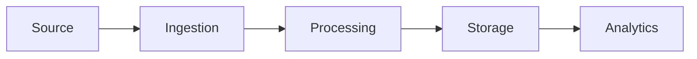

# Confluence Interview Questions & Answers

## 📋 Table of Contents
1. [Basic Concepts](#basic-concepts)
2. [Content Management](#content-management)
3. [Collaboration Features](#collaboration-features)
4. [Administration & Security](#administration--security)
5. [Integration & Automation](#integration--automation)
6. [Best Practices](#best-practices)
7. [Real-world Scenarios](#real-world-scenarios)

---

## Basic Concepts

### 1. What is Confluence and how does it fit into the Atlassian ecosystem?

**Answer:**
Confluence is a collaborative workspace and knowledge management platform developed by Atlassian, designed to help teams create, share, and collaborate on content.

**Key Features:**
- **Wiki-style Documentation**: Create and maintain team knowledge
- **Collaborative Editing**: Real-time collaboration on documents
- **Template System**: Standardized content creation
- **Integration Hub**: Connects with other Atlassian tools
- **Search & Discovery**: Powerful content search capabilities

**Atlassian Ecosystem Integration:**
```
Jira ←→ Confluence ←→ Bitbucket
  ↓         ↓         ↓
Bamboo ←→ Trello ←→ Opsgenie
```

**Common Use Cases:**
- Project documentation and requirements
- Team knowledge bases and wikis
- Meeting notes and decision records
- Process documentation and runbooks
- Product specifications and roadmaps

### 2. Explain Confluence's hierarchical structure and organization.

**Answer:**
Confluence organizes content in a hierarchical structure that provides logical organization and access control.

**Organizational Hierarchy:**
```
Site
├── Space (Project/Team)
│   ├── Page (Main Content)
│   │   ├── Child Page
│   │   │   └── Child Page
│   │   └── Attachments
│   ├── Blog Posts
│   └── Space Settings
└── User Profiles
```

**Space Types:**
1. **Team Spaces**: Collaborative workspaces for teams
2. **Personal Spaces**: Individual user spaces
3. **Documentation Spaces**: Formal documentation repositories
4. **Project Spaces**: Project-specific content

**Example Structure:**
```
Data Engineering Team Space
├── Team Information
│   ├── Team Charter
│   ├── Contact Information
│   └── Onboarding Guide
├── Projects
│   ├── Data Pipeline Migration
│   │   ├── Requirements
│   │   ├── Architecture Design
│   │   └── Implementation Plan
│   └── Analytics Platform
├── Documentation
│   ├── Data Architecture
│   ├── Best Practices
│   └── Troubleshooting Guides
└── Meeting Notes
    ├── Weekly Standups
    └── Architecture Reviews
```

### 3. What are Confluence templates and how do they improve productivity?

**Answer:**
Templates in Confluence provide pre-structured page layouts that standardize content creation and ensure consistency across teams.

**Built-in Template Categories:**
1. **Meeting Notes**: Structured format for meeting documentation
2. **Project Plans**: Project planning and tracking templates
3. **Requirements**: Software and business requirement templates
4. **Retrospectives**: Team retrospective formats
5. **Decision Records**: Architecture decision documentation

**Meeting Notes Template Example:**
```markdown
# Meeting: Data Engineering Weekly Standup
**Date:** {{date}}
**Attendees:** {{attendees}}
**Meeting Type:** Weekly Standup

## Agenda
- [ ] Previous action items review
- [ ] Current sprint progress
- [ ] Blockers and issues
- [ ] Upcoming priorities

## Discussion Points
### Sprint Progress
- Pipeline deployment: 80% complete
- Data quality monitoring: In progress

### Blockers
- AWS permissions for new S3 bucket
- Waiting for schema approval from product team

## Action Items
| Action | Owner | Due Date | Status |
|--------|-------|----------|--------|
| Request AWS permissions | John | 2023-12-15 | Open |
| Follow up on schema | Sarah | 2023-12-13 | Open |

## Next Meeting
**Date:** {{next-meeting-date}}
**Focus:** Sprint demo preparation
```

**Custom Template Creation:**
```markdown
# Data Pipeline Documentation Template

## Overview
**Pipeline Name:** 
**Owner:** 
**Last Updated:** 
**Status:** [Development/Testing/Production]

## Architecture
### Source Systems
- System 1: Description
- System 2: Description

### Data Flow


### Technology Stack
- **Ingestion:** Apache Kafka
- **Processing:** Apache Spark
- **Storage:** Amazon S3
- **Orchestration:** Apache Airflow

## Implementation Details
### Configuration
```yaml
pipeline:
  name: customer-data-pipeline
  schedule: "0 2 * * *"
  retries: 3
```

### Monitoring
- **Metrics:** Pipeline success rate, processing time
- **Alerts:** Data quality issues, pipeline failures
- **Dashboard:** [Link to monitoring dashboard]

## Troubleshooting
### Common Issues
1. **Issue:** Data quality validation failures
   **Solution:** Check source data format changes

2. **Issue:** Pipeline timeout
   **Solution:** Increase processing resources
```

---

## Content Management

### 4. How do you manage content lifecycle and versioning in Confluence?

**Answer:**
Confluence provides comprehensive content lifecycle management through versioning, archiving, and content governance features.

**Version Control:**
- **Automatic Versioning**: Every save creates a new version
- **Version History**: Complete audit trail of changes
- **Version Comparison**: Side-by-side diff view
- **Version Restoration**: Rollback to previous versions

**Version Management Example:**
```
Page: "Data Pipeline Architecture"
├── Version 1.0 (Initial draft) - John Doe - 2023-11-01
├── Version 1.1 (Added monitoring section) - Sarah Smith - 2023-11-05
├── Version 1.2 (Updated technology stack) - Mike Johnson - 2023-11-10
└── Version 2.0 (Major revision) - John Doe - 2023-11-15 (Current)
```

**Content Lifecycle States:**
1. **Draft**: Work in progress, not published
2. **Published**: Live content available to users
3. **Archived**: Outdated content, hidden from search
4. **Deleted**: Removed content (recoverable by admins)

**Content Governance:**
```markdown
# Content Review Process

## Review Schedule
- **Technical Documentation**: Quarterly review
- **Process Documentation**: Semi-annual review
- **Project Documentation**: Post-project review

## Review Checklist
- [ ] Content accuracy verified
- [ ] Links and references updated
- [ ] Screenshots and diagrams current
- [ ] Ownership and contacts updated
- [ ] Labels and metadata correct

## Archival Criteria
- Content older than 2 years without updates
- Superseded by newer documentation
- Related to discontinued projects/processes
```

### 5. How do you implement effective search and content discovery in Confluence?

**Answer:**
Effective search and discovery in Confluence relies on proper content organization, metadata, and search optimization techniques.

**Search Optimization Strategies:**

1. **Proper Labeling:**
```markdown
# Page Labels Example
Labels: data-engineering, apache-spark, etl-pipeline, production, aws

# Label Categories
- Technology: spark, kafka, airflow, python
- Environment: development, staging, production
- Team: data-engineering, analytics, platform
- Status: draft, review, approved, deprecated
```

2. **Content Structure:**
```markdown
# Well-Structured Page Example

# Data Pipeline Monitoring Guide

## Overview
This guide covers monitoring strategies for data pipelines...

## Keywords for Search
monitoring, alerting, observability, data-pipeline, metrics

## Table of Contents
1. [Monitoring Tools](#monitoring-tools)
2. [Alert Configuration](#alert-configuration)
3. [Dashboard Setup](#dashboard-setup)
4. [Troubleshooting](#troubleshooting)

## Monitoring Tools
### Prometheus and Grafana
Configuration for pipeline metrics collection...

### DataDog Integration
Setup instructions for DataDog monitoring...
```

3. **Cross-References and Linking:**
```markdown
# Related Documentation
- [Data Pipeline Architecture](link-to-architecture)
- [Deployment Guide](link-to-deployment)
- [Troubleshooting Runbook](link-to-troubleshooting)

# See Also
- [Team Confluence Space](link-to-team-space)
- [Project Jira Board](link-to-jira)
- [Code Repository](link-to-git)
```

**Advanced Search Features:**
```
# Search Operators
title:"Data Pipeline" AND label:production
space:"Data Engineering" AND type:page
created:>2023-01-01 AND contributor:john.doe
attachment:*.pdf AND space:"Documentation"
```

### 6. How do you handle large-scale content migration to Confluence?

**Answer:**
Large-scale content migration requires careful planning, automated tools, and phased execution to ensure data integrity and minimal disruption.

**Migration Planning:**
```yaml
# Migration Assessment
source_systems:
  - SharePoint: 500 documents
  - Wiki: 200 pages
  - File shares: 1000+ files
  - Email archives: Selected threads

content_audit:
  - Identify duplicate content
  - Assess content relevance
  - Determine ownership
  - Plan space structure

timeline:
  - Phase 1: Critical documentation (2 weeks)
  - Phase 2: Team wikis (4 weeks)
  - Phase 3: Archive content (2 weeks)
  - Phase 4: Cleanup and optimization (1 week)
```

**Migration Tools and Scripts:**
```python
# Confluence REST API Migration Script
import requests
import json
from pathlib import Path

class ConfluenceMigrator:
    def __init__(self, base_url, username, api_token):
        self.base_url = base_url
        self.auth = (username, api_token)
        self.headers = {'Content-Type': 'application/json'}
    
    def create_space(self, space_key, space_name):
        """Create a new Confluence space"""
        url = f"{self.base_url}/rest/api/content"
        payload = {
            "type": "space",
            "key": space_key,
            "name": space_name,
            "description": {"plain": {"value": f"Migrated space: {space_name}"}}
        }
        
        response = requests.post(url, json=payload, auth=self.auth, headers=self.headers)
        return response.json()
    
    def create_page(self, space_key, title, content, parent_id=None):
        """Create a page in Confluence"""
        url = f"{self.base_url}/rest/api/content"
        payload = {
            "type": "page",
            "title": title,
            "space": {"key": space_key},
            "body": {
                "storage": {
                    "value": content,
                    "representation": "storage"
                }
            }
        }
        
        if parent_id:
            payload["ancestors"] = [{"id": parent_id}]
        
        response = requests.post(url, json=payload, auth=self.auth, headers=self.headers)
        return response.json()
    
    def migrate_directory(self, source_dir, space_key):
        """Migrate directory structure to Confluence"""
        for file_path in Path(source_dir).rglob("*.md"):
            with open(file_path, 'r', encoding='utf-8') as f:
                content = f.read()
            
            # Convert markdown to Confluence storage format
            confluence_content = self.convert_markdown_to_storage(content)
            
            # Create page
            page_title = file_path.stem.replace('_', ' ').title()
            result = self.create_page(space_key, page_title, confluence_content)
            
            print(f"Migrated: {page_title} -> {result.get('id', 'Error')}")
    
    def convert_markdown_to_storage(self, markdown_content):
        """Convert markdown to Confluence storage format"""
        # Basic conversion - in practice, use a proper converter
        storage_content = markdown_content
        storage_content = storage_content.replace('# ', '<h1>').replace('\n', '</h1>\n', 1)
        storage_content = storage_content.replace('## ', '<h2>').replace('\n', '</h2>\n', 1)
        # Add more conversions as needed
        return storage_content

# Usage
migrator = ConfluenceMigrator(
    "https://company.atlassian.net/wiki",
    "admin@company.com",
    "api_token"
)

# Create space and migrate content
migrator.create_space("DE", "Data Engineering")
migrator.migrate_directory("/path/to/source/docs", "DE")
```

---

## Collaboration Features

### 7. How do you facilitate effective team collaboration using Confluence features?

**Answer:**
Confluence provides multiple collaboration features that enable teams to work together effectively on documentation and knowledge sharing.

**Real-time Collaboration:**
```markdown
# Collaborative Editing Features

## Simultaneous Editing
- Multiple users can edit the same page
- Real-time cursor tracking
- Automatic conflict resolution
- Live typing indicators

## Comments and Feedback
- Inline comments on specific content
- Page-level comments for general feedback
- @mentions to notify specific users
- Comment resolution tracking

## Review and Approval Workflow
1. Author creates content
2. Reviewers add comments and suggestions
3. Author addresses feedback
4. Content approved and published
```

**Team Collaboration Example:**
```markdown
# Sprint Planning Document

**Sprint:** 2023-12 Sprint 3
**Team:** Data Engineering
**Scrum Master:** @sarah.johnson
**Product Owner:** @mike.chen

## Sprint Goal
Implement real-time data processing pipeline for customer analytics

## User Stories
### Story 1: Real-time Event Processing
**Assignee:** @john.doe
**Story Points:** 8
**Status:** In Progress

**Acceptance Criteria:**
- [ ] Kafka consumer processes events in real-time
- [ ] Data validation and enrichment applied
- [ ] Processed events stored in data lake

**Comments:**
@sarah.johnson: "Need to clarify data retention requirements"
@john.doe: "Will follow up with product team on retention policy"

### Story 2: Monitoring Dashboard
**Assignee:** @lisa.wang
**Story Points:** 5
**Status:** Ready for Development

**Dependencies:**
- Requires completion of Story 1
- Monitoring infrastructure setup
```

**Collaboration Best Practices:**
1. **Use @mentions** for direct communication
2. **Add watchers** to keep stakeholders informed
3. **Create shared templates** for consistency
4. **Use page restrictions** for sensitive content
5. **Implement review cycles** for critical documentation

### 8. How do you use Confluence for project documentation and knowledge management?

**Answer:**
Confluence excels at project documentation and knowledge management through structured content organization and collaborative features.

**Project Documentation Structure:**
```
Project Space: Customer Analytics Platform
├── Project Overview
│   ├── Project Charter
│   ├── Stakeholder Matrix
│   └── Success Criteria
├── Requirements
│   ├── Functional Requirements
│   ├── Non-functional Requirements
│   └── User Stories
├── Architecture & Design
│   ├── System Architecture
│   ├── Data Flow Diagrams
│   ├── API Specifications
│   └── Database Design
├── Implementation
│   ├── Development Guidelines
│   ├── Code Review Process
│   ├── Testing Strategy
│   └── Deployment Plan
├── Operations
│   ├── Monitoring & Alerting
│   ├── Troubleshooting Guide
│   ├── Runbooks
│   └── Performance Metrics
└── Project Closure
    ├── Lessons Learned
    ├── Post-mortem Analysis
    └── Knowledge Transfer
```

**Knowledge Management Framework:**
```markdown
# Data Engineering Knowledge Base

## Team Knowledge Areas

### Technical Documentation
- **Architecture Decisions**: ADR (Architecture Decision Records)
- **Best Practices**: Coding standards, design patterns
- **Troubleshooting**: Common issues and solutions
- **Tools & Technologies**: Setup guides, configurations

### Process Documentation
- **Development Workflow**: Git flow, code review process
- **Deployment Process**: CI/CD pipelines, release procedures
- **Incident Response**: On-call procedures, escalation paths
- **Change Management**: RFC process, approval workflows

### Institutional Knowledge
- **Team History**: Past projects, decisions, lessons learned
- **Vendor Relationships**: Contacts, contracts, SLAs
- **Domain Expertise**: Business context, data sources
- **Training Materials**: Onboarding guides, skill development
```

**Knowledge Capture Strategies:**
```markdown
# Architecture Decision Record Template

## ADR-001: Choice of Stream Processing Framework

**Status:** Accepted
**Date:** 2023-11-15
**Deciders:** Data Engineering Team

### Context
We need to process real-time data streams for customer analytics...

### Decision
We will use Apache Kafka Streams for stream processing.

### Rationale
- Native Kafka integration
- Exactly-once processing semantics
- Horizontal scalability
- Strong community support

### Consequences
**Positive:**
- Simplified architecture
- Better performance
- Easier maintenance

**Negative:**
- Team learning curve
- Vendor lock-in with Kafka ecosystem

### Implementation Plan
1. Proof of concept development
2. Team training on Kafka Streams
3. Migration from current solution
4. Production deployment

### Related Documents
- [Kafka Streams Setup Guide](link)
- [Stream Processing Best Practices](link)
```

---

## Administration & Security

### 9. How do you manage user permissions and security in Confluence?

**Answer:**
Confluence provides granular permission management and security features to control access to content and functionality.

**Permission Levels:**

1. **Global Permissions:**
   - System Administrator
   - Confluence Administrator
   - User Management
   - Space Creation

2. **Space Permissions:**
   - Space Administrator
   - View Space
   - Add/Edit Pages
   - Add Comments
   - Export Space

3. **Page Permissions:**
   - View Page
   - Edit Page
   - Add Comments
   - Page Restrictions

**Permission Configuration Example:**
```yaml
# Space Permission Matrix
Data Engineering Space:
  administrators:
    - data-eng-leads
  
  view_space:
    - all-employees
    - contractors
  
  add_edit_pages:
    - data-engineering-team
    - platform-team
  
  add_comments:
    - all-employees
    - external-consultants

# Page-level Restrictions
Sensitive Documentation:
  view_restrictions:
    - senior-engineers
    - management
  
  edit_restrictions:
    - space-administrators
    - document-owners
```

**Security Best Practices:**
```markdown
# Confluence Security Checklist

## Access Control
- [ ] Implement least privilege principle
- [ ] Regular permission audits
- [ ] Use groups instead of individual permissions
- [ ] Restrict anonymous access
- [ ] Enable two-factor authentication

## Content Security
- [ ] Classify sensitive content
- [ ] Apply appropriate page restrictions
- [ ] Monitor content access logs
- [ ] Implement data retention policies
- [ ] Regular security training for users

## Integration Security
- [ ] Secure API tokens and credentials
- [ ] Audit third-party app permissions
- [ ] Monitor integration access logs
- [ ] Regular security assessments
```

### 10. How do you backup and maintain Confluence instances?

**Answer:**
Proper backup and maintenance strategies are crucial for Confluence availability and data protection.

**Backup Strategy:**
```yaml
# Backup Configuration
backup_types:
  full_backup:
    frequency: weekly
    retention: 12 weeks
    includes:
      - Database dump
      - Attachments
      - Configuration files
      - Custom plugins
  
  incremental_backup:
    frequency: daily
    retention: 30 days
    includes:
      - Database changes
      - New attachments
      - Configuration changes

# Backup Script Example
#!/bin/bash
BACKUP_DIR="/backup/confluence"
DATE=$(date +%Y%m%d_%H%M%S)
DB_NAME="confluence"

# Database backup
pg_dump -h localhost -U confluence_user $DB_NAME > \
  "$BACKUP_DIR/db_backup_$DATE.sql"

# Attachments backup
tar -czf "$BACKUP_DIR/attachments_$DATE.tar.gz" \
  /var/atlassian/application-data/confluence/attachments/

# Configuration backup
tar -czf "$BACKUP_DIR/config_$DATE.tar.gz" \
  /opt/atlassian/confluence/conf/

# Cleanup old backups
find $BACKUP_DIR -name "*.sql" -mtime +30 -delete
find $BACKUP_DIR -name "*.tar.gz" -mtime +30 -delete
```

**Maintenance Tasks:**
```markdown
# Regular Maintenance Schedule

## Daily Tasks
- Monitor system performance
- Check backup completion
- Review error logs
- Monitor disk space usage

## Weekly Tasks
- Database maintenance (reindex, analyze)
- Plugin updates review
- Performance metrics analysis
- User activity review

## Monthly Tasks
- Full system backup verification
- Security patch assessment
- Capacity planning review
- User permission audit

## Quarterly Tasks
- Disaster recovery testing
- Performance optimization
- Content archival review
- Security assessment
```

---

## Integration & Automation

### 11. How do you integrate Confluence with other development tools and workflows?

**Answer:**
Confluence integrates with various development tools to create seamless workflows and automated documentation processes.

**Jira Integration:**
```markdown
# Jira-Confluence Integration Examples

## Requirements Traceability
### Epic: Customer Analytics Platform
**Jira Epic:** [CAP-100](jira-link)
**Status:** In Progress
**Components:** Data Pipeline, Analytics API, Dashboard

### Related User Stories
- [CAP-101](jira-link): Real-time data ingestion
- [CAP-102](jira-link): Data transformation pipeline
- [CAP-103](jira-link): Analytics API development

## Sprint Documentation
### Sprint 2023-12
**Jira Filter:** [Sprint Board](jira-filter-link)

{jira:CAP|type=table|columns=key,summary,status,assignee}

## Issue Tracking in Documentation
**Known Issues:**
{jira:project=CAP AND status="Known Issue"|type=list}
```

**Git Integration:**
```markdown
# Code Repository Integration

## Repository Links
- **Main Repository:** [customer-analytics-platform](github-link)
- **Documentation:** [docs repository](github-docs-link)
- **Infrastructure:** [terraform configs](github-infra-link)

## Automated Documentation Updates
### Git Webhook Configuration
```yaml
webhook_url: https://confluence.company.com/webhook/git-updates
events:
  - push
  - pull_request
  - release

automation_rules:
  - trigger: push to main branch
    action: update deployment status page
  
  - trigger: new release tag
    action: create release notes page
  
  - trigger: README.md changes
    action: sync to confluence page
```

**CI/CD Integration:**
```python
# Jenkins Pipeline Integration
pipeline {
    agent any
    
    stages {
        stage('Build') {
            steps {
                // Build application
                sh 'mvn clean package'
            }
        }
        
        stage('Test') {
            steps {
                // Run tests
                sh 'mvn test'
            }
        }
        
        stage('Deploy') {
            steps {
                // Deploy application
                sh './deploy.sh'
            }
        }
        
        stage('Update Documentation') {
            steps {
                script {
                    // Update Confluence deployment page
                    def confluenceUpdate = [
                        pageId: '123456789',
                        title: 'Deployment Status',
                        content: """
                        <h2>Latest Deployment</h2>
                        <p><strong>Build:</strong> ${BUILD_NUMBER}</p>
                        <p><strong>Version:</strong> ${env.GIT_COMMIT}</p>
                        <p><strong>Status:</strong> Deployed Successfully</p>
                        <p><strong>Timestamp:</strong> ${new Date()}</p>
                        """
                    ]
                    
                    updateConfluencePage(confluenceUpdate)
                }
            }
        }
    }
}
```

### 12. How do you automate content creation and updates in Confluence?

**Answer:**
Automation in Confluence can be achieved through REST APIs, webhooks, and integration with external systems.

**REST API Automation:**
```python
# Automated Report Generation
import requests
import json
from datetime import datetime, timedelta

class ConfluenceAutomation:
    def __init__(self, base_url, username, api_token):
        self.base_url = base_url
        self.auth = (username, api_token)
        self.headers = {'Content-Type': 'application/json'}
    
    def generate_weekly_report(self, space_key):
        """Generate automated weekly team report"""
        
        # Gather data from various sources
        jira_data = self.get_jira_metrics()
        git_data = self.get_git_activity()
        deployment_data = self.get_deployment_status()
        
        # Create report content
        report_content = self.create_report_html(
            jira_data, git_data, deployment_data
        )
        
        # Create or update Confluence page
        page_title = f"Weekly Report - {datetime.now().strftime('%Y-%m-%d')}"
        self.create_or_update_page(space_key, page_title, report_content)
    
    def create_report_html(self, jira_data, git_data, deployment_data):
        """Create HTML content for the report"""
        return f"""
        <h1>Weekly Team Report</h1>
        <p><strong>Report Period:</strong> {datetime.now().strftime('%Y-%m-%d')}</p>
        
        <h2>Sprint Progress</h2>
        <table>
            <tr><th>Metric</th><th>Value</th></tr>
            <tr><td>Stories Completed</td><td>{jira_data['completed']}</td></tr>
            <tr><td>Stories In Progress</td><td>{jira_data['in_progress']}</td></tr>
            <tr><td>Bugs Fixed</td><td>{jira_data['bugs_fixed']}</td></tr>
        </table>
        
        <h2>Development Activity</h2>
        <ul>
            <li>Commits: {git_data['commits']}</li>
            <li>Pull Requests: {git_data['pull_requests']}</li>
            <li>Code Reviews: {git_data['reviews']}</li>
        </ul>
        
        <h2>Deployment Status</h2>
        <p>Production Deployments: {deployment_data['production_deploys']}</p>
        <p>Success Rate: {deployment_data['success_rate']}%</p>
        """
    
    def schedule_content_updates(self):
        """Schedule regular content updates"""
        
        # Update architecture diagrams from code
        self.update_architecture_diagrams()
        
        # Sync API documentation
        self.sync_api_documentation()
        
        # Update team contact information
        self.update_team_directory()
    
    def update_architecture_diagrams(self):
        """Auto-generate architecture diagrams from code"""
        
        # Generate diagram from infrastructure code
        diagram_content = self.generate_diagram_from_terraform()
        
        # Update Confluence page with new diagram
        self.update_page_content(
            page_id="architecture-overview",
            content=diagram_content
        )

# Scheduled automation
from apscheduler.schedulers.blocking import BlockingScheduler

scheduler = BlockingScheduler()
confluence = ConfluenceAutomation(base_url, username, token)

# Schedule weekly reports
scheduler.add_job(
    confluence.generate_weekly_report,
    'cron',
    day_of_week='mon',
    hour=9,
    args=['DATA-ENG']
)

# Schedule daily content updates
scheduler.add_job(
    confluence.schedule_content_updates,
    'cron',
    hour=6,
    minute=0
)

scheduler.start()
```

---

## Best Practices

### 13. What are the best practices for organizing and maintaining documentation in Confluence?

**Answer:**
Effective documentation organization and maintenance requires consistent structure, clear ownership, and regular review processes.

**Content Organization Best Practices:**

1. **Hierarchical Structure:**
```
Team Space
├── 📋 Team Information (Landing Page)
├── 📁 Projects
│   ├── 🚀 Active Projects
│   ├── ✅ Completed Projects
│   └── 📋 Project Templates
├── 📚 Documentation
│   ├── 🏗️ Architecture
│   ├── 🔧 Processes
│   ├── 🛠️ Tools & Setup
│   └── 🆘 Troubleshooting
├── 📝 Meeting Notes
│   ├── 📅 Weekly Standups
│   ├── 🏛️ Architecture Reviews
│   └── 🔄 Retrospectives
└── 📊 Reports & Metrics
```

2. **Naming Conventions:**
```markdown
# Page Naming Standards

## Format: [Category] - [Specific Topic] - [Version/Date]
Examples:
- "Architecture - Data Pipeline Design - v2.0"
- "Process - Code Review Guidelines"
- "Meeting - Weekly Standup - 2023-12-01"
- "Runbook - Production Incident Response"

## Label Standards
- Technology: aws, kafka, spark, python
- Environment: dev, staging, prod
- Status: draft, review, approved, deprecated
- Team: data-eng, platform, analytics
- Priority: critical, high, medium, low
```

3. **Content Lifecycle Management:**
```yaml
# Content Review Schedule
documentation_types:
  architecture_docs:
    review_frequency: quarterly
    owner: tech_leads
    approval_required: true
  
  process_docs:
    review_frequency: semi_annually
    owner: team_leads
    approval_required: true
  
  runbooks:
    review_frequency: monthly
    owner: on_call_engineers
    approval_required: false
  
  meeting_notes:
    review_frequency: never
    owner: meeting_organizer
    archive_after: 6_months

# Review Process
review_checklist:
  - Content accuracy verified
  - Links and references updated
  - Screenshots refreshed
  - Ownership confirmed
  - Labels updated
  - Related pages linked
```

### 14. How do you ensure documentation quality and consistency across teams?

**Answer:**
Documentation quality and consistency require standardized templates, review processes, and governance frameworks.

**Quality Assurance Framework:**
```markdown
# Documentation Quality Standards

## Content Quality Criteria
### Accuracy
- Information is current and correct
- Technical details verified by subject matter experts
- Examples tested and working
- Links functional and up-to-date

### Completeness
- All necessary information included
- Prerequisites clearly stated
- Step-by-step procedures complete
- Troubleshooting section provided

### Clarity
- Written for target audience
- Technical jargon explained
- Clear headings and structure
- Visual aids where helpful

### Consistency
- Follows team templates
- Uses standard terminology
- Consistent formatting
- Proper labeling applied
```

**Review Process Implementation:**
```python
# Automated Quality Checks
class DocumentationQualityChecker:
    def __init__(self, confluence_client):
        self.client = confluence_client
        self.quality_rules = self.load_quality_rules()
    
    def check_page_quality(self, page_id):
        """Run quality checks on a Confluence page"""
        page = self.client.get_page(page_id)
        results = {
            'page_id': page_id,
            'title': page['title'],
            'checks': []
        }
        
        # Check for required sections
        results['checks'].append(
            self.check_required_sections(page['body']['storage']['value'])
        )
        
        # Check for broken links
        results['checks'].append(
            self.check_broken_links(page['body']['storage']['value'])
        )
        
        # Check for outdated content
        results['checks'].append(
            self.check_content_freshness(page['version']['when'])
        )
        
        # Check for proper labeling
        results['checks'].append(
            self.check_labels(page.get('metadata', {}).get('labels', []))
        )
        
        return results
    
    def generate_quality_report(self, space_key):
        """Generate quality report for entire space"""
        pages = self.client.get_space_pages(space_key)
        report = []
        
        for page in pages:
            quality_check = self.check_page_quality(page['id'])
            report.append(quality_check)
        
        # Create summary report page
        self.create_quality_report_page(space_key, report)
        
        return report

# Quality metrics dashboard
quality_metrics = {
    'pages_reviewed': 0,
    'pages_passed': 0,
    'common_issues': {
        'broken_links': 0,
        'missing_labels': 0,
        'outdated_content': 0,
        'missing_sections': 0
    }
}
```

**Governance Framework:**
```markdown
# Documentation Governance

## Roles and Responsibilities
### Content Owners
- **Technical Leads**: Architecture and design documents
- **Team Leads**: Process and procedure documentation
- **Product Managers**: Requirements and specifications
- **DevOps Engineers**: Operational runbooks

### Review Board
- **Documentation Manager**: Overall quality oversight
- **Subject Matter Experts**: Technical accuracy review
- **Technical Writers**: Style and clarity review
- **Stakeholders**: Business relevance review

## Approval Workflow
1. **Author** creates/updates content
2. **Peer Review** by team members
3. **Technical Review** by subject matter expert
4. **Final Approval** by content owner
5. **Publication** and notification

## Quality Metrics
- Documentation coverage: 85% of systems documented
- Review compliance: 90% of docs reviewed on schedule
- User satisfaction: 4.0+ rating on documentation surveys
- Content freshness: 95% of docs updated within SLA
```

---

## Real-world Scenarios

### 15. Design a comprehensive documentation strategy for a data engineering team using Confluence.

**Answer:**
A comprehensive documentation strategy requires structured organization, clear processes, and integration with development workflows.

**Documentation Architecture:**
```
Data Engineering Documentation Hub
├── 🏠 Team Home
│   ├── Team Charter & Mission
│   ├── Team Members & Contacts
│   ├── Onboarding Guide
│   └── Quick Links Dashboard
│
├── 🏗️ Architecture & Design
│   ├── Data Architecture Overview
│   ├── System Architecture Diagrams
│   ├── Technology Stack
│   ├── Architecture Decision Records (ADRs)
│   └── Design Patterns & Standards
│
├── 📊 Data Assets
│   ├── Data Catalog
│   ├── Data Lineage Documentation
│   ├── Schema Registry
│   ├── Data Quality Rules
│   └── SLA & Data Contracts
│
├── 🔧 Development
│   ├── Development Guidelines
│   ├── Code Review Process
│   ├── Testing Strategies
│   ├── CI/CD Pipelines
│   └── Environment Setup
│
├── 🚀 Operations
│   ├── Deployment Procedures
│   ├── Monitoring & Alerting
│   ├── Incident Response Runbooks
│   ├── Troubleshooting Guides
│   └── Performance Optimization
│
├── 📋 Projects
│   ├── Active Projects
│   ├── Project Templates
│   ├── Requirements & Specifications
│   └── Project Retrospectives
│
└── 📚 Knowledge Base
    ├── Best Practices
    ├── Lessons Learned
    ├── Training Materials
    └── External Resources
```

**Implementation Strategy:**
```yaml
# Phase 1: Foundation (Weeks 1-2)
foundation:
  - Create space structure
  - Set up templates
  - Define governance model
  - Train team on Confluence

# Phase 2: Core Documentation (Weeks 3-6)
core_docs:
  - Architecture documentation
  - Critical runbooks
  - Development processes
  - Data catalog basics

# Phase 3: Integration (Weeks 7-8)
integration:
  - Jira integration setup
  - Git webhook configuration
  - Automated reporting
  - Quality checks

# Phase 4: Optimization (Weeks 9-10)
optimization:
  - User feedback collection
  - Process refinement
  - Advanced automation
  - Metrics dashboard
```

**Automation and Integration:**
```python
# Automated Documentation Pipeline
class DataEngDocumentationPipeline:
    def __init__(self):
        self.confluence = ConfluenceClient()
        self.jira = JiraClient()
        self.git = GitClient()
        self.monitoring = MonitoringClient()
    
    def daily_updates(self):
        """Run daily documentation updates"""
        
        # Update system status dashboard
        self.update_system_status()
        
        # Sync data catalog from metadata store
        self.sync_data_catalog()
        
        # Update deployment status
        self.update_deployment_status()
        
        # Generate daily metrics report
        self.generate_daily_metrics()
    
    def weekly_reports(self):
        """Generate weekly team reports"""
        
        # Sprint progress report
        sprint_data = self.jira.get_sprint_progress()
        self.create_sprint_report(sprint_data)
        
        # Code quality metrics
        code_metrics = self.git.get_code_metrics()
        self.update_code_quality_dashboard(code_metrics)
        
        # Infrastructure health report
        infra_health = self.monitoring.get_infrastructure_health()
        self.create_infrastructure_report(infra_health)
    
    def project_documentation(self, project_key):
        """Auto-generate project documentation"""
        
        # Create project space
        project_space = self.confluence.create_project_space(project_key)
        
        # Generate requirements from Jira epics
        requirements = self.jira.get_project_requirements(project_key)
        self.confluence.create_requirements_page(project_space, requirements)
        
        # Generate architecture from code analysis
        architecture = self.git.analyze_project_architecture(project_key)
        self.confluence.create_architecture_page(project_space, architecture)
        
        # Create monitoring dashboard links
        monitoring_links = self.monitoring.get_project_dashboards(project_key)
        self.confluence.create_monitoring_page(project_space, monitoring_links)

# Scheduled execution
scheduler = BlockingScheduler()
pipeline = DataEngDocumentationPipeline()

scheduler.add_job(pipeline.daily_updates, 'cron', hour=6)
scheduler.add_job(pipeline.weekly_reports, 'cron', day_of_week='mon', hour=9)
scheduler.start()
```

### 16. How would you handle a scenario where you need to migrate 10,000+ pages from multiple legacy systems to Confluence?

**Answer:**
Large-scale migration requires careful planning, automated tools, and phased execution to ensure data integrity and user adoption.

**Migration Strategy:**
```yaml
# Migration Assessment
source_systems:
  sharepoint:
    pages: 4000
    file_types: [.docx, .xlsx, .pptx]
    complexity: medium
    
  mediawiki:
    pages: 3500
    format: wikitext
    complexity: high
    
  file_shares:
    documents: 2000
    file_types: [.pdf, .doc, .txt]
    complexity: low
    
  legacy_wiki:
    pages: 500
    format: html
    complexity: medium

# Migration Phases
phase_1_critical:
  duration: 2_weeks
  content: active_project_docs, runbooks, procedures
  pages: 1000
  
phase_2_important:
  duration: 4_weeks
  content: team_wikis, architecture_docs, guides
  pages: 4000
  
phase_3_archive:
  duration: 3_weeks
  content: historical_docs, reference_materials
  pages: 5000
```

**Migration Tools and Scripts:**
```python
# Comprehensive Migration Framework
import asyncio
import aiohttp
from pathlib import Path
import logging
from dataclasses import dataclass
from typing import List, Dict, Optional

@dataclass
class MigrationItem:
    source_path: str
    title: str
    content: str
    metadata: Dict
    target_space: str
    parent_id: Optional[str] = None

class LargeMigrationManager:
    def __init__(self, confluence_client, batch_size=50):
        self.confluence = confluence_client
        self.batch_size = batch_size
        self.migration_log = []
        self.error_log = []
        
    async def migrate_batch(self, items: List[MigrationItem]):
        """Migrate a batch of items concurrently"""
        semaphore = asyncio.Semaphore(10)  # Limit concurrent requests
        
        async def migrate_single_item(item):
            async with semaphore:
                try:
                    result = await self.confluence.create_page_async(
                        space_key=item.target_space,
                        title=item.title,
                        content=item.content,
                        parent_id=item.parent_id
                    )
                    
                    self.migration_log.append({
                        'source': item.source_path,
                        'target': result['id'],
                        'status': 'success'
                    })
                    
                    return result
                    
                except Exception as e:
                    self.error_log.append({
                        'source': item.source_path,
                        'error': str(e),
                        'status': 'failed'
                    })
                    logging.error(f"Migration failed for {item.source_path}: {e}")
                    return None
        
        # Execute batch migration
        tasks = [migrate_single_item(item) for item in items]
        results = await asyncio.gather(*tasks, return_exceptions=True)
        
        return results
    
    def process_sharepoint_export(self, export_path):
        """Process SharePoint export files"""
        items = []
        
        for file_path in Path(export_path).rglob("*.docx"):
            # Convert Word document to Confluence format
            content = self.convert_docx_to_confluence(file_path)
            
            item = MigrationItem(
                source_path=str(file_path),
                title=file_path.stem.replace('_', ' ').title(),
                content=content,
                metadata={'source': 'sharepoint', 'original_path': str(file_path)},
                target_space=self.determine_target_space(file_path)
            )
            items.append(item)
        
        return items
    
    def process_mediawiki_export(self, xml_export_path):
        """Process MediaWiki XML export"""
        import xml.etree.ElementTree as ET
        
        tree = ET.parse(xml_export_path)
        root = tree.getroot()
        items = []
        
        for page in root.findall('.//page'):
            title = page.find('title').text
            content = page.find('.//text').text
            
            # Convert MediaWiki syntax to Confluence
            confluence_content = self.convert_mediawiki_to_confluence(content)
            
            item = MigrationItem(
                source_path=f"mediawiki:{title}",
                title=title,
                content=confluence_content,
                metadata={'source': 'mediawiki'},
                target_space=self.determine_target_space_by_title(title)
            )
            items.append(item)
        
        return items
    
    async def execute_migration(self, migration_items):
        """Execute full migration with progress tracking"""
        total_items = len(migration_items)
        processed = 0
        
        # Process in batches
        for i in range(0, total_items, self.batch_size):
            batch = migration_items[i:i + self.batch_size]
            
            logging.info(f"Processing batch {i//self.batch_size + 1}, items {i+1}-{min(i+self.batch_size, total_items)}")
            
            await self.migrate_batch(batch)
            processed += len(batch)
            
            # Progress report
            progress = (processed / total_items) * 100
            logging.info(f"Migration progress: {progress:.1f}% ({processed}/{total_items})")
            
            # Rate limiting
            await asyncio.sleep(1)
        
        # Generate migration report
        self.generate_migration_report()
    
    def generate_migration_report(self):
        """Generate comprehensive migration report"""
        total_attempted = len(self.migration_log) + len(self.error_log)
        success_count = len(self.migration_log)
        error_count = len(self.error_log)
        success_rate = (success_count / total_attempted) * 100 if total_attempted > 0 else 0
        
        report = f"""
        # Migration Report
        
        ## Summary
        - **Total Items**: {total_attempted}
        - **Successful**: {success_count}
        - **Failed**: {error_count}
        - **Success Rate**: {success_rate:.1f}%
        
        ## Error Analysis
        """
        
        # Analyze common errors
        error_types = {}
        for error in self.error_log:
            error_type = error['error'].split(':')[0]
            error_types[error_type] = error_types.get(error_type, 0) + 1
        
        for error_type, count in error_types.items():
            report += f"- **{error_type}**: {count} occurrences\n"
        
        # Save report
        with open('migration_report.md', 'w') as f:
            f.write(report)
        
        return report

# Usage example
async def main():
    confluence_client = ConfluenceAsyncClient(base_url, username, token)
    migrator = LargeMigrationManager(confluence_client)
    
    # Process different source systems
    sharepoint_items = migrator.process_sharepoint_export('/path/to/sharepoint/export')
    mediawiki_items = migrator.process_mediawiki_export('/path/to/mediawiki/export.xml')
    
    all_items = sharepoint_items + mediawiki_items
    
    # Execute migration
    await migrator.execute_migration(all_items)

# Run migration
asyncio.run(main())
```

**Post-Migration Activities:**
```markdown
# Post-Migration Checklist

## Content Validation
- [ ] Verify page hierarchy structure
- [ ] Check content formatting and images
- [ ] Validate internal links
- [ ] Test search functionality
- [ ] Confirm user permissions

## User Training
- [ ] Conduct Confluence training sessions
- [ ] Create user guides and tutorials
- [ ] Set up help desk support
- [ ] Gather user feedback

## Optimization
- [ ] Analyze usage patterns
- [ ] Optimize space organization
- [ ] Implement governance policies
- [ ] Set up automated maintenance

## Monitoring
- [ ] Track user adoption metrics
- [ ] Monitor system performance
- [ ] Review content quality
- [ ] Plan continuous improvement
```

---

## Summary

Confluence is a powerful collaboration and knowledge management platform that requires understanding of:

1. **Core Concepts**: Spaces, pages, templates, and organizational structure
2. **Collaboration**: Real-time editing, comments, and team workflows
3. **Administration**: User management, permissions, and security
4. **Integration**: API usage, automation, and tool connectivity
5. **Best Practices**: Content organization, quality assurance, and governance
6. **Real-world Applications**: Large-scale migrations and enterprise documentation strategies

Mastering these areas will enable effective use of Confluence for team collaboration and knowledge management in data engineering environments.