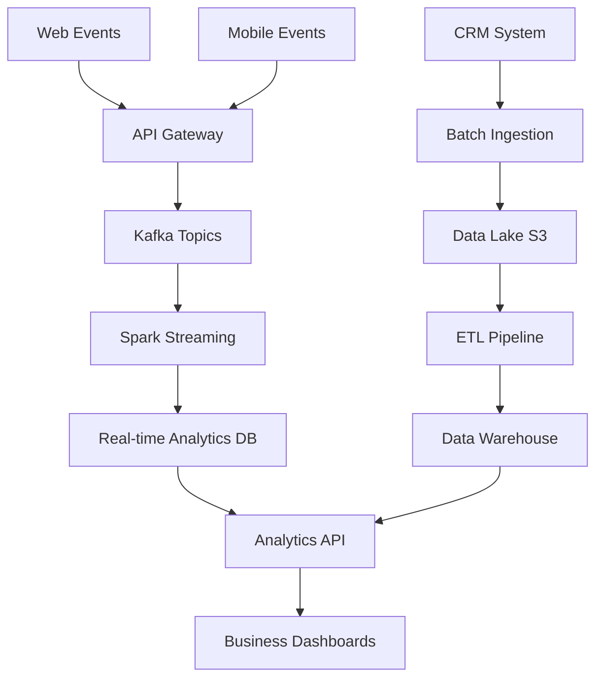

# 📋 Project Management Practical Examples for Data Engineering

## 🎯 **Agile Data Engineering Project Setup**

### **Sprint Planning Template**
```markdown
# Sprint Planning Template - Data Engineering Team

## Sprint Information
- **Sprint Number**: 15
- **Sprint Duration**: 2 weeks (Jan 15 - Jan 28, 2024)
- **Sprint Goal**: Implement real-time customer analytics pipeline
- **Team Capacity**: 80 story points (4 developers × 20 points each)

## Team Members & Capacity
| Name | Role | Capacity (SP) | Availability |
|------|------|---------------|--------------|
| Alice Johnson | Senior Data Engineer | 20 | 100% |
| Bob Smith | Data Engineer | 18 | 90% (1 day off) |
| Carol Davis | ML Engineer | 20 | 100% |
| David Wilson | DevOps Engineer | 22 | 110% (overtime approved) |

## Sprint Backlog

### High Priority (Must Have)
- **DE-101**: Set up Kafka streaming infrastructure (13 SP)
  - Acceptance Criteria:
    - [ ] Kafka cluster deployed on Kubernetes
    - [ ] Topics created for customer events
    - [ ] Schema registry configured
    - [ ] Monitoring dashboards setup
  - Assigned: David Wilson
  - Dependencies: Infrastructure approval

- **DE-102**: Implement customer event ingestion (8 SP)
  - Acceptance Criteria:
    - [ ] Producer service for web events
    - [ ] Producer service for mobile events
    - [ ] Data validation and error handling
    - [ ] Unit tests with 90% coverage
  - Assigned: Alice Johnson
  - Dependencies: DE-101

- **DE-103**: Build real-time aggregation pipeline (21 SP)
  - Acceptance Criteria:
    - [ ] Spark Streaming job for event processing
    - [ ] Customer behavior metrics calculation
    - [ ] Output to analytics database
    - [ ] Performance benchmarks met
  - Assigned: Bob Smith, Carol Davis
  - Dependencies: DE-102

### Medium Priority (Should Have)
- **DE-104**: Create analytics API endpoints (13 SP)
  - Acceptance Criteria:
    - [ ] REST API for customer metrics
    - [ ] Authentication and authorization
    - [ ] API documentation
    - [ ] Load testing completed
  - Assigned: Alice Johnson
  - Dependencies: DE-103

- **DE-105**: Implement data quality monitoring (8 SP)
  - Acceptance Criteria:
    - [ ] Data quality checks in pipeline
    - [ ] Alerting for quality issues
    - [ ] Quality metrics dashboard
    - [ ] SLA compliance tracking
  - Assigned: Carol Davis
  - Dependencies: DE-103

### Low Priority (Could Have)
- **DE-106**: Setup automated testing pipeline (5 SP)
  - Acceptance Criteria:
    - [ ] Integration tests for pipeline
    - [ ] Performance regression tests
    - [ ] Automated deployment tests
  - Assigned: David Wilson
  - Dependencies: DE-103

## Risk Assessment
| Risk | Impact | Probability | Mitigation |
|------|--------|-------------|------------|
| Kafka cluster instability | High | Medium | Have rollback plan, test thoroughly |
| Schema evolution issues | Medium | High | Version schema registry properly |
| Performance bottlenecks | High | Medium | Load test early, have scaling plan |
| Team member unavailability | Medium | Low | Cross-train team members |

## Definition of Done
- [ ] Code reviewed and approved
- [ ] Unit tests written and passing (>90% coverage)
- [ ] Integration tests passing
- [ ] Documentation updated
- [ ] Performance benchmarks met
- [ ] Security review completed
- [ ] Deployed to staging environment
- [ ] Product owner acceptance

## Sprint Ceremonies Schedule
- **Daily Standups**: 9:00 AM daily
- **Sprint Review**: Jan 28, 2:00 PM
- **Sprint Retrospective**: Jan 28, 3:30 PM
- **Sprint Planning (Next)**: Jan 29, 10:00 AM

## Success Metrics
- Velocity: Target 75-80 story points
- Burndown: Steady progress, no major blockers
- Quality: Zero critical bugs in production
- Performance: <100ms API response time
- Uptime: 99.9% pipeline availability
```

### **Jira Workflow Configuration**
```json
{
  "workflow": {
    "name": "Data Engineering Workflow",
    "description": "Custom workflow for data engineering tasks",
    "statuses": [
      {
        "name": "Backlog",
        "description": "Items waiting to be prioritized",
        "category": "TO_DO"
      },
      {
        "name": "Ready for Development",
        "description": "Items ready to be worked on",
        "category": "TO_DO"
      },
      {
        "name": "In Progress",
        "description": "Actively being worked on",
        "category": "IN_PROGRESS"
      },
      {
        "name": "Code Review",
        "description": "Waiting for code review",
        "category": "IN_PROGRESS"
      },
      {
        "name": "Testing",
        "description": "In testing phase",
        "category": "IN_PROGRESS"
      },
      {
        "name": "Staging",
        "description": "Deployed to staging environment",
        "category": "IN_PROGRESS"
      },
      {
        "name": "Done",
        "description": "Completed and deployed to production",
        "category": "DONE"
      },
      {
        "name": "Blocked",
        "description": "Cannot proceed due to external dependency",
        "category": "IN_PROGRESS"
      }
    ],
    "transitions": [
      {
        "name": "Start Progress",
        "from": ["Ready for Development"],
        "to": "In Progress",
        "conditions": ["Assignee exists"]
      },
      {
        "name": "Submit for Review",
        "from": ["In Progress"],
        "to": "Code Review",
        "conditions": ["Pull request created"]
      },
      {
        "name": "Move to Testing",
        "from": ["Code Review"],
        "to": "Testing",
        "conditions": ["Code review approved"]
      },
      {
        "name": "Deploy to Staging",
        "from": ["Testing"],
        "to": "Staging",
        "conditions": ["All tests passing"]
      },
      {
        "name": "Complete",
        "from": ["Staging"],
        "to": "Done",
        "conditions": ["Product owner approval", "Production deployment"]
      },
      {
        "name": "Block",
        "from": ["Ready for Development", "In Progress", "Code Review", "Testing"],
        "to": "Blocked",
        "conditions": ["Blocker reason provided"]
      },
      {
        "name": "Unblock",
        "from": ["Blocked"],
        "to": "Ready for Development",
        "conditions": ["Blocker resolved"]
      }
    ]
  },
  "issue_types": [
    {
      "name": "Epic",
      "description": "Large feature or initiative",
      "fields": ["summary", "description", "business_value", "acceptance_criteria"]
    },
    {
      "name": "Story",
      "description": "User story or feature request",
      "fields": ["summary", "description", "story_points", "acceptance_criteria", "epic_link"]
    },
    {
      "name": "Task",
      "description": "Technical task or chore",
      "fields": ["summary", "description", "story_points", "parent_link"]
    },
    {
      "name": "Bug",
      "description": "Defect or issue",
      "fields": ["summary", "description", "severity", "steps_to_reproduce", "environment"]
    },
    {
      "name": "Spike",
      "description": "Research or investigation task",
      "fields": ["summary", "description", "time_box", "research_questions"]
    }
  ],
  "custom_fields": [
    {
      "name": "Data Source",
      "type": "select",
      "options": ["Database", "API", "File", "Stream", "External"]
    },
    {
      "name": "Pipeline Stage",
      "type": "select",
      "options": ["Ingestion", "Processing", "Storage", "Analytics", "Monitoring"]
    },
    {
      "name": "Performance Impact",
      "type": "select",
      "options": ["None", "Low", "Medium", "High", "Critical"]
    },
    {
      "name": "Data Volume",
      "type": "select",
      "options": ["Small (<1GB)", "Medium (1-100GB)", "Large (100GB-1TB)", "Very Large (>1TB)"]
    }
  ]
}
```

## 📊 **Data Engineering Project Dashboard**

### **Confluence Project Documentation Template**
```markdown
# Customer Analytics Pipeline Project

## Project Overview

### Executive Summary
The Customer Analytics Pipeline project aims to build a real-time data processing system that ingests customer interaction data from multiple touchpoints and provides actionable insights for business stakeholders.

**Project Timeline**: Q1 2024 (12 weeks)
**Budget**: $150,000
**Team Size**: 4 engineers + 1 product owner

### Business Objectives
1. **Reduce time-to-insight** from 24 hours to <5 minutes
2. **Increase data accuracy** from 85% to 99%
3. **Enable real-time personalization** for 1M+ customers
4. **Reduce infrastructure costs** by 30% through optimization

### Success Metrics
| Metric | Current State | Target | Measurement |
|--------|---------------|--------|-------------|
| Data Latency | 24 hours | <5 minutes | Pipeline monitoring |
| Data Accuracy | 85% | 99% | Quality checks |
| System Uptime | 95% | 99.9% | Monitoring alerts |
| Processing Cost | $10K/month | $7K/month | AWS billing |

## Technical Architecture

### High-Level Architecture
```
[Web/Mobile Apps] → [API Gateway] → [Kafka] → [Spark Streaming] → [Analytics DB]
                                      ↓
[Batch Sources] → [Data Lake] → [ETL Pipeline] → [Data Warehouse]
```

### Technology Stack
- **Streaming**: Apache Kafka, Spark Streaming
- **Storage**: PostgreSQL, Amazon S3, Redis
- **Processing**: Apache Spark, Python, Scala
- **Orchestration**: Apache Airflow
- **Monitoring**: Prometheus, Grafana, DataDog
- **Infrastructure**: Kubernetes, Terraform, AWS

### Data Flow Diagram


## Project Phases

### Phase 1: Infrastructure Setup (Weeks 1-3)
**Deliverables**:
- Kubernetes cluster deployment
- Kafka streaming infrastructure
- Monitoring and alerting setup
- CI/CD pipeline configuration

**Acceptance Criteria**:
- [ ] All infrastructure components deployed
- [ ] Monitoring dashboards operational
- [ ] Security scanning integrated
- [ ] Performance benchmarks established

### Phase 2: Data Ingestion (Weeks 4-6)
**Deliverables**:
- Real-time event producers
- Batch data ingestion pipelines
- Data validation and quality checks
- Schema registry implementation

**Acceptance Criteria**:
- [ ] 1M+ events/hour processing capacity
- [ ] <1% data loss rate
- [ ] Schema evolution support
- [ ] Error handling and retry logic

### Phase 3: Processing Pipeline (Weeks 7-9)
**Deliverables**:
- Spark streaming applications
- Real-time aggregation logic
- Customer behavior analytics
- Performance optimization

**Acceptance Criteria**:
- [ ] <5 minute end-to-end latency
- [ ] 99.9% processing accuracy
- [ ] Auto-scaling capabilities
- [ ] Fault tolerance mechanisms

### Phase 4: Analytics & API (Weeks 10-12)
**Deliverables**:
- Analytics API development
- Business intelligence dashboards
- User access controls
- Performance testing

**Acceptance Criteria**:
- [ ] <100ms API response time
- [ ] Role-based access control
- [ ] Interactive dashboards
- [ ] Load testing completed

## Risk Management

### High-Risk Items
| Risk | Impact | Probability | Mitigation Strategy | Owner |
|------|--------|-------------|-------------------|-------|
| Kafka performance issues | High | Medium | Thorough load testing, have scaling plan | DevOps Lead |
| Data quality problems | High | Medium | Implement comprehensive validation | Data Engineer |
| Team member unavailability | Medium | Low | Cross-training, documentation | Project Manager |
| Scope creep | Medium | High | Regular stakeholder reviews | Product Owner |

### Contingency Plans
- **Performance Issues**: Pre-approved budget for additional infrastructure
- **Data Quality**: Rollback mechanism to previous stable version
- **Resource Constraints**: Contractor budget allocated for critical skills
- **Timeline Delays**: Prioritized feature list for scope reduction

## Communication Plan

### Stakeholder Matrix
| Stakeholder | Role | Communication Frequency | Method |
|-------------|------|------------------------|--------|
| Executive Sponsor | Decision maker | Weekly | Status report |
| Product Owner | Requirements | Daily | Standup, Slack |
| Engineering Team | Implementation | Daily | Standup, Jira |
| Business Users | End users | Bi-weekly | Demo sessions |
| IT Operations | Support | Weekly | Technical review |

### Meeting Schedule
- **Daily Standups**: 9:00 AM (15 minutes)
- **Sprint Planning**: Every 2 weeks (2 hours)
- **Sprint Review**: Every 2 weeks (1 hour)
- **Retrospective**: Every 2 weeks (1 hour)
- **Stakeholder Demo**: Monthly (30 minutes)

## Quality Assurance

### Testing Strategy
1. **Unit Testing**: 90% code coverage minimum
2. **Integration Testing**: End-to-end pipeline validation
3. **Performance Testing**: Load and stress testing
4. **Security Testing**: Vulnerability scanning
5. **User Acceptance Testing**: Business stakeholder validation

### Code Quality Standards
- **Code Reviews**: All code must be reviewed by 2+ engineers
- **Static Analysis**: SonarQube quality gates
- **Security Scanning**: Automated vulnerability detection
- **Documentation**: All APIs and processes documented

## Deployment Strategy

### Environment Progression
1. **Development**: Individual developer environments
2. **Integration**: Shared testing environment
3. **Staging**: Production-like environment
4. **Production**: Live customer-facing system

### Deployment Process
```yaml
# deployment-pipeline.yml
stages:
  - build
  - test
  - security_scan
  - deploy_staging
  - integration_tests
  - deploy_production
  - smoke_tests
  - rollback_plan
```

### Rollback Procedures
- **Database Changes**: Migration rollback scripts
- **Application Code**: Blue-green deployment
- **Infrastructure**: Terraform state management
- **Data Pipeline**: Circuit breaker patterns

## Monitoring & Alerting

### Key Performance Indicators
- **Throughput**: Events processed per second
- **Latency**: End-to-end processing time
- **Accuracy**: Data quality percentage
- **Availability**: System uptime percentage
- **Cost**: Infrastructure spend per month

### Alert Thresholds
| Metric | Warning | Critical | Action |
|--------|---------|----------|--------|
| Latency | >3 minutes | >10 minutes | Auto-scale, notify team |
| Error Rate | >1% | >5% | Circuit breaker, escalate |
| CPU Usage | >70% | >90% | Scale up, investigate |
| Memory Usage | >80% | >95% | Scale up, restart services |

## Budget & Resource Planning

### Budget Breakdown
| Category | Allocated | Spent | Remaining |
|----------|-----------|-------|-----------|
| Personnel | $100,000 | $45,000 | $55,000 |
| Infrastructure | $30,000 | $12,000 | $18,000 |
| Tools & Licenses | $15,000 | $8,000 | $7,000 |
| Contingency | $5,000 | $0 | $5,000 |
| **Total** | **$150,000** | **$65,000** | **$85,000** |

### Resource Allocation
- **Senior Data Engineer**: 100% allocation (12 weeks)
- **Data Engineers (2)**: 100% allocation (10 weeks)
- **DevOps Engineer**: 75% allocation (8 weeks)
- **Product Owner**: 25% allocation (12 weeks)

## Lessons Learned & Best Practices

### What Worked Well
- Daily standups kept team aligned
- Automated testing caught issues early
- Infrastructure as Code reduced deployment issues
- Regular stakeholder demos maintained buy-in

### Areas for Improvement
- Earlier performance testing would have prevented bottlenecks
- More detailed requirements gathering upfront
- Better estimation of infrastructure costs
- Cross-training team members on all components

### Recommendations for Future Projects
1. Invest in comprehensive monitoring from day one
2. Allocate 20% buffer for performance optimization
3. Establish data quality standards early
4. Plan for operational handover from the beginning
```

## 🔄 **Automated Project Tracking**

### **Jira Automation Scripts**
```python
# jira_automation.py - Automate Jira project management tasks
from jira import JIRA
import pandas as pd
from datetime import datetime, timedelta
import smtplib
from email.mime.text import MimeText
from email.mime.multipart import MimeMultipart

class JiraProjectManager:
    def __init__(self, server, username, api_token):
        self.jira = JIRA(server=server, basic_auth=(username, api_token))
        self.project_key = "DE"  # Data Engineering project
    
    def get_sprint_metrics(self, sprint_id):
        """Get comprehensive sprint metrics"""
        # Get sprint details
        sprint = self.jira.sprint(sprint_id)
        
        # Get issues in sprint
        jql = f"project = {self.project_key} AND sprint = {sprint_id}"
        issues = self.jira.search_issues(jql, expand='changelog')
        
        metrics = {
            'sprint_name': sprint.name,
            'start_date': sprint.startDate,
            'end_date': sprint.endDate,
            'total_issues': len(issues),
            'completed_issues': 0,
            'in_progress_issues': 0,
            'blocked_issues': 0,
            'total_story_points': 0,
            'completed_story_points': 0,
            'velocity': 0,
            'burndown_data': [],
            'team_performance': {}
        }
        
        for issue in issues:
            # Count story points
            story_points = getattr(issue.fields, 'customfield_10016', 0) or 0
            metrics['total_story_points'] += story_points
            
            # Count by status
            status = issue.fields.status.name
            if status == 'Done':
                metrics['completed_issues'] += 1
                metrics['completed_story_points'] += story_points
            elif status in ['In Progress', 'Code Review', 'Testing']:
                metrics['in_progress_issues'] += 1
            elif status == 'Blocked':
                metrics['blocked_issues'] += 1
            
            # Team performance tracking
            assignee = issue.fields.assignee
            if assignee:
                assignee_name = assignee.displayName
                if assignee_name not in metrics['team_performance']:
                    metrics['team_performance'][assignee_name] = {
                        'assigned': 0,
                        'completed': 0,
                        'story_points': 0
                    }
                
                metrics['team_performance'][assignee_name]['assigned'] += 1
                metrics['team_performance'][assignee_name]['story_points'] += story_points
                
                if status == 'Done':
                    metrics['team_performance'][assignee_name]['completed'] += 1
        
        # Calculate velocity
        metrics['velocity'] = metrics['completed_story_points']
        
        return metrics
    
    def generate_burndown_chart_data(self, sprint_id):
        """Generate burndown chart data"""
        sprint = self.jira.sprint(sprint_id)
        start_date = datetime.strptime(sprint.startDate[:10], '%Y-%m-%d')
        end_date = datetime.strptime(sprint.endDate[:10], '%Y-%m-%d')
        
        # Get all issues in sprint
        jql = f"project = {self.project_key} AND sprint = {sprint_id}"
        issues = self.jira.search_issues(jql, expand='changelog')
        
        # Calculate total story points
        total_points = sum([getattr(issue.fields, 'customfield_10016', 0) or 0 for issue in issues])
        
        # Generate ideal burndown
        sprint_days = (end_date - start_date).days
        ideal_burndown = []
        for day in range(sprint_days + 1):
            remaining = total_points - (total_points * day / sprint_days)
            ideal_burndown.append({
                'date': start_date + timedelta(days=day),
                'ideal_remaining': remaining,
                'actual_remaining': None
            })
        
        # Calculate actual burndown from issue history
        for day_data in ideal_burndown:
            completed_points = 0
            for issue in issues:
                # Check if issue was completed by this date
                for history in issue.changelog.histories:
                    history_date = datetime.strptime(history.created[:10], '%Y-%m-%d')
                    if history_date <= day_data['date']:
                        for item in history.items:
                            if item.field == 'status' and item.toString == 'Done':
                                story_points = getattr(issue.fields, 'customfield_10016', 0) or 0
                                completed_points += story_points
                                break
            
            day_data['actual_remaining'] = total_points - completed_points
        
        return ideal_burndown
    
    def check_sprint_health(self, sprint_id):
        """Check sprint health and generate alerts"""
        metrics = self.get_sprint_metrics(sprint_id)
        alerts = []
        
        # Check velocity
        if metrics['velocity'] < metrics['total_story_points'] * 0.7:
            alerts.append({
                'type': 'velocity',
                'severity': 'warning',
                'message': f"Sprint velocity is below target: {metrics['velocity']}/{metrics['total_story_points']} points"
            })
        
        # Check blocked issues
        if metrics['blocked_issues'] > 0:
            alerts.append({
                'type': 'blocked',
                'severity': 'critical',
                'message': f"{metrics['blocked_issues']} issues are currently blocked"
            })
        
        # Check team workload distribution
        team_workload = metrics['team_performance']
        if team_workload:
            max_workload = max([member['assigned'] for member in team_workload.values()])
            min_workload = min([member['assigned'] for member in team_workload.values()])
            
            if max_workload > min_workload * 2:
                alerts.append({
                    'type': 'workload',
                    'severity': 'warning',
                    'message': "Uneven workload distribution detected across team members"
                })
        
        return alerts
    
    def generate_sprint_report(self, sprint_id):
        """Generate comprehensive sprint report"""
        metrics = self.get_sprint_metrics(sprint_id)
        burndown_data = self.generate_burndown_chart_data(sprint_id)
        alerts = self.check_sprint_health(sprint_id)
        
        report = f"""
# Sprint Report: {metrics['sprint_name']}

## Sprint Overview
- **Duration**: {metrics['start_date']} to {metrics['end_date']}
- **Total Issues**: {metrics['total_issues']}
- **Completed Issues**: {metrics['completed_issues']}
- **Velocity**: {metrics['velocity']} story points

## Team Performance
"""
        
        for member, performance in metrics['team_performance'].items():
            completion_rate = (performance['completed'] / performance['assigned'] * 100) if performance['assigned'] > 0 else 0
            report += f"- **{member}**: {performance['completed']}/{performance['assigned']} issues ({completion_rate:.1f}% completion)\n"
        
        if alerts:
            report += "\n## Alerts\n"
            for alert in alerts:
                report += f"- **{alert['severity'].upper()}**: {alert['message']}\n"
        
        return report
    
    def send_daily_standup_reminder(self):
        """Send daily standup reminder with current sprint status"""
        # Get current active sprint
        sprints = self.jira.sprints(board_id=1, state='active')
        if not sprints:
            return
        
        current_sprint = sprints[0]
        metrics = self.get_sprint_metrics(current_sprint.id)
        
        # Prepare email
        subject = f"Daily Standup Reminder - {current_sprint.name}"
        body = f"""
Good morning team!

Time for our daily standup at 9:00 AM.

Current Sprint Status:
- Completed: {metrics['completed_issues']}/{metrics['total_issues']} issues
- Story Points: {metrics['completed_story_points']}/{metrics['total_story_points']}
- Blocked Issues: {metrics['blocked_issues']}

Please be prepared to share:
1. What you completed yesterday
2. What you're working on today
3. Any blockers or impediments

See you in the meeting room!
        """
        
        # Send email (implementation depends on your email setup)
        self.send_email(
            to=['team@company.com'],
            subject=subject,
            body=body
        )
    
    def send_email(self, to, subject, body):
        """Send email notification"""
        # Email configuration
        smtp_server = "smtp.company.com"
        smtp_port = 587
        sender_email = "jira-bot@company.com"
        sender_password = "password"
        
        msg = MimeMultipart()
        msg['From'] = sender_email
        msg['To'] = ', '.join(to)
        msg['Subject'] = subject
        
        msg.attach(MimeText(body, 'plain'))
        
        try:
            server = smtplib.SMTP(smtp_server, smtp_port)
            server.starttls()
            server.login(sender_email, sender_password)
            text = msg.as_string()
            server.sendmail(sender_email, to, text)
            server.quit()
            print(f"Email sent successfully to {', '.join(to)}")
        except Exception as e:
            print(f"Failed to send email: {e}")

# Usage example
if __name__ == "__main__":
    # Initialize Jira manager
    jira_manager = JiraProjectManager(
        server="https://company.atlassian.net",
        username="admin@company.com",
        api_token="your-api-token"
    )
    
    # Generate sprint report
    sprint_report = jira_manager.generate_sprint_report(sprint_id=123)
    print(sprint_report)
    
    # Check sprint health
    alerts = jira_manager.check_sprint_health(sprint_id=123)
    for alert in alerts:
        print(f"ALERT: {alert['message']}")
```

## 🔧 **Quick Setup Commands**

### **Jira Project Setup**
```bash
# Install Jira CLI
pip install jira

# Configure Jira connection
cat > ~/.jira_config << EOF
{
    "server": "https://company.atlassian.net",
    "username": "admin@company.com",
    "api_token": "your-api-token"
}
EOF

# Create project automation
python jira_automation.py
```

### **Confluence Automation**
```python
# confluence_automation.py
from atlassian import Confluence
import os

confluence = Confluence(
    url='https://company.atlassian.net/wiki',
    username='admin@company.com',
    password='api-token'
)

# Create project space
space_key = 'DE'
space_name = 'Data Engineering'

confluence.create_space(
    space_key=space_key,
    space_name=space_name,
    space_description='Data Engineering project documentation'
)

# Create page templates
templates = [
    'Project Charter',
    'Technical Architecture',
    'Sprint Planning',
    'Retrospective Notes',
    'Runbook'
]

for template in templates:
    confluence.create_page(
        space=space_key,
        title=template,
        body=f'<h1>{template} Template</h1><p>Template content here...</p>'
    )
```

---

*Updated: December 2024 | Focus: Agile data engineering | Tools: Jira, Confluence, automation*